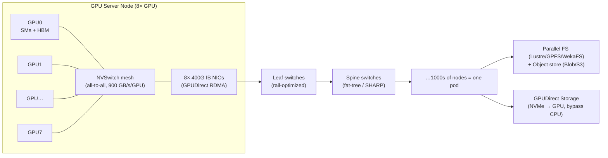
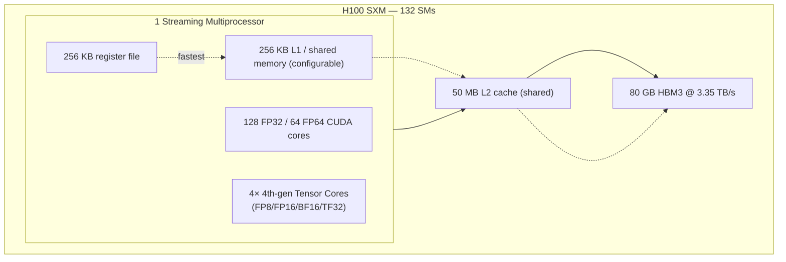
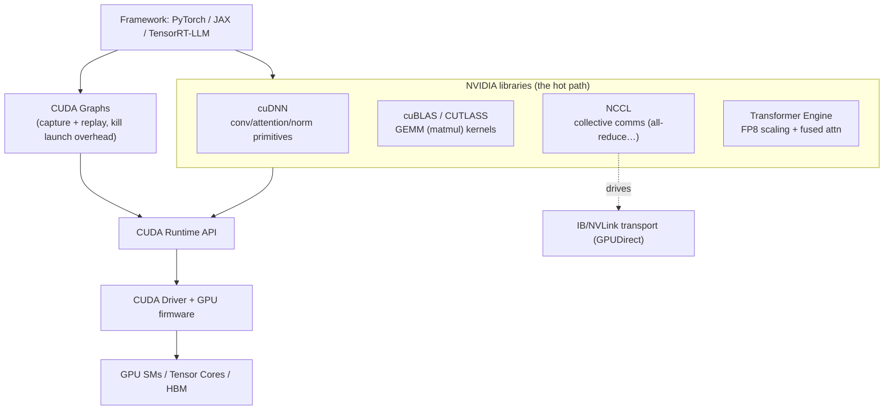
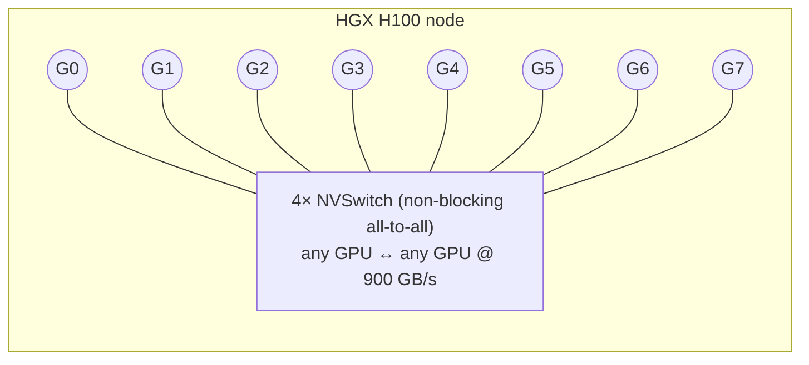
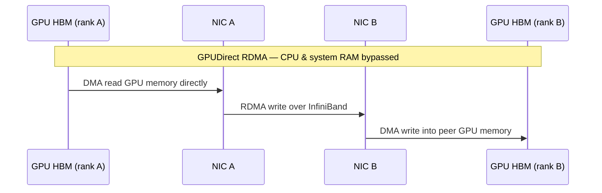
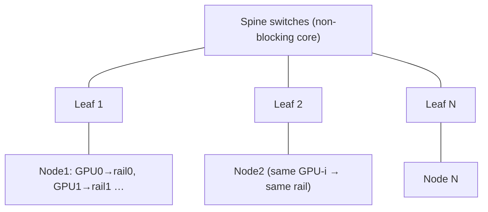
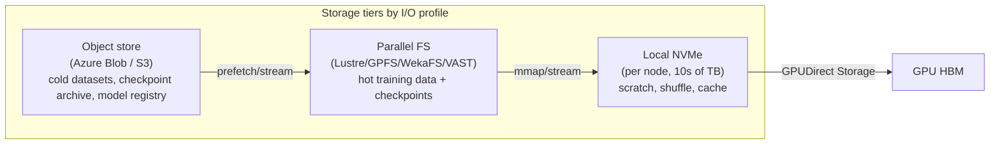
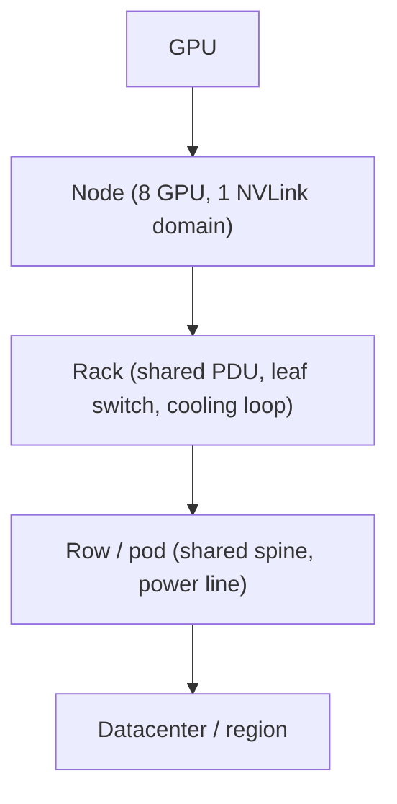
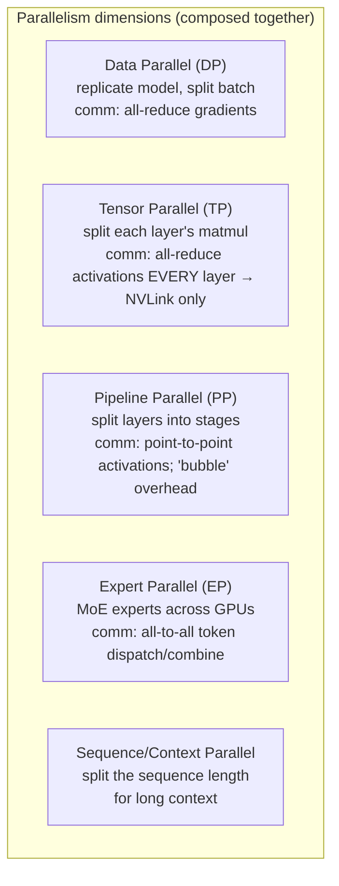
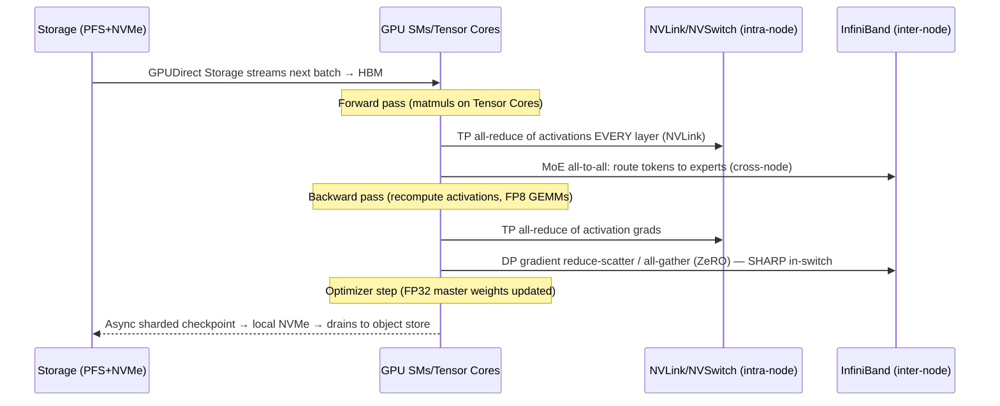

# 📘 SECTION 1 — AI INFRASTRUCTURE FOUNDATIONS (DEEP TECH STACK)

> **System:** LearnAI — Hyperscale AI Infrastructure (Microsoft LearnTeam)
> **Audience:** AI infra / distributed-systems / SRE engineers operating at OpenAI / Meta / Google
> DeepMind / Azure-AI scale. Strong infra background assumed. No toy examples.
> **Thesis of this document:** At hyperscale, **compute, network, and storage are not three systems
> — they are one machine.** A 2T-parameter training run is a single distributed program whose
> instruction set is *collective communication* and whose clock speed is set by the *slowest GPU and
> the most congested link*. Everything below is in service of that one idea.

---

## 0. The one mental model to hold throughout

A modern AI cluster is a **single computer** whose:

- **ALUs** are Streaming Multiprocessors (SMs) inside GPUs,
- **registers/L1** are on-chip SRAM,
- **RAM** is HBM (per-GPU) + the *aggregate* HBM of the whole pod (made addressable by NVLink),
- **system bus** is NVLink/NVSwitch (intra-node) and InfiniBand/RoCE (inter-node),
- **disk** is a parallel filesystem + object store,
- **the program counter** is the training loop, advanced in lockstep by **collective operations**
  (all-reduce, all-gather, reduce-scatter, all-to-all).

The recurring question for **every** component below: *which level of this machine does it sit at,
how much bandwidth and latency does it add, and what happens when it fails?*

---

## 1. GPU Compute Architecture

### 1.1 Why the GPU, not the CPU

Transformer training and inference are **dense linear algebra** (matmuls) plus **elementwise** ops.
The arithmetic intensity is high and the parallelism is enormous (millions of independent
multiply-accumulates per layer). A CPU optimizes for *latency of a single thread*; a GPU optimizes
for *throughput across tens of thousands of threads*. The economic consequence: a GPU delivers
~10–30× the useful FLOPs/$ and FLOPs/Watt for matmul-heavy workloads. At hyperscale, **Watts is the
real currency** (see §9, ADDED), so FLOPs/Watt is what actually caps your cluster.

### 1.2 The current NVIDIA lineup (and where each belongs)

| GPU | Arch | HBM | HBM BW | Dense BF16 | FP8 (dense) | NVLink/GPU | TDP | Primary role |
|---|---|---|---|---|---|---|---|---|
| **H100 SXM** | Hopper | 80 GB HBM3 | 3.35 TB/s | ~990 TFLOP/s | ~1,980 TFLOP/s | 900 GB/s (NVLink 4) | 700 W | Training + inference workhorse |
| **H200 SXM** | Hopper | **141 GB HBM3e** | **4.8 TB/s** | ~990 TFLOP/s | ~1,980 TFLOP/s | 900 GB/s | 700 W | Memory-bound inference (big KV cache), long-context |
| **L40S** | Ada | 48 GB GDDR6 | 0.864 TB/s | ~362 TFLOP/s | ~733 TFLOP/s | **none (PCIe only)** | 350 W | Cheap inference / fine-tune, no NVLink → no big-model TP |
| **B200 / GB200** | Blackwell | 192 GB HBM3e | ~8 TB/s | ~2.2–2.5 PFLOP/s | FP4 ~9–10 PFLOP/s | **1.8 TB/s (NVLink 5)** | ~1000–1200 W | Frontier training + NVL72 mega-domains |

**Reading the table like an architect:**

- **Memory, not FLOPs, is usually the binding constraint.** H200 has *identical compute* to H100 but
  exists because **inference is memory-bandwidth-bound** and KV cache needs capacity. The upgrade
  H100→H200 buys you *more concurrent sequences and longer context*, not faster matmuls.
- **L40S has no NVLink.** That single fact disqualifies it from tensor-parallel serving of large
  models (TP needs NVLink-class bandwidth). It is an *inference-of-small-models / fine-tuning* part.
  Knowing this prevents a classic procurement mistake.
- **Blackwell GB200 NVL72** changes the unit of design: 72 GPUs become **one NVLink domain** (130
  TB/s aggregate), so a model that needed cross-node InfiniBand for tensor parallelism on Hopper can
  stay on NVLink on Blackwell — a step change in TP/EP feasibility.

### 1.3 Inside the GPU: SMs, Tensor Cores, the memory hierarchy

- **SM (Streaming Multiprocessor):** the GPU's fundamental compute unit. H100 SXM has **132 SMs**.
  Each schedules warps of **32 threads** in lockstep (SIMT). Occupancy = how many warps you keep
  resident; low occupancy or thread divergence wastes the chip.
- **Tensor Cores (4th gen on Hopper):** dedicated matrix-multiply-accumulate units. They are the
  reason a GPU does ~990 BF16 TFLOP/s vs ~67 FP32 TFLOP/s on the CUDA cores. **All serious training
  goes through Tensor Cores**; if your kernel isn't hitting them, you're using <10% of the chip.
  - **Numeric formats:** FP16 (range-limited, needs loss scaling), **BF16** (same exponent range as
    FP32 — the default for training), **TF32** (auto for FP32 matmuls), and **FP8 (E4M3 / E5M2)**
    via the **Transformer Engine** — 2× throughput and half the memory vs BF16, the key to frontier
    training/inference economics. Blackwell adds **FP4**.
- **Memory hierarchy (latency/bandwidth cliff):** registers (~TB/s, ~1 cycle) → shared memory/L1 →
  **50 MB L2** → **HBM3** (3.35 TB/s but ~hundreds of cycles). The entire art of CUDA kernel
  optimization (FlashAttention is the canonical example) is **keeping data in SRAM and off HBM**,
  because HBM bandwidth — not FLOPs — bounds most real kernels.
- **HBM (High-Bandwidth Memory):** stacked DRAM on the same package, connected by a silicon
  interposer. This is why a GPU has 3–8 TB/s of bandwidth where a CPU has ~0.1 TB/s. It is also why
  GPUs are expensive and supply-constrained: HBM and CoWoS packaging are the bottleneck of the
  industry.

> **Interview-grade takeaway:** "GPU utilization %" (from `nvidia-smi`) is a *lie* — it means "a
> kernel was resident," not "the chip was busy." The honest metrics are **SM occupancy, Tensor-Core
> active %, HBM bandwidth utilization, and MFU (Model FLOPs Utilization)**. A run can show 100% "GPU
> util" at 35% MFU. (This is the bridge to the Observability domain → Phase 14.)

---

## 2. CUDA Software Stack (MANDATORY ADDITION)

Hardware does nothing without the software stack that feeds it. This is the layer where most real
performance is won or lost.

- **CUDA Runtime + Driver:** the foundation. A subtle but **production-critical** fact: the **driver
  and CUDA toolkit versions must be compatible across thousands of nodes**, and a firmware/driver
  mismatch is a top cause of "this one node trains 20% slower" or XID errors. Driver/firmware
  lifecycle management is a real ops discipline (see Section 2 team model).
- **cuBLAS / CUTLASS:** the GEMM (general matrix multiply) libraries. Every linear layer and
  attention projection is a GEMM. CUTLASS lets you write custom fused kernels (e.g., FP8 GEMM with
  epilogue fusion) when cuBLAS isn't optimal.
- **cuDNN:** primitives for convolution, attention, normalization, activation. Fused attention
  kernels (FlashAttention-style) live here and in custom kernels.
- **NCCL (NVIDIA Collective Communications Library):** *the single most important library for
  distributed training.* It implements **all-reduce, all-gather, reduce-scatter, broadcast,
  all-to-all** over NVLink **and** InfiniBand, choosing ring vs tree algorithms by message size and
  topology, and using **GPUDirect RDMA** so the NIC reads GPU memory directly. **When training
  "hangs," it is almost always a stuck NCCL collective** (one rank died, everyone else blocks on the
  barrier). NCCL tuning (`NCCL_ALGO`, `NCCL_PROTO`, topology files, SHARP) is core performance work.
- **CUDA Graphs:** capture a sequence of kernel launches once and **replay** it as a single
  submission. At inference decode (one token at a time), per-kernel CPU launch overhead (~microsecond
  each × hundreds of kernels) becomes the bottleneck; CUDA Graphs reclaim it. Essential for
  low-latency serving.
- **Transformer Engine:** manages **FP8 scaling factors** (per-tensor amax history) so you get FP8
  speed without diverging — see §8.4 (ADDED) on numerical stability.

### 2.1 PyTorch / JAX execution model on CUDA

- **PyTorch eager:** Python dispatches one op → one (or more) CUDA kernel(s), launched
  **asynchronously** onto a CUDA *stream*. The CPU runs ahead, queuing kernels; the GPU executes them
  in order. `tensor.item()` / `.cpu()` forces a **synchronization** — a classic accidental
  performance killer.
- **`torch.compile` (TorchInductor) / CUDA Graphs:** fuse ops and remove launch overhead. The shift
  from "many small kernels" to "few fused kernels + graph replay" is often a 1.3–2× win.
- **JAX:** functional, **`jit`-compiles whole functions through XLA** into fused kernels ahead of
  time. `pjit`/`shard_map` + GSPMD express parallelism declaratively (sharding annotations), and XLA
  inserts the collectives. This is the model Google uses on TPUs and increasingly on GPU.
- **Async + streams = the mental model:** training overlaps **compute** (matmuls on the compute
  stream) with **communication** (NCCL on a separate stream) so all-reduce of layer *N*'s gradients
  happens while layer *N-1* still computes. **Overlap efficiency is what separates 40% MFU from 60%
  MFU.**

---

## 3. NVLink + NVSwitch Architecture (intra-node fabric)

### 3.1 The problem it solves

Tensor parallelism and MoE expert dispatch require GPUs to exchange **activations every layer** —
gigabytes, thousands of times per second. PCIe (~64 GB/s on Gen5 x16) is **10–30× too slow** and adds
CPU-in-the-path latency. NVLink is a **dedicated GPU-to-GPU interconnect** that makes 8 (or 72) GPUs
behave like one big GPU with a shared, coherent-ish memory domain.

| Generation | GPU | Per-GPU NVLink BW | Domain size |
|---|---|---|---|
| NVLink 4 + NVSwitch 3 | H100/H200 | **900 GB/s** (18 links × 50) | 8 GPUs/node (DGX/HGX); up to 256 via NVLink Switch |
| NVLink 5 + NVSwitch 4 | GB200 | **1.8 TB/s** | **72 GPUs** in one domain (NVL72), 130 TB/s aggregate |

- **NVLink** = the point-to-point links. **NVSwitch** = the crossbar that makes all 8 GPUs
  **fully connected and non-blocking** (every GPU talks to every other at full 900 GB/s
  simultaneously), instead of a ring where bandwidth is shared.
- **Shared memory domain:** within the NVLink domain, a GPU can directly read/write peer GPU HBM. TP
  all-reduce of activations rides this fabric. **Rule of thumb on Hopper: keep tensor parallelism
  ≤ 8 (inside one node)** because crossing to InfiniBand for TP would tank throughput. NVL72 lifts
  that ceiling to 72 — a genuine architectural unlock for huge dense layers and MoE.
- **Failure mode:** NVLink errors (visible as NVML/DCGM NVLink CRC/replay counters) silently degrade
  bandwidth → one node becomes a straggler that drags a 10k-GPU job. Detecting and draining it is a
  core reliability task (Section 2).

---

## 4. InfiniBand RDMA Network Fabric (cluster-level fabric)

### 4.1 Why InfiniBand and not "just Ethernet"

Once you exceed one NVLink domain, GPUs talk over the cluster network. Distributed training is
**bandwidth-hungry and latency-sensitive and bursty and synchronized** (all ranks all-reduce at the
same instant — an "incast" that destroys naive networks). The requirements:

1. **Microsecond latency** (collectives are on the critical path of every step).
2. **No CPU in the data path** → **RDMA** (Remote Direct Memory Access).
3. **Lossless** delivery (credit-based flow control), because retransmits wreck collective tail
   latency.

**InfiniBand** delivers all three natively. The Ethernet answer is **RoCEv2** (RDMA over Converged
Ethernet) with PFC/ECN for losslessness — **Meta runs RoCE at scale; Microsoft/OpenAI lean
InfiniBand**. The trade-off: IB is a purpose-built, lower-risk lossless fabric with SHARP; RoCE
reuses Ethernet economics/ecosystem but lossless Ethernet tuning (PFC storms, deadlocks) is
notoriously hard. Both are valid hyperscale choices.

| IB generation | Per-port bandwidth | Switch |
|---|---|---|
| HDR | 200 Gb/s | Quantum |
| **NDR** | **400 Gb/s** | Quantum-2 (64×400G) |
| **XDR** | **800 Gb/s** | Quantum-X |

An Azure **ND H100 v5** node: 8× H100 + **8× 400 Gb/s NDR InfiniBand = 3.2 Tb/s per node** (one NIC
per GPU — "rail" design).

### 4.2 GPUDirect RDMA

The NIC reads/writes **GPU HBM directly** over PCIe peer-to-peer, bypassing the CPU and host RAM.
This removes a copy and ~microseconds of latency per message — at billions of messages it's the
difference between a viable and a dead training run.

### 4.3 Topology: rail-optimized fat-tree (+ SHARP)

- **Fat-tree / Clos** with **full bisection bandwidth** (or a deliberately cheaper oversubscription
  ratio at the spine if budget demands — a key cost lever). Bisection bandwidth is what determines
  whether an all-reduce across the whole pod runs at line rate.
- **Rail-optimized:** GPU *i* on every node connects to the *same* leaf ("rail *i*"). All-reduce
  among the GPU-0s of 1000 nodes then stays on rail 0 and is one hop — minimizing cross-spine
  traffic and congestion.
- **SHARP (Scalable Hierarchical Aggregation and Reduction Protocol):** the **switch itself performs
  the reduction** (in-network computing). Instead of every GPU sending data around a ring, partial
  sums are aggregated *inside the switch ASIC*, roughly halving all-reduce traffic and latency for
  large jobs. This is a real OpenAI/Azure-scale lever.
- **Congestion control:** adaptive routing + ECN; the failure mode is **fabric congestion → all-reduce
  tail latency → cluster-wide slowdown** even though every GPU looks "healthy." (Observability:
  per-edge IB counters, congestion, link-flap detection.)

---

## 5. Storage Architecture

Storage at AI scale serves three very different I/O profiles, and one size does **not** fit all:

1. **Dataset read (training):** sustained, high-throughput, sequential-ish streaming of tens of
   petabytes of tokens. Must keep thousands of GPUs fed; a stall starves the whole job. Pattern:
   shard + shuffle + **prefetch** + local NVMe cache.
2. **Checkpoint write (training):** *bursty, enormous, synchronized*. A 2T-param checkpoint is
   **30–40 TB** written by all ranks at once (see §8.3). If checkpointing blocks training, it is pure
   lost GPU-hours, so it must be **sharded + asynchronous** (write to local NVMe fast, drain to
   parallel FS / object store in the background).
3. **Inference (model load + KV):** load tens-to-hundreds of GB of weights fast on scale-up;
   weights then live in HBM.

**Technologies:**

- **Local NVMe:** lowest latency, used as scratch/shuffle buffer and checkpoint staging. **NVMe-oF
  (NVMe over Fabrics)** disaggregates NVMe over the RDMA network so capacity can be pooled without
  CPU overhead.
- **Parallel filesystems:** **Lustre, IBM Spectrum Scale (GPFS), WekaFS, VAST, BeeGFS** — provide a
  single namespace with aggregate throughput in the **TB/s** range by striping across many storage
  servers. This is the hot tier for training data and checkpoints.
- **Object storage (Azure Blob / S3):** the cheap, durable, effectively-infinite cold tier — raw
  datasets, checkpoint archives, the **model registry/artifact store**. Higher latency, accessed via
  streaming/prefetch.
- **GPUDirect Storage (GDS):** DMA path **NVMe → GPU HBM directly**, bypassing the CPU bounce buffer
  — the storage analogue of GPUDirect RDMA. Critical for keeping data-loading off the CPU at scale.

> **Cost reality:** checkpoint and dataset storage at the PB scale is a multi-million-dollar line
> item, and **checkpoint write bandwidth caps how often you can checkpoint**, which in turn caps how
> much work you lose to a failure (see §8.3 and the goodput math in Section 2).

---

## 6. Distributed AI Compute Model

### 6.1 The GPU as a *memory + compute* unit (and why that framing matters)

At this scale you stop thinking "I have N GPUs" and start thinking "I have **N × HBM_capacity** of
fast memory and **N × FLOPs** of compute, stitched by a fabric with finite bandwidth." A 2T model
**does not fit in any single GPU** (it needs ~4 TB just for BF16 weights vs 80–192 GB/GPU), so the
model itself is *sharded across the aggregate HBM of hundreds-to-thousands of GPUs.* The fabric (§3,
§4) is what makes that aggregate memory usable as one address space. **This is why network bandwidth,
not GPU count, is frequently the real ceiling.**

### 6.2 Token-based compute scaling (the unit of work)

- **Training cost** scales ≈ with **tokens processed × active parameters** (the well-known
  `C ≈ 6 · N · D` FLOPs for a dense model of N params over D tokens; the factor 6 = fwd + bwd).
- **Inference cost** scales with **tokens generated** (and prompt tokens for prefill). This is why
  the business unit is **$/token** and the infra unit is **tokens/sec/GPU** (decode) and
  **prompt-tokens/sec/GPU** (prefill).
- **MoE breaks the link** between *total* and *active* parameters: a 2T-total MoE may activate only
  ~5% per token, so its **compute** is ~100B-class while its **memory** is 2T-class. This is *the*
  reason frontier models are MoE — it decouples capacity (memory) from cost (compute).

### 6.3 Failure domains in large clusters

Define blast radius explicitly — it drives both reliability design and scheduling:

- **Independent failures** (single GPU XID, ECC, NVLink CRC) are *frequent* — at 10k+ GPUs you see
  one every few hours (Meta's Llama-3 logbook is the canonical public data point).
- **Correlated failures** are the dangerous ones: a PDU trips a whole rack, a leaf switch isolates a
  rack, a cooling loop fails a row, a region loses power. **A topology-aware scheduler must place a
  job's replicas to bound correlated loss**, and checkpoint/restart must assume *correlated* loss,
  not just single-GPU.

---

## 7. Parallelism Strategies

The core skill of an AI infra engineer: **map a model onto the machine** by combining parallelism
dimensions so that (a) it fits in memory and (b) communication overlaps with compute. Frontier runs
combine **4–5 dimensions simultaneously** ("4D/5D parallelism").

| Dim | What it splits | Communication | Where it must live | Limit |
|---|---|---|---|---|
| **DP** + **ZeRO/FSDP** | the batch (and optimizer/grad/param shards) | all-reduce / reduce-scatter + all-gather | across nodes (IB) | comms grows with model size; ZeRO-3 trades comms for memory |
| **TP** (Megatron) | inside each layer (the matmul) | all-reduce **every** layer | **inside NVLink domain (≤8 on Hopper, ≤72 on NVL72)** | bandwidth — never cross IB for TP if avoidable |
| **PP** | the stack of layers (stages) | P2P activations between stages | across nodes (IB), tolerant | **pipeline bubble** (idle stages); fixed by micro-batching + interleaved 1F1B |
| **EP** | MoE experts | **all-to-all** dispatch/combine | across nodes (IB) | all-to-all is bursty; load imbalance between experts |
| **SP/CP** | the sequence | all-gather/ring of K/V | with TP | needed only for long context |

- **ZeRO / FSDP (the DP memory fix):** plain DP replicates the *entire* optimizer state on every GPU
  — impossible at 2T. **ZeRO-1/2/3** (DeepSpeed) and **FSDP** (PyTorch) **shard optimizer states,
  then gradients, then parameters** across the DP group, all-gathering parameters just-in-time per
  layer. ZeRO-3/FSDP is how you fit a model that "shouldn't fit," at the cost of extra all-gather
  traffic.
- **Composing them (worked intuition for a 2T MoE on H100):** TP=8 (inside the node, on NVLink) ×
  PP=N stages (across nodes) × EP=M experts (across nodes, all-to-all) × DP=rest (with ZeRO).
  **Placement is everything:** TP groups must be co-located on NVLink; PP/EP/DP ride InfiniBand and
  must be laid out rail-optimally. A bad mapping can halve MFU with zero code changes.
- **The optimization target is MFU** (Model FLOPs Utilization) = achieved FLOPs ÷ peak FLOPs.
  Frontier dense runs hit ~**40–55% MFU**; getting there is a fight against pipeline bubbles,
  exposed (non-overlapped) communication, load imbalance, and stragglers.

---

## 8. The Memory Scale Problem (CRITICAL)

This is the section that turns "2 trillion parameters" from a marketing number into an engineering
plan. **It's all arithmetic — and the arithmetic dictates the cluster.**

### 8.1 Where the memory goes (mixed-precision Adam, per parameter)

For standard mixed-precision training with the Adam/AdamW optimizer, **per parameter** you store:

| Item | Bytes/param |
|---|---|
| BF16 parameter (compute copy) | 2 |
| BF16 gradient | 2 |
| FP32 master parameter | 4 |
| FP32 Adam momentum (m) | 4 |
| FP32 Adam variance (v) | 4 |
| **Total (model + optimizer state)** | **16** |

### 8.2 The 2T-parameter math

- **Weights alone (BF16):** 2×10¹² × 2 B = **4 TB**.
- **Model + optimizer state @ 16 B/param:** 2×10¹² × 16 = **32 TB** (≈ matches your 30–80 TB target;
  the rest is activations + fragmentation + comms buffers).
- **GPUs just to *hold state*:** 32 TB ÷ 80 GB (H100) ≈ **400 GPUs minimum** — and that's before any
  room for activations, KV during training, NCCL buffers, or fragmentation. **In practice you need
  thousands** of GPUs for a 2T training run, the extra ones supplying *compute throughput and
  activation memory*, not just capacity.
- **MoE relief:** if the 2T is a sparse MoE with ~5% active, the *activation* memory and *compute*
  track the active params, but the *parameter+optimizer* memory is still the full 2T — so **MoE saves
  compute, not weight memory.** You still must store and shard 32 TB of state. (This asymmetry is a
  favorite interview probe.)

### 8.3 Activation memory & the recomputation trade-off

Activations (the intermediate tensors saved for the backward pass) scale with
**batch × sequence_length × hidden × layers** and can rival or exceed parameter memory for long
context. Two levers:

- **Activation recomputation / gradient checkpointing:** don't store activations; **recompute them in
  the backward pass.** Trades ~30% extra compute for a large memory saving — almost always worth it
  at frontier scale.
- **Sequence/context parallelism:** split the sequence so no single GPU holds the full activation for
  a long context.

### 8.4 FP8 and numerical stability (ADDED — the part the prompt omits)

FP8 (E4M3/E5M2) **halves memory and doubles throughput**, but FP8's tiny dynamic range will diverge a
naïve run. Production FP8 requires:

- **Per-tensor scaling factors** with **amax history** (the Transformer Engine tracks the running max
  magnitude and rescales) so values use the full FP8 range without overflow/underflow.
- Keeping **master weights and optimizer state in FP32/higher** (you never quantize the optimizer).
- Watching for **loss spikes** — at 2T scale, loss spikes and silent NaNs are *operational events*
  (you roll back to the last good checkpoint, possibly skip a bad data shard, and resume). **This is
  why checkpoint cadence is a numerical-stability decision, not just a reliability one.**

### 8.5 Checkpoint sizing & strategy

- A full **model + optimizer** checkpoint for 2T params ≈ **32–40 TB** (you must save FP32 master +
  momentum + variance to resume *exactly*).
- **Naïve synchronous checkpoint = catastrophic GPU idle.** At, say, 1 TB/s aggregate checkpoint
  bandwidth, 40 TB takes ~40 s of *all* GPUs doing nothing — every checkpoint.
- **Production pattern:** **sharded + asynchronous + tiered** — each rank writes its shard to **local
  NVMe** in seconds, then a background process drains NVMe → parallel FS → object store while
  training continues. Frameworks: **PyTorch Distributed Checkpoint (DCP)**, DeepSpeed, plus
  in-memory/peer checkpointing (a la Gemini/CheckFreq) that keeps a copy in a peer's RAM so a single
  node failure doesn't even need disk.
- **Cadence = a goodput optimization** (see Section 2): checkpoint too often → I/O overhead; too
  rarely → you lose more work per failure. The optimum depends on MTBF and checkpoint cost (Young/
  Daly formula).

---

## 9. ADDED COMPONENTS — what a 2T blueprint must include that the brief omitted

These are the components an OpenAI/Azure-scale design **cannot** ship without; flagged so you can see
the gap in the original brief.

### 9.1 Power, cooling, and datacenter physics (the *real* hyperscale ceiling)

At 700–1200 W per GPU, **the binding constraint on cluster size is power and heat, not money or
silicon.**

- A single H100 node (~10 kW) → a rack of 4–8 nodes is **40–100+ kW**; a GB200 NVL72 rack is
  **~120+ kW**. Legacy datacenters were built for ~10 kW/rack. **This is why AI datacenters are new
  builds.**
- **Air cooling tops out** around these densities → **direct-to-chip liquid cooling** (cold plates)
  and increasingly **immersion** are mandatory at the frontier. Cooling failure = thermal throttle
  (silent MFU loss) → emergency shutdown (job loss).
- **PUE** (Power Usage Effectiveness) and **grid availability** now gate where you *can* build. A
  10k-GPU cluster is a **15–25 MW** facility; a frontier campus is **100s of MW → GW-class**.
- **Observability hooks:** per-rack power draw, coolant temps/flow, GPU thermal throttle counters,
  power capping events. (→ Observability domain.)

### 9.2 Scheduling & orchestration

- **Training:** **Slurm** (HPC heritage, gang scheduling) or **Kubernetes + Kueue/Volcano** (gang +
  topology-aware), with **topology-aware placement** (keep TP groups on one NVLink domain, lay out
  PP/DP rail-optimally) and **gang scheduling** (all-or-nothing: a 1024-GPU job must get all 1024 at
  once or none — partial allocation just wastes GPUs idling on a barrier).
- **Microsoft-specific:** **Singularity** (Azure's globally-distributed scheduler with transparent
  preemption/migration/elasticity) is the canonical example. Mention **Project Forge** as the
  internal scheduling fabric.
- **Inference:** autoscaling on **tokens/sec & queue depth** (not CPU%), with **prefill/decode
  disaggregation** as a scheduling decision (Section 2).

### 9.3 Collective-communication algorithms (the "instruction set")

- **All-reduce** = reduce-scatter + all-gather. **Ring** all-reduce is bandwidth-optimal for big
  messages; **tree** is latency-optimal for small; **SHARP** offloads the reduce into the switch.
  NCCL auto-selects, but tuning (`NCCL_ALGO/PROTO`, buffer sizes, `NCCL_IB_HCA`, topology file) is
  real work.
- **All-to-all** is the MoE primitive and the hardest on the fabric (every rank sends to every rank
  — maximal incast). MoE scaling lives or dies on all-to-all performance + expert load balance.

### 9.4 Confidential computing, multi-tenancy & supply chain (brief mentions)

- **Multi-tenancy isolation:** MIG (Multi-Instance GPU) partitions a GPU for small/inference
  tenants; full-GPU isolation for training tenants; per-tenant network/QoS.
- **Confidential computing** (H100 confidential VMs) for customer-model isolation — a real Azure
  requirement.
- **Software supply chain:** golden CUDA/driver/firmware images, version pinning across thousands of
  nodes, NCCL/topology config as code. Drift here = stragglers and XID storms.

---

## 10. How compute, network, and storage act as ONE system (the synthesis)

Trace a **single training step** of a 2T MoE and watch the whole machine move in lockstep:

**The chain is only as fast as its slowest link, and the failures cascade:**

- A **storage** stall starves the GPUs → MFU drops though GPUs look "100% utilized."
- An **NVLink** CRC error on one GPU slows that node's TP all-reduce → it becomes a **straggler** →
  the whole synchronized job waits on it every step.
- **InfiniBand congestion** lengthens all-reduce/all-to-all tails → cluster-wide slowdown.
- A **single GPU XID** failure trips the NCCL barrier → the entire 10k-GPU job **hangs**, then
  restarts from the **last checkpoint** → minutes-to-hours of lost GPU-hours.

This is why the operating metric isn't "GPU utilization" but **goodput** = (useful FLOPs delivered) ÷
(theoretical FLOPs of the cluster over wall-clock), which folds in MFU **and** time lost to failures,
restarts, stragglers, and checkpointing. **Goodput is the number a Principal AI-infra engineer
optimizes — and it is a property of compute + network + storage + scheduling together, never any one
of them alone.** Section 2 turns this foundation into an operable, multi-region production platform.

---

### Cross-references

- **Observability of all of the above** → `Observability/14-AI Infrastructure Observability/`
  (DCGM, MFU/goodput dashboards, NVLink/IB congestion, KV-cache & batching SLOs).
- **Reference platform answer-key** → `Observability/18-Architecture Patterns/00-Reference-Platform-Architecture.md`.
- **Section 2 (this domain)** → `AI-Infra/02-Production-Stack/Section-2-LearnAI-Production-Stack.md`.
