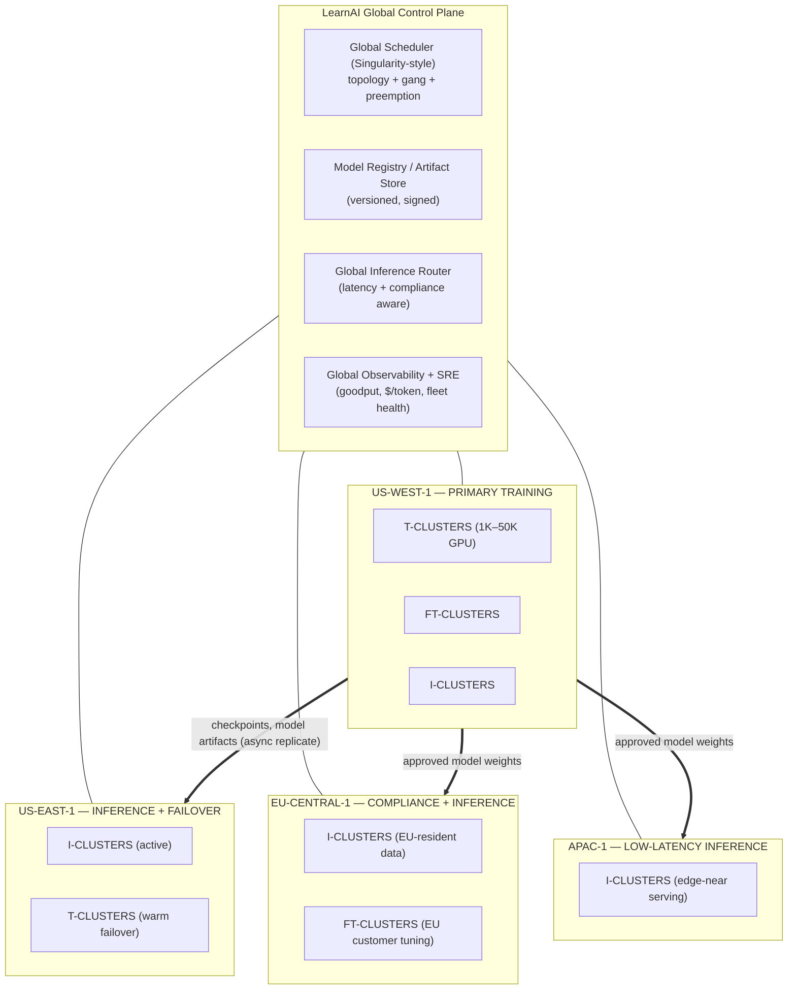
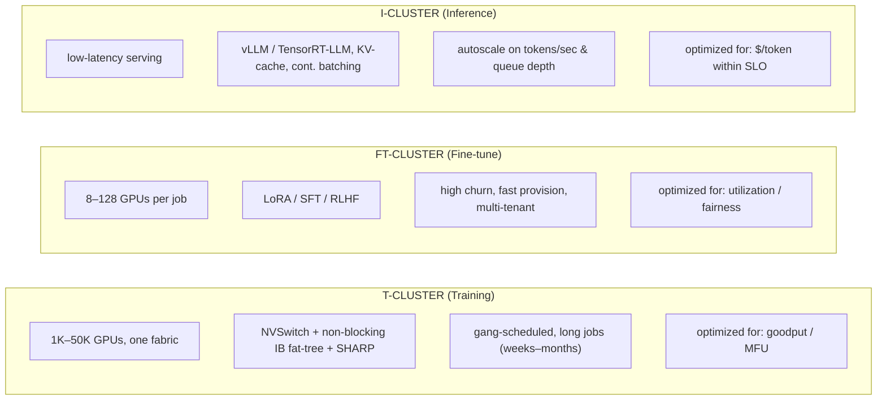
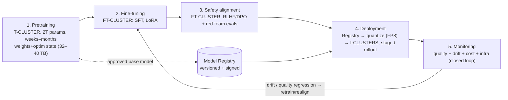
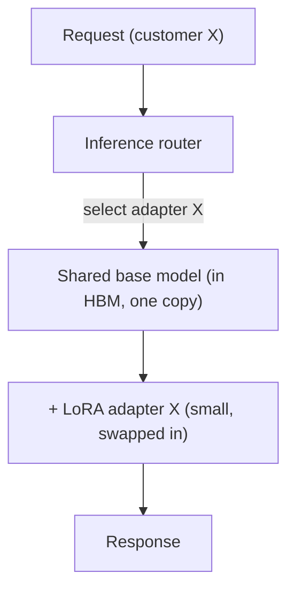
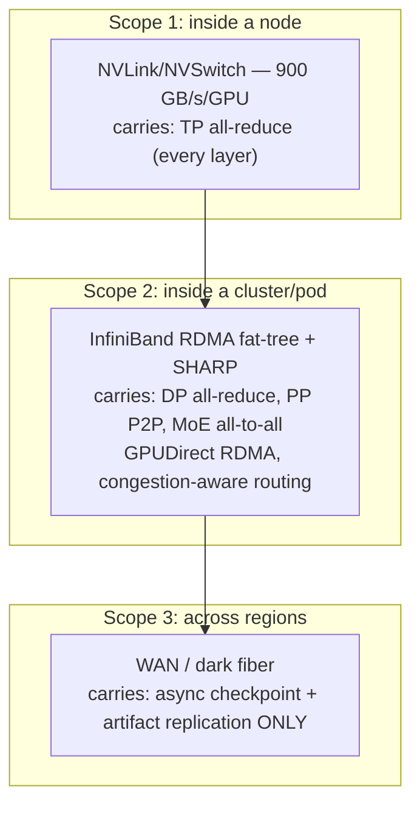
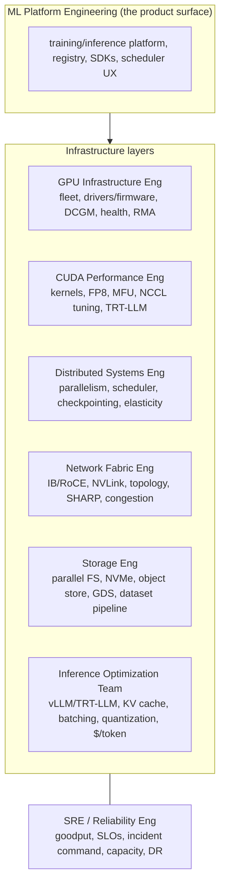
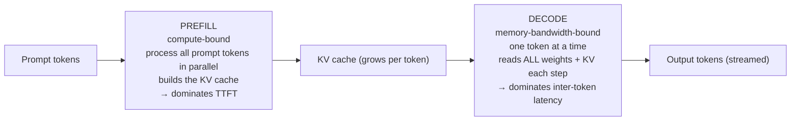
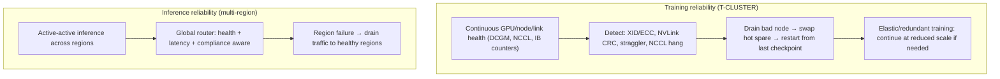

# 📗 SECTION 2 — LEARNAI PRODUCTION STACK (REAL-TIME AI PLATFORM)

> **System:** LearnAI — Hyperscale AI Infrastructure (Microsoft LearnTeam)
> **Document type:** Internal production reference architecture — how a 2T+ parameter platform is
> **actually operated** across regions, clusters, and teams.
> **Prereq:** `AI-Infra/01-Foundations/Section-1-AI-Infrastructure-Foundations.md` (the deep tech
> stack). This section assumes that machine exists and asks: *how do we run it as a business-grade,
> multi-region, fault-tolerant service?*
> **North-star metric:** **goodput** (useful FLOPs delivered, net of failures/stragglers/checkpoints)
> for training, and **goodput tokens/sec within SLO** for inference. Every decision below is justified
> against goodput and **$/token / $/GPU-hour**.

---

## 1. Platform topology at a glance

The platform is **three cluster types** (training, fine-tuning, inference) placed across **four
regions** by a **global control plane** that owns scheduling, the model registry, inference routing,
and observability. The rest of this document specifies each piece and — critically — **how it behaves
under failure.**

---

## 2. Global Region Design

| Region | Role | Primary clusters | Why it exists | Data residency |
|---|---|---|---|---|
| **US-WEST-1** | **Primary training** | T-CLUSTERS (largest), some FT/I | Largest contiguous power + GPU capacity; frontier 2T runs live here | Training corpora |
| **US-EAST-1** | **Inference + failover** | I-CLUSTERS (active), warm T-CLUSTER | Active-active inference for US; **DR target for US-WEST training** | US traffic |
| **EU-CENTRAL-1** | **Compliance + inference** | I-CLUSTERS, FT-CLUSTERS | **GDPR / EU data residency**; EU customer fine-tuning stays in-region | **EU-resident** (must not leave) |
| **APAC-1** | **Low-latency inference** | I-CLUSTERS | Serve APAC users near the edge to cut TTFT (cross-Pacific RTT is ~150 ms) | APAC traffic |

**Design rules that follow from this:**

- **Training is centralized; inference is distributed.** Training wants one giant contiguous fabric
  (you cannot tensor-parallel across an ocean — inter-region RTT is 10⁴× NVLink latency). Inference
  wants to be **near users** (TTFT is dominated by network RTT for short prompts).
- **Weights flow one way:** trained/aligned models are produced in US-WEST-1, registered centrally,
  and **replicated out** to inference regions. **Customer data and EU-resident data do not flow back**
  to the training region — compliance is a routing + storage constraint, not an afterthought.
- **Cross-region links** are high-bandwidth WAN (dedicated/dark fiber) used for **async checkpoint
  replication and artifact distribution**, never for synchronous training collectives.

---

## 3. Cluster Types (MANDATORY)

### 3.1 Training Clusters (T-CLUSTERS)

- **Scale:** 1K–50K GPUs as **one fabric** (full/near-full bisection IB fat-tree + NVSwitch +
  SHARP). A 2T run is a single gang-scheduled job spanning thousands of GPUs.
- **Workload:** weeks-to-months, synchronous, fragile to any single failure (§7). Combines TP (≤8 on
  NVLink) × PP × EP × DP+ZeRO (Section 1 §7).
- **Operating goal:** maximize **goodput** = MFU × (1 − fraction of time lost to failures/restarts/
  checkpoints). Stragglers and exposed communication are the enemies.
- **Scheduling:** **gang** (all-or-nothing) + **topology-aware** placement; hot spare nodes held in
  reserve for fast straggler replacement.

### 3.2 Fine-Tuning Clusters (FT-CLUSTERS)

- **Scale:** 8–128 GPUs per job — small relative to training. **High churn, many tenants,
  fast provisioning.**
- **Workload:** **LoRA** (cheap, freeze base weights, train low-rank adapters), **SFT** (supervised
  fine-tune), **RLHF/DPO** (preference alignment — needs reward model + policy, more GPU-hungry).
- **Operating goal:** **utilization + fairness + fast queue times**, not single-job MFU. Heavy use of
  **MIG** (slice GPUs) and bin-packing many small jobs. Per-tenant quotas and isolation matter most
  here.
- **Placement nuance:** LoRA jobs may not even need cross-node IB (fit in one node) → schedule
  densely. RLHF jobs co-locate policy + reward model to cut latency.

### 3.3 Inference Clusters (I-CLUSTERS)

- **Scale-unit thinking:** the unit is a **model replica** (enough GPUs to hold the model + KV cache
  with the right TP), not "a cluster." You scale **replicas** horizontally.
- **Engines:** **vLLM** (PagedAttention — pages the KV cache like virtual memory, near-zero
  fragmentation), **TensorRT-LLM** (compiled, fastest on NVIDIA, in-flight batching), **SGLang**
  (RadixAttention — prefix/KV reuse). H200 preferred here for KV-cache capacity (Section 1 §1.2).
- **Continuous (in-flight) batching:** insert/evict sequences from the running batch every decode
  step instead of waiting for a static batch to finish — **the single biggest inference throughput
  win**, keeps the GPU busy while sequences finish at different times.
- **Autoscaling signal:** **tokens/sec, queue depth, and TTFT** — *never* CPU%. (See §9 for the
  prefill/decode split that makes this work.)
- **Operating goal:** **$/token at or below the latency SLO** (TTFT + inter-token latency).

---

## 4. Model Lifecycle

1. **Pretraining** (T-CLUSTER): the expensive frontier run. Output: base model weights + the full
   optimizer state (so the run is resumable). Output lands in the **model registry** (versioned,
   signed, immutable).
2. **Fine-tuning** (FT-CLUSTER): SFT on curated/instruction data; customer LoRA adapters.
3. **Safety alignment** (FT-CLUSTER): RLHF/DPO + automated safety/red-team eval gates. **A model
   does not advance to deployment without passing eval + safety gates** — this is a release control,
   not a suggestion.
4. **Deployment:** registry → **quantize to FP8/INT8** for serving → push to I-CLUSTERS via
   **staged/canary rollout** per region. Weights are signed and verified on load.
5. **Monitoring → closed loop:** production quality/drift/cost signals feed back to trigger
   re-tuning or re-alignment. (Detail in `Observability/15-MLOps Observability/`.)

---

## 5. Model Placement Strategy

| Model class | Where it runs | Why | Lifecycle |
|---|---|---|---|
| **Foundation / frontier models** | **T-CLUSTERS** (train), then base weights → registry | Need the full fabric to train; never served raw | trained centrally in US-WEST-1 |
| **Customer fine-tuned models (LoRA/SFT)** | **FT-CLUSTERS** (train) → **I-CLUSTERS** (serve, often as adapters on a shared base) | Many small models; LoRA adapters served on a shared base host save enormous memory | per-customer, EU-resident stays in EU |
| **Production API models** | **I-CLUSTERS** (all regions) | Latency-near users; autoscaled per region | versioned, canaried, instantly rollback-able |

**Key operational pattern — adapter multiplexing:** instead of one full model replica per fine-tuned
customer (impossibly expensive), serve **one base model + thousands of LoRA adapters** swapped per
request (e.g., S-LoRA / multi-LoRA). This is *the* economic unlock for "fine-tune your own model"
products — it turns N customer models into N small adapter files over one shared, well-utilized base.

---

## 6. 2 Trillion Parameter Scale Requirements

This is the operational counterpart to Section 1 §8 — *how the 32–40 TB of state is actually run.*

- **Model sharding across thousands of GPUs:** 2T weights = 4 TB BF16, full state ≈ 32 TB →
  **hundreds of GPUs minimum just to hold state, thousands to run it** (Section 1 §8.2). Mapping:
  **TP=8 on NVLink × PP across nodes × EP for experts × DP+ZeRO-3 for the rest**, laid out
  rail-optimally on the IB fat-tree.
- **Distributed memory behavior:** the model's parameters/optimizer live in the **aggregate HBM** of
  the pod; ZeRO-3/FSDP all-gathers each layer's parameters just-in-time and frees them after use, so
  no single GPU ever holds the whole model. The fabric *is* the memory bus.
- **30–80 TB training memory footprint:** 32 TB state + activations (mitigated by recomputation +
  sequence parallelism) + NCCL/comms buffers + fragmentation → lands in the 30–80 TB range depending
  on batch/context/recompute settings.
- **MoE routing architecture:** a learned **gating network** sends each token to its **top-k (e.g.,
  top-2) experts**; experts are sharded across GPUs (**expert parallelism**), so routing is an
  **all-to-all** dispatch (tokens → expert GPUs) then **all-to-all** combine (results back).
  Operationally you must manage:
  - **Expert load balancing** (auxiliary load-balance loss; without it a few "celebrity" experts
    saturate while others idle → wasted GPUs and stragglers),
  - **Expert capacity factor** (token drop vs padding trade-off),
  - **All-to-all performance** on the fabric (the dominant comms cost of MoE).
- **Checkpointing strategy (operational):** **sharded + asynchronous + tiered** (Section 1 §8.5) —
  each rank dumps its shard to local NVMe in seconds, a background drain replicates NVMe → parallel
  FS → object store, and a **cross-region async copy** sends the latest good checkpoint to US-EAST-1
  for DR. **Checkpoint cadence is tuned from MTBF** (Young/Daly): more often than ~MTBF wastes I/O,
  less often wastes work on each failure.

---

## 7. Network + Infra Integration (one machine, three fabrics)

The platform composes the three fabrics from Section 1 by **scope**, and the golden rule is
**bandwidth-matching: never put a high-frequency collective on a slower fabric than it needs.**

| Traffic | Fabric | Why there |
|---|---|---|
| **TP all-reduce** (every layer, latency-critical) | **NVLink/NVSwitch** | only fabric fast enough; keep TP ≤ node size |
| **DP gradient all-reduce / ZeRO** | **InfiniBand** (+ **SHARP** in-switch reduce) | large but tolerant; SHARP halves traffic |
| **PP activations** (point-to-point) | InfiniBand | modest, latency-tolerant |
| **MoE all-to-all** (dispatch/combine) | InfiniBand | burstiest pattern; needs **congestion-aware adaptive routing** |
| **GPUDirect RDMA** | NIC ↔ GPU HBM | removes CPU from the path (Section 1 §4.2) |
| **Cross-region replication** | WAN/dark fiber | **never** synchronous training comms |

**Congestion-aware routing** (adaptive routing + ECN, rail-optimized placement, SHARP) is what keeps
all-reduce/all-to-all tails short. The failure mode to design against: **a hot link → long collective
tail → the synchronized job slows cluster-wide** even though every GPU reports healthy.

---

## 8. Engineering Teams Model (Microsoft-style)

Each fabric/layer of the machine maps to an owning team with a clear charter and on-call surface:

| Team | Owns | On-call surface (what pages them) |
|---|---|---|
| **GPU Infrastructure Eng** | GPU fleet, **driver/firmware lifecycle**, DCGM health, node provisioning, RMA | XID/ECC storms, GPU/node down, throttling |
| **CUDA Performance Eng** | kernels (GEMM, attention), **FP8**, MFU, NCCL/SHARP tuning | MFU regression, kernel correctness, NCCL hangs |
| **Distributed Systems Eng** | parallelism strategy, **scheduler**, gang/topology placement, **checkpoint/restart**, elasticity | job won't schedule, restart failures, stragglers |
| **Network Fabric Eng** | IB/RoCE, NVLink, topology, **SHARP**, congestion control | link flaps, congestion, all-reduce tail latency |
| **Storage Eng** | parallel FS, NVMe, object store, **GDS**, data-loading pipeline | I/O stalls, checkpoint write failures, dataset starvation |
| **ML Platform Eng** | training/inference platform, **model registry**, SDKs, scheduler UX | platform API down, registry, onboarding |
| **Inference Optimization Team** | vLLM/TRT-LLM, **KV cache, batching, quantization**, $/token | TTFT/ITL SLO breach, throughput regression |
| **SRE / Reliability Eng** | **goodput SLOs**, incident command, capacity planning, **DR/failover** | SLO burn, region failover, capacity exhaustion |

> **Conway's law on purpose:** the org chart mirrors the machine (Section 1 §10). When a 10k-GPU job
> slows down, the symptom alone (low goodput) doesn't say which team owns it — so the **observability
> layer must attribute the loss** (MFU vs stragglers vs IB congestion vs storage stall vs failures)
> to route the page correctly. That attribution is the whole point of AI-infra observability.

---

## 9. Real-Time Inference — production behavior (the "real-time" core)

The platform's real-time surface deserves its own treatment because its operating physics differ
fundamentally from training.

### 9.1 Prefill vs decode — two different machines

- **Prefill** is **compute-bound** (big parallel matmul over the prompt) and sets **TTFT** (time to
  first token).
- **Decode** is **memory-bandwidth-bound** (each new token reads the full model + KV cache from HBM)
  and sets **inter-token latency / TBT**. This is why H200's extra HBM bandwidth and capacity matter,
  and why decode batching is essential to amortize the weight reads.
- **Prefill/decode disaggregation** (Microsoft's **Splitwise**, also DistServe/Mooncake): run prefill
  and decode on **separate GPU pools** so a long prefill doesn't stall everyone's decode, and each
  pool is sized/tuned for its own bottleneck. A real scheduling + routing decision in I-CLUSTERS.

### 9.2 KV cache — the capacity constraint of serving

- KV cache size ≈ `2 (K,V) × layers × kv_heads × head_dim × seq_len × batch × bytes`. It **grows with
  context length and concurrency** and competes with weights for HBM. **KV cache capacity, not
  compute, usually caps how many concurrent users you can serve.**
- Levers: **PagedAttention** (vLLM — no fragmentation), **GQA/MQA** (fewer KV heads → smaller cache),
  **KV quantization** (FP8 KV), **prefix caching / RadixAttention** (reuse shared prompt prefixes
  across requests — huge for system prompts and few-shot).

### 9.3 Inference SLOs & autoscaling

- **SLOs:** TTFT (e.g., p95 < 500 ms), inter-token latency (e.g., p95 < 50 ms), and **goodput**
  (tokens/sec served *within* SLO — throughput that violates latency is worthless).
- **Autoscale on tokens/sec + queue depth + TTFT**, scaling **replicas**. Cold-start of a replica
  (loading tens of GB of weights into HBM) is slow → keep **warm pools** and use fast weight loading
  / GDS.
- **Throughput vs latency is a dial:** bigger batches → higher tokens/sec/GPU (lower $/token) but
  worse per-request latency. The platform runs **latency-tiered fleets** (interactive low-latency vs
  batch/async high-throughput) at different points on that curve.

---

## 10. Failover + Reliability

### 10.1 Training recovery (the hard problem)

- **Why it's hard:** training is **synchronous** — one GPU failing trips the NCCL barrier and **hangs
  the entire job**. At 10k+ GPUs, failures occur every few hours, so recovery must be **routine and
  fast**, not heroic.
- **Mechanism:** health monitors detect the fault (XID/ECC/NVLink/straggler/NCCL-hang) → **drain** the
  bad node → **swap in a hot spare** → **restart from the last checkpoint** (Section 1 §8.5).
- **Goodput math (the number that matters):**
  `goodput = MFU × (1 − checkpoint_overhead − restart_lost_work − straggler_loss)`.
  Lost work per failure ≈ time since last checkpoint + restart time. This is why **checkpoint cadence
  is tuned to MTBF** and why **fast restart + async checkpointing** are first-order reliability
  features, not nice-to-haves.
- **Beyond restart:** **elastic training** (continue at reduced GPU count and rescale later),
  **in-memory/peer checkpointing** (survive single-node loss without touching disk), and **redundant/
  hot-spare** capacity to mask the common single-GPU failure entirely.

### 10.2 Inference failover (multi-region active-active)

- **Active-active** across US-EAST-1 / EU-CENTRAL-1 / APAC-1: every region serves live traffic; the
  **global router** picks a region by **latency + capacity + compliance** (EU traffic must stay in
  EU).
- **Region failure → drain:** the router withdraws the failed region and reroutes to the nearest
  healthy region with capacity (capacity headroom must exist to absorb it — an explicit capacity-plan
  input). Stateless serving makes this clean; KV cache is per-request so there's little state to lose.
- **Model artifact DR:** the model registry and latest checkpoints are replicated cross-region
  (US-WEST → US-EAST), so training can **resume in US-EAST-1** if US-WEST is lost.

### 10.3 Cluster health monitoring

Continuous **DCGM** (GPU), **NCCL/IB counters** (fabric), storage I/O, and power/thermal telemetry
feed a fleet-health system that **proactively drains** suspect nodes *before* they corrupt a run.
(Full design → `Observability/14-AI Infrastructure Observability/`.)

---

## 11. Observability (control loop, not dashboards)

Observability here is the **control system** that keeps goodput high and routes failures to the right
team (§8). Minimum signal set:

| Layer | Signals | What they catch |
|---|---|---|
| **GPU compute** | SM occupancy, **Tensor-Core active %**, HBM BW util, **MFU**, power, temp, **XID/ECC** | the "100% util, 35% MFU" lie; failing/throttling GPUs |
| **NVLink** | per-link BW, **CRC/replay errors** | intra-node stragglers |
| **InfiniBand** | per-edge BW, **congestion / ECN marks**, link flaps, all-reduce tail | fabric-induced cluster-wide slowdown |
| **Inference** | **tokens/sec (prefill & decode)**, **TTFT, inter-token latency**, KV-cache utilization, batch size, queue depth, **goodput-within-SLO** | latency SLO breach, KV exhaustion, batching inefficiency |
| **Storage** | dataset throughput, checkpoint write time, I/O stalls | GPU starvation, checkpoint failures |
| **Economics** | **$/GPU-hour, $/token, $/training-run**, goodput | cost regressions, idle/wasted GPU attribution |

> **The synthesis (ties back to Section 1 §10):** the platform's true SLI is **goodput**, and the job
> of observability is to **decompose goodput loss** into MFU / stragglers / congestion / storage / 
> failures so SRE can act and page the owning team. Dashboards that show "GPU utilization 100%" while
> the cluster bleeds money are the failure mode this design exists to prevent.

---

## 12. ADDED — economics, capacity, and the constraints the brief omitted

(Flagged as the Principal-level dimensions the original brief under-weighted.)

- **Unit economics:** the platform's reason to exist is **$/token (inference)** and **$/training-run
  (training)**. Every lever above maps to a dollar: MFU↑ → $/training-run↓; continuous batching + FP8
  + KV reuse → $/token↓; idle GPUs and stragglers → pure burn. **A frontier 2T run is tens of
  millions of dollars of GPU-hours; a 1% MFU improvement is real money.**
- **Capacity planning:** GPUs are scarce and power-bound (Section 1 §9.1). Capacity is planned in
  **MW and GPU-months**, with explicit **headroom for inference failover** and **hot spares for
  training**. The scheduler arbitrates training vs fine-tuning vs inference demand (often **preempting
  fine-tuning** to protect frontier training or inference SLOs).
- **Power & cooling as a platform constraint:** liquid cooling, per-rack power capping, and PUE are
  operational concerns the SRE/datacenter teams own; thermal throttling is a silent goodput leak.
- **Security & compliance:** signed model artifacts, confidential computing for customer models,
  per-tenant isolation (MIG + network QoS), and **data-residency-aware routing** (EU stays in EU) —
  enforced in the router and storage layer, not bolted on.
- **Build vs buy:** managed (Azure ND-series + AKS + Singularity) vs self-operated bare metal — a
  re-decided trade-off per layer (control/cost vs operational burden). The honest position: at this
  scale you operate the fabric and scheduler yourself; you rarely outsource the parts that determine
  goodput.

---

## 13. How a 2T model is *actually operated* — end-to-end narrative

1. **Provision & validate** (GPU Infra + Network + Storage Eng): bring up the T-CLUSTER fabric, run
   NCCL/IB burn-in and DCGM health, pin golden driver/firmware, validate full-bisection bandwidth and
   SHARP. **A flaky fabric is found here, not in week 3 of training.**
2. **Map the model** (Distributed Systems + CUDA Perf): choose TP=8 × PP × EP × DP+ZeRO-3, lay it out
   rail-optimally, enable FP8 (Transformer Engine) + activation recomputation; tune NCCL; target
   ~45–55% MFU.
3. **Train** (weeks–months): synchronous steps; overlap compute with NCCL comms; **async sharded
   checkpoints** to NVMe → object store → cross-region DR copy. Watch loss for spikes (FP8 stability),
   watch goodput for stragglers/congestion.
4. **Survive failures routinely:** XID/NVLink/straggler → drain → hot-spare swap → restart from last
   checkpoint; elastic continue if spares are short. **Goodput, not uptime, is the scorecard.**
5. **Align & gate** (FT-CLUSTER): SFT → RLHF/DPO → safety + eval gates → **register signed artifact**.
6. **Deploy** (Inference Optimization + ML Platform): quantize to FP8 → push to I-CLUSTERS in all
   regions via canary → serve with vLLM/TRT-LLM, continuous batching, paged KV, prefill/decode
   disaggregation; autoscale replicas on tokens/sec + TTFT.
7. **Operate the closed loop** (SRE + Observability): goodput & $/token SLOs; multi-region
   active-active with compliance-aware routing; drift/quality signals trigger re-alignment; capacity
   planned in MW and GPU-months.

**That is the whole machine** (Section 1) **operated as a global, fault-tolerant, cost-governed
product** (Section 2): one distributed computer whose clock is collective communication, whose
scorecard is goodput and $/token, and whose reliability comes from assuming — and routinely
recovering from — failure at every layer.

---

### Cross-references

- **Deep tech stack** → `AI-Infra/01-Foundations/Section-1-AI-Infrastructure-Foundations.md`.
- **Observability of this platform** → `Observability/14-AI Infrastructure Observability/`
  (DCGM, MFU/goodput, NVLink/IB congestion, KV-cache & batching SLOs) and
  `Observability/15-MLOps Observability/` (drift, quality, the closed loop).
- **Reference platform answer-key** → `Observability/18-Architecture Patterns/00-Reference-Platform-Architecture.md`.
