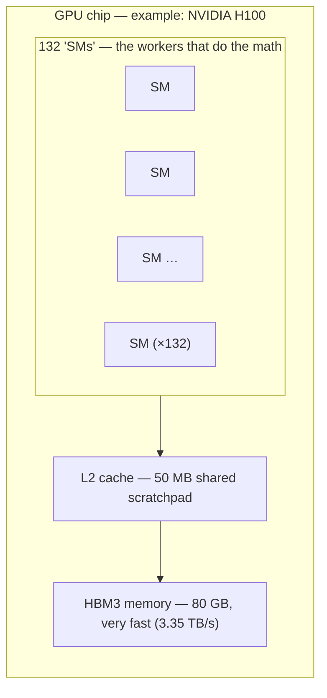
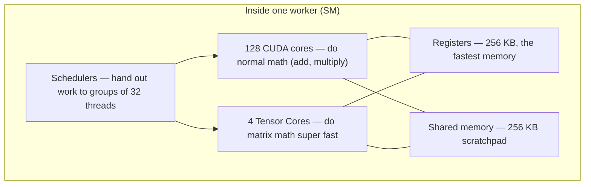
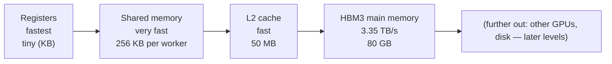
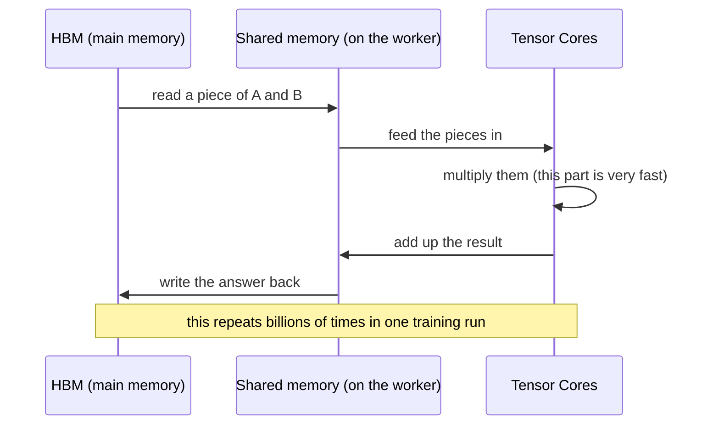

# Level 1 — GPU Architecture

> **Where we are.** We are building a city. You don't start with highways. You start with one house
> and ask what it needs. Our "house" is **one GPU**. Every later level — servers, racks, networks,
> the whole supercomputer — is just *more GPUs wired together*. So if you understand one GPU well,
> everything above it becomes easy.
>
> **By the end of this page you will be able to answer:**
> - Why is a GPU built so differently from a CPU?
> - What actually happens inside a GPU when it does math?
> - Why is "GPU at 100%" usually a lie?
> - Why does one chip cost as much as a car?

---

## 1. The big idea: a GPU does *many* things at once, not *one* thing fast

Let's start with a simple picture.

**A CPU is like 8 expert chefs.** Each chef is very smart and very fast. Each one can cook a
complicated meal from start to finish. If you give a CPU one hard job, it finishes it quickly.

**A GPU is like 15,000 simple cooks.** Each cook only knows one thing: how to chop an onion. On its
own, each cook is slow and not very smart. But if your job is "chop 50 million onions," the GPU wins
by a mile — because that job is the *same simple step repeated millions of times*.

```
   CPU                          GPU
 ┌───────────────┐            ┌──────────────────────────────┐
 │ 8 strong cores│            │ thousands of small cores     │
 │ big memory    │            │ small memory, but huge speed │
 │ smart, flexible│           │ all do the same step at once │
 │ → fast at ONE │            │ → fast at MANY at once       │
 │    hard task  │            │                              │
 └───────────────┘            └──────────────────────────────┘
```

Why does this matter for AI? Because **training and running AI models is mostly one kind of math:
multiplying big grids of numbers** (called matrix multiplication, or "matmul"). Each little
multiplication is simple, and you can do millions of them at the same time. That is exactly the
"chop a million onions" job. **This is the whole reason AI runs on GPUs and not CPUs.**

> **Remember this one line:** a GPU trades "fast at one thing" for "fast at a million things at once."
> Almost every strange design choice below comes from that trade.

---

## 2. Looking inside the chip

A GPU is not one single processor. It is a stack of parts. Let's build it up from the inside.



Three things to notice. We will explain each one:

1. The math is done by **many small workers** (called SMs), not one big core.
2. There are **layers of memory**, from tiny-and-fast to big-and-slow. This memory layout decides
   most of the real-world speed.
3. The main memory (**HBM**) is special and expensive, because feeding thousands of workers is harder
   than the math itself.

---

## 3. The worker: one "SM"

The **SM (Streaming Multiprocessor)** is the basic worker unit of a GPU. Think of it as a small
processor that has its own tiny fast memory and a few hundred math units inside it. One H100 chip has
**132 of these workers.**



Inside each worker there are **two kinds of math engine**, and the difference between them is the most
important thing on this page.

### CUDA cores — the all-rounders
These do ordinary math: add, subtract, multiply, divide. There are thousands of them across the chip.
They are flexible, but for AI they are **not** where the real speed comes from.

### Tensor Cores — the reason modern AI is possible
A **Tensor Core** does a small **matrix multiply** in one single step. Because AI is *built out of*
matrix multiplies, having a part that does matrix multiplies directly is a perfect match.

How big is the difference? On an H100:

- Normal CUDA cores: about **67 TFLOP/s** (that means 67 trillion math operations per second).
- Tensor Cores (BF16): about **990 TFLOP/s**.
- Tensor Cores (FP8): about **1,980 TFLOP/s**.

So the Tensor Cores are roughly **15 to 30 times faster** than the normal cores. The plain takeaway:

> **If your AI code is not using the Tensor Cores, you are wasting more than 90% of the chip.**

Half of "GPU performance work" is just making sure the math actually lands on the Tensor Cores.

*(These numbers are for the H100 generation. Always check the current NVIDIA datasheet before quoting
exact figures.)*

### Warps — why threads move in groups of 32
A GPU does not run one thread at a time. It runs them in groups of **32, called a warp**. All 32
threads in a warp do **the same step at the same time**, just on different data. One instruction → 32
onions chopped.

This is great — *as long as all 32 threads do the same thing*. But if your code has a branch, like
`if (x) do A; else do B;`, and half the group goes each way, the hardware has to run A first (with 16
workers idle) and then B (with the other 16 idle). This is called **warp divergence**, and it quietly
cuts your speed in half:

```
All 32 threads take the same path:     Threads split (if/else):
   ──── 32 working ───►                   ──── 16 working ───►  (16 idle)
        FAST                              ──── 16 working ───►  (16 idle)
                                               SLOW (done one after the other)
```

---

## 4. Memory: the part that really limits speed

Here is the most useful fact on this whole page: **most of the time, AI is waiting on memory, not on
math.** The Tensor Cores are so fast that the real question becomes: *can we feed them data quickly
enough?*

Think of memory as shelves at different distances from the cook. The closer the shelf, the faster —
but the smaller:



Each step down is **bigger but slower**. Here is the same idea as a road:

| Memory | Size | Speed | Picture |
|---|---|---|---|
| CPU memory (DDR5) | hundreds of GB | ~tens of GB/s | a 4-lane road |
| **GPU memory (HBM3)** | 80 GB (H100) | **3,350 GB/s** | a **100-lane** road |

**HBM** stands for "High-Bandwidth Memory." It is special memory stacked right next to the GPU chip,
on the same package. Because it sits so close, it can move data about **30 times faster** than normal
CPU memory. The downside: HBM is hard to make, which is a big reason GPUs are expensive and often hard
to buy.

> **The lesson:** fast AI code keeps data on the *close* shelves (registers and shared memory) and
> avoids going back to the far shelf (HBM) as much as possible. The famous "FlashAttention" trick is
> exactly this: it does the same math but stops copying big results back and forth to HBM, so it runs
> much faster.

---

## 5. What happens during one matrix multiply

Let's make it real. You ask the GPU to compute `C = A × B` (this is the core of every AI layer):



Look at where the time goes. The **multiply itself is super fast**. The slow part is **moving the
data** between memory and the workers. That is why we care so much about memory speed, about keeping
data on the close shelves, and about using smaller number formats (like FP8) — smaller numbers mean
fewer bytes to move, so everything goes faster.

---

## 6. The "100% GPU" lie

When a tool like `nvidia-smi` says **"GPU usage: 100%,"** it only means one thing: *some work was
running on the GPU during that moment.* It does **not** mean the chip was actually busy doing useful
math.

A GPU can show "100%" while it is really:

- not using the Tensor Cores at all (so the fast part sits idle),
- waiting on memory,
- waiting for data from the network or disk,
- running tiny jobs that barely fill one worker.

The numbers that tell the **truth**:

| Honest number | What it tells you |
|---|---|
| **Tensor Core active %** | is the *fast* part actually working? |
| **Memory bandwidth used** | are we stuck waiting on memory? |
| **MFU (Model FLOPs Utilization)** | of all the math the chip *could* do, how much is real, useful AI work? |

**MFU is the number that matters most.** A real training run can show "100% GPU" but only **35% MFU**.
That means two-thirds of a very expensive chip is being wasted. Pushing MFU from 35% up to 50% can
save millions of dollars across a big cluster. We will keep coming back to MFU all the way up to the
top level — it is the thread that ties this whole course together.

---

## 7. Power and heat (a preview of why big clusters are hard)

One H100 chip uses up to about **700 watts**. The newer Blackwell chips use about **1,000–1,200
watts** each. When a chip gets too hot, it **slows itself down on purpose** to avoid damage. This is
called **throttling**. Nobody gets a warning — the job just quietly runs slower, and your MFU drops.

Keep this in mind: about **1,000 watts of heat per chip, times tens of thousands of chips**, is a huge
amount of heat. At Level 4 (Rack) and Level 9 (Datacenter) this single fact is what forces special
liquid cooling and limits how big a cluster you can build.

---

## 8. How a GPU fails (because at scale, it will)

A single GPU rarely fails. But a big cluster has tens of thousands of them, so failures happen *every
day*. You need to design for that. Here is the basic vocabulary:

| Failure | What it means | How you notice |
|---|---|---|
| **XID error** | a general GPU error code (like a crash report) | shows up in driver logs / monitoring |
| **ECC error** | a memory bit flipped; small ones are auto-fixed, big ones are not | monitoring counters; a bad one can kill the job |
| **NVLink error** | a problem on the high-speed link between GPUs (Level 3) | the link gets slower → that GPU falls behind |
| **Throttling** | the chip overheated and slowed down | clock speed drops, MFU drops, no hard error |

The pattern to remember: **the dangerous failures are often the quiet ones** — a chip that throttles,
or a link that slows down. Nothing crashes. One GPU just becomes slow. And because big AI jobs make
all GPUs work together in lockstep (Level 7), *one slow GPU can drag down thousands of others*. That
is why watching GPU health closely is not optional.

---

## 9. Why one chip costs as much as a car

You are not buying "a graphics card." On one chip you are getting:

- 132 workers (SMs) → tens of thousands of small math units,
- hundreds of Tensor Cores,
- 80–192 GB of special **HBM** memory (the rare, expensive part),
- super-fast **NVLink** connections to other GPUs (Level 3),
- a 700–1,200 watt power-and-cooling need,
- and a deep software stack (Level 2) to make it all usable.

It is much closer to **a small supercomputer on one board** than to a gaming card. And because the HBM
memory is in short supply, these chips are often *allocated*, not simply sold.

---

## 10. Quick interview questions (check yourself)

**Q: A training run shows 100% GPU usage but the team says it is slow and expensive. What do you
check?**
Check MFU and Tensor Core activity, not "usage." Common causes: the data pipeline is too slow and the
GPU is starving (Level 6), too many tiny jobs, the wrong number format (not using Tensor Cores), or
the chip is overheating and throttling. "100% usage" only means *something* was running.

**Q: Why does the H200 exist if it has the same math speed as the H100?**
Because AI is often limited by *memory*, not math. The H200 keeps the same math power but adds more
memory (80 → 141 GB) and faster memory. That lets you serve more users at once and handle longer
inputs. You are upgrading the *memory*, not the math.

**Q: Why use BF16 instead of FP16 for training?**
Both use 16 bits. BF16 keeps a wider *range* of numbers (it can represent very big and very small
values), which keeps training stable. FP16 has a narrower range and can break more easily. Range
matters more than fine detail here. (More on this at Level 7.)

**Q: What is warp divergence and why should I care?**
GPU threads run in groups of 32 that must do the same step together. An `if/else` that splits the
group forces the hardware to run both sides one after the other, with half the workers idle. It
quietly halves your speed. It is a common reason that code copied straight from a CPU runs badly on a
GPU.

**Q: You see rising "double-bit ECC" errors on a node. What is the risk and what do you do?**
A double-bit error is memory damage that *cannot* be auto-fixed. It can corrupt results or crash the
job. Action: take the node out of service, run diagnostics, and replace the GPU if it keeps happening.
Leaving it in a big job risks crashing the whole run.

---

## 10b. Foundational Q&A (the building blocks, step by step)

These questions build the mental model piece by piece. If you can answer all of them, you have the
core of this chapter.

**Q1. Why is a GPU called a *throughput* machine instead of a *speed* machine?**
A CPU is built to finish a small number of tasks with very low delay. It has a few powerful cores that
work through steps one after another. A GPU is built to do *thousands of similar steps at the same
time*. It has many SMs, and each SM has many CUDA cores running together. Instead of finishing one
task as fast as possible, a GPU maximizes the *total work done per second*. That total-work-per-second
is called **throughput**.

**Q2. In the kitchen picture (Section 1), do the "8 chefs" mean CPU cores and the "15,000 cooks" mean
SMs?**
Not quite — and this is an important detail:
- The **8 chefs** = 8 CPU cores. ✔
- The **many cooks** = the **CUDA cores** (the small math units), **not** the SMs.

An SM is not one cook. An SM is more like a *kitchen station* (a team) that holds many cooks plus their
tools. The real hierarchy is:

```
GPU
 ├── SM 1
 │     ├── CUDA Cores      (the "cooks" — do the math)
 │     ├── Tensor Cores    (special cooks — do matrix math)
 │     ├── Registers       (each cook's private notepad)
 │     └── Shared Memory   (the station's shared counter)
 ├── SM 2
 ├── SM 3
 └── ...
```

So: the GPU has **many SMs**, and each SM has **many CUDA cores**. The "thousands of cooks" live
*inside* the SMs.

**Q3. What is a Streaming Multiprocessor (SM)?**
An SM is the basic processing unit inside an NVIDIA GPU. Think of it as a mini-processor. Each SM
contains: warp schedulers, CUDA cores, Tensor Cores, registers, shared memory, load/store units, and a
small cache. An H100 GPU has **132 SMs**.

**Q4. Is an SM made of bits?**
No. An SM is *physical hardware*, built from millions of transistors etched into the silicon. It is not
a software thing and not a group of bits. The bits (your data and threads) *flow through* the SM; the
SM itself is permanent hardware.

**Q5. Does each NVIDIA generation have a different SM design?**
Yes. Each new architecture brings a new SM design.

| GPU | Architecture |
|---|---|
| A100 | Ampere |
| H100 | Hopper |
| H200 | Hopper |
| B200 | Blackwell |

The way you *program* it stays similar across generations, but the internal hardware gets better each
time.

**Q6. Does each SM have its own threads?**
No. **Threads are created by your program** (your CUDA/AI code), not by the SM. The GPU takes your
threads, groups them into "thread blocks," and hands each block to an SM to run. The threads are
**temporary** (they exist only while your job runs). The SM hardware is **permanent**.

**Q7. How do the schedulers inside an SM work?**
Each SM has several **warp schedulers**. A scheduler simply: (1) checks which warps (groups of 32
threads) are ready to run, (2) picks one ready warp, and (3) sends its instruction to the cores. The
scheduler does **not** create threads — it only decides *which ready group runs next*. This is how the
SM stays busy: while one warp waits on memory, the scheduler runs another.

**Q8. What are registers?**
Registers are the **fastest** memory, sitting right inside the SM. Each thread gets its **own private**
registers. They hold temporary values: counters, loop variables, in-progress results. They are not
shared between threads.

**Q9. What is shared memory?**
Shared memory is fast memory **shared by all the threads in the same block**. It is used to: pass data
between threads, avoid slow trips to main memory (HBM), and speed up matrix work. Think of it as the
station's shared counter that all the cooks at that station can reach quickly.

**Q10. Is a warp always 32 threads? Can I make a warp of 1,000 threads?**
The warp size is **fixed by the hardware at 32**. You cannot change it. As a programmer you choose the
number of blocks and the number of threads per block — and the GPU automatically splits your threads
into groups of 32. You *can* create thousands of warps (by launching many threads), but each warp is
always exactly 32 threads.

**Q11. What is inside a B200 (Blackwell) SM?**
A Blackwell B200 SM contains: **128 CUDA cores**, **4 fifth-generation Tensor Cores**, a **256 KB
register file**, **up to 256 KB of shared memory**, and several **warp schedulers**. The layout is
similar to Hopper (H100), but with better performance and stronger AI features (such as faster
low-precision math).

---

## 11. What you should be able to draw from memory

- The layers of a GPU: **chip → workers (SMs) → (CUDA cores + Tensor Cores) + the memory shelves.**
- The memory ladder: **registers → shared memory → L2 → HBM**, getting bigger but slower, and why
  HBM speed — not math speed — is usually the limit.
- The path of one matrix multiply, and why **moving data, not multiplying, is the slow part.**
- Why **MFU**, not "GPU usage," is the real score.

## 12. Lab — is the GPU *really* at 100%? (finding the bottleneck)

This is the most important lab in Level 1. Earlier we said **"GPU at 100% is usually a lie."** Now you
will *prove it with your own eyes* and learn the tools that show the truth.

### What you need

- **Best:** any computer with one NVIDIA GPU. Even a small or older GPU is fine — we are learning the
  *tools and the method*, not chasing big numbers.
- **No GPU at hand?** Rent one cheaply: a single small cloud GPU (for example an Azure NC-series spot
  VM) for an hour or two. **Always shut it down right after** (this fits the $150/month lab budget —
  spin up, run the lab, tear down). If you can't run anything, just read the sample outputs below and
  the "what it means" table — you'll still get the idea.
- Software: the NVIDIA driver (gives you `nvidia-smi`), Python with PyTorch, and — for the deeper
  tools — NVIDIA **DCGM** and **Nsight** (both free).

### The toolbox (what each tool tells you, in plain words)

| Tool | What it shows | When to reach for it |
|---|---|---|
| `nvidia-smi` | quick health: usage %, memory used, power, temperature, throttling | first look, always |
| `nvidia-smi dmon` | the same numbers, *streaming live* once per second | watch a job while it runs |
| **DCGM** (`dcgmi dmon`) | the **honest** numbers: SM active, **Tensor Core active %**, **memory active %** | to see if the *fast* part is really working |
| **dcgm-exporter** + Prometheus + Grafana | the DCGM numbers on a dashboard, for many GPUs at once | production / a whole cluster |
| **Nsight Systems** (`nsys`) | a **timeline** of the whole run — you can *see* gaps where the GPU waited | find "why is there idle time?" |
| **Nsight Compute** (`ncu`) | zoom into **one kernel**: is it limited by compute or by memory? | tune a specific slow kernel |
| **PyTorch profiler** | timing from *inside* your training code, per operation | day-to-day, no extra setup |

> **The key idea:** `nvidia-smi` answers *"is something running?"* DCGM answers *"is the right thing
> running?"* You need both.

### Step 0 — the quick look

```bash
nvidia-smi
```

Read these fields: **GPU-Util %** (how busy it *looks*), **Memory-Usage**, **Pwr** (watts now vs max),
**Temp**. This is your dashboard's front page.

### Step 1 — watch it live

In one terminal, stream the numbers once per second:

```bash
nvidia-smi dmon          # columns: sm% (usage), mem%, power, temp, clocks
```

Keep this open while you run the experiments below in a second terminal.

### Step 2 — a job that uses the GPU *well* (compute-bound)

Save as `compute_bound.py` and run it. This does big matrix multiplies — exactly the work Tensor Cores
love.

```python
import torch
dev = "cuda"
a = torch.randn(8192, 8192, device=dev, dtype=torch.bfloat16)
b = torch.randn(8192, 8192, device=dev, dtype=torch.bfloat16)
for _ in range(2000):
    c = a @ b            # matrix multiply → goes to Tensor Cores
torch.cuda.synchronize()
```

In `nvidia-smi` you'll see **GPU-Util near 100%**. Good. Now check the *honest* number with DCGM:

```bash
dcgmi dmon -e 1002,1004,1005
# 1002 = SM active %, 1004 = Tensor Core active %, 1005 = memory (DRAM) active %
```

You should see **Tensor Core active % is high**. This is a GPU that is *truly* busy doing useful AI
math. 

### Step 3 — the lie: a job that *looks* 100% but wastes the chip (memory-bound)

Save as `memory_bound.py`. This only adds 1 to a big list of numbers — almost no math, but it moves a
lot of memory.

```python
import torch
dev = "cuda"
x = torch.randn(200_000_000, device=dev)
for _ in range(2000):
    y = x + 1.0          # tiny math, huge memory traffic
torch.cuda.synchronize()
```

Now look again:

- `nvidia-smi`: **GPU-Util is still ~100%.** Looks great!
- `dcgmi dmon -e 1002,1004,1005`: **Tensor Core active % is near 0**, but **memory active % is very
  high.**

**There it is — the lie.** The GPU *looks* fully busy, but the fast part (Tensor Cores) is doing
nothing. The chip is just shoveling memory around. This is what "100% util, low MFU" feels like in
real life.

### Step 4 — starve the GPU (find a *bottleneck outside* the GPU)

Save as `starved.py`. Here the GPU does real work, but we make the CPU pause between each step — like a
slow data pipeline (Level 6) that can't feed the GPU fast enough.

```python
import torch, time
dev = "cuda"
a = torch.randn(8192, 8192, device=dev, dtype=torch.bfloat16)
b = torch.randn(8192, 8192, device=dev, dtype=torch.bfloat16)
for _ in range(200):
    c = a @ b
    torch.cuda.synchronize()
    time.sleep(0.05)     # the CPU stalls → the GPU sits idle, waiting
```

Now `nvidia-smi dmon` shows the usage **jumping up and down** instead of steady. To *see* the idle
gaps clearly, record a timeline:

```bash
nsys profile -o starved_report python starved.py
```

Open `starved_report` in Nsight Systems. You'll see **empty gaps** between the GPU's work — the GPU
waiting on the CPU. The bottleneck is **not the GPU at all.** This is the single most common real-world
problem: an expensive GPU sitting idle because something upstream is slow.

### Step 5 — is the GPU slowing itself down? (throttling)

```bash
nvidia-smi -q -d PERFORMANCE        # look for "Clocks Throttle Reasons"
```

If you see a throttle reason like **"SW Thermal Slowdown"**, the chip is too hot and is slowing down on
purpose (Section 7). Your job gets slower with no error message.

### Step 6 — put a real number on it (MFU)

MFU = how much of the chip's possible math you actually used. Rough recipe:

1. One matrix multiply of size `N×N` does about `2 × N³` math operations.
2. Time how long `M` of them take, then: `achieved = (M × 2 × N³) / seconds`.
3. `MFU = achieved ÷ peak`, where peak for BF16 on an H100 is about `990 × 10¹²` ops/sec.

Even a quick estimate tells you a lot: if your big training job is at **35% MFU**, two-thirds of the
GPU is being wasted — and now you have the tools (Steps 2–5) to find out *why*.

### What you should now be able to do

| You see… | Use… | It means… |
|---|---|---|
| "GPU-Util 100%" but slow/expensive | DCGM **Tensor Core active %** | if it's low → the fast part is idle (memory-bound or wrong setup) |
| usage jumping up and down | `nsys` timeline | the GPU is waiting on the CPU / data / network |
| clocks dropping for no reason | `nvidia-smi -q -d PERFORMANCE` | the chip is too hot and throttling |
| one kernel is slow | `ncu` | find out if it's compute-bound or memory-bound |

> **Lab takeaway:** never trust "GPU-Util" alone. The real question is *"is the right part busy, and if
> not, what is it waiting for?"* These five tools answer that — and you will use the exact same method,
> just at bigger scale, all the way up to Level 9.

---

> **Next — Level 2: The Single GPU Server.** A GPU never works alone. We zoom out one step to the
> machine around it: the CPU, the system memory, the PCIe lanes, and the network card. We will see how
> data gets *to* the GPU, and why the connection between GPUs (PCIe vs NVLink) becomes the big problem
> at the next level.

---
*Part of `AI-Infra/Foundations/` (Levels 1–6). See `AI-Infra/README.md` for the full 9-level map.*
