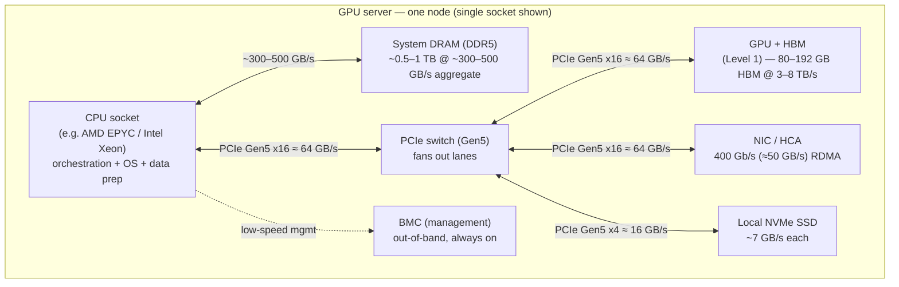
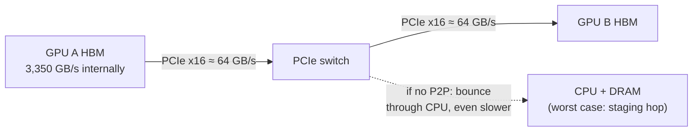
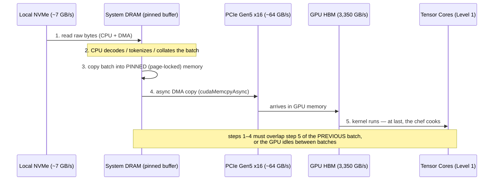
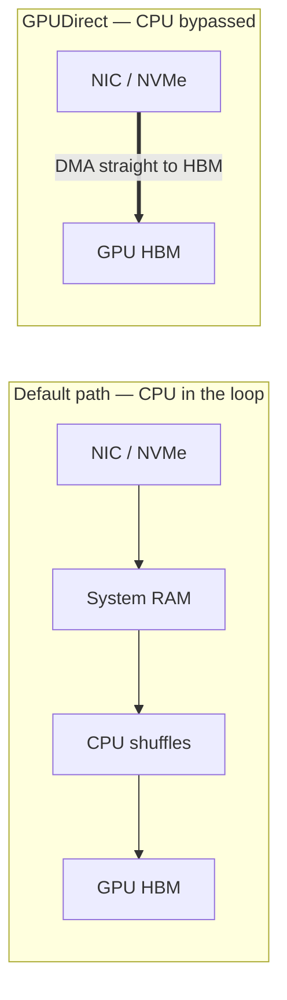
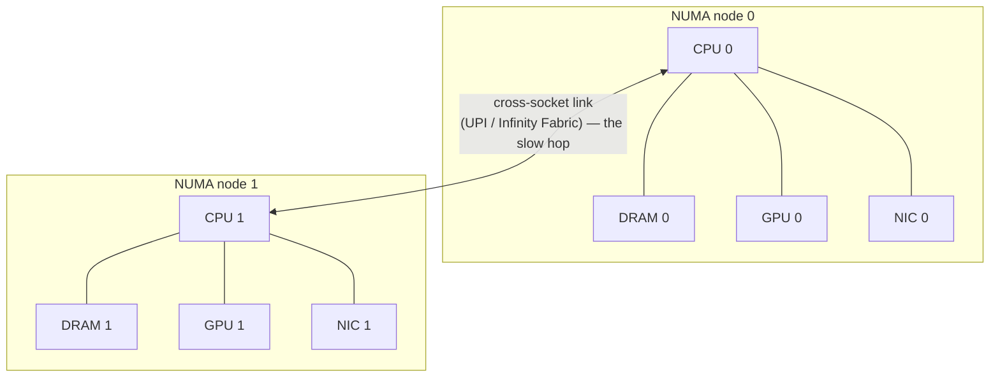
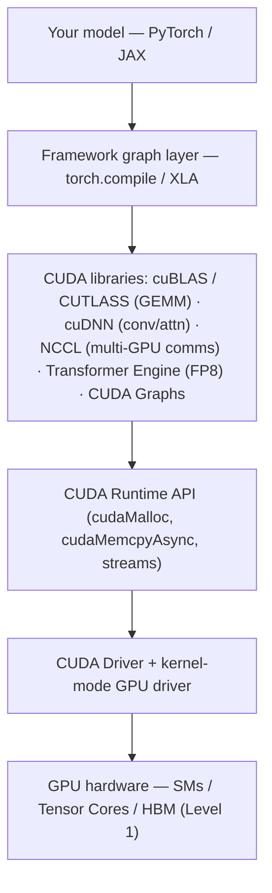
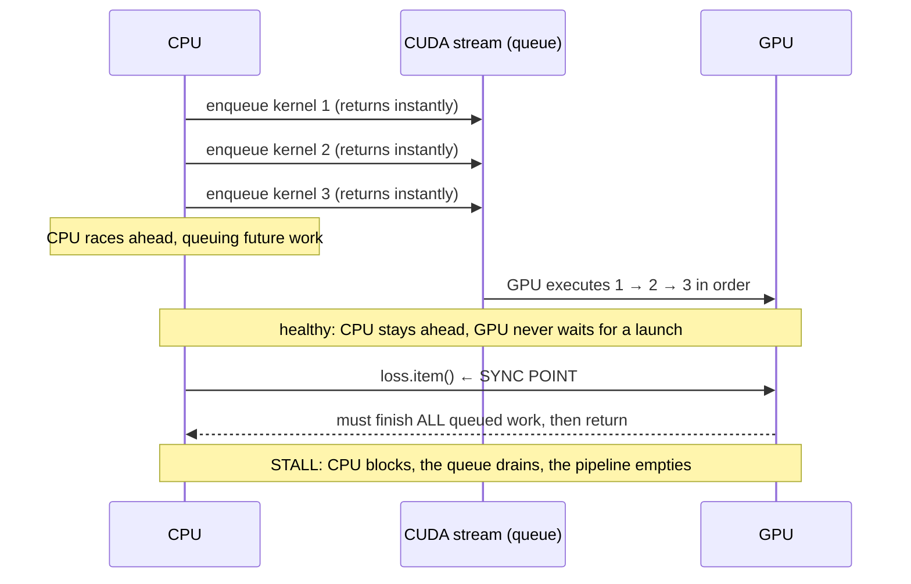

# Level 2 — The Single GPU Server

> **Where we are in the journey.** In Level 1 we lived *inside* one GPU — the SMs, the Tensor Cores,
> the HBM hierarchy, and the hard truth that **data movement, not multiplication, is the cost.** But a
> GPU is a brain in a jar. It can't read a file, it can't reach the network, it can't even start
> itself. It needs a body. This level zooms out exactly one ring: from the chip to **the server the
> chip lives in.** That server exists for one purpose — to **feed and orchestrate** the GPU fast
> enough that those Tensor Cores never go hungry.
>
> **By the end of this level you can answer:** What is every component on a GPU server *for*? Why does
> a $30k GPU still need a beefy CPU and fast RAM? What exactly is the path a byte travels from disk to
> HBM, and where does it get stuck? Why is PCIe — the very bus that connects the GPU to everything —
> *far too slow* to let GPUs talk to each other (and what that forces us to build in Level 3)? And what
> is the CUDA software stack that turns this hardware into something you can actually run a model on?

---

## 1. The one idea: the GPU is the chef; the server is the kitchen

In Level 1 the GPU was 15,000 line cooks. Now meet the rest of the kitchen.

A restaurant doesn't ship a chef in a box. Around the star chef there's a whole operation whose entire
job is to make sure the chef never stops cooking:

- **The head chef (CPU)** doesn't cook the signature dish. He reads the tickets, decides what gets
  made, and shouts orders. He *coordinates*; he doesn't do the heavy chopping.
- **The pantry (system RAM)** holds the ingredients staged and ready, far more than fit on the cutting
  board at once.
- **The hallways (PCIe)** carry ingredients from the pantry to the chef's station. Wide hallways =
  fast plating; narrow hallways = the chef waiting, knife in hand.
- **The loading dock (NIC)** is where deliveries arrive from *other kitchens* (other servers).
- **The walk-in freezer (local NVMe)** is bulk cold storage for what won't fit in the pantry.
- **The building manager (BMC)** keeps the lights on and calls you when something's on fire.

```
        ┌──────────────────────── GPU SERVER (one node) ───────────────────────┐
        │                                                                       │
        │   head chef          pantry           the STAR CHEF                   │
        │  ┌────────┐  DDR5   ┌────────┐  PCIe  ┌──────────────┐                │
        │  │  CPU   │◄───────►│ System │◄──────►│   GPU + HBM   │                │
        │  │(orchestr)│ ~hundreds│  RAM  │ hallway│ (Level 1)    │                │
        │  └────┬───┘  GB/s   └────────┘ ~64GB/s └──────────────┘                │
        │       │                                                                │
        │   ┌───▼────┐         ┌────────┐         ┌──────────────┐               │
        │   │  NIC   │         │  NVMe  │         │     BMC       │               │
        │   │(loading│         │(freezer│         │(bldg manager) │               │
        │   │  dock) │         │  SSD)  │         └──────────────┘               │
        │   └────────┘         └────────┘                                        │
        └───────────────────────────────────────────────────────────────────────┘
```

> **Keep this lens for the whole level:** the GPU is the only part that does the valuable work. *Every
> other component exists to keep it fed.* When a GPU server underperforms, the GPU is almost never the
> problem — the **kitchen logistics** are. That single sentence is what this level teaches you to debug.

---

## 2. Anatomy of a GPU server — the board, built up

Let's draw the real board, with the links labeled by bandwidth. This is the diagram you should be able
to reproduce on a whiteboard.



Notice the asymmetry, because it dictates everything below:

| Link | Bandwidth | What it implies |
|---|---|---|
| CPU ↔ DRAM | **~300–500 GB/s** aggregate | the pantry can stage data fast — but still **~10×** slower than HBM |
| CPU/switch ↔ GPU (PCIe Gen5 x16) | **~64 GB/s** | the hallway to the chef is **~50× narrower** than HBM (3.35 TB/s) |
| NIC | 400 Gb/s ≈ **~50 GB/s** | the loading dock is roughly PCIe-class — *on purpose* (Level 5) |
| NVMe | ~7 GB/s each | the freezer is slow; you read in bulk, not byte-by-byte |

> *(All link figures are current-generation rough numbers — PCIe Gen5 x16 is ~63–64 GB/s per
> direction; NICs are moving to 800 Gb/s; HBM varies by GPU. Verify against the current platform
> datasheet before quoting in a design review. We won't repeat this caveat each time.)*

The headline that motivates the rest of the level is already visible: **HBM is ~3,350 GB/s; the PCIe
hallway into the GPU is ~64 GB/s.** The chef can consume ingredients **~50× faster than the hallway
can deliver them.** Hold that ratio — it is the cliffhanger.

---

## 3. The CPU's real job — it coordinates, it doesn't cook

The most common misconception from people new to AI infra: *"the GPU does the work, so the CPU barely
matters — give it the cheapest one."* This is wrong, and it's expensive.

The CPU never does the matrix math. But it does **everything that surrounds** the matrix math, and if
any of those falls behind, the GPU starves:

1. **Kernel launch & orchestration.** Every GPU operation (a matmul, a softmax) is a *kernel* the CPU
   must *launch*. In eager-mode training the CPU is issuing **thousands of kernel launches per second**.
   If the CPU can't issue them fast enough, the GPU sits idle between kernels — this is being
   **launch-bound** (the fix is CUDA Graphs / `torch.compile`, §8).
2. **The data-loading pipeline.** Decode JPEGs, tokenize text, shuffle, augment, collate into batches,
   and stage them in pinned RAM. This is pure CPU work, and it's *the* classic GPU-starvation cause
   (§9). A serious training node has **dozens of CPU cores per GPU** just to keep the input pipeline
   ahead of the chef.
3. **The OS, driver, and runtime.** The CUDA driver, the NCCL communicator, the filesystem, the
   network stack — all run on the CPU.
4. **Process & memory management.** Allocating pinned buffers, managing the page cache for dataset
   reads, handling checkpoint writes.

So a "beefy GPU still needs capable CPUs + RAM" because the kitchen logistics are CPU-bound. A rule of
thumb from production designs: budget on the order of **~24–32 CPU cores and ~64–128 GB system RAM per
GPU** — not because the CPU computes, but because *feeding* the GPU is genuinely hard work. Under-spec
the head chef and the star chef stands around waiting for tickets.

---

## 4. PCIe, deeply — the hallway, and why it's the wrong road for GPU-to-GPU

PCIe (**Peripheral Component Interconnect Express**) is the general-purpose bus that connects the GPU,
the NIC, and NVMe to the CPU. You measure it in **lanes** and **generations**:

- A **lane** is one serial differential pair each direction. Devices use them in groups: **x1, x4, x8,
  x16.** A GPU gets a full **x16**.
- Each **generation roughly doubles per-lane speed.** Gen4 x16 ≈ 32 GB/s; **Gen5 x16 ≈ 64 GB/s**;
  Gen6 ≈ 128 GB/s (emerging).

```
   PCIe lanes (think highway lanes, both directions):

   x1   │                              ~4 GB/s   (Gen5)
   x4   ││││                          ~16 GB/s   (NVMe drive)
   x8   ││││││││                      ~32 GB/s
   x16  ││││││││││││││││              ~64 GB/s   (a GPU, a fast NIC)
```

A **PCIe switch** fans a CPU's limited lanes out to many devices (multiple GPUs + NICs + NVMe), and —
crucially — lets two devices behind the same switch talk to each other **peer-to-peer** without
bouncing through the CPU. That peer-to-peer path is the foundation of **GPUDirect** (§6).

### Why ~64 GB/s is fine for I/O but catastrophic for GPU-to-GPU

PCIe is *great* for what it's designed for: pulling a batch from RAM, talking to the NIC and SSD. Those
are I/O-rate jobs and ~64 GB/s is plenty.

It is **hopelessly slow as a path between two GPUs.** Here's the physics. In Level 1 we saw HBM runs at
**~3,350 GB/s.** Now look at the two ways GPU A could send a tensor to GPU B over PCIe:



The GPU can *produce and consume* data at ~3.35 TB/s but can only *ship* it to a sibling at ~64 GB/s —
a **~50× cliff** the instant work leaves the chip. And in Level 3 you'll see that big models **must**
split across GPUs and exchange tensors **every single layer** (tensor parallelism) or every step (data
parallelism). If those exchanges crawl over a ~64 GB/s PCIe hallway while the math wants 3,350 GB/s, the
GPUs spend their lives waiting on each other and your MFU (Level 1) collapses.

> **This is the cliffhanger that creates Level 3.** PCIe is a fine hallway from the pantry to one chef.
> It is a *terrible* corridor between chefs who must hand each other half-finished dishes thousands of
> times a second. The industry's answer — a dedicated, ~10–25× faster chef-to-chef corridor called
> **NVLink** — is the entire subject of the next level.

---

## 5. The data journey — how a byte gets from disk to a Tensor Core

Let's trace the path a training sample takes, because every hop is a place it can get stuck.



Three concepts make or break this path:

**Pinned (page-locked) memory.** Normal OS memory is *pageable* — the kernel may move or swap it. The
GPU's DMA engine can't safely copy directly from pageable memory, so an un-pinned transfer secretly
does an extra CPU copy into a staging buffer first (slower, and it blocks). **Pinned memory** tells the
OS "never move these pages," enabling a true direct DMA and roughly **2× faster host↔device copies**.
The cost: pinned pages can't be swapped, so over-pinning can exhaust host RAM (§9).

**Async copies that overlap compute.** Naively, you'd copy batch *N*, then compute batch *N*, then copy
*N+1* — the GPU idle during every copy. Instead you use **`cudaMemcpyAsync` on a separate CUDA stream**
(§8) so that *while* the GPU computes batch *N*, the copy engine is already pulling batch *N+1* across
PCIe. Done right, the ~64 GB/s hallway is hidden entirely behind compute and the chef never waits. Done
wrong, you pay the PCIe latency on the critical path of every step.

**GPUDirect — the shortcuts that bypass the CPU.** See §6.

---

## 6. GPUDirect — letting data skip the head chef entirely

In the default path, the CPU touches everything: bytes from the NIC or SSD land in system RAM, the CPU
shuffles them, then they DMA to the GPU. That CPU hop adds latency, burns memory bandwidth, and makes
the head chef a bottleneck at scale. **GPUDirect** is a family of NVIDIA technologies that lets data go
*straight* into GPU HBM:

- **GPUDirect RDMA** — the NIC writes network data **directly into GPU HBM**, skipping the CPU and
  system RAM. This is what makes multi-node GPU communication fast (the backbone of Level 5's fabric).
- **GPUDirect Storage (GDS)** — NVMe reads land **directly in GPU HBM**, skipping the CPU bounce. This
  matters for huge datasets and fast checkpoint loads (Level 6).



You don't need the deep mechanics yet — just bank the principle: **at scale, every time the CPU has to
touch GPU-bound data, it's a tax.** The whole trajectory of high-end AI infra is *removing the CPU from
the data path.* We pay this off concretely in **Level 5 (network fabric)** and **Level 6 (storage and
data pipeline).**

---

## 7. NUMA — the silent bandwidth thief in multi-socket servers

Most serious GPU servers have **two CPU sockets.** Each socket has its *own* bank of DRAM and its *own*
PCIe lanes physically attached to it. The sockets are joined by a cross-socket link (Intel UPI / AMD
Infinity Fabric). This is **NUMA** — Non-Uniform Memory Access: a core can reach *its own* socket's RAM
and devices fast, but reaching the *other* socket's RAM/devices means a slower hop across the inter-socket
link.



The trap: a data-loader process pinned to **CPU 0** that feeds **GPU 1**, and reads through **NIC 1**,
forces *every* batch to cross the inter-socket link twice. Nothing errors. Nothing logs. The job just
runs **10–30% slower** with no crash and no obvious cause — a misplaced process **silently loses
bandwidth.** This is one of the most common "why is this node slow?" bugs in real fleets.

The fix is **affinity discipline:** pin each GPU's process, its data-loader threads, its pinned memory,
*and* the NIC it uses to the **same NUMA node.** Tools like `nvidia-smi topo -m`, `numactl`, and
`lstopo` exist precisely to verify "is GPU N talking to local RAM and the local NIC?" At fleet scale
this is automated by the scheduler (Level 8), but you must understand it to debug the one slow node.

---

## 8. The CUDA software stack — turning silicon into something runnable

Hardware does nothing without software, and this is where that stack belongs in the progression: you
now have a server, so let's make it *usable.* Picture it as layers, top (your code) to bottom (the
chip).



### Driver + runtime, and version-compatibility discipline across a fleet
Two layers, often confused:
- The **driver** (kernel-mode) talks to the physical GPU. It has a version (e.g. 550.xx).
- The **CUDA runtime/toolkit** is the userspace API your build links against (e.g. CUDA 12.4).

The rule that bites fleets: **the installed driver must be ≥ the CUDA toolkit a binary was built for.**
A container built for CUDA 12.4 will **fail to start** on a node whose driver only supports 12.2. In a
cluster of thousands of nodes, *one* node with a stale driver becomes the mystery "one slow / failing
node" (§9). Treat driver + CUDA + cuDNN + NCCL versions as a **single locked tuple** rolled across the
whole fleet — version drift is an operational hazard, not a detail.

### CUDA streams and async execution — the mental model
A **CUDA stream** is an ordered queue of work. The CPU **enqueues** kernels into a stream and *returns
immediately* — it does **not** wait for them to finish. The GPU drains the queue in order, asynchronously.



**The classic accidental-sync pitfall.** Because the queue is what keeps the GPU fed, anything that
forces the CPU to *wait for a result* drains the queue and serializes everything. The usual culprits:
- `loss.item()` / `tensor.cpu()` / `tensor.numpy()` — pull a value back to the host,
- `print(tensor)` inside the training loop,
- `torch.cuda.synchronize()`, or a Python `if` that branches on a GPU value.

Each of these is a **sync point**: the CPU stops queuing, waits for the GPU to finish *everything*, the
pipeline empties, and you lose all the overlap you carefully built. A single stray `.item()` logged
every step can quietly cost double-digit percentages of throughput. (This is *also* why profiling is
hard: the sync hides the real cost in the wrong line.)

### The libraries — what each one is *for*
| Library | Job | Why it exists |
|---|---|---|
| **cuBLAS / CUTLASS** | GEMM — the matrix multiply | hand-tuned matmul that actually lands on Tensor Cores (Level 1); CUTLASS is the template kit for custom/fused GEMMs |
| **cuDNN** | conv, attention, normalization primitives | the deep-learning kernel library; FlashAttention-style kernels live here |
| **NCCL** | multi-GPU / multi-node collectives (all-reduce, all-gather) | the comms layer that makes parallelism work — **central to Level 3 & Level 5** |
| **Transformer Engine** | FP8 with automatic scaling | manages the per-tensor scale factors that make 8-bit training numerically safe (Level 7) |
| **CUDA Graphs** | capture a sequence of kernels, replay as ONE launch | kills per-kernel CPU launch overhead — decisive for inference **decode** (Level 7), where kernels are tiny and launch-bound |

CUDA Graphs deserve a beat: in inference decode you run *many tiny kernels per token*, so the CPU's
per-launch overhead (§3) dominates. Capturing the step once and **replaying the whole graph in a single
launch** removes that overhead — a standard, large win for latency-sensitive serving.

### PyTorch eager vs `torch.compile`, and JAX/XLA — conceptually
- **PyTorch eager** runs each op as the CPU hits it: maximally flexible and debuggable, but it pays
  full launch overhead per op and can't fuse across ops. Great for development.
- **`torch.compile`** traces your model into a graph and hands it to a compiler (TorchInductor) that
  **fuses** kernels (fewer HBM round-trips — the Level 1 lesson) and cuts launch overhead. You trade
  some flexibility for speed.
- **JAX / XLA** is the *compile-first* philosophy: you write functional code, XLA traces and compiles
  the *whole* computation into fused, optimized kernels ahead of time. Often the best out-of-the-box
  MFU, at the cost of a less imperative, harder-to-poke programming model.

The throughline: **eager = flexible but launch-heavy; compiled = fused and fast but rigid.** Both are
fighting the same two enemies you met in Level 1 and §8 — *HBM round-trips* and *CPU launch overhead.*

---

## 9. How a GPU server fails (the "one slow node" zoo)

Single GPUs rarely fail (Level 1). **Servers** fail in subtle, throughput-stealing ways — and at scale,
*one* degraded node drags a synchronized job (Level 7). The vocabulary:

| Failure | What it is | How it shows up |
|---|---|---|
| **PCIe link errors / downtraining** | a marginal slot/cable retrains the link to fewer lanes or a lower gen (x16→x8, Gen5→Gen3) | bandwidth quietly halves; `lspci` shows reduced `LnkSta`; no crash |
| **Driver / toolkit mismatch** | node's driver older than the binary's CUDA, or NCCL version skew | container won't start, or comms hang — the canonical "one bad node" |
| **NUMA misplacement** | process/RAM/NIC on the wrong socket (§7) | 10–30% slower, no error, no log |
| **CPU-bound data loader** | input pipeline can't keep the GPU fed (§3, §5) | low GPU/Tensor-Core active %, GPU idle gaps between batches, high CPU |
| **Host RAM OOM** | dataset cache + pinned buffers + workers exceed system RAM | OOM-killer reaps the trainer mid-run; over-pinning is a frequent cause |
| **Thermal / power capping (server-level)** | chassis can't cool or power all GPUs at full tilt | GPUs throttle together; MFU sags (ties to Level 1's heat preview) |

The pattern, again: **the dangerous server failures are the silent, throughput-stealing ones** —
downtrained PCIe, a misplaced NUMA process, a starving data loader. They never crash; they just make
the node *slow*, and slow is contagious in a synchronized cluster. This is exactly why node-level
telemetry (PCIe link width, NUMA topology, data-loader queue depth, GPU active %) is non-negotiable —
the bridge to `Observability/14-AI Infrastructure Observability/`.

---

## 10. Interview deep-dives (defend your understanding)

**Q: A GPU server shows low Tensor-Core active % and the GPU has idle gaps between every step. The GPU
itself tests fine. Where do you look?**
The kitchen logistics, not the chef. Top suspects in order: a **CPU-bound data loader** (too few worker
processes, JPEG decode/tokenize on the critical path) starving the GPU; **no async prefetch** (copies
not overlapping compute, so PCIe latency is on the critical path each step); **non-pinned host memory**
(every H2D copy pays an extra staging copy); or an **accidental sync** (`.item()`/`print`) draining the
stream each step. Confirm with a profiler showing GPU idle between kernels and busy CPU/data threads.

**Q: Why is PCIe fine for the GPU↔NIC and GPU↔storage paths but unacceptable for GPU↔GPU?**
Because the *rates* differ by purpose. I/O (network, disk) is naturally ~tens of GB/s, so PCIe's ~64
GB/s matches it. But GPU↔GPU exchange in tensor/data parallelism happens at the *compute* rate — the
GPU internally moves data at ~3.35 TB/s and wants to swap tensors every layer. PCIe at ~64 GB/s is
~50× too slow for that, so the GPUs stall waiting on each other. That mismatch is precisely why NVLink
(Level 3) exists as a separate, ~10–25× faster GPU-to-GPU fabric.

**Q: A team buys top-end GPUs but pairs them with a cheap low-core CPU and minimal RAM. What breaks?**
The CPU can't launch kernels fast enough (launch-bound) and can't run enough data-loader workers to
keep the input pipeline ahead. The expensive GPUs idle waiting for tickets and ingredients. Symptom:
high "GPU util," low MFU. Fix: ~24–32 cores + ~64–128 GB RAM per GPU, pinned memory, async prefetch,
and `torch.compile`/CUDA Graphs to cut launch overhead.

**Q: One node out of 512 is mysteriously ~20% slow and never crashes. Walk the diagnosis.**
The "one slow node" checklist: (1) **PCIe downtraining** — `lspci`/`nvidia-smi` for reduced link width
or gen; (2) **NUMA misplacement** — is the process/RAM/NIC on the GPU's local socket (`nvidia-smi topo
-m`)? (3) **driver/toolkit/NCCL skew** vs the fleet's locked version tuple; (4) **thermal/power capping**
on that chassis (clocks lower than peers). All four are silent and steal throughput rather than crash —
and in a synchronized job, that one node sets the pace for all 512.

**Q: What is pinned memory and when does it hurt you?**
Page-locked host memory the OS promises never to move, enabling true DMA (no staging copy) and ~2×
faster host↔device transfers and real async overlap. It hurts when you **over-pin**: pinned pages can't
be swapped, so too many pinned buffers (or too many data-loader workers each pinning) can exhaust system
RAM and trigger the OOM-killer. It's a tool with a budget, not a free "always on."

**Q: Why does `torch.compile` / XLA usually beat eager mode, and what's the cost?**
They trace the model into a graph and **fuse** kernels — fewer HBM round-trips (Level 1) and far less
per-kernel CPU launch overhead (§3, §8). Net: higher MFU. The cost is flexibility and debuggability —
graph breaks on dynamic control flow, longer first-step compile times, and harder interactive poking.
Eager wins for development; compiled wins for production throughput.

---

## 11. What you should now be able to draw from memory

- The **server block diagram:** CPU + DRAM, PCIe switch fanning to GPU / NIC / NVMe, plus the BMC — with
  the link bandwidths (DRAM ~300–500 GB/s, **PCIe Gen5 x16 ≈ 64 GB/s**, NIC ~50 GB/s, NVMe ~7 GB/s).
- The **data path** disk → system RAM → (pinned) → PCIe → HBM → Tensor Cores, and the **GPUDirect**
  shortcut that bypasses the CPU.
- The **~50× cliff**: HBM ~3,350 GB/s internally vs ~64 GB/s out over PCIe — *the reason GPU-to-GPU
  needs NVLink (Level 3).*
- The **CUDA stack** layers (driver → runtime → libraries → framework) and the **stream/async** model,
  including the **accidental-sync** pitfall (`.item()`/`.cpu()`/`print`).
- The **NUMA affinity** rule: GPU, its process/RAM, and its NIC on the *same* socket — or lose bandwidth
  silently.

> **Next — Level 3: The Multi-GPU Server.** We just hit the wall: PCIe at ~64 GB/s is ~50× too slow for
> chefs to hand each other dishes. Level 3 builds the dedicated chef-to-chef corridor — **NVLink** and
> the **NVSwitch** fabric — that lets 8 GPUs in one box behave almost like one giant GPU at ~900 GB/s
> per GPU. We'll see how NCCL (§8) uses that fabric to do all-reduce, how a model splits across GPUs,
> and why the SXM/HGX baseboard looks the way it does. The kitchen just became a *brigade*.

---
*Part of `AI-Infra/Foundations/` (Levels 1–6). See `AI-Infra/README.md` for the full 9-level map.*
