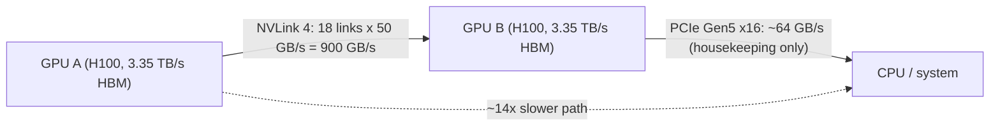
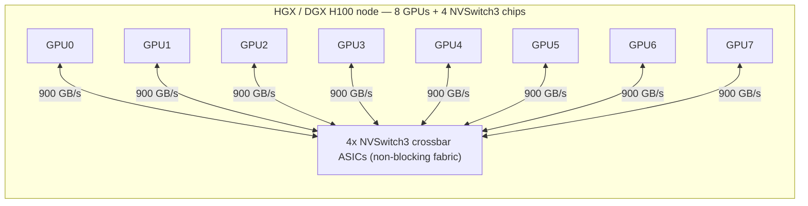
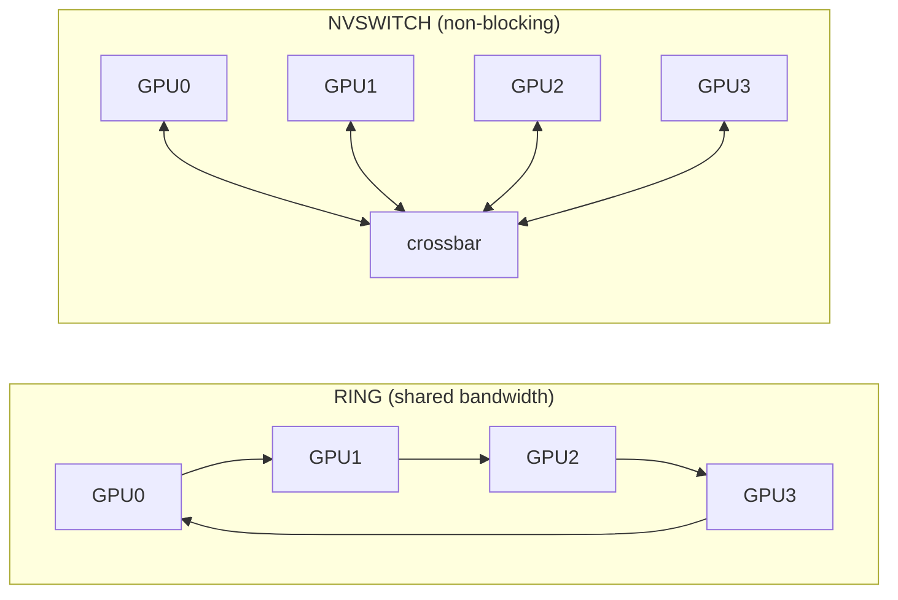
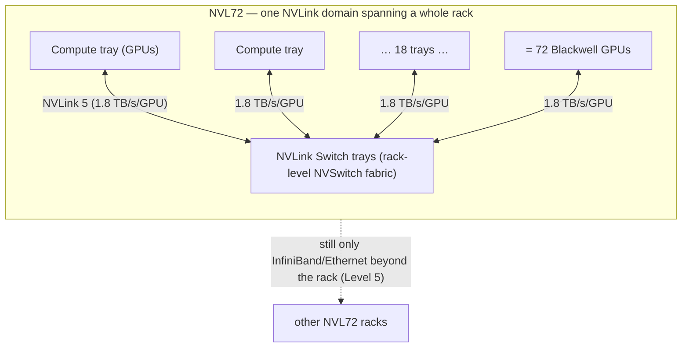
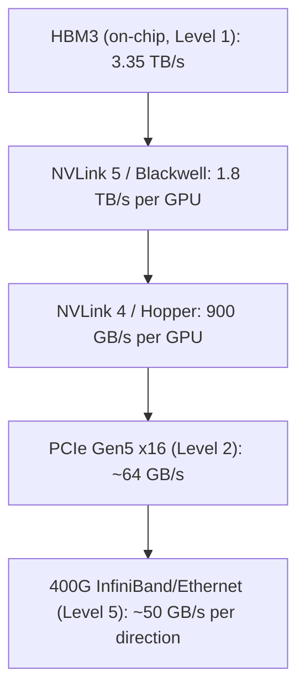

# Level 3 — The Multi-GPU Server (NVLink & NVSwitch)

> **Where we are in the journey.** At Level 2 we wired one GPU into a *server*: a CPU, system RAM, a
> NIC, storage, and the **PCIe** bus (~64 GB/s on Gen5 ×16) that connects the GPU to the rest of the
> box. PCIe was fine there — it's a *housekeeping* road, moving model weights in once and pulling
> results out. Now we put **eight GPUs in one chassis** and a brand-new problem appears: the GPUs need
> to talk *to each other*, constantly, at speeds PCIe cannot dream of. This level is about that
> conversation — the dedicated GPU-to-GPU fabric (**NVLink**) and the crossbar switch (**NVSwitch**)
> that make 8 separate chips behave like *one giant GPU*.
>
> **By the end of this level you can answer:** Why is PCIe fatally slow for multi-GPU work? What is an
> "NVLink domain" and why must tensor parallelism stay inside it? Why is NVSwitch *non-blocking* and
> why does that matter more than raw bandwidth? And why is the Blackwell **NVL72** an architectural
> step change, not just a bigger box?

---

## 1. The one idea: 8 GPUs only help if they can *share work* fast enough

Start with intuition, then we'll earn the numbers.

**One GPU is one chef in a kitchen.** Fine for a small dish. But the models we care about don't *fit*
in one GPU's 80 GB of HBM, and even when they do, one chef is too slow. So we hire **8 chefs and put
them in one kitchen** (one server). The dream: they cook one enormous banquet together, as if they
were a single chef with 8× the hands and 8× the memory.

The catch is *coordination*. These 8 chefs are not making 8 independent dishes — they're making **one
dish together**, and they must constantly hand each other half-finished work: "here's my part of the
sauce, give me yours." If passing ingredients between chefs is slow, the chefs spend all their time
*waiting at the pass* instead of cooking, and 8 chefs end up barely faster than one.

```
  THE WRONG WAY (PCIe)              THE RIGHT WAY (NVLink)
  Chef A ──┐                        Chef A ══════ Chef B
           │  out the front door             (dedicated pass-
        [ hallway / CPU ]                      through window
           │  and back in                      between them)
  Chef B ──┘
   slow, shared, congested          fast, private, full-speed
```

Passing ingredients **out the front door, down the hallway, past the host stand (the CPU), and back
in** is the PCIe path. **NVLink is a pass-through window cut directly into the wall between two
chefs.** And **NVSwitch** — coming in Section 4 — is a shared turntable in the middle of the kitchen
that *every* chef can reach at full speed *at the same time*.

> **Keep this lens for the whole level:** at multi-GPU scale, the bottleneck stops being "how fast can
> one chip compute" and becomes **"how fast can the chips talk."** Every design choice below follows
> from that.

---

## 2. Why PCIe is fatally slow here

At Level 2, PCIe Gen5 ×16 gives ~**64 GB/s** per direction. That sounds like a lot. To see why it's a
catastrophe *between* GPUs, you have to know what the traffic actually is.

When you split a single model layer across multiple GPUs (**tensor parallelism** — full treatment at
Level 7), each GPU computes a *slice* of the layer and they must **exchange and sum their partial
activations** — an **all-reduce** — **at the end of essentially every layer.** A large model has
~80–120 layers, and you run forward + backward thousands of times per second of wall-clock. So the
GPU-to-GPU link carries **gigabytes of activation tensors, thousands of times per second**, for the
*entire* run. This isn't housekeeping traffic; it's on the **critical path of every single step.**

Make the gap visceral with one number. An H100's HBM runs at **3.35 TB/s** internally. If two of those
chips can only talk to each other at PCIe's **64 GB/s**, the link between them is **~50× slower than
the memory inside each chip.** You'd have 8 ferraris connected by garden hoses. The GPUs would finish
their slice of work and then sit idle — MFU (Level 1) collapses — waiting for data to dribble across
PCIe. Eight $30,000 chips would deliver maybe twice the throughput of one. That is the problem NVLink
exists to solve.

---

## 3. NVLink — a private, wide, GPU-to-GPU road

**NVLink** is NVIDIA's dedicated chip-to-chip interconnect. It does *not* go through the CPU or the
PCIe root complex — it's a direct, point-to-point fabric between GPU dies, built from many parallel
**links**, each a bundle of high-speed lanes. More links = more bandwidth.



The headline numbers, by generation:

| Interconnect | GPU generation | Per-GPU aggregate bandwidth | How it's built |
|---|---|---|---|
| **PCIe Gen5 ×16** | (the baseline, Level 2) | **~64 GB/s** | 16 lanes, shared system bus |
| **NVLink 4** | H100 / H200 (Hopper) | **900 GB/s** | 18 links × 50 GB/s |
| **NVLink 5** | GB200 / B200 (Blackwell) | **1.8 TB/s** | 2× the per-link rate + more links |

So the GPU-to-GPU road is **~14× wider than PCIe on Hopper, and ~28× wider on Blackwell.** That's not
an optimization — it's the difference between 8 GPUs *working together* and 8 GPUs *taking turns*.

> *(NVLink "900 GB/s" and "1.8 TB/s" are the **aggregate bidirectional** per-GPU figures NVIDIA
> quotes; per-direction is half. Always verify link counts and per-link rates against the current
> NVIDIA datasheet before quoting in a design review — the marketing number and the directional number
> get conflated constantly.)*

### Peer-to-peer: the GPUs share memory

NVLink does more than move bytes fast — it lets a GPU **read and write another GPU's HBM directly**
(`cudaMemcpyPeer`, and unified-address P2P). To the software, GPU B's memory looks like a region it can
reach. The consequence is profound: within an NVLink-connected node, the 8 GPUs become, in effect,
**one device with a pooled ~640 GB of HBM (8 × 80 GB).** A model too big for one chip's 80 GB can be
laid across all eight and the chips fetch each other's slices over NVLink as if it were (slightly more
distant) local memory. *This* is what "act like one giant GPU" actually means.

---

## 4. NVSwitch — the non-blocking turntable

NVLink alone gives you *point-to-point* roads. With 8 GPUs you'd have to choose a topology. The naive
one is a **ring**: A→B→C→…→H→A. Rings are cheap but they have a fatal property: **the bandwidth is
shared.** If A wants to send to E, the data hops through B, C, D — eating into *their* link budget. As
more GPUs talk at once, everyone slows down. A ring's effective per-pair bandwidth *falls* as the
group gets busier.

**NVSwitch** fixes this. It's a dedicated crossbar **ASIC** — a switch chip whose entire job is to
route NVLink traffic — that connects *every* GPU to *every* other GPU through it. The result is a
**fully-connected, non-blocking fabric**: every GPU can talk to every other GPU **at full NVLink
bandwidth, all simultaneously**, with no contention.



Each GPU's 18 NVLink links are spread across the **4 NVSwitch3 chips** so that any GPU→GPU path runs at
the full 900 GB/s regardless of what the other six are doing. Read it as: *every chef has a full-speed
spoke to the central turntable, and the turntable never jams.*

### Ring vs NVSwitch — the picture to burn in



- **Ring:** A→E must hop through B, C, D → those links congest → effective bandwidth *drops* as more
  pairs talk. Latency grows with distance. Cheap, but it doesn't scale to all-to-all traffic.
- **NVSwitch:** every pair is one hop at full speed, *concurrently*. The all-reduce that tensor
  parallelism needs every layer hits its theoretical best.

### Bisection bandwidth — the one number that summarizes a node

The standard way to score a fabric: cut the 8 GPUs into two halves of 4 and ask **how much bandwidth
crosses the cut**. On an NVSwitch node, all 4 GPUs on one side can talk to all 4 on the other at full
NVLink speed simultaneously — the node's **bisection bandwidth** is enormous and *flat* (it doesn't
collapse under load). On a ring, the bisection is just two links. Bisection bandwidth is the number you
quote when someone asks "how parallel can this box really go?"

---

## 5. The NVLink domain — the unit that governs everything above

Here is the single most important concept in this level, the one every decision at Levels 4–7 hangs
off of:

> **An "NVLink domain" is the set of GPUs that can reach each other over NVLink/NVSwitch at full
> bandwidth.** On an HGX/DGX H100 node, the NVLink domain is **8 GPUs**. Beyond those 8, you fall off
> NVLink onto the *much* slower cluster network (Level 5) — InfiniBand or Ethernet at ~50 GB/s per
> direction (400 Gb/s), which is ~18× slower than NVLink.

This creates a hard, bright line:

```
  ┌──────── NVLink domain (8 GPUs) ────────┐
  │   900 GB/s any-to-any, non-blocking    │  ← put tensor parallelism HERE
  └─────────────────┬───────────────────────┘
                    │  cross this and you drop to...
            400 Gb/s (~50 GB/s) InfiniBand/Ethernet   ← ~18x slower (Level 5)
```

**Tensor parallelism must stay inside the NVLink domain.** On Hopper that means **TP ≤ 8.** Why? Walk
the bandwidth argument: TP does an all-reduce of the layer's activations *every layer*. If those 8
GPUs are all inside one NVLink domain, the all-reduce runs at 900 GB/s and finishes in microseconds. If
even one of the GPUs lives across the cluster network, *every* per-layer all-reduce now waits on the
~50 GB/s link — **~18× slower, on the critical path, ~100 times per step, thousands of steps per
second.** Throughput doesn't degrade gracefully; it falls off a cliff. This is *the* reason a model's
parallelism strategy is shaped like the hardware: **TP within the node (NVLink), the slower forms of
parallelism — pipeline and data — across nodes (Level 7).**

---

## 6. NVL72 — when the domain becomes a *rack*

On Hopper the NVLink domain is 8 GPUs, full stop. Blackwell changes the *size of the box you can treat
as one GPU* — and that's an architectural step change, not a spec bump.

**NVL72** is a Blackwell system that puts **72 GPUs in a single NVLink domain.** It does this by
pulling the NVSwitch out of the server and into the **rack**: dedicated **NVLink Switch trays**
interconnect 18 compute trays so that all 72 GPUs are non-blocking, any-to-any, over NVLink — with
**~130 TB/s of aggregate NVLink bandwidth** in the domain.



Why this matters: on Hopper, anything needing more than 8 GPUs in lockstep had to **cross the slow
cluster network**. On NVL72, the line moves — TP can now span far more than 8, and the **expert groups
of a Mixture-of-Experts model** (which shuffle tokens between experts constantly) can live entirely on
NVLink instead of being throttled by InfiniBand. Workloads that were *network-bound* on Hopper become
*NVLink-bound* on Blackwell. **The unit of "one giant GPU" grew from a server to a rack.** That single
move is why NVL72 reframes Level 4 (Rack) and Level 5 (Fabric) — the boundary between "fast local" and
"slow remote" jumped up a level of the hierarchy.

---

## 7. Worked example — all-reduce one activation tensor across 8 GPUs

Make the bandwidth gap concrete with arithmetic. Say each step must all-reduce a **1 GB** activation
tensor across the 8 GPUs (realistic for a large layer's TP exchange). A ring all-reduce moves
~`2 × (N-1)/N × size` ≈ **1.75 GB** across each GPU's link.

| Path | Effective link BW | Time for the all-reduce | Relative |
|---|---|---|---|
| **NVLink 4 (NVSwitch)** | 900 GB/s | ~1.75 GB ÷ 900 GB/s ≈ **~1.9 ms** | **1× (baseline)** |
| Forced onto **PCIe Gen5** | ~64 GB/s | ~1.75 GB ÷ 64 GB/s ≈ **~27 ms** | **~14× slower** |
| Forced onto **400G network** | ~50 GB/s | ~1.75 GB ÷ 50 GB/s ≈ **~35 ms** | **~18× slower** |

Now multiply by reality: **~100 layers × thousands of steps.** If each per-layer all-reduce costs
~1.9 ms on NVLink vs ~35 ms on the network, you've turned a step that should be compute-bound into one
that spends **the overwhelming majority of its time waiting on the wire.** The GPUs — the expensive
part — sit idle. This single table is the entire economic argument for NVLink/NVSwitch, and for the
"TP stays in the domain" rule. *(The exact all-reduce cost depends on algorithm and message size; the
**order of magnitude** is the point.)*

---

## 8. The bandwidth ladder (memorize this)

Every link in the AI-infra hierarchy, from fastest to slowest, with the ratio that matters:



Internalize the cliffs: **HBM (3.35 TB/s) → NVLink (0.9–1.8 TB/s) → PCIe/network (~50–64 GB/s).** Each
step down is roughly an *order of magnitude*. The art of distributed AI is **keeping the hottest,
most-frequent traffic on the highest rung you can afford** — which is exactly why TP lives on NVLink
and only the rarer, more tolerant traffic (pipeline/data parallelism, Level 7) is allowed onto the
network.

---

## 9. How a multi-GPU server fails (the silent killer: the straggler)

The dangerous failures here, like at Level 1, are the **silent** ones — they don't crash the job, they
just make it slow, and because big jobs run in **lockstep** (Level 7), one slow GPU drags *all* of
them.

| Failure | What it is | How it shows up / detection |
|---|---|---|
| **NVLink CRC / replay errors** | Bit errors on a link force retransmits; a marginal link can quietly run at **half** its rated bandwidth | DCGM/NVML NVLink CRC + replay counters; falling effective BW with no hard fault |
| **NVLink down / lane degrade** | A link drops lanes (18→fewer) or goes down → that GPU's path narrows | `nvidia-smi nvlink -s`, DCGM link-state; one GPU becomes a **straggler** |
| **NVSwitch fault** | A crossbar ASIC fails → non-blocking property lost; some pairs lose full bandwidth or the node degrades | Fabric Manager logs, NVSwitch health via DCGM; node should be drained |
| **GPU falls off the bus** | PCIe/NVLink enumeration loss → GPU vanishes from the topology mid-job | XID errors (Level 1), `nvidia-smi` topo missing a device → job crash |
| **Thermal throttle** (recap) | One GPU overheats → clock drop → it finishes its TP slice late | falling clocks/MFU, no error → straggler |

The pattern to burn in: **a CRC-degraded NVLink that silently halves one link's bandwidth turns that
GPU into a straggler.** In a synchronized TP all-reduce, *everyone waits for the slowest participant*,
so one half-speed link can knock a measurable chunk off the **whole node's** MFU while raising no
alarm. This is why **GPU + NVLink health telemetry (DCGM/NVML counters, NVSwitch Fabric Manager) is
non-negotiable**, and why the operational reflex is **detect → drain the node → diagnose → RMA**, not
"wait for a crash." *(Forward ref: at Level 7 we quantify exactly how badly one straggler taxes a
10,000-GPU lockstep job — the answer will alarm you.)*

---

## 10. Interview deep-dives (defend your understanding)

**Q: Why can't you just use PCIe to connect 8 GPUs and skip NVLink?**
Because the GPU-to-GPU traffic in tensor parallelism is on the critical path of *every layer* — an
all-reduce of activations, thousands of times per second. PCIe at ~64 GB/s is ~14× slower than NVLink
(900 GB/s) and ~50× slower than the GPUs' own HBM. The GPUs would finish their slice and idle waiting
on the wire; MFU collapses and 8 GPUs barely beat 1. NVLink is what makes the box behave like one GPU.

**Q: What does "non-blocking" mean for NVSwitch, and why does it beat a ring?**
Non-blocking means *every* GPU can talk to *every* other GPU at full bandwidth **simultaneously**, with
no contention — the crossbar has enough internal capacity for all pairs at once. A ring shares
bandwidth: A→E hops through intermediate GPUs, eating their link budget, so effective bandwidth falls
as more pairs communicate. For the all-to-all all-reduce that TP needs every layer, non-blocking is the
difference between hitting theoretical best and degrading under load.

**Q: What is an "NVLink domain" and why does it cap tensor parallelism at 8 on Hopper?**
It's the set of GPUs reachable over NVLink/NVSwitch at full bandwidth — 8 on an HGX/DGX H100 node.
Cross it and you drop to the ~18×-slower cluster network. Since TP all-reduces every layer, any TP
member living across the network throttles every step ~18×. So TP must stay inside the domain → TP ≤ 8
on Hopper. The slower-tolerance parallelism (pipeline, data) is what's allowed to cross nodes.

**Q: Why is NVL72 an architectural step change rather than just more GPUs?**
It grows the NVLink domain from 8 (a server) to 72 (a rack) by moving NVSwitch into rack-level NVLink
Switch trays, ~130 TB/s aggregate. Workloads that *had* to cross the slow network on Hopper — large TP,
MoE expert-to-expert shuffles — now stay on NVLink. The boundary between "fast local" and "slow remote"
jumps up a level, which reshapes how you plan racks (Level 4) and fabric (Level 5).

**Q: Your 8-GPU node's throughput dropped ~10% with no errors in the job log. Where do you look?**
A straggler. Check DCGM/NVML **NVLink CRC and replay counters** and link state (`nvidia-smi nvlink -s`)
for a link running degraded/half-bandwidth, and clocks for thermal throttling on one GPU. In a lockstep
TP all-reduce everyone waits for the slowest member, so one silently-degraded link taxes the whole
node. Action: drain the node, diagnose, RMA if the link errors persist.

**Q: You have 640 GB of pooled HBM across 8 GPUs — can you treat it as one flat 640 GB memory?**
Functionally yes via NVLink P2P (a GPU can read/write peers' HBM directly), which is how a model too
big for 80 GB spreads across the node. But it's **NUMA-like**: local HBM is 3.35 TB/s, a peer's HBM is
reached at NVLink speed (900 GB/s) — still fast, but ~3.7× slower and a hop away. You design kernels and
sharding to keep the hottest data local and accept that cross-GPU access is the cost of fitting the
model.

---

## 11. What you should now be able to draw from memory

- The **kitchen**: 8 chefs, PCIe = out-the-front-door (slow/shared), NVLink = pass-through window,
  NVSwitch = the central non-blocking turntable everyone reaches at full speed at once.
- The **bandwidth ladder**: HBM (3.35 TB/s) → NVLink 5 (1.8 TB/s) → NVLink 4 (900 GB/s) → PCIe
  (~64 GB/s) → 400G network (~50 GB/s), each step ~an order of magnitude down.
- The **8-GPU HGX node**: 8 GPUs + 4 NVSwitch3 chips, fully-connected non-blocking at 900 GB/s; and why
  bisection bandwidth, not peak link rate, summarizes it.
- The **NVLink-domain boundary** and the rule it forces: **TP stays inside the domain (≤8 on Hopper)**;
  pipeline/data parallelism cross nodes.
- Why **NVL72** (72 GPUs, one domain, ~130 TB/s) moves that boundary from server to rack.
- The **straggler** failure: a CRC-degraded NVLink silently halves a link → one slow GPU drags a
  lockstep job → detect via DCGM/NVML → drain.

> **Next — Level 4: Rack Design.** We've made 8 GPUs act like one. Now we stack these nodes into a
> rack and confront the *physical* reality the GPUs forced on us at Level 1: ~700–1,200 W per chip ×
> dozens of chips per rack means **tens of kilowatts of heat in one cabinet**, busbars, power
> distribution, and the move to **liquid cooling**. We'll also see where the NVLink domain ends and the
> rack-scale fabric (Level 5) begins — the seam NVL72 just redrew.

---
*Part of `AI-Infra/Foundations/` (Levels 1–6). See `AI-Infra/README.md` for the full 9-level map.*
