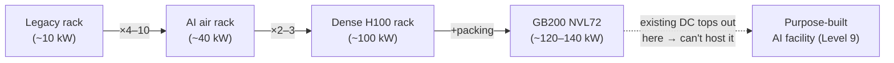
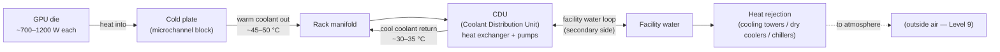
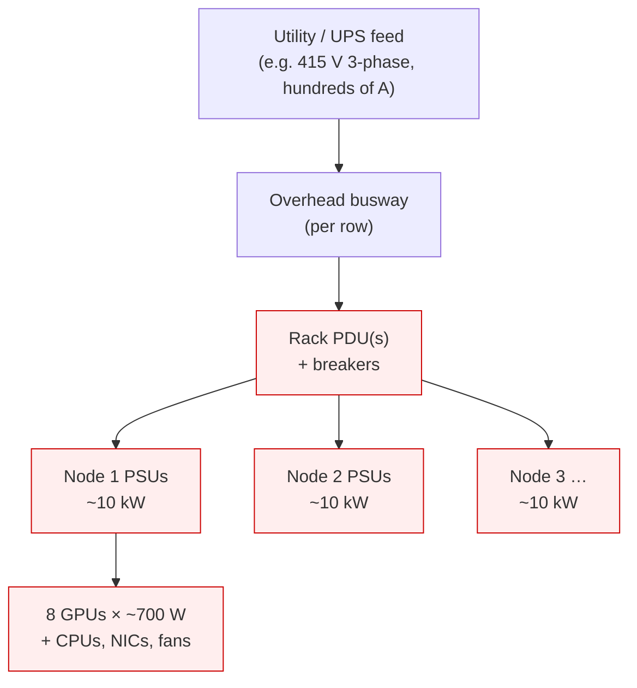
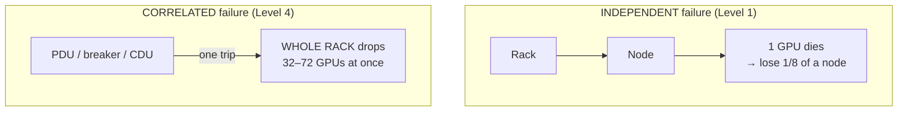
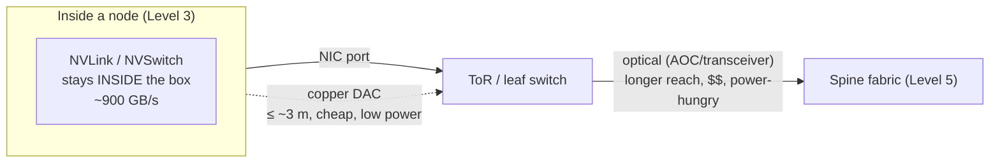

# Level 4 — Rack Design

> **Where we are in the journey.** At Level 3 we built the **8-GPU server** — eight H100s lashed
> together with NVLink + NVSwitch into a single coherent compute brick drawing ~10 kW. That was still
> an *electronics* problem: how do chips talk to each other fast. Now we stack those servers into a
> **rack**, and something changes the moment we do: **the problem stops being about chips and becomes
> about PHYSICS.** Power and heat — not silicon, not shelf space — become the wall.
>
> **By the end of this level you can answer:** Why does a rack of AI servers need its own electrical
> substation-grade feed? Why did air cooling die and liquid cooling take over? Why can't you put an
> AI rack in your existing datacenter? And why is "the rack" the first **correlated failure domain**
> that will haunt every training-job placement decision for the rest of the course?

---

## 1. The one idea: a rack is a closet, and you fill the *power* before the *shelves*

Start with the intuition.

Imagine a kitchen closet with **42 shelves**. Your instinct says the limit is *how many ovens fit on
the shelves* — 42 ovens, done. **Wrong.** Each oven pulls real current and dumps real heat. Plug in
five and you trip the breaker. Run them at once and the closet hits 60 °C and the ovens throttle
themselves to avoid catching fire. You never get anywhere near shelf 42 — **you run out of electrical
capacity and cooling capacity long before you run out of physical space.**

That is exactly what happens with an AI rack.

```
   Legacy enterprise rack            AI rack (GPU)
 ┌────────────────────────┐       ┌────────────────────────┐
 │ shelves: 42U           │       │ shelves: 42U            │
 │ power:   5–15 kW       │       │ power:   40–120+ kW     │
 │ cooling: AIR is fine   │       │ cooling: AIR DIES → LIQUID
 │ limit = SPACE          │       │ limit = POWER + HEAT    │
 └────────────────────────┘       └────────────────────────┘
   "fill the rack with                "fill the breaker and the
    1U pizza-box servers"              cooling loop — space is
                                       the LAST thing you run out of"
```

A standard 19-inch rack is **42U** tall (1U = 1.75 inches of vertical space). For a legacy
fleet of web/database servers, you fill all 42U and draw maybe 5–15 kW total — power and cooling are
afterthoughts. For AI, a *single* 8-GPU node already eats ~10 kW in ~6–8U. Do the multiplication and
you hit a wall that **legacy datacenters were never built to handle.**

> **Keep this lens for the whole level:** at the chip (Level 1) the binding constraint was *memory
> bandwidth*. At the rack, the binding constraints are **kilowatts in and kilowatts of heat out.**
> Everything below — busways, CDUs, cold plates, breaker domains — is plumbing for those two numbers.

---

## 2. What's physically in an AI rack

Let's build it from the bottom up. Here's a rack elevation — read it like a section drawing of the
closet:

```
        ┌─────────────────────────────────────────────┐
   42U  │  ToR / leaf switch  (on-ramp to Level 5 fabric)│  ← network uplinks leave here
        ├─────────────────────────────────────────────┤
        │  GPU node 1   (8× H100, ~10 kW)   [6–8U]      │
        │      NVLink stays INSIDE this box (Level 3)   │
        ├─────────────────────────────────────────────┤
        │  GPU node 2   (8× H100, ~10 kW)               │
        ├─────────────────────────────────────────────┤
        │  GPU node 3   (8× H100, ~10 kW)               │
        ├─────────────────────────────────────────────┤
        │  GPU node 4   …  (4–8 nodes total)            │
        ├─────────────────────────────────────────────┤
        │  CDU — Coolant Distribution Unit  (liquid)    │  ← heat exchanger to facility water
        └─────────────────────────────────────────────┘
          │  PDU strip (left)        PDU strip (right) │  ← vertical, in the "zero-U" side channels
          │  fed by overhead POWER BUSWAY               │
          └─────────────────────────────────────────────┘
                  network cabling tray  ╪  power cabling
```

The inventory, and why each piece exists:

| Component | What it is | Why it's here |
|---|---|---|
| **GPU nodes** | the 8-GPU servers from Level 3, 4–8 of them | the actual compute; the only thing that earns money |
| **ToR / leaf switch** | top-of-rack (a.k.a. leaf) Ethernet/InfiniBand switch | the rack's **on-ramp to Level 5's fabric** — aggregates every node's NICs onto the spine |
| **PDUs** | Power Distribution Units (metered rack power strips) | turn one fat feed into many outlets; meter + sometimes switch per-outlet |
| **Power busway** | overhead bus bar running the row | delivers hundreds of amps to each rack without a spaghetti of thick cables |
| **CDU / manifold** | Coolant Distribution Unit + cold-plate manifold | the rack's **liquid-cooling heart** — moves heat from chips to facility water |
| **Cabling** | NVLink (inside node), copper DAC + optical uplinks | NVLink never leaves the node; the network cables go up to the ToR and out |

The two newcomers versus Level 3 are the **PDU/busway** (power *in*) and the **CDU/manifold** (heat
*out*). They are the entire story of this level.

---

## 3. Power density — the number that breaks everything

Let's stack the real watts. This is the single table that explains why AI needs purpose-built
facilities.

| Rack type | Per-node | Per-rack | Cooling reality |
|---|---|---|---|
| Legacy enterprise (web/DB) | ~0.3–0.5 kW | **~5–15 kW** | air, trivially |
| AI rack, 4 nodes of 8× H100 | ~10 kW | **~40 kW** | air at the ragged edge |
| AI rack, 8 nodes of 8× H100 | ~10 kW | **~80–100+ kW** | **air can't — liquid** |
| **GB200 NVL72** (Blackwell) | — (72 GPUs in one rack) | **~120–140 kW** | **liquid mandatory** |

Read the jump: a legacy datacenter was engineered around **~5–15 kW per rack**. An AI rack wants
**40–120+ kW** — a **10× to nearly 30× increase in power density per floor tile.** This is not a
tuning problem. The building's electrical risers, transformers, and cooling plant were *sized* for the
old number.



**The conclusion that sets up Level 9:** you cannot retrofit a 10 kW/rack enterprise datacenter into a
100 kW/rack AI hall by "adding more AC." The power feed isn't there, the floor can't reject the heat,
and the cooling architecture is the wrong *kind*. AI infrastructure forces **purpose-built
facilities** — which is exactly where the course ends, at `../Production/Level-9-Physical-AI-Infrastructure.md`.

---

## 4. Cooling — why air died and liquid took over

This is the heart of the level. Recall from Level 1: a hot GPU **thermal-throttles** — it silently
drops its clock to save itself, which silently drops your MFU. **Cooling isn't comfort; it's MFU.** A
rack you can't cool is a rack that quietly runs slow.

### Why air tops out around ~30–50 kW/rack
Air is a *terrible* heat-transfer medium — low density, low heat capacity. To pull 10 kW out of a node
with air you must blow a *gale* through it; the fans themselves start to cost real power and make
deafening noise, and beyond ~30–50 kW/rack you physically can't move enough cold air through the
chassis to keep the silicon below its throttle point. **Air didn't get more expensive — it ran out of
physics.**

### Direct-to-chip liquid cooling — the mainstream answer
You bolt a **cold plate** (a metal block with internal microchannels) directly onto each GPU and CPU.
Coolant flows through the plate, picks up the heat *right at the source*, and carries it away. Liquid
(water/glycol) has **~3,500× the volumetric heat capacity of air** — it removes orders of magnitude
more heat per unit volume moved. That's why a ~120 kW NVL72 rack is *only* coolable with liquid.



Two loops, and the boundary between them is the key concept:
- **TCS (technology/primary loop):** clean coolant, GPU cold plate → manifold → CDU. Tight, filtered,
  controlled. This is the loop that touches the chips.
- **FWS (facility water loop):** the building's water, CDU → cooling towers/chillers → outside. Dirtier,
  bigger, the datacenter's responsibility.
- The **CDU is the heat exchanger between them** — it isolates the precious clean GPU loop from the
  facility's water, and houses the pumps and controls.

**Temperatures you should know:** coolant supply to the rack runs ~**30–35 °C**; it returns ~**45–50 °C**
after picking up the chips' heat. The gap between coolant temperature and the facility water is the
**approach temperature** — the smaller you can make it, the warmer (and cheaper, even chiller-*less*)
your facility water can be. Warm-water cooling that needs no mechanical chiller is a giant PUE win
(Level 9).

### The other two cooling styles (know the spectrum)
| Approach | How | Where it sits |
|---|---|---|
| **Rear-door heat exchanger (RDHx)** | a liquid-cooled radiator + fans bolted to the rack's back door; air still flows through nodes but is "re-cooled" on the way out | retrofit-friendly bridge, good to ~40–60 kW/rack |
| **Direct-to-chip (D2C)** | cold plates on the hot chips (above) | the mainstream for 50–140 kW racks today |
| **Immersion** | submerge whole boards in a dielectric fluid | highest density, but disruptive to operate/service; niche but growing |

### Cooling failure is *not* graceful
Lose the coolant loop and the chain is fast and brutal: **pump/flow loss → coolant temperature spikes
→ GPUs thermal-throttle (silent MFU loss) → emergency shutdown** to prevent hardware damage. With ~120 kW
of heat per rack, the thermal time-constant is **seconds**, not minutes. A coolant leak is worse — it's
liquid near hundreds of kW of live electronics. This is why CDUs run **N+1 pumps** and leak detection
is everywhere.

---

## 5. Power delivery & redundancy — and the correlated failure domain

Now the *power in* side. The path from the building feed down to one GPU:



- **Busway:** an overhead bus bar runs the length of a row; each rack taps it. It delivers hundreds of
  amps without running a separate thick cable to every rack — cleaner, denser, and re-taps without an
  electrician re-running conduit.
- **PDU + breakers:** the PDU splits the feed into outlets and meters them. The **breaker** is the
  protective fuse — trip it and everything downstream goes dark *at once.*

### Redundancy levels (memorize these — they appear in every facility review)
| Level | Meaning | Survives |
|---|---|---|
| **N** | exactly enough capacity, no spare | nothing — any failure = outage |
| **N+1** | one spare unit beyond need | a single component failure (one PDU, one pump) |
| **2N** | fully duplicated, two independent paths | an entire feed/path failure (with A+B power) |

### The big idea: the rack is a CORRELATED failure domain
At Level 1, a GPU failure was an **independent**, random event — one chip out of tens of thousands.
At the rack, failures become **correlated**: a single PDU trip, a tripped breaker, or a CDU pump loss
takes down **every GPU in the rack at the same instant.**



This distinction is enormous and it propagates up the entire course:
- **Job placement (Levels 7–8):** you do *not* pack one training job's most critical replicas all into
  a single rack — a breaker trip would vaporize them together. You spread across racks/power domains so
  one correlated event can't kill a quorum.
- **Checkpointing (Levels 7–8):** the blast radius of a correlated loss sets how often you checkpoint.
  Losing one GPU is a node-replace; losing a 72-GPU rack mid-step means rewinding *everyone* in that
  job to the last checkpoint. Frequency × blast-radius = wasted GPU-hours.

> **The sentence to remember:** *the PDU and the breaker — not the GPU — define the unit of correlated
> loss, and that unit drives placement and checkpoint strategy for the rest of the stack.*

---

## 6. Cabling — the unglamorous problem that eats your time

Three tiers of "wire," each with different physics:



- **NVLink** is the intra-node fabric from Level 3 — it **never leaves the chassis.** The GPUs in one
  box are wired together inside; that's a closed world.
- **Copper (DAC — Direct Attach Copper):** cheap, passive, low-power, but only reaches **~3 m.** Used
  for short in-rack and rack-to-adjacent hops.
- **Optical (AOC / transceivers):** required once a link must travel farther than copper allows — to the
  spine across the hall. Optics cost real money **and real power** (a transceiver burns watts, and at
  cluster scale that's megawatts of optics — a Level 5/8 line item).

The under-appreciated problem is **sheer count.** A rack of 8 nodes might have 8 GPUs × multiple NICs
each → dozens of network cables per rack, plus power whips, plus coolant hoses — all needing strain
relief, labeling, bend-radius respect, and serviceability. At a cluster of thousands of racks, cabling
is a **planned, surveyed, and inspected** discipline; a mislabeled or pinched cable is a
hard-to-find straggler (recall Level 1's "one slow link drags thousands").

---

## 7. Worked example — the power & heat budget of one ~100 kW rack

Make it concrete. We build **one rack of 8 nodes, each 8× H100 + CPUs + NICs + fans ≈ 12.5 kW** loaded.

**Power in:**
- 8 nodes × 12.5 kW = **100 kW** IT load.
- At 415 V 3-phase, P = √3 × V × I → I ≈ 100,000 / (1.732 × 415) ≈ **~139 A per phase.** You provision
  the breaker above continuous load (the classic 80% rule → size for ~125 kW) → **~174 A.**
- For redundancy you want **2N power** (A + B feeds): two independent ~150–200 A feeds to the rack, so
  one path can carry the whole rack alone. One rack now demands what a *small office building* used to.

**Heat out (this is the part people forget):** by conservation of energy, **~100 kW in ≈ ~100 kW of
heat out, every second.** Translate to the unit facilities engineers use:
- 1 ton of cooling = 3.517 kW. So **100 kW ≈ ~28.4 tons** of cooling **per rack.**
- That's roughly the cooling of **14 large house central-AC units — for one rack.** A row of 10 such
  racks = ~1 MW of heat = **~284 tons.** A hall of 100 racks = **~10 MW.** This is why Level 9 talks in
  *megawatts* and why the cooling plant, not the servers, often dominates the capital cost.

> **The two numbers to internalize for any AI rack:** the **electrical feed** it demands (and at what
> redundancy) and the **heat in kW/tons** you must reject *continuously*. If you can recite those for a
> 100 kW rack, you understand this level.

---

## 8. How a rack fails (the new failure vocabulary)

At Level 1 failures were silicon-level and mostly independent. At the rack they're **infrastructure**
failures, and the dangerous ones take down *many* GPUs together.

| Failure | What it is | How it shows up | Blast radius |
|---|---|---|---|
| **Cooling-loop loss** | pump/flow/CDU failure | coolant temp climbs → **throttle → emergency shutdown** in seconds | whole rack (correlated) |
| **PDU / breaker trip** | overcurrent or fault opens the breaker | every node downstream loses power *instantly* | whole rack (correlated) |
| **Coolant leak** | hose/fitting/cold-plate seepage | leak detection alarms; risk of liquid + live power | rack, possibly neighbors |
| **Power over-subscription** | provisioned for nameplate, real load spikes higher | breaker trips **under load** (often during a hard training step) | whole rack (correlated) |
| **Hot spot** | uneven airflow/coolant, one node runs hot | that node throttles → **straggler**, no hard error | one node (drags the job) |

The pattern, escalated from Level 1: the **silent** failures (a single hot node throttling into a
straggler) quietly bleed MFU, while the **correlated** failures (PDU trip, CDU loss) hit *hard and
wide* and are the ones your job-placement and checkpointing strategy must survive. Both problems are
*created* at the rack — neither existed when you were thinking about one chip.

---

## 9. Interview deep-dives (defend your understanding)

**Q: Why can't I just put AI servers in my existing enterprise datacenter?**
Power density and cooling *kind*, not space. Enterprise DCs are engineered for ~5–15 kW/rack with air;
AI racks want 40–120+ kW and require liquid (direct-to-chip/CDU). The electrical risers, transformers,
and cooling plant were sized for the old number and the building can't physically deliver the power or
reject the heat. It forces purpose-built facilities (Level 9).

**Q: Why did the industry move from air to direct-to-chip liquid cooling?**
Air ran out of physics. Beyond ~30–50 kW/rack you can't move enough cold air through a chassis to keep
silicon below its throttle point. Liquid has ~3,500× the volumetric heat capacity of air, so a cold
plate at the source removes orders of magnitude more heat. A ~120 kW GB200 NVL72 rack is *only*
coolable with liquid — air was never an option for it.

**Q: A PDU breaker trips on a rack mid-training-run. Why is this categorically worse than a single GPU
dying, and what should the design already have done?**
It's a **correlated** failure: the breaker drops *every* GPU in the rack at once (32–72 GPUs), versus an
independent single-GPU loss. The job's blast radius is the whole rack. The design should already spread
a job's critical replicas across multiple racks/power domains so one trip can't kill a quorum, and
checkpoint frequently enough that rewinding the whole job to the last checkpoint is tolerable. The
breaker — not the GPU — is the real unit of loss.

**Q: What's a CDU and where does it sit?**
The Coolant Distribution Unit is the heat exchanger between the clean primary loop that touches the GPU
cold plates and the facility water loop that goes to the cooling towers/chillers. It isolates the two
loops, houses the pumps (run N+1), and lets you keep the GPU coolant filtered and controlled while the
facility handles the bulk heat rejection.

**Q: Why does cooling failure show up as lost MFU before it shows up as an error?**
Because a hot GPU throttles *silently* first (Level 1) — clocks drop, the run gets slower, no alert
fires saying "you lost 8%." Only if temperature keeps climbing does emergency shutdown trigger a hard
error. So a degrading cooling loop is first a quiet MFU bleed and only later a crash — which is exactly
why coolant-temp and clock telemetry are non-negotiable.

**Q: You're given a 100 kW rack. What feed and what heat rejection does it need?**
~139 A/phase at 415 V 3-phase continuous → breaker sized ~174 A (80% rule), ideally as **2N** A+B
feeds. Heat: ~100 kW out continuously ≈ **~28 tons** of cooling per rack. Scale that across a row/hall
and you're into the MW range — the cooling plant becomes a dominant cost.

*(All figures here are order-of-magnitude for teaching — H100 SXM ~700 W, node ~10–13 kW, NVL72
~120–140 kW. Verify exact watts/amps against the current node and rack datasheets before quoting in a
design or facility review.)*

---

## 10. What you should now be able to draw from memory

- The **rack elevation**: GPU nodes + ToR/leaf switch + PDUs + CDU/manifold, fed by an overhead busway.
- The **power tree**: feed → busway → PDU/breaker → node PSUs → GPUs, with ~100 kW at the rack.
- The **liquid-cooling loop**: cold plate → manifold → CDU → facility water → heat rejection, and the
  two-loop (primary/facility) boundary at the CDU.
- The **failure-domain tree**: independent single-GPU loss vs **correlated whole-rack loss** at the
  PDU/breaker/CDU — and why that drives placement and checkpointing.
- The one-rack budget: **~100 kW in, ~28 tons of heat out, 2N feed.**

> **Next — Level 5: The Network Fabric.** We've filled one rack and put a leaf switch on top of it. But
> a training job spans *hundreds* of racks, and they all have to talk as if they were one machine. We
> walk out the ToR uplinks into the **datacenter fabric** — leaf/spine topologies, the difference
> between the back-end GPU fabric and the front-end network, InfiniBand vs RoCE, and why the *network*,
> not the GPU, becomes the thing that limits how fast a 10,000-GPU job can train.

---
*Part of `AI-Infra/Foundations/` (Levels 1–6). See `AI-Infra/README.md` for the full 9-level map.*
