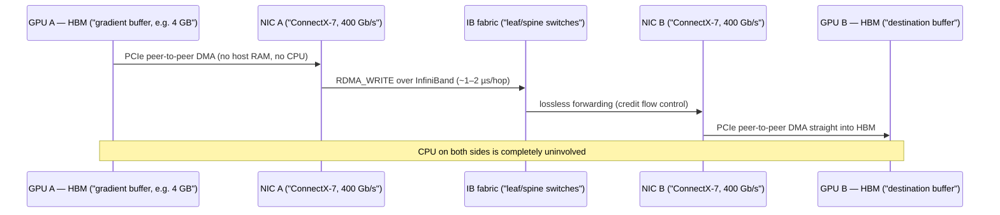
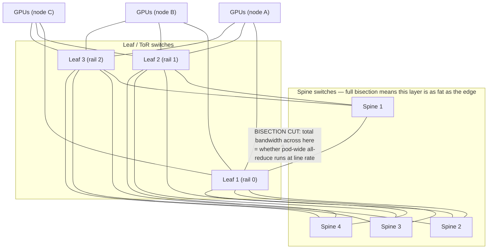
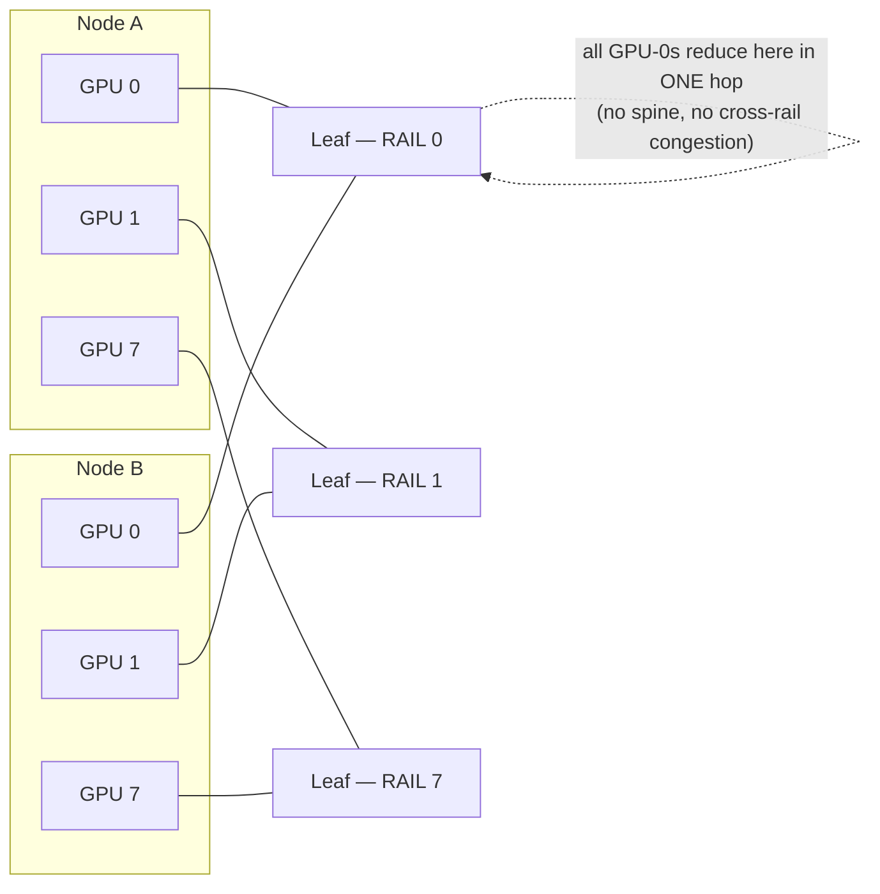
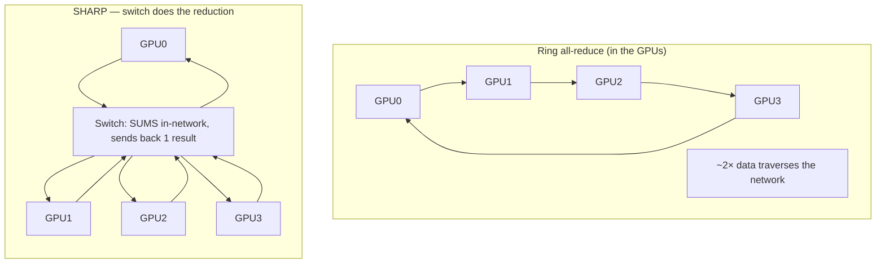

# Level 5 — The Network Fabric (InfiniBand & RDMA)

> **Where we are in the journey.** At Level 4 we built **the rack**: ~8 servers wired together with
> top-of-rack switches, power, and liquid cooling — a self-contained block of the city. But a frontier
> training job doesn't fit in one rack. It needs *thousands* of GPUs across *hundreds* of racks, and —
> this is the hard part — it needs them to behave as **one machine**. This level is the **road network
> between racks**: the fabric that lets GPU #4,096 in the far corner of the building hand a gradient to
> GPU #1 as if they shared a board.
>
> **By the end of this level you can answer:** Why can't we just use "normal" datacenter Ethernet? What
> is RDMA and why must the CPU be *out* of the data path? InfiniBand vs RoCE — and who chose which and
> why? What is bisection bandwidth and why does it decide whether your all-reduce runs at line rate?
> And why can **one bad transceiver** silently slow down ten thousand healthy GPUs?

---

## 1. The one idea: training traffic is a synchronized rush hour

Start with intuition, then we'll earn the numbers.

Picture a city where, at exactly 5:00:00.000 PM, **every single car floors it onto the highway at the
same instant** — and they all want to reach the same downtown intersection, exchange a package, and
drive back, *before anyone is allowed to leave for home.* That is what a distributed training step
looks like on the wire.

This is **not** like web traffic. Web traffic is millions of small, independent, randomly-timed
requests — a steady drizzle the network smooths out easily. Training traffic is the opposite on every
axis:

```
   Web / cloud traffic                 AI training traffic
 ┌───────────────────────┐          ┌───────────────────────────┐
 │ many small flows       │          │ few HUGE flows             │
 │ random arrival times   │          │ SYNCHRONIZED — all at once │
 │ latency-tolerant       │          │ latency-CRITICAL (µs)      │
 │ loss-tolerant (TCP)    │          │ loss-INTOLERANT            │
 │ → smooth, easy         │          │ → bursty incast, brutal    │
 └───────────────────────┘          └───────────────────────────┘
```

The defining word is **incast**: at the end of every training step, all N GPUs run an **all-reduce**
to average their gradients (we'll do the math at Level 7). They *all* transmit at *once*, often toward
*overlapping* destinations. Thousands of senders, a few receivers, simultaneously — the exact pattern
that overwhelms a naive network's buffers and makes packets queue, or worse, **drop**.

> **Keep this lens for the whole level:** the fabric isn't carrying "traffic," it's carrying a
> **barrier**. The slowest packet in the all-reduce gates the next training step. So the fabric is only
> as good as its **tail latency under a synchronized burst** — not its average throughput on a brochure.

From that one fact fall the **three hard requirements** of an AI fabric, each of which the rest of this
level explains:

1. **Microsecond latency** — the barrier waits on the last byte; round-trips must be ~1–3 µs, not the
   ~50–100 µs a TCP/IP stack costs.
2. **No CPU in the path** — at 400 Gb/s a CPU copying bytes through the kernel *is* the bottleneck; the
   data must move NIC-to-NIC without a core touching it. (This is **RDMA**.)
3. **Lossless delivery** — a single dropped packet triggers a retransmit + timeout that stalls the
   whole synchronized step. The fabric must *never* drop under congestion; it must push back instead.

---

## 2. RDMA — getting the CPU out of the way

### The intuition
Normal networking is like mailing a letter: your app writes data, the **kernel copies it** into a
socket buffer, the **CPU** builds TCP/IP headers, hands it to the NIC, and on the far side the whole
dance runs in reverse — another copy, another CPU, another wake-up. Every step burns CPU cycles and
microseconds. At 400 Gb/s that's ~50 GB/s *per link*; no general-purpose CPU can shuffle that through
the kernel and still do anything useful.

**RDMA — Remote Direct Memory Access — deletes the post office.** The NIC reads from (or writes to) a
remote machine's memory *directly*, with **zero CPU and zero kernel involvement** on either side once
set up. The application says "put these bytes into that remote buffer," and the hardware does it.

### The mechanism (briefly, precisely)
RDMA works through three primitives you should be able to name:

- **Queue Pairs (QPs):** a send queue + a receive queue that an app registers with the NIC. The app
  posts work requests onto the send queue; the NIC executes them autonomously.
- **Verbs:** the RDMA API. The key ones are **one-sided** — `RDMA_WRITE` and `RDMA_READ` — where the
  *remote* CPU is never even notified. The sender's NIC writes straight into pre-registered remote
  memory.
- **Memory registration / kernel bypass:** buffers are pinned and mapped once; thereafter the NIC and
  the app talk directly in user space. The kernel is bypassed entirely on the data path.

### GPUDirect RDMA — the part that matters for AI
Recall Level 2's data path: data normally hops **GPU HBM → PCIe → CPU/host RAM → NIC**. That host-RAM
bounce is a tax — an extra copy and extra latency on every transfer.

**GPUDirect RDMA** removes the bounce. The NIC performs a **PCIe peer-to-peer DMA straight out of GPU
HBM**, across the wire, and into the *remote* GPU's HBM — the CPU and host RAM never see the bytes:



This is the through-line of the whole course: **HBM (Level 1) → server PCIe (Level 2) → NVLink inside
the box (Level 3) → and now, the moment you leave the box, GPUDirect RDMA over the fabric.** Inside a
server, GPUs talk over NVLink; the instant a GPU needs a peer in *another* rack, this is the path.

---

## 3. InfiniBand vs RoCEv2 — the honest trade-off

There are two ways to build a lossless RDMA fabric, and the choice is one of the more political
decisions in AI infra. Be able to argue both sides.

### InfiniBand (IB)
A **purpose-built fabric** — its own switches, its own NICs (NVIDIA/Mellanox ConnectX + Quantum
switches), its own link layer. It was *designed* to be lossless from day one:

- **Credit-based flow control:** a sender may only transmit if the receiver has advertised buffer
  **credits**. No credit, no send — so a switch buffer *cannot* overflow, so packets are *never*
  dropped due to congestion. Losslessness is structural, not bolted on.
- **SHARP** (in-network reduction — Section 6) lives in the IB switches.
- Subnet-managed, low-jitter, ~1 µs switch latency. The "it just works for HPC" fabric.

### RoCEv2 — RDMA over Converged Ethernet
RDMA carried inside **UDP/IP over ordinary Ethernet**. The appeal: you reuse the Ethernet ecosystem —
familiar tooling, more switch vendors, no single-vendor lock-in. But Ethernet drops packets when
congested by default, so you must *make* it lossless with two mechanisms — and that's where the pain
lives:

- **PFC — Priority Flow Control:** a switch nearing buffer-full sends a **PAUSE** to the upstream port,
  telling it to stop. This prevents drops — but PAUSE is blunt (it stops a whole priority class) and
  propagates *backward*, creating:
  - **PFC storms / congestion spreading:** one hot link pauses its neighbor, which pauses *its*
    neighbor — backpressure ripples across the fabric and stalls flows that were never congested.
  - **Deadlock:** cyclic PAUSE dependencies can freeze a region of the fabric solid.
  - **Head-of-line blocking:** one paused flow stalls innocent flows sharing the queue.
- **ECN — Explicit Congestion Notification:** switches *mark* packets as they get congested; the
  receiver echoes the mark back so the sender slows down (via DCQCN). This is the gentler, preferred
  control loop — but it must be **tuned carefully**, and a mistuned RoCE fabric is a recurring source
  of mysterious training slowdowns.

### Who runs what, and why

| | **InfiniBand** | **RoCEv2 (Ethernet)** |
|---|---|---|
| Losslessness | structural (credit flow control) | engineered (PFC + ECN, must tune) |
| Latency / jitter | lowest, most predictable | good, but tail sensitive to tuning |
| In-network reduction | **SHARP** | (vendor-specific / limited) |
| Ecosystem | single-vendor (NVIDIA) | many switch vendors, Ethernet tooling |
| Operational risk | low — designed for this | PFC storms, deadlock, HoL blocking |
| Cost at scale | premium | leverages commodity Ethernet economics |
| **Who** | **Microsoft Azure / OpenAI** lean IB | **Meta** runs **RoCE** at massive scale |

The honest summary: **IB buys you correctness-by-design at a vendor premium; RoCE buys you ecosystem
leverage at the cost of a hard tuning problem.** Meta's bet is that at hyperscale, owning the Ethernet
supply chain and tooling is worth the engineering to tame PFC/ECN. Microsoft's bet is that for the
tightest synchronized training, IB's predictable tail is worth paying for. Both are defensible — which
is exactly why you should never answer this question with a one-liner in an interview.

---

## 4. The wires: InfiniBand generations and the "rail" NIC layout

Each IB generation roughly doubles per-link bandwidth. Know these like the back of your hand:

| Generation | Per-link | Switch (example) | Note |
|---|---|---|---|
| **HDR** | ~200 Gb/s | Quantum (40×200G) | the A100 era |
| **NDR** | ~400 Gb/s | **Quantum-2 (64×400G)** | the H100 era |
| **XDR** | ~800 Gb/s | Quantum-X | Blackwell era |

> *(Per-link and switch radix figures are approximate and generation-dependent — verify against the
> current NVIDIA Quantum datasheet before quoting in a design review.)*

The key design move at the node level: **one NIC per GPU.** An **Azure ND H100 v5** node has 8× H100s
and **8× 400 Gb/s NDR** NICs — one dedicated NIC per GPU — for **~3.2 Tb/s of fabric bandwidth per
node** (8 × 400 Gb/s). That 1:1 GPU-to-NIC pairing is what makes the **rail** topology in the next
section possible: each GPU has its own private on-ramp to the highway.

---

## 5. Topology: fat-tree, full bisection, and rail-optimized placement

You can't connect thousands of NICs to one switch — switches have a fixed **radix** (port count, e.g.
64). So you build a **tree of switches**. The standard is a **fat-tree / Clos** topology: **leaf**
switches (top-of-rack, facing the GPUs) connect *up* to **spine** switches, which connect leaves to
each other.

### Bisection bandwidth — the number that decides everything
Cut the fabric in half. **Bisection bandwidth** = the total bandwidth crossing that cut. It tells you
the worst-case throughput when one half of the GPUs all talk to the other half *at once* — which is
**exactly what a pod-wide all-reduce does.**

- **Full (non-blocking) bisection:** there is as much *uplink* (leaf→spine) bandwidth as there is
  *downlink* (leaf→GPU). Every GPU can blast every other GPU at full line rate simultaneously, with no
  internal bottleneck. A pod-wide all-reduce runs at **line rate**. This is what frontier training
  fabrics buy — and it is expensive, because the spine layer must be as fat as the edge.

- **Oversubscription** (e.g. 2:1, 4:1): you deliberately put *less* uplink than downlink — say 16 GPUs
  share enough spine bandwidth for 8. It's a **cost lever**: fewer spine switches, fewer long optical
  cables. The risk: under a synchronized all-reduce the spine becomes the bottleneck, and the step
  stalls. Oversubscription is fine for *inference* or loosely-coupled jobs; it's dangerous for *tightly
  synchronized training* unless the topology (below) keeps the hot traffic off the spine.



### Rail-optimized design — keep the all-reduce one hop away
Here's the elegant trick. Recall each node has 8 GPUs, each with its own NIC. **Rail-optimized**
wiring connects **GPU *i* on *every* node to the *same* leaf switch — "rail *i*."** So all the GPU-0s
across the whole pod hang off leaf 0, all the GPU-1s off leaf 1, and so on.



Why this is brilliant: a typical all-reduce pattern reduces **across the same GPU index** on every
node (GPU-0 with GPU-0, etc. — this is how NCCL maps ranks). With rail-optimized placement, **that
entire collective stays on one leaf switch — a single hop — never touching the spine.** You get the
all-reduce bandwidth of a full-bisection fabric for the common case, while letting the spine handle
only the cross-rail traffic. It's the topology that makes "thousands of GPUs as one computer"
affordable.

---

## 6. SHARP — let the switch do the math

Normally a reduction (summing gradients) happens **in the GPUs**, and the partial sums bounce around
the network repeatedly — a ring all-reduce sends roughly **2× the data** around the loop.

**SHARP — Scalable Hierarchical Aggregation and Reduction Protocol** — moves the reduction *into the
switch silicon.* The IB switch itself **adds up the gradients from all the GPUs beneath it** and sends
back only the single summed result:



The win: SHARP **roughly halves all-reduce traffic and latency** for large collectives, and the result
is independent of GPU count (the switch fans it out in a tree). At Azure/OpenAI scale, where a pod-wide
all-reduce runs *every training step* across thousands of GPUs, this is a real, measurable lever on
training throughput and cost. *(The deep collective-algorithm math — ring vs tree vs all of it — is
Level 7. Here, just hold: the network can do arithmetic, and that halves the bill.)*

---

## 7. Congestion: the silent cluster-wide slowdown

Even a full-bisection fabric congests, because the all-reduce is bursty and synchronized. Two
mechanisms fight it:

- **Adaptive routing:** the switch doesn't pin a flow to one path; it spreads packets across multiple
  equal-cost uplinks, dodging a hot link. (Per-packet spraying needs reordering tolerance, which RDMA
  handles better than naive TCP.)
- **ECN / congestion notification:** switches mark packets as buffers fill; senders back off before
  they cause drops.

Now the failure mode — and it echoes Level 1's central lie. When the fabric congests:

> Every GPU still reports **100% utilization**. Every NIC link is **up**. DCGM shows the GPUs healthy.
> And yet the job is **slow**, because the all-reduce's **tail latency** has blown up — the barrier
> waits on the one straggling packet — so *every* GPU sits idle at the barrier waiting for the slowest
> path. A whole cluster's throughput collapses with **no error, no alert, nothing red on a dashboard.**

This is the network version of "GPU-Util 100% is a lie." The honest signal isn't link-up/link-down;
it's **per-edge IB counters** and **collective tail latency**. We'll instrument exactly this in the
Observability domain (`Observability/14-AI Infrastructure Observability/`).

---

## 8. Worked example: time to all-reduce a gradient buffer

Let's make the SHARP win concrete. Say a model has a **4 GB gradient buffer** to all-reduce across
**N = 256 nodes**, on a **400 Gb/s** (NDR) fabric. (Treat these as order-of-magnitude — the point is
the *shape*, not three sig figs.)

The standard **ring all-reduce** moves ~**2×** the buffer per GPU over the network (reduce-scatter +
all-gather), and that cost is roughly independent of N (that's the beauty of the ring):

```
Per-link rate:  400 Gb/s = 50 GB/s
Data per GPU on the wire (ring):  ~2 × 4 GB = 8 GB
Ideal time (bandwidth-bound):     8 GB ÷ 50 GB/s ≈ 0.16 s = 160 ms
```

160 ms — **per step** — just for the gradient exchange. Now apply **SHARP**: the switch does the
reduction in-network, so each GPU effectively sends its buffer up *once* and receives the result
*once* — roughly **halving** the bytes on the wire:

```
With SHARP:  ~1 × 4 GB = 4 GB  ÷ 50 GB/s ≈ 0.08 s = 80 ms
```

**~160 ms → ~80 ms.** On a job doing tens of thousands of steps, that's the difference between a
3-week run and a 6-week run — *the same hardware, the network did half the math.* That order-of-
magnitude is why frontier shops obsess over the fabric, not just the GPUs. (Real numbers fold in
overlap-with-compute, bucketing, and protocol overhead — Level 7 — but the lever is exactly this.)

---

## 9. How the fabric fails (because at scale, it will)

A pod has thousands of cables and tens of thousands of optical transceivers. At that count, **something
is always marginal.** The dangerous failures, as at Level 1, are the **silent** ones.

| Failure | What it is | How it shows up |
|---|---|---|
| **Link flap** | a port repeatedly goes down/up (bad cable seat, dying optic) | intermittent retrains; routing churn; periodic latency spikes |
| **Bad cable / transceiver** | one optic degrades — rising bit-error rate, not a clean failure | link stays "up" but corrects errors constantly → a **slow path** |
| **Congestion hot-spot** | one spine link saturates under incast | all-reduce **tail** balloons → cluster-wide slowdown, no error |
| **PFC storm (RoCE)** | backpressure ripples across the fabric | flows stall far from the actual hot spot; hard to localize |
| **Silent throughput degradation** | a flow runs at, say, 380 of 400 Gb/s | nothing alerts; MFU just quietly drops a few % |

The pattern to internalize — and it's the **same lesson as the slow GPU** at Level 1: **one bad
transceiver on one rail makes that path slow, the all-reduce barrier waits on the slowest path, and so
one $20 optic drags ten thousand healthy GPUs into a straggle.** "Link up" is not "link healthy." The
only way to catch it is **per-edge telemetry** — port-level bit-error-rate, symbol errors, queue depth,
PFC pause counts, and ECN marks on every switch port — correlated against collective tail latency.

---

## 10. Cost: why the fabric is a huge slice of capex

The network is **not** a rounding error next to the GPUs — at frontier scale it's commonly **10–20% of
cluster capex.** The drivers:

- **Switches:** a full-bisection fat-tree for thousands of GPUs needs *hundreds* of high-radix switches
  (leaf + spine), each tens of thousands of dollars.
- **Optical transceivers:** the dominant hidden cost. Every long link needs an optic on **each end**;
  at 400/800 Gb/s these are expensive, and a pod has *tens of thousands* of them. They also fail more
  than anything else in the fabric.
- **Cables:** copper (DAC) is cheap but only reaches a couple of meters; cross-rack links need active
  optical cables, which are pricier and more failure-prone.

The economic lever is **full-bisection vs oversubscription**. Full bisection roughly *doubles* the
spine layer (switches + the most expensive long optical runs) versus a 2:1 design. So the real
engineering question is: *which jobs actually need line-rate pod-wide all-reduce?* Tightly synchronized
training does (and rail-optimization lets you serve it cheaply for the common collective);
loosely-coupled inference often doesn't. Matching topology to workload is where millions of capex
dollars are won or lost.

---

## 11. Interview deep-dives (defend your understanding)

**Q: Why can't we just run training on standard datacenter TCP/IP Ethernet?**
Three reasons, all from the synchronized-incast nature of all-reduce: (1) **latency** — a TCP/IP kernel
stack adds ~50–100 µs of round-trip and CPU work the barrier can't afford; (2) **CPU bottleneck** — at
400 Gb/s no core can copy bytes through the kernel fast enough, so you need **RDMA** to bypass it; (3)
**loss** — TCP *expects* drops and recovers with retransmit+timeout, which stalls the synchronized
step. You need an RDMA fabric that's lossless and microsecond-scale: InfiniBand, or Ethernet made
lossless via RoCEv2.

**Q: What does GPUDirect RDMA actually remove, and why does it matter?**
It removes the **bounce through host RAM and the CPU**. Without it the path is HBM → PCIe → host RAM →
NIC (an extra copy and CPU involvement on each end). With it, the NIC does a **PCIe peer-to-peer DMA
straight out of GPU HBM** across the wire into the remote GPU's HBM. That cuts latency and frees the
CPU, which is mandatory at 400 Gb/s per NIC.

**Q: InfiniBand or RoCE — how do you decide?**
IB is **lossless by design** (credit flow control), lowest jitter, and has **SHARP** in-switch
reduction — but it's single-vendor and premium-priced; Microsoft/OpenAI lean this way for tightly
synchronized training. RoCEv2 reuses the **Ethernet ecosystem** (multi-vendor, familiar tooling) but
must be *made* lossless with **PFC + ECN**, which brings PFC storms, deadlock, and head-of-line
blocking if mistuned; Meta runs RoCE at scale and invests in taming it. The decision is
correctness-by-design + premium (IB) vs ecosystem-leverage + tuning-burden (RoCE).

**Q: What is bisection bandwidth and why do you care?**
Cut the fabric in half; bisection bandwidth is the total bandwidth across the cut. It's the worst-case
throughput when half the GPUs talk to the other half at once — i.e. a **pod-wide all-reduce**. Full
(non-blocking) bisection means the all-reduce runs at line rate; **oversubscription** trades that for
cheaper spine but risks stalling synchronized jobs. It's the single number that says whether your pod
acts like one computer.

**Q: Explain rail-optimized topology and what it buys.**
Each node's GPU *i* connects to the **same leaf switch, "rail *i*."** Because NCCL's all-reduce reduces
across the same GPU index on every node, that collective stays on **one leaf — a single hop — and never
hits the spine**, avoiding cross-spine congestion and giving full-bisection-like all-reduce bandwidth
for the common case at a fraction of the spine cost.

**Q: A 4,000-GPU training run slowed 15% overnight. Every GPU shows 100% util, all NIC links are up,
DCGM is green. What do you suspect?**
A **silent fabric problem** — almost certainly a degrading transceiver/cable creating a slow path, or a
congestion hot-spot, blowing up **all-reduce tail latency**. The barrier waits on the slowest path, so
every GPU idles at the barrier while looking 100% busy. Check **per-edge IB counters** (port BER,
symbol errors, PFC pause counts, ECN marks, queue depth) and **collective tail latency**, not
link-up/down. This is the network sibling of "GPU-Util 100% is a lie."

**Q: What does SHARP do and roughly how much does it help?**
The IB **switch performs the gradient reduction in-network**, sending back only the summed result
instead of bouncing partial sums around. It roughly **halves all-reduce traffic and latency** for large
collectives — a direct, per-step throughput win at training scale.

---

## 12. What you should now be able to draw from memory

- The synchronized-**incast** shape of training traffic, and the three requirements it forces:
  **µs latency, no CPU in path, lossless**.
- **GPUDirect RDMA** as a sequence: **GPU A HBM → NIC A → fabric → NIC B → GPU B HBM**, CPU untouched —
  the continuation of the HBM → PCIe → NVLink data path from Levels 1–3.
- A **leaf-spine fat-tree** with the **bisection cut** highlighted, and **rail-optimized** placement
  (GPU *i* → leaf *i*) keeping the all-reduce one hop off the spine.
- **SHARP** as switch-side reduction that ~halves all-reduce cost.
- The **IB vs RoCE** trade-off, and the silent failure mode: a slow path → all-reduce **tail latency** →
  cluster-wide slowdown with nothing red on the dashboard.

> **Next — Level 6: Storage & the Data Pipeline.** We've wired the GPUs into one synchronized machine —
> but that machine is *starving* if it can't be fed. A pod of thousands of GPUs reading the same
> training dataset is its own incast problem, pointed at *storage* instead of peers. Level 6 builds the
> data path from object store → parallel filesystem → node-local NVMe cache → GPU, and shows why a slow
> data loader (Level 1's "data starvation") is the most common reason a fabric this expensive sits idle.

---
*Part of `AI-Infra/Foundations/` (Levels 1–6). See `AI-Infra/README.md` for the full 9-level map.*
