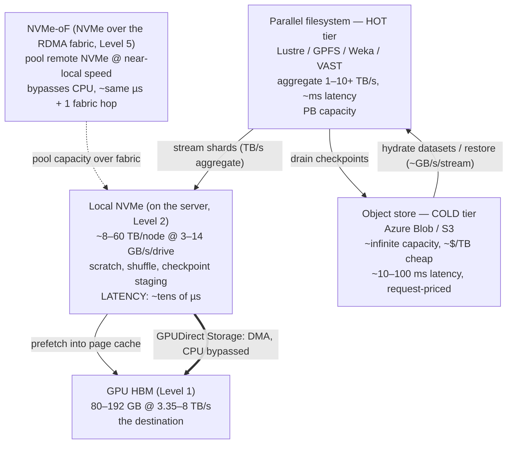
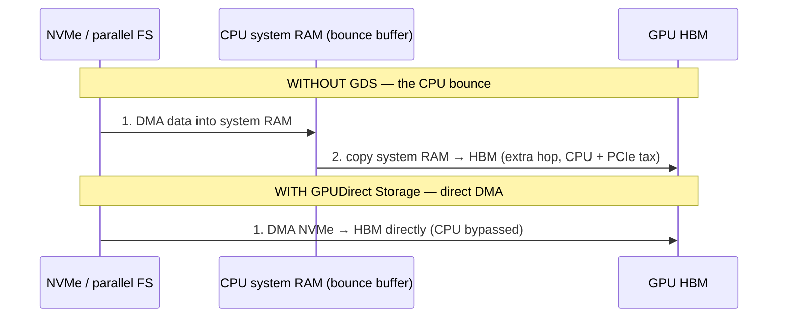
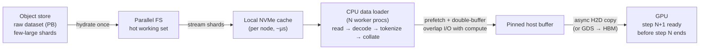
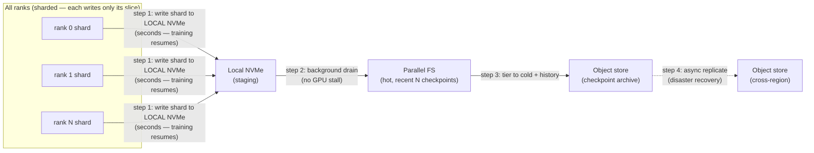

# Level 6 — Storage & the Data Pipeline

> **Where we are in the journey.** We've built the machine. Level 1 was one GPU (a throughput beast
> bound by HBM bandwidth). Level 2 wrapped it in a server (CPU, PCIe, NIC, CUDA stack). Levels 3–4
> wired GPUs into racks over NVLink/NVSwitch. Level 5 stitched racks into a non-blocking fabric with
> RDMA and GPUDirect, so thousands of GPUs can talk as if they were one. The compute and the network
> are *done*. And yet — **a GPU waiting for data is just a 700 W space heater.** Recall the lie from
> Level 1: `nvidia-smi` will happily say "100% util" while the chip sits idle on a stalled read. This
> level is about the part everyone underestimates: **feeding the beast.**
>
> **By the end of this level you can answer:** Why does storage for AI have *three completely different*
> jobs that fight each other? Why does saving a checkpoint freeze 10,000 GPUs, and how do you stop it?
> Why is the CPU data loader the most common hidden cause of low MFU? And why is petabyte-scale storage
> a multi-million-dollar line item that quietly caps how often you can survive a failure?

---

## 1. The one idea: storage is the pantry for a 10,000-cook kitchen

Start with intuition, then we'll earn the numbers.

Levels 1–5 built a kitchen with **10,000 line cooks** (GPUs) wired together so tightly they chop in
perfect lockstep. But a kitchen with no ingredients cooks nothing. The **storage system is the supply
chain**: the loading dock, the walk-in fridge, the prep counter, and the off-site warehouse. If a
single truck is late, it doesn't slow down *one* cook — because the cooks work in lockstep (Level 7),
**every cook stands idle until the ingredient arrives.** Ten thousand idle cooks. That is what a
starved GPU cluster looks like.

And here's the twist that makes AI storage hard: **the kitchen needs three completely different kinds
of supply chain at once**, and a design tuned for one is wrong for the others.

```
   PROFILE 1: dataset READ            PROFILE 2: checkpoint WRITE      PROFILE 3: model LOAD
   "the conveyor belt"                "the synchronized snapshot"      "the cold start"
   ──────────────────────             ─────────────────────────       ────────────────────
   sustained streaming of             every N minutes, ALL ranks       pull 100s of GB of
   tens of PB of tokens,              dump 30–40 TB at once,           weights FAST when an
   never stops, must keep             then resume — a bursty wall      inference replica
   thousands of GPUs fed              of synchronized writes           spins up
```

> **Keep this lens for the whole level:** *one size does not fit all.* Training reads are a steady
> high-throughput river; checkpoints are a synchronized tidal wave; inference loads are latency-
> sensitive sprints. The storage architecture is a *hierarchy* (just like Level 1's memory hierarchy)
> precisely so each profile lands on the tier that fits it.

---

## 2. The three I/O profiles, in numbers

Before the tiers, internalize *what* we're moving and *how*, because every design choice follows from
these three shapes.

| Profile | Pattern | Size / rate | What it must not do |
|---|---|---|---|
| **1. Dataset read (training)** | sustained sequential streaming | tens of PB of tokens, read once-ish per epoch; must sustain **GB/s per node, TB/s aggregate** | never let a single GPU run dry |
| **2. Checkpoint write** | bursty, synchronized, write-once | a 2T-param checkpoint ≈ **30–40 TB** (forward-ref Level 7's memory math), written by all ranks at the *same instant* | never freeze the cluster while it drains |
| **3. Inference model load** | latency-sensitive read on scale-up | tens-to-hundreds of GB of weights pulled fast when a replica boots | never make cold-start the SLO killer |

A useful mental check: a 2T-parameter model in mixed precision needs **~2 bytes/param for the weights
(~4 TB) plus optimizer state and FP32 master copies**, which is why the *full* training checkpoint
balloons to ~30–40 TB. (We derive this in Level 7; here just hold the magnitude.) Streaming tens of PB
of training tokens past the cluster, every epoch, is a different beast entirely — and loading a 100 GB
inference model on a cold replica is a third. Same storage system, three personalities.

---

## 3. The storage hierarchy — the memory ladder, one ring out

In Level 1 we drew the on-chip memory ladder (registers → shared → L2 → HBM) and the lesson was *keep
data in the fast shelves.* **Storage is the same idea, one ring further out.** Each tier down is
bigger and cheaper but slower; the craft is putting each I/O profile on the right rung.



| Tier | Capacity | Bandwidth | Latency | Rough $ | Job |
|---|---|---|---|---|---|
| **Local NVMe** | ~8–60 TB/node | ~3–14 GB/s per drive (×N drives) | ~tens of µs | ~$0.1–0.3/GB hardware | scratch, shuffle buffer, **checkpoint staging**, hot dataset cache |
| **NVMe-oF** | pooled across nodes | near-local, over RDMA | µs + 1 hop | shares NVMe cost | pool stranded NVMe without CPU overhead |
| **Parallel FS (hot)** | PB | **1–10+ TB/s aggregate** | ~ms | ~$0.2–1+/GB | the working set: live datasets, in-flight checkpoints |
| **Object store (cold)** | EB, effectively infinite | per-stream GB/s, scales by parallelism | ~10–100 ms | **~$0.02/GB/mo** | raw dataset archive, checkpoint history, **model registry / artifact store** |

The pattern from Level 1 repeats exactly: **the fast tiers are tiny and expensive, the cheap tier is
huge and slow, and performance engineering is choreographing data between them so the GPU never waits.**

---

## 4. Parallel filesystems — how you get TB/s out of spinning-and-flash boxes

A single storage box gives you GB/s. A training cluster needs **TB/s aggregate**. You get there the
same way the GPU gets bandwidth from many HBM stacks: **stripe one file across many storage servers**
and read all the stripes in parallel.

```
  One 1 GB shard, striped across 8 storage servers (stripe size 128 MB):

   shard ──┬─► server 1  (128 MB) ─┐
           ├─► server 2  (128 MB) ─┤
           ├─► server 3  (128 MB) ─┼─► client reads all 8 in parallel
           ├─► ...                 │     → 8× the bandwidth of one box
           └─► server 8  (128 MB) ─┘
```

The contenders you must be able to compare in a design review:

| FS | Heritage / model | Strength | Watch-out |
|---|---|---|---|
| **Lustre** | HPC standard, open | massive sequential bandwidth; the supercomputer default | separate metadata servers (MDS) are a classic hotspot; ops-heavy |
| **IBM Spectrum Scale (GPFS)** | enterprise HPC | mature, POSIX, distributed metadata | licensed, complex |
| **WekaFS** | NVMe-native, software | very low latency + high IOPS on flash; strong on small files | cost; flash-tier sizing |
| **VAST Data** | disaggregated flash + QLC | huge capacity at flash-ish latency, single tier | newer; vendor lock-in concerns |
| **BeeGFS** | lightweight, open | easy to stand up, good bandwidth | fewer enterprise guarantees |

### The metadata server is the hidden bottleneck

Striping fixes *bandwidth*. It does **not** fix *metadata*. Every `open()`, `stat()`, `readdir()`,
`create()` hits a **metadata server (MDS/MDT)** — and AI datasets are notorious for being **millions
of tiny files** (one JPEG per sample, one JSON per record). Ten thousand GPUs each opening thousands
of tiny files per second is a metadata storm that pins the MDS at 100% while the data servers sit
*idle*. You're bandwidth-rich and metadata-starved.

> **This is why dataset *format* is a storage-architecture decision, not a data-science detail** (see
> §6). Packing millions of samples into a few thousand large **shards** turns a metadata storm into a
> handful of big sequential reads — exactly what parallel filesystems are built for.

**POSIX vs object semantics** is the other axis: parallel filesystems give you POSIX (`seek`, partial
writes, locks, a directory tree) which legacy data loaders expect; object stores give you flat
key→blob with immutable PUTs. Object semantics scale further and cost less but force you to rethink
random access — which is why the modern training stack leans on shard formats that *stream* rather
than seek.

---

## 5. Object storage and GPUDirect — the cold floor and the express lane

### Object storage (Azure Blob / S3): the bottomless, cheap cold tier
Object storage is where the bulk actually lives: **raw datasets, the full checkpoint history, and the
model registry / artifact store** (every released model version, immutable, addressable by key). It's
~infinite, durable (11+ nines), and cheap (~$0.02/GB/mo) — but it pays for that with **~10–100 ms
latency** and **request-cost economics**: you're billed per GET/PUT/LIST. Listing a prefix with
millions of objects, or issuing millions of tiny GETs, is both *slow* and *expensive*. Object stores
reward few-large-objects, just like parallel FS metadata does. The economics and the physics point the
same way: **big shards win.**

### GPUDirect Storage (GDS): the storage twin of Level 5's GPUDirect RDMA
Recall Level 5: GPUDirect RDMA lets a NIC DMA straight into GPU HBM, **bypassing the CPU bounce
buffer.** GDS is the exact same idea for storage: **DMA the data NVMe → GPU HBM directly**, skipping
the trip through CPU system memory.



The win is the same shape as GPUDirect RDMA: you remove a memory copy and the CPU's involvement,
cutting latency and freeing CPU cycles that were being wasted shuffling bytes. It matters most where
the CPU is the bottleneck — large sequential reads feeding hungry GPUs, and (with the right stack)
checkpoint restore straight into HBM. (Verify GDS support against your filesystem/driver matrix; not
every FS exposes the DMA path.)

---

## 6. The training data-loading pipeline — where MFU quietly dies

Here is the most important *practical* truth of this level, the storage analog of Level 1's "100% util
is a lie": **the CPU data loader is the single most common hidden cause of low MFU.** The GPUs are
fine. The network is fine. The storage is fine. And yet MFU is 40% — because the humble CPU process
that reads, decodes, and tokenizes the next batch **can't keep up**, so the GPU finishes step *N* and
*waits* for step *N+1*'s data. Every wait is a stall. The profiler shows gaps; `nvidia-smi` shows
"100%." The cooks are standing at the counter with no onions.



The techniques that keep the river flowing — each one a place a real run goes wrong:

- **Shard + global shuffle.** Pack samples into large shards (so storage sees big sequential reads),
  then shuffle at *two* levels: shuffle the order of shards, and shuffle a buffer of samples within.
  Pure per-sample random reads (seek-per-sample) is the metadata/latency killer from §4; shard-level
  streaming + a shuffle buffer gives you randomness *without* random I/O.
- **Prefetch + double-buffering.** While the GPU computes step *N*, the loader builds step *N+1* on
  CPU workers and stages it in a **pinned host buffer** for an async copy to HBM. This *overlaps I/O
  with compute* — the whole point. If the loader is slower than a step, prefetch depth can't save you;
  you're loader-bound.
- **Tokenization placement.** Tokenizing on the fly burns CPU on the hot path. Pre-tokenize offline so
  the loader streams ready-to-go token tensors, not raw text/images.
- **Formats** — a first-class storage decision:
  - **WebDataset / tar shards** — samples concatenated into ~100 MB–1 GB tarballs, streamed
    sequentially. Storage-friendly, the de-facto large-scale default.
  - **Parquet** — columnar, great for tabular/structured and selective column reads.
  - **Mosaic MDS (StreamingDataset)** — purpose-built for streaming from object storage with
    deterministic shuffling, resumption, and **local NVMe caching** baked in.
- **Local NVMe caching.** First epoch hydrates from the parallel FS/object store onto each node's
  local NVMe; subsequent epochs read from local NVMe at µs latency — turning a network/PFS read into a
  local one and taking enormous pressure off the shared tiers.

> **Sizing intuition:** to keep a node of 8 GPUs fed, the loader must sustain (bytes per sample ×
> samples per step ÷ step time). If a step is 200 ms and a batch is several GB, you need **tens of
> GB/s sustained off the local cache and enough CPU workers to decode it in time.** Under-provisioning
> either is how a $30M cluster runs at 40% MFU. Tune `num_workers`, prefetch depth, and decode cost
> *as carefully as you tune the kernels.*

---

## 7. Checkpoint I/O — why saving freezes the cluster, and how to unfreeze it

A checkpoint is insurance: when (not if) a node dies mid-run (Level 7–8 quantify the failure rate),
you restart from the last save instead of from scratch. But the *naive* way to save is a disaster.

### Do the math on the naive synchronous checkpoint
A 2T-param checkpoint is **~30–40 TB**. Suppose your storage sustains **~1 TB/s aggregate** on writes.
A synchronous checkpoint stops *all* training, has every rank flush its state, and waits for the write
to finish:

```
   40 TB ÷ ~1 TB/s ≈ ~40 seconds of TOTAL cluster idle, EVERY checkpoint.
```

Forty seconds of 10,000 idle GPUs. If you checkpoint every 30 minutes, you're burning **~40 s / 1800 s
≈ ~2.2% of your entire cluster, forever** — pure dead time, before counting any failure. That is
millions of dollars a year evaporating into a save button.

### The production pattern: sharded + asynchronous + tiered
Don't make training wait for the slow tiers. Stage to the fast tier, drain in the background.



The three moves that turn 40 s of idle into seconds:

1. **Sharded.** Each rank writes only *its own* slice of the state in parallel (don't gather 40 TB to
   rank 0 — that serializes everything through one node and one NIC). **PyTorch Distributed Checkpoint
   (DCP)** and **DeepSpeed** do exactly this.
2. **Asynchronous.** Each rank dumps its shard to **local NVMe in a few seconds**, training *resumes
   immediately*, and a **background process drains NVMe → parallel FS → object store** while the GPUs
   are already working again. The GPU-visible stall drops to the local-NVMe write time, not the
   slow-tier write time.
3. **Tiered + replicated.** Keep the last few checkpoints hot on the parallel FS for fast restore;
   tier older ones to object storage for history; async-replicate cross-region for disaster recovery.

The aggressive end of the spectrum: **in-memory / peer checkpointing** (CheckFreq, Gemini-style) keeps
a copy in a *peer GPU's or node's memory* so recovery doesn't even touch persistent storage for the
common single-node failure — trading RAM for recovery speed.

> **Checkpoint cadence is a goodput knob.** Save too rarely → a failure costs you hours of recomputed
> work. Save too often → checkpoint overhead eats your throughput. The optimal cadence balances
> *write-cost-per-checkpoint* against *expected-work-lost-per-failure*, and that balance is set by your
> **checkpoint write bandwidth.** Faster checkpoints → cheaper to save often → less work lost per
> failure → higher **goodput.** This is the thread we pull hard at **Levels 7–8.**

---

## 8. How storage fails (because at scale, it will)

| Failure | What it is | How it shows up |
|---|---|---|
| **Dataset starvation** | loader/storage can't sustain the read rate | GPUs idle between steps, profiler gaps, MFU sags while "util 100%" |
| **Checkpoint write failure / partial write** | a node dies or storage errors mid-save | corrupt/incomplete checkpoint — *worse than none* if you trust it; restore fails or silently loads garbage |
| **Metadata hotspot** | millions of tiny-file ops pin the MDS | data servers idle, MDS at 100%, opens/stats crawl |
| **Object-store throttling / rate limits** | too many requests per prefix/account → 503s | random read latency spikes, checkpoint drains stall, retries storm |
| **Single slow storage node** | one OST/server degraded (failing flash, hot drive) | a straggler on the storage side — drags the *whole synchronized job*, mirroring Level 1's slow-GPU and Level 5's slow-link straggler |

The pattern to internalize is the same one from Levels 1 and 5: **the dangerous failures are the
silent, slow ones.** A storage node that's *up but slow* doesn't throw an error — it just becomes a
straggler, and because training runs in lockstep (Level 7), one slow OST or one throttled object
prefix can drag thousands of GPUs to its pace. **Verify checkpoint integrity on write** (checksums,
atomic rename / manifest-commit) so a partial write can never masquerade as a good one.

---

## 9. Why storage is a multi-million-dollar line item

PB-scale storage is not a rounding error next to the GPUs — it's its own budget war:

- A **hot parallel-FS tier** sized in petabytes of NVMe flash, at ~$0.2–1+/GB plus the storage
  servers and the fabric ports to reach them, is **easily $5–20M+** for a large cluster.
- The **cold object tier** is cheap per-GB (~$0.02/GB/mo) but tens of PB of datasets + a long
  checkpoint history still runs to **six–seven figures per year**, and request/egress costs surprise
  people.
- The deepest coupling: **checkpoint write bandwidth caps checkpoint frequency, which caps
  work-lost-per-failure.** Under-buy storage bandwidth and you're forced to checkpoint less often,
  which means every failure throws away more GPU-hours. The storage bill and the goodput math are the
  same conversation — you can pay for it in flash, or pay for it in recomputed work after every crash.

---

## 10. Interview deep-dives (defend your understanding)

**Q: A training run shows 100% GPU utilization at 45% MFU. You've ruled out kernels and precision
(Level 1). What's next?**
The data path. Profile for gaps between steps: if the GPU stalls waiting for the next batch, you're
**loader-bound**. Check `num_workers`, prefetch depth, decode cost (tokenizing on the hot path?),
whether shards are big-sequential or tiny-random, and whether epoch 2+ is reading from local NVMe
cache or hammering the shared FS. Often the fix is "pre-tokenize + bigger shards + cache to local
NVMe," not more GPUs.

**Q: Why does saving a checkpoint stall thousands of GPUs, and how do you make it not?**
Naive sync checkpoint = all ranks stop, gather/write ~30–40 TB, resume — at ~1 TB/s that's ~40 s of
total idle every save. Fix: **sharded** (each rank writes its slice in parallel), **asynchronous**
(dump to local NVMe in seconds, resume training, drain to FS/object in the background), **tiered**
(hot FS for recent, object for history, cross-region for DR). Tools: PyTorch DCP, DeepSpeed; aggressive
variants do peer/in-memory checkpointing.

**Q: Your dataset is 400 million small JPEGs and the parallel FS bandwidth is barely used during
training. What's wrong?**
**Metadata hotspot.** Millions of tiny-file opens pin the metadata server while data servers idle —
and on object storage you'd also pay per-GET and hit throttling. Repack into large shards
(WebDataset/tar or MDS), shuffle at shard + buffer level, cache to local NVMe. You turn a metadata
storm into big sequential reads, which is what the FS is built for.

**Q: What is GPUDirect Storage and how does it relate to GPUDirect RDMA from Level 5?**
Same idea, different source. GPUDirect RDMA = NIC DMAs straight into GPU HBM, bypassing the CPU bounce
buffer. **GDS = NVMe/storage DMAs straight into GPU HBM**, also bypassing the CPU copy. Both remove a
memory hop and free CPU cycles; GDS helps most on large sequential feeds and checkpoint restore where
the CPU copy was the bottleneck.

**Q: How does checkpoint write bandwidth affect training cost?**
It sets how often you can afford to checkpoint, which sets how much work a failure throws away. Slow
checkpoints → save rarely → big work-loss per crash → low goodput. Fast checkpoints → save often →
small work-loss → high goodput. So storage write bandwidth is a *goodput and $ lever*, not just an
ops detail (Levels 7–8).

**Q: Why not just put everything on object storage and skip the parallel filesystem?**
Latency and semantics. Object storage is ~10–100 ms and flat key→blob with request-cost pricing —
fine for cold archive, datasets, and the model registry, but it can't sustain the low-latency,
high-IOPS, POSIX-ish working set that live training and fast checkpoint restore need. You use both: a
hot parallel-FS/NVMe tier for the working set, object storage as the cheap durable floor.

---

## 11. What you should now be able to draw from memory

- The **three I/O profiles** and why one design can't serve all: streaming dataset read (TB/s
  sustained), bursty synchronized checkpoint write (~30–40 TB), latency-sensitive model load.
- The **storage hierarchy** with numbers — local NVMe (µs) → NVMe-oF → parallel FS (TB/s, ms) →
  object store (cheap, 10–100 ms) — and the **GDS shortcut DMA-ing straight into HBM**, the storage
  twin of Level 5's GPUDirect RDMA.
- The **data-loading pipeline** (shard → global shuffle → prefetch/double-buffer → local NVMe cache →
  GPU) and why the **CPU loader is the silent MFU killer.**
- The **async sharded checkpoint drain** (rank → local NVMe → parallel FS → object store →
  cross-region) and the **40 TB ÷ 1 TB/s ≈ 40 s** math that justifies it.
- Why **checkpoint cadence is a goodput knob** capped by write bandwidth, and why storage is a
  multi-million-dollar line item.

> **Next — Level 7: Distributed Training.** We've now fed the beast. Level 7 is where everything
> converges: how a 2T-parameter model is *split* across thousands of GPUs (data / tensor / pipeline /
> expert parallelism, ZeRO), why the cluster behaves as **one computer whose instruction set is
> collective communication**, where the ~30–40 TB checkpoint number actually comes from, and how
> failures + stragglers + checkpoint cadence combine into the one number that governs everything:
> **goodput.** Storage (this level) and fabric (Level 5) are the two things that decide whether that
> distributed run is fast or just expensive.

---
*Part of `AI-Infra/Foundations/` (Levels 1–6). See `AI-Infra/README.md` for the full 9-level map.*
