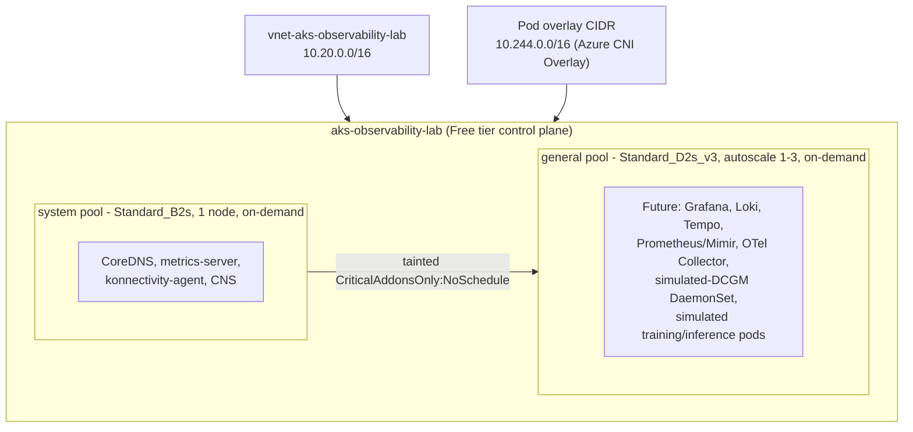

# AKS Lab 01 — Cluster Foundation for Observability (Logs, Metrics, Traces)

> Companion to `DCGM-Lab-01.md`. That lab built GPU observability on a standalone VM. This lab
> builds the **Kubernetes integration path**: a real, cost-guarded AKS cluster that will host apps,
> infra, training/inference (simulated), and GPU (simulated) observability targets, with the
> logs/metrics/traces stack added incrementally in later sessions.

## Table of Contents
1. [Why AKS, Why Now](#1-why-aks-why-now)
2. [Architecture](#2-architecture)
3. [Environment Details](#3-environment-details)
4. [Node Pool Taxonomy](#4-node-pool-taxonomy)
5. [Cost Model & Guardrails](#5-cost-model--guardrails)
6. [Build Log — What Actually Happened](#6-build-log--what-actually-happened)
7. [Lifecycle Commands](#7-lifecycle-commands)
8. [What's Next](#8-whats-next)
9. [Interview Q&A](#9-interview-qa)

---

## 1. Why AKS, Why Now

The roadmap's original plan was `kind` (local, free) first, then AKS later. We skipped straight to
real AKS deliberately: AKS-specific skills — node pool design, Spot vs Regular priority, cluster
autoscaling, remote state for IaC, cost management via stop/start — are directly interview-relevant
for Senior Staff / Principal Observability roles and don't transfer cleanly from `kind`.

Scope is deliberately narrow: **this lab only builds the cluster.** The observability stack (which
OSS tools, in what order) is a separate decision per the repo's "deferred, collaborative tool
selection" working agreement — added one component at a time in later sessions.

## 2. Architecture



The `system` pool carries a `CriticalAddonsOnly=true:NoSchedule` taint, so nothing but AKS system
pods can land there — every workload we add goes on `general` by construction, no toleration
juggling needed since it's currently the only untainted pool.

## 3. Environment Details

- **Cluster:** `aks-observability-lab`
- **Resource group:** `rg-aks-observability-lab`
- **Region:** `eastus`
- **Subscription:** `a04c60cd-2bf3-4e74-9625-a54212845d2b` (Visual Studio Enterprise,
  `Vidya@pranjalshrivastavahotmail.onmicrosoft.com`) — **deliberately separate** from the DCGM VM
  lab's subscription (`0a5a25eb-e88c-4dd3-9b6e-cd71db042088`). Don't mix these up; always
  `az account show` before running `tofu`/`az aks` commands.
- **SKU tier:** Free (no SLA — correct for a lab, $0 control plane cost)
- **Networking:** Azure CNI Overlay (`network_plugin=azure`, `network_plugin_mode=overlay`) — nodes
  on a real VNet subnet (`10.20.1.0/24`), pods on a separate overlay range (`10.244.0.0/16`)
- **Kubernetes version:** unpinned (AKS default GA at creation time), no auto-upgrade channel

### Access
```bash
az account set --subscription a04c60cd-2bf3-4e74-9625-a54212845d2b
az aks get-credentials -g rg-aks-observability-lab -n aks-observability-lab --overwrite-existing
kubectl get nodes -o wide
```

## 4. Node Pool Taxonomy

| Pool | VM size | Priority | Scaling | Taint/label | Purpose |
|---|---|---|---|---|---|
| `system` | `Standard_B2s` | Regular (never Spot) | fixed, 1 node | `CriticalAddonsOnly=true:NoSchedule` | AKS system pods only |
| `general` | `Standard_D2s_v3` | Regular | autoscale 1-3 | `workload-type=general` | Everything else (current) |
| `gpu` (future) | real GPU SKU, once T4 quota lands | Regular | autoscale 0-N | `nvidia.com/gpu=present:NoSchedule` | Real GPU workloads, NVIDIA device plugin/GPU Operator |

Until a real GPU pool exists, GPU observability is simulated the same way DCGM Lab 01 did it — a
fake-DCGM-metrics container — just packaged as a Kubernetes DaemonSet on `general` instead of a bare
VM process. This matches the pattern already documented in `DCGM-Lab-01.md` Section 7 (GPU
Operator / `dcgm-exporter` DaemonSet architecture), so the eventual jump to a real GPU pool is a
node-pool addition, not a redesign.

## 5. Cost Model & Guardrails

| Item | Cost |
|---|---|
| Control plane (Free tier) | $0 |
| `system` pool (`Standard_B2s`, 1 node, on-demand) | ~$30/mo if run 24/7 |
| `general` pool (`Standard_D2s_v3`, 1 node avg, on-demand) | ~$70/mo if run 24/7 |
| State storage account (Cool tier, tiny) | ~$0.02/mo |
| **Realistic cost with stop/start discipline** | **A few dollars per session** |

Guardrails baked into the Terraform/OpenTofu config:
- **AKS Free tier** — no control-plane billing.
- **No Azure Monitor / Container Insights add-on** — this is the single biggest accidental-cost trap
  in AKS labs (per-GB Log Analytics ingestion billing). Confirmed off: `kubectl get pods -A` shows
  no `omsagent` pods.
- **`az aks stop` / `az aks start`** between sessions — deallocates all node VMs (compute billing
  stops; only trivial disk cost remains) while preserving cluster config. This is the AKS equivalent
  of the DCGM lab's `az vm deallocate` discipline. **Tested working 2026-07-10.**
- Full `tofu destroy` reserved for actually ending the lab series, not day-to-day pausing.

## 6. Build Log — What Actually Happened

Worth keeping — the failure mode here is a real, common AKS lesson, not a config mistake.

1. **Wrong default subscription caught early.** `az account show` defaulted to an unrelated
   "Visual Studio Enterprise Subscription" that didn't contain `rg-dcgm-lab`. Fixed before writing
   any Terraform by explicitly setting/hardcoding the intended subscription ID.
2. **First cluster build landed in the wrong account.** Built successfully in `0a5a25eb...`
   (the DCGM lab's subscription) before realizing the user wanted AKS kept in a **separate**
   subscription (`a04c60cd...`) for budget isolation between the two free accounts. Full
   `tofu destroy` of both the cluster stack and the bootstrap state storage, cleanly, via state
   (not manual portal deletion) — this is exactly why remote state matters even for a lab.
3. **Spot capacity unavailable, twice, on two different SKUs.** `general` pool creation failed with
   `SkuNotAvailable` for `Standard_B2s` Spot, then again for `Standard_D2s_v3` Spot, both in
   `eastus`, both times leaving a `Failed`-state agent-pool object in Azure that had to be
   `az aks nodepool delete`d before retrying (OpenTofu can't "recreate over" a resource it doesn't
   have in state). Two different SKUs failing the same way indicates genuine regional Spot capacity
   pressure at that moment, not a SKU choice error — switched `general` to Regular/on-demand
   priority, which succeeded immediately. Revisit Spot later; capacity fluctuates.
4. **Storage account name reuse lag.** After destroying `sttofuaksvsr01`, Azure didn't release the
   name immediately (`check-name` still reported `AlreadyExists`) — used a new name
   (`sttofuaksvsr02`) rather than waiting on propagation.

## 7. Lifecycle Commands

```bash
# Day-to-day pause/resume (cost guardrail):
az aks stop  -g rg-aks-observability-lab -n aks-observability-lab
az aks start -g rg-aks-observability-lab -n aks-observability-lab

# Re-attach kubectl after a start:
az aks get-credentials -g rg-aks-observability-lab -n aks-observability-lab --overwrite-existing

# Full IaC apply/destroy (from Azure/infra/aks-cluster/):
tofu init && tofu plan -out=plan.tfplan && tofu apply plan.tfplan
tofu destroy   # end of the lab series only

# Check power state before assuming nodes are up:
az aks show -g rg-aks-observability-lab -n aks-observability-lab --query "powerState.code" -o tsv
```

Second-laptop setup: `az login` → `az account set --subscription a04c60cd-2bf3-4e74-9625-a54212845d2b`
→ install OpenTofu (`winget install OpenTofu.Tofu`) → `cd Azure/infra/aks-cluster && tofu init`
(pulls existing remote state, no need to re-run `bootstrap/`).

## 8. What's Next

Per the "add stack one by one" agreement, upcoming sessions will each add a single piece to
`general`, with a tool-decision arena (score/debate/log, per `SECTION-ROADMAP-TEMPLATE.md`) before
each:
1. Metrics: Prometheus or Mimir — collection + storage
2. Visualization: Grafana
3. Logs: Loki (or alternative)
4. Traces: Tempo (or alternative) + OTel Collector as the ingestion path
5. Simulated-DCGM DaemonSet (port the fake exporter from `DCGM-Lab-01.md` into K8s)
6. Simulated training/inference workload to generate real signal to observe
7. Real `gpu` node pool, once T4 quota is approved

## 9. Interview Q&A

**Q1: Why Free tier for the AKS control plane, and when would you *not* use it?**
Free tier has no SLA and a lower-throughput API server — fine for dev/lab/low-QPS clusters. Any
cluster with an availability commitment, or enough API traffic (large fleets, aggressive
controllers/operators) needs Standard tier for the 99.95% SLA and higher API server throughput.

**Q2: Why taint the system pool instead of just co-locating everything on one pool?**
Isolates control-plane-critical pods (CoreDNS, metrics-server) from workload pressure — a workload
that exhausts node resources or gets evicted can't take CoreDNS down with it. Also lets you scale
disruptions on `general` (Spot node reclaim, `tofu apply` VM replacement) without any control-plane
blast radius.

**Q3: What does `SkuNotAvailable` actually mean, and how do you respond to it operationally?**
It's a regional/zonal capacity signal from Azure's fleet, not a config error — the requested SKU has
no free capacity in that region (or that combination of region+zone+priority) right now. Response
options, in order of effort: retry (capacity fluctuates), try a different SKU in the same family,
try a different zone, try a different region, or switch Spot→Regular (Regular has its own capacity
pool, usually deeper). Seeing it on two different SKUs back-to-back is a strong signal to stop
retrying SKUs and switch priority instead.

**Q4: Why remote state for a single-person lab cluster?**
Two reasons even at lab scale: (1) it's what let us `tofu destroy` cleanly across a subscription
move instead of manually hunting down resources in the portal — state is the source of truth for
what OpenTofu owns; (2) this repo is explicitly synced across two laptops, and local state files
would drift or conflict between them.

**Q5: Why does Azure CNI Overlay still need a VNet/subnet if pods aren't on the VNet address space?**
Node NICs are still real Azure NICs attached to a VNet subnet — only *pod* IPs come from the overlay
CIDR. This is what makes Overlay cheaper on IP space than legacy Azure CNI (which needed a VNet IP
per pod) while still giving nodes normal VNet connectivity (NSGs, peering, on-prem routes via
ExpressRoute/VPN if ever needed).
