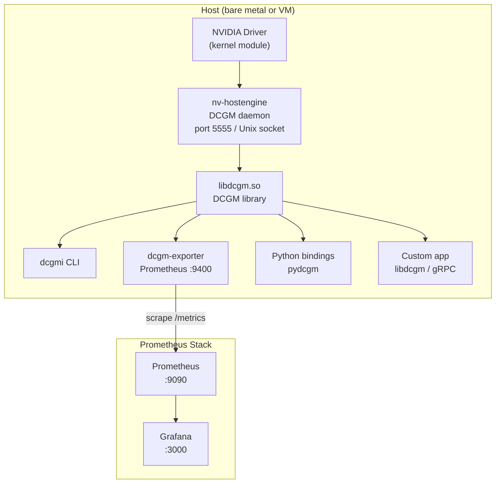
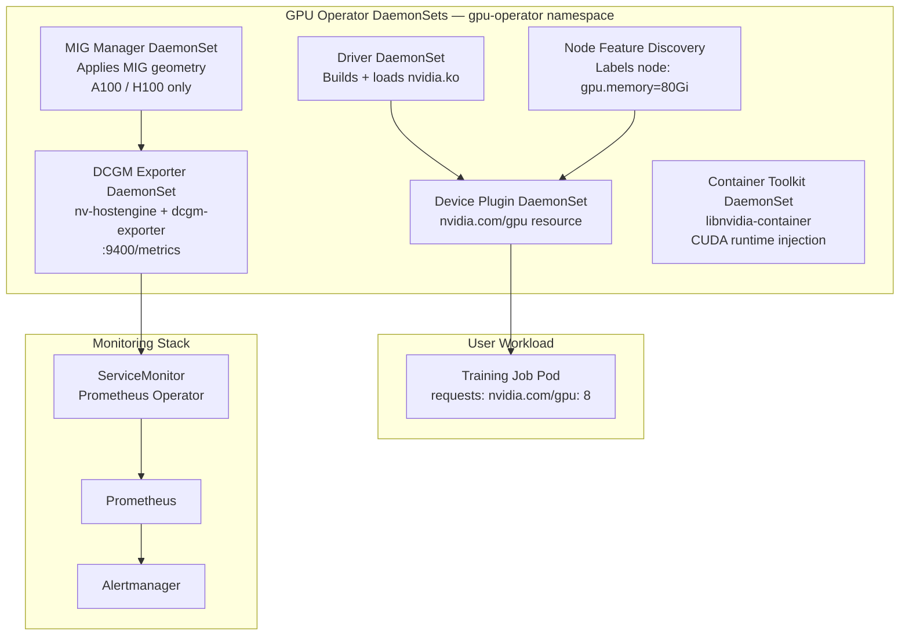

# DCGM Lab 01 — GPU Observability from Zero to Production

> **Lab environment:** Azure VM `vm-dcgm-lab` (Standard_B2s, eastus, `20.25.43.14`)
> **Session date:** 2026-07-06
> **Status:** DCGM 3.3.9 + Prometheus + Grafana stack running with 2× H100 SXM5 simulator

---

## Table of Contents

1. [What Is DCGM and Why It Exists](#1-what-is-dcgm-and-why-it-exists)
2. [Lab Environment Recap](#2-lab-environment-recap)
3. [DCGM CLI Hands-On](#3-dcgm-cli-hands-on)
4. [Prometheus + Grafana Setup](#4-prometheus--grafana-setup)
5. [Production Troubleshooting Lab — 8 Scenarios](#5-production-troubleshooting-lab--8-scenarios)
6. [Failure Simulation Scripts](#6-failure-simulation-scripts)
7. [DCGM in Kubernetes — GPU Operator Architecture](#7-dcgm-in-kubernetes--gpu-operator-architecture)
8. [Interview Q-Bank — 20 Questions](#8-interview-q-bank--20-questions)
9. [Cost Model](#9-cost-model)

---

## 1. What Is DCGM and Why It Exists

### The Problem: nvidia-smi Doesn't Scale

Every GPU engineer's first tool is `nvidia-smi`. It works fine when you SSH into one box and
glance at what's happening. But `nvidia-smi` is a **point-in-time, single-node CLI** — it
queries the driver, prints state, exits. At hyperscale this breaks down in every possible way:

- **Polling at scale is expensive.** Calling `nvidia-smi` spawns a process, acquires a driver
  lock, reads state, releases. On a DGX H100 with 8 GPUs you're fine. On a 10,000-GPU cluster,
  if every node runs `nvidia-smi` every 5 seconds, you generate millions of driver-lock
  acquisitions per minute. It serializes, degrades, and causes the very latency jitter you're
  trying to observe.
- **No health-check semantics.** `nvidia-smi` tells you temperature and utilization. It does
  NOT tell you "this GPU is likely to fail in the next 24 hours." DCGM's **Active Health Checks**
  run actual memory and compute tests that catch degraded hardware before it silently corrupts
  gradients.
- **No job attribution.** In a multi-tenant cluster, you need to know which job consumed how
  much GPU memory, how many SM cycles, how much HBM bandwidth. `nvidia-smi` has no concept of
  a "job." DCGM's **Job Stats** subsystem tracks per-PID/SLURM-job GPU resource consumption.
- **No Prometheus-native output.** Monitoring stacks are pull-based. `nvidia-smi` produces
  human-readable text, not `/metrics` endpoints. DCGM ships `dcgm-exporter`, a first-class
  Prometheus exporter maintained by NVIDIA.
- **No profiling counters.** `nvidia-smi` doesn't expose tensor core utilization, DRAM
  bandwidth utilization, or NVLink byte counters. These are **DCP (DCGM Compute Profiling)**
  counters and require DCGM's exclusive access to the profiling infrastructure.

### DCGM Architecture

**DCGM (Data Center GPU Manager)** is NVIDIA's production observability and management
framework for data center GPUs. The architecture is a classic agent-daemon pattern:



**`nv-hostengine`** is the heart of the system. It:

1. Loads `libdcgm.so` and holds a persistent connection to the NVIDIA driver
2. Polls configured metrics at configured intervals (default 1s for most counters, 100ms for
   profiling counters when licensed)
3. Caches metric values in an in-process ring buffer
4. Serves clients over **port 5555** (TCP) or a Unix domain socket
5. Runs as a systemd service — it survives across jobs, maintains historical state, and
   runs diagnostic passes in the background

**`dcgm-exporter`** is a thin translation layer: it connects to `nv-hostengine` as a DCGM
client, reads the cached metric values, and serves them as Prometheus exposition format on
`:9400/metrics`. The heavy lifting (driver polling, health checks) stays in `nv-hostengine`.

### Three Deployment Modes

| Mode | Description | When to use |
|------|-------------|-------------|
| **Standalone** | `nv-hostengine` runs as a separate daemon. Clients connect over TCP/Unix socket. | Production: Kubernetes (GPU Operator), bare metal clusters. Daemon persists across jobs. |
| **Embedded** | Your application calls `dcgmInit()` and starts the engine in-process. No separate daemon. | Low-overhead tooling where you control the process lifecycle. Less common in production. |
| **Remote** | Client connects to a `nv-hostengine` on a different host over TCP. | Centralized management server polling multiple GPU nodes. Useful for DCGM-based health sweeps. |

In Kubernetes, the GPU Operator deploys `nv-hostengine` in the `dcgm-exporter` pod itself
(standalone mode per-node). Each DaemonSet pod manages its node's GPUs independently.

### Key Subsystems

**Health Monitor** — Passive watches. DCGM registers watches on metrics like ECC errors,
XID events, NVLink errors, PCIe replay counters. When a threshold is crossed, it flags the
GPU's health state. `dcgmi health -c` checks the current health state without running a test.

**Active Health Checks (Diagnostics)** — `dcgmi diag` runs actual workloads: memory pattern
tests, compute tests, NVLink bandwidth verification. These are the pre-flight checks you run
before handing a node to a high-priority training job.

| Level | Command | Duration | What it runs |
|-------|---------|----------|-------------|
| 1 (Quick) | `dcgmi diag -r 1` | ~1 min | Software/config checks, basic memory |
| 2 (Medium) | `dcgmi diag -r 2` | ~5 min | Memory stress, PCIe bandwidth |
| 3 (Full) | `dcgmi diag -r 3` | ~20 min | Full memory test, compute/FP64 validation, NVLink BW |

**Policy Manager** — Lets you define automated responses to GPU events. Example: when any GPU
hits 85°C, call a webhook that drains the node from Kubernetes. Removes the need to poll;
DCGM pushes events to your automation.

**Job Stats** — DCGM can be told "SLURM job 12345 started, mapped to GPUs 0,1,2,3." It then
tracks cumulative SM utilization, HBM bandwidth, power, ECC errors, and PCIe traffic for that
job. At job end, `dcgmi stats` produces a per-job report. This is how hyperscalers do
chargeback: not by guessing from utilization spikes, but by explicit job attribution.

**Config Manager** — Centrally applies GPU configuration across a fleet: clock locking,
ECC mode, power limits, MIG geometry. Ensures consistency: every node in a SLURM partition
runs at the same clock frequency, ECC on, same power cap.

**DCP (DCGM Compute Profiling)** — This is the gem. DCGM can access hardware performance
counters that `nvidia-smi` never exposes: tensor core pipe utilization, DRAM bandwidth
utilization, NVLink TX/RX bytes, SM active fraction. These require exclusive lock on the
profiling hardware — only one client at a time (DCGM or Nsight, not both simultaneously).

### Metric Taxonomy

DCGM field IDs are prefixed to indicate category:

| Prefix | Category | Examples |
|--------|----------|---------|
| `DCGM_FI_DEV_*` | Device/hardware counters | `GPU_UTIL`, `FB_USED`, `GPU_TEMP`, `ECC_DBE_VOL_TOTAL`, `XID_ERRORS` |
| `DCGM_FI_DRIVER_*` | Driver-level info | Driver version, CUDA version |
| `DCGM_FI_PROF_*` | DCP profiling counters | `PIPE_TENSOR_ACTIVE`, `SM_ACTIVE`, `SM_OCCUPANCY`, `DRAM_ACTIVE`, `NVLINK_TX_BYTES` |
| `DCGM_FI_DEV_NVLINK_*` | NVLink per-link counters | `NVLINK_BANDWIDTH_TOTAL`, `NVLINK_CRC_FLIT_ERROR_COUNT_*` |

**Why does this taxonomy matter in interviews?** Because `DCGM_FI_DEV_GPU_UTIL` and
`DCGM_FI_PROF_SM_ACTIVE` measure similar things but differently. `GPU_UTIL` is the driver's
"was any kernel running in the last polling interval" — a 1ms kernel every 100ms gives 1%
`GPU_UTIL` but could be reported as 100% in some driver versions. `PROF_SM_ACTIVE` is the
hardware fraction of cycles where at least one warp was active on an SM. For LLM inference
at low batch sizes, `GPU_UTIL` = 98%, `PROF_SM_ACTIVE` = 30% — the GPU is being called
constantly but each call is short and the SMs are mostly idle. That's the fragmentation
problem behind batching strategies in vLLM/TGI.

---

## 2. Lab Environment Recap

### Services

| Service | URL | Purpose |
|---------|-----|---------|
| DCGM Exporter (simulated) | `http://20.25.43.14:9400/metrics` | Prometheus metrics endpoint — 2× H100 SXM5 simulated |
| Prometheus | `http://20.25.43.14:9090` | Metrics store, PromQL query engine |
| Grafana | `http://20.25.43.14:3000` | Dashboards — admin/admin |
| DCGM hostengine | `20.25.43.14:5555` | DCGM daemon (native install) |
| SSH | `ssh -i ~/.ssh/dcgm_lab_key azureuser@20.25.43.14` | Shell access |

### Lab Directory Structure

```
~/dcgm-lab/
├── docker-compose.yml          # 3-service stack
├── fake_dcgm_metrics.py        # H100 simulator (edit this for failure injection)
├── prometheus.yml              # Scrape config
└── grafana/
    └── provisioning/
        ├── datasources/        # Auto-wires Prometheus
        └── dashboards/         # Dashboard JSON
```

### Key Commands

```bash
# SSH into the lab VM
ssh -i ~/.ssh/dcgm_lab_key azureuser@20.25.43.14

# Check stack status
cd ~/dcgm-lab && docker compose ps

# View live exporter metrics
curl -s http://localhost:9400/metrics | grep DCGM_FI_DEV_GPU_UTIL

# Restart exporter after editing fake_dcgm_metrics.py
docker compose restart dcgm-exporter

# View DCGM daemon status
systemctl status nv-hostengine

# Check DCGM port
ss -tlnp | grep 5555
```

### VM Lifecycle Management

```bash
# Start VM (after deallocation)
az vm start --resource-group rg-dcgm-lab --name vm-dcgm-lab

# Deallocate (stop billing for compute — CRITICAL: do this when done)
az vm deallocate --resource-group rg-dcgm-lab --name vm-dcgm-lab

# Delete everything (end of lab series)
az group delete --name rg-dcgm-lab --yes --no-wait

# Check VM state
az vm show --resource-group rg-dcgm-lab --name vm-dcgm-lab \
  --query "powerState" -d -o tsv
```

> **Cost warning:** Standard_B2s runs at ~$0.0416/hr (≈₹3.5/hr). Always deallocate after
> a session. The IP address `20.25.43.14` is static (Standard SKU public IP) and persists
> across deallocations, so SSH access resumes instantly after `az vm start`.

### Why No Real GPU?

Azure's VS Enterprise subscription has 0 vCPU quota for GPU-class VMs in most regions. The
`NCASv3_T4` (T4 GPU) family requires a quota increase request. The `NC6`/`NV6` series
(K80/M60) are retired. The `Standard_B2s` was chosen as the cheapest VM that can run the
entire software stack for learning DCGM concepts, with a Python simulator serving the exact
Prometheus schema that `dcgm-exporter` produces on real hardware.

**DCGM 3.x breaking changes that affected this setup:**
- `nv-hostengine -s` (stub/simulation mode) was removed in DCGM 3.x. The daemon requires
  real GPU hardware.
- `dcgm-exporter --fake-gpus` was removed in dcgm-exporter 3.x. The Python simulator
  (`fake_dcgm_metrics.py`) replaces it.

---

## 3. DCGM CLI Hands-On

> These commands work against the real `nv-hostengine` daemon (port 5555). On this lab VM,
> the daemon runs but reports no GPUs (no physical GPU). The commands are correct for
> real GPU hardware — run them when you have access to an NCv3/NCA100 node or a DGX.

### GPU Discovery

```bash
# List all GPUs visible to DCGM
dcgmi discovery -l
```

**Expected output shape (real H100 node):**
```
+------ Device Information ------+
| GPU ID | Device Name            | Device UUID                          |
| 0      | NVIDIA H100 SXM5 80GB  | GPU-xxxxxxxx-xxxx-xxxx-xxxx-xxxx |
| 1      | NVIDIA H100 SXM5 80GB  | GPU-yyyyyyyy-yyyy-yyyy-yyyy-yyyy |
| 2      | NVIDIA H100 SXM5 80GB  | GPU-zzzzzzzz-zzzz-zzzz-zzzz-zzzz |
...
| 7      | NVIDIA H100 SXM5 80GB  | GPU-aaaaaaaa-aaaa-aaaa-aaaa-aaaa |
```

**What it means:** DCGM has enumerated GPUs via the NVIDIA driver. GPU IDs are used in all
subsequent commands. Note: in MIG mode, you'll also see MIG instances listed with their
own sub-IDs.

### GPU Groups

Groups let you apply operations to multiple GPUs atomically. In production you'd create
groups per node partition or per job.

```bash
# Create a group with GPUs 0 and 1
dcgmi group -c mygroup --add 0,1
# Returns: Group ID (e.g., 1)

# List all groups
dcgmi group -l

# Add GPU to existing group (group ID 1)
dcgmi group -g 1 --add 2

# Destroy group
dcgmi group -d 1
```

### Health Monitoring

```bash
# Set all health watches on group 1
# -s a = enable all subsystems (memory, io, inforom, thermal, power, nvlink)
dcgmi health -g 1 -s a

# Run health check (returns current health state, no active test)
dcgmi health -g 1 -c
```

**Expected healthy output:**
```
+---------------------------+
| Overall Health : Healthy  |
+---------------------------+
| GPU ID | Health           |
| 0      | Healthy          |
| 1      | Healthy          |
+---------------------------+
```

**Degraded output (XID 79 present):**
```
+----------------------------+
| Overall Health : Warning   |
+----------------------------+
| GPU ID | Health            |
| 0      | Healthy           |
| 1      | Warning (NVLink)  |
+----------------------------+
```

### Diagnostics

```bash
# Level 1: Quick (~1 min) — run before scheduling any job
# Checks: software environment, basic memory, inforom
dcgmi diag -r 1

# Level 2: Medium (~5 min) — run after node maintenance
# Adds: memory stress test, PCIe bandwidth check
dcgmi diag -r 2

# Level 3: Full (~20 min) — run after hardware swap or RMA return
# Adds: full HBM test, FP64 compute validation, NVLink bidirectional BW
dcgmi diag -r 3

# Run diagnostics against a specific group
dcgmi diag -g 1 -r 1

# Output results to JSON (for automation)
dcgmi diag -r 1 -j /tmp/diag_results.json
```

**Level 3 output shape:**
```
+---------------------------+
| Diagnostic Summary        |
+---------------------------+
| Test                 | Result |
| Memory               | Pass   |
| Diagnostic           | Pass   |
| PCI                  | Pass   |
| SM Stress            | Pass   |
| Targeted Stress      | Pass   |
| Targeted Power       | Pass   |
| Memory Bandwidth     | Pass   |
+---------------------------+
```

Any `Fail` → do NOT schedule production jobs on this node. File NVIDIA support ticket.

### Job Statistics

```bash
# Enable job stats collection on group 1
dcgmi stats -g 1 -e

# Start recording a new job (associate with SLURM job ID)
dcgmi stats -g 1 -s

# View stats for a specific PID
dcgmi stats -g 1 -x 1234

# Stop recording
dcgmi stats -g 1 -t

# View summary for all jobs
dcgmi stats -g 1 -v
```

**Job stats output includes:** GPU utilization mean/max, HBM bandwidth mean/max, PCIe
TX/RX, power mean/max, ECC errors during job, XID events during job. This is the
chargeback data.

### Live Metric Stream

`dcgmi dmon` is the `top`-equivalent for GPUs. Field IDs map to specific metrics:

```bash
# Stream util (150), temperature (155), power (203), mem used (204) every 1s
dcgmi dmon -e 150,155,203,204

# Common field IDs:
# 150 = DCGM_FI_DEV_GPU_UTIL
# 155 = DCGM_FI_DEV_GPU_TEMP
# 203 = DCGM_FI_DEV_POWER_USAGE
# 204 = DCGM_FI_DEV_FB_USED
# 252 = DCGM_FI_DEV_ECC_DBE_VOL_TOTAL
# 230 = DCGM_FI_DEV_XID_ERRORS
# 1001 = DCGM_FI_PROF_GR_ENGINE_ACTIVE
# 1002 = DCGM_FI_PROF_SM_ACTIVE
# 1003 = DCGM_FI_PROF_SM_OCCUPANCY
# 1004 = DCGM_FI_PROF_PIPE_TENSOR_ACTIVE
# 1005 = DCGM_FI_PROF_DRAM_ACTIVE

# Stream at 500ms interval
dcgmi dmon -e 150,155,203 -d 500

# Watch profiling counters (requires DCP license in some configurations)
dcgmi dmon -e 1002,1003,1004,1005 -d 100
```

**Expected output shape:**
```
#            Entity   UTIL  TEMP  POWER  FUSED
ID           GPU 0     95    72    670    70000
ID           GPU 1     93    71    665    68000
ID           GPU 2     96    73    680    72000
```

### Policy Management

```bash
# Show current policies on group 1
dcgmi policy -g 1 -s

# Set a policy: notify when power exceeds 700W
dcgmi policy -g 1 --set 0,0 --power 700

# Set policy: call webhook on thermal violation
dcgmi policy -g 1 --set 0,0 --thermal 85

# Register a callback (your automation script)
dcgmi policy -g 1 -r --script /opt/gpu-drain.sh
```

### NVLink Diagnostics

```bash
# Show NVLink error counters for group 1
dcgmi nvlink -g 1 -e

# Show NVLink topology
dcgmi nvlink -g 1 -s
```

**NVLink error output:**
```
+----------------------------------------------------+
| NvLink Error Counters                              |
+----------------------------------------------------+
| GPU ID | Link | CRC FLIT | CRC Data | Replay | Recovery |
| 0      | 0    | 0        | 0        | 0      | 0        |
| 0      | 1    | 0        | 0        | 0      | 0        |
| 1      | 0    | 0        | 0        | 12     | 3        |  ← problem
+----------------------------------------------------+
```

Any non-zero Replay or Recovery on a single link is a precursor to XID 79.

### Profiling Stress Test

```bash
# dcgmproftester12: built-in GPU stress utility, field 1004 = tensor pipe
# -t 1004 = stress tensor core pipeline
# -d 5 = run for 5 seconds
dcgmproftester12 -t 1004 -d 5

# Validate NVLink bandwidth
dcgmproftester12 -t 1030 -d 10

# Full help
dcgmproftester12 --help
```

---

## 4. Prometheus + Grafana Setup

### Verify Metrics Are Flowing

```bash
# From lab VM
curl -s http://localhost:9400/metrics | head -60

# Expected: lines like
# DCGM_FI_DEV_GPU_UTIL{gpu="0",UUID="GPU-sim-0",device="nvidia0",...} 87.3
# DCGM_FI_DEV_GPU_TEMP{gpu="0",...} 72.1
# DCGM_FI_PROF_PIPE_TENSOR_ACTIVE{gpu="0",...} 0.85
```

### Add Prometheus Datasource in Grafana

1. Open `http://20.25.43.14:3000`, login with `admin`/`admin`
2. Left sidebar → **Connections** → **Data sources** → **Add data source**
3. Select **Prometheus**
4. URL: `http://prometheus:9090` (container name resolves in Docker network)
5. **Save & test** — should show "Data source is working"

> Note: `http://localhost:9090` will NOT work from inside Grafana's container. Always use
> the Docker service name `prometheus`.

### Import DCGM Exporter Dashboard

1. Left sidebar → **Dashboards** → **Import**
2. Enter dashboard ID: **12239** → **Load**
3. Select the Prometheus datasource you just added → **Import**

Dashboard 12239 is the official NVIDIA DCGM Exporter dashboard. Key panels:

| Panel | Metric | What to look for |
|-------|--------|-----------------|
| GPU Utilization | `DCGM_FI_DEV_GPU_UTIL` | Should be >80% during training; <20% means idle waste |
| FB Memory Used % | `FB_USED / FB_TOTAL * 100` | Alert at >90%; OOM happens abruptly |
| GPU Temperature | `DCGM_FI_DEV_GPU_TEMP` | Alert at >83°C; throttle starts at ~87°C |
| Power Usage (W) | `DCGM_FI_DEV_POWER_USAGE` | H100 TDP = 700W; sustained >680W = TDP pressure |
| Tensor Core Active | `DCGM_FI_PROF_PIPE_TENSOR_ACTIVE` | The real efficiency metric; target >0.60 for training |
| SM Occupancy | `DCGM_FI_PROF_SM_OCCUPANCY` | Low occupancy = poor kernel launch configuration |
| XID Errors | `DCGM_FI_DEV_XID_ERRORS` | Any non-zero = hardware event, investigate immediately |

### PromQL Examples

```promql
# Per-GPU utilization — time series
DCGM_FI_DEV_GPU_UTIL

# Average utilization across all GPUs
avg(DCGM_FI_DEV_GPU_UTIL) by (gpu)

# Memory utilization percentage
DCGM_FI_DEV_FB_USED / DCGM_FI_DEV_FB_TOTAL * 100

# Memory used in GB (metrics are in MiB)
DCGM_FI_DEV_FB_USED / 1024

# Power in Watts from energy counter (rate of energy = power)
rate(DCGM_FI_DEV_TOTAL_ENERGY_CONSUMPTION[5m]) / 1000

# Total cluster power consumption (kW)
sum(DCGM_FI_DEV_POWER_USAGE) / 1000

# GPUs with tensor core activity above 50% (healthy training signal)
DCGM_FI_PROF_PIPE_TENSOR_ACTIVE > 0.5

# Alert: any XID error fired in last 5 minutes
increase(DCGM_FI_DEV_XID_ERRORS[5m]) > 0

# Alert: double-bit ECC error (page retirement risk)
DCGM_FI_DEV_ECC_DBE_VOL_TOTAL > 0

# Straggler detection: GPU utilization more than 20% below cluster average
DCGM_FI_DEV_GPU_UTIL < (avg(DCGM_FI_DEV_GPU_UTIL) - 20)

# Clock throttle active (any reason)
DCGM_FI_DEV_CLOCK_THROTTLE_REASONS > 0

# Thermal throttle specifically (bit 1 = 0x0001 = SW thermal slowdown)
(DCGM_FI_DEV_CLOCK_THROTTLE_REASONS & 2) > 0

# Power cap throttle (bit 5 = 0x0020)
(DCGM_FI_DEV_CLOCK_THROTTLE_REASONS & 32) > 0

# SM clock drop — correlates with throttling
DCGM_FI_DEV_SM_CLOCK < 1600

# NVLink bandwidth utilization (H100 max: 900 GB/s bidirectional = 450 GB/s per direction)
DCGM_FI_PROF_NVLINK_TX_BYTES / (450 * 1024^3)

# Inference efficiency: DRAM active fraction
DCGM_FI_PROF_DRAM_ACTIVE

# GPU efficiency SLO: fraction of GPUs above 80% utilization
count(DCGM_FI_DEV_GPU_UTIL > 80) / count(DCGM_FI_DEV_GPU_UTIL)
```

### Alertmanager Rules (Production)

```yaml
# /etc/prometheus/rules/dcgm-alerts.yml
groups:
  - name: dcgm-gpu
    interval: 30s
    rules:
      - alert: GPUThermalThrottle
        expr: (DCGM_FI_DEV_CLOCK_THROTTLE_REASONS & 2) > 0
        for: 2m
        labels:
          severity: warning
          team: infra-gpu
        annotations:
          summary: "GPU {{ $labels.gpu }} on {{ $labels.Hostname }} thermal throttling"
          description: "SM clock throttled due to temperature. Check cooling."

      - alert: GPUXIDError
        expr: increase(DCGM_FI_DEV_XID_ERRORS[5m]) > 0
        for: 0m
        labels:
          severity: critical
          team: infra-gpu
        annotations:
          summary: "XID error on GPU {{ $labels.gpu }}"
          description: "XID {{ $value }} — hardware fault. Drain node immediately."

      - alert: GPUECCDoublebitError
        expr: DCGM_FI_DEV_ECC_DBE_VOL_TOTAL > 0
        for: 0m
        labels:
          severity: critical
        annotations:
          summary: "ECC double-bit error on GPU {{ $labels.gpu }}"
          description: "DBE count: {{ $value }}. Page retirement risk. Schedule maintenance."

      - alert: GPUMemoryHigh
        expr: (DCGM_FI_DEV_FB_USED / DCGM_FI_DEV_FB_TOTAL * 100) > 90
        for: 5m
        labels:
          severity: warning
        annotations:
          summary: "GPU {{ $labels.gpu }} memory >90%"

      - alert: GPUHighTemperature
        expr: DCGM_FI_DEV_GPU_TEMP > 85
        for: 3m
        labels:
          severity: warning
        annotations:
          summary: "GPU {{ $labels.gpu }} temperature {{ $value }}°C"

      - alert: GPULowTensorCoreActivity
        expr: avg(DCGM_FI_PROF_PIPE_TENSOR_ACTIVE) by (Hostname) < 0.3
        for: 10m
        labels:
          severity: info
        annotations:
          summary: "Low tensor core utilization on {{ $labels.Hostname }}"
          description: "Training may not be GPU-bound. Check dataloader, I/O, communication."
```

---

## 5. Production Troubleshooting Lab — 8 Scenarios

### Scenario 1: GPU Thermal Throttling During Training

**Symptom:** Training throughput drops 15% mid-run with no error messages. Loss curves are
normal. The team initially suspects a dataloader bottleneck.

**DCGM Signal:**
```promql
# Temperature spiking
DCGM_FI_DEV_GPU_TEMP  # → 91°C (baseline 72°C)

# Throttle reason: bit 1 (value 2) = SW thermal slowdown
DCGM_FI_DEV_CLOCK_THROTTLE_REASONS  # → 2

# SM clock drop
DCGM_FI_DEV_SM_CLOCK  # → 1410 MHz (baseline 1755 MHz = H100 boost clock)

# GPU util unchanged (still 95%) — the GPU is busy but slower
DCGM_FI_DEV_GPU_UTIL  # → 95%
```

**Root Cause Analysis:**

The clock frequency drop is the direct cause of throughput loss. H100 runs tensor cores
at 1755 MHz boost; at 1410 MHz that's an 80% clock ratio, which maps almost linearly to
throughput for compute-bound kernels (matrix multiply). Hence the 15-20% slowdown.

Possible physical root causes:
- Cooling fan failure on one GPU (thermal load redistributes to neighbors in NVSwitch-based DGX topology)
- Hot aisle/cold aisle mixing: cold aisle is recirculating warm exhaust
- Ambient temperature rise: datacenter cooling capacity saturated during summer peak
- TDP hit under dense packing: 8× H100 in one chassis = 5.6 kW sustained

**CLI Investigation:**
```bash
# Live temperature watch
dcgmi dmon -e 155,1005,230 -d 1000
# Field 155 = TEMP, 1005 = SM_CLOCK, 230 = XID

# Detailed throttle reasons from nvidia-smi (complementary)
nvidia-smi -q -d CLOCK | grep -A5 "Clocks Throttle Reasons"
```

**How to distinguish thermal vs power throttle:**

The `DCGM_FI_DEV_CLOCK_THROTTLE_REASONS` field is a bitmask. Each bit represents a
throttle reason:

| Bit | Value (hex) | Value (dec) | Reason |
|-----|-------------|-------------|--------|
| 0 | 0x0001 | 1 | GPU idle |
| 1 | 0x0002 | 2 | SW thermal slowdown |
| 2 | 0x0004 | 4 | SW power brake slowdown |
| 3 | 0x0008 | 8 | HW slow down (generic) |
| 4 | 0x0010 | 16 | HW power brake slowdown |
| 5 | 0x0020 | 32 | SW power cap |

Thermal throttle = bitmask `& 2 > 0`. Power cap = bitmask `& 32 > 0`. These can be
set simultaneously.

**Production Remediation:**
1. **Immediate:** DCGM policy fires webhook → Kubernetes taint node `gpu-thermal-issue=:NoSchedule`
   → running jobs migrate (checkpoint-restart must be enabled)
2. **Short-term:** Page datacenter ops for physical inspection (fan replacement, airflow audit)
3. **Long-term:** Set DCGM alert at 83°C (pre-throttle), not 87°C (when it's already too late)
4. **Design implication:** Always deploy thermal headroom buffers. Running GPUs at sustained
   TDP (700W) in ambient >25°C without proper cooling leads to this. Target max 80% TDP
   sustained during LLM training to maintain clock headroom.

**Simulate in lab:**
```bash
# Edit fake_dcgm_metrics.py — set GPU 0 temperature to 93°C with throttle
# See Section 6 for exact diff
docker compose restart dcgm-exporter
# Watch in Grafana: temperature panel + throttle reason panel
```

---

### Scenario 2: XID 79 — NVLink Error Causing Job Failure

**Symptom:** NCCL all-reduce hangs. Training job fails with `SIGKILL` after the NCCL
timeout (default 1800s = 30 min). Error in logs: `NCCL WARN Timeout waiting for op`.
This is a 2048-GPU training run for a 70B parameter model. Job has been running 18 hours.

**DCGM Signal:**
```promql
# XID 79 = NVLink Uncorrected Error
DCGM_FI_DEV_XID_ERRORS{gpu="1"}  # → 79

# NVLink bandwidth drops to zero on GPU 1
DCGM_FI_DEV_NVLINK_BANDWIDTH_TOTAL{gpu="1"}  # → 0 (baseline ~450 GB/s)

# Health check returns NVLINK FAIL
# dcgmi health -g 1 -c → Warning on GPU 1
```

**Root Cause Analysis:**

XID 79 is "GPU-NVLink LTSSM Error" — a NVLink lane has failed at the physical layer.
LTSSM = Link Training and Status State Machine. This is almost always hardware:
- NVLink cable failure (NVLink4 uses copper or optical cables in DGX SuperPOD)
- NVSwitch port failure
- Thermal stress on the connector (expansion/contraction)
- Driver bug (rare; check NVIDIA driver release notes for known XID 79 bugs)

**Why NCCL hangs (not fails fast):**

NCCL uses a ring-allreduce algorithm. In a ring of N GPUs, each GPU sends data to the
next and receives from the previous simultaneously. When GPU 1's NVLink dies, it can't
send data to GPU 2. GPU 2 waits for GPU 1. GPU 0 waits for GPU 7. The entire ring is
blocked. NCCL doesn't detect this as an error — it interprets it as slow communication
and eventually times out. This is why the job "hangs" for 30 minutes before dying.

**Investigation:**
```bash
# Check per-link NVLink error counters
dcgmi nvlink -g 1 -e
# Look for non-zero Replay or CRC errors on specific link #

# Check XID event log
dcgmi diag -r 1  # will fail on GPU 1

# nvidia-smi cross-check
nvidia-smi nvlink --status -i 1
```

**Production Remediation:**
1. **Immediate:** Drain node from scheduler

   ```bash
   # Kubernetes
   kubectl taint nodes <node-name> nvidia.com/gpu-xid=79:NoSchedule
   kubectl cordon <node-name>

   # SLURM
   scontrol update NodeName=gpu-node-042 State=drain \
     Reason="XID79 NVLink failure GPU1 $(date)"
   ```

2. **Job recovery:** If checkpoint-restart enabled (Megatron-LM, PyTorch's FaultTolerance),
   job resumes from last checkpoint minus ~30 min work. Without it: 18 hours of compute lost.

3. **Hardware:** File NVIDIA support case with `nvidia-bug-report.sh` output. NVLink errors
   that don't clear after driver reload require hardware RMA (cable or switch swap).

4. **Automate with DCGM policy:**
   ```bash
   # Policy: on NVLink error, call drain script
   dcgmi policy -g 1 --set 0,0 --nvlink
   dcgmi policy -g 1 -r --script /opt/drain-node.sh
   ```

**Design implication:** This is why hyperscalers run DCGM health checks as pre-flight
before scheduling large jobs. A diag level-1 would have caught the NVLink issue before
the 18-hour run. Never schedule a >1000 GPU job without a pre-flight health sweep.

---

### Scenario 3: Double-Bit ECC Error → Page Retirement

**Symptom:** A model training on GPU 0 produces slightly different loss values than
the reference run. Re-run on a different GPU produces correct results. The difference
is in the 4th decimal place — easily mistaken for randomness.

**DCGM Signal:**
```promql
# Volatile DBE count > 0 (cleared on driver reload)
DCGM_FI_DEV_ECC_DBE_VOL_TOTAL{gpu="0"}  # → 3

# Aggregate DBE count (persists across reboots, stored in inforom)
DCGM_FI_DEV_ECC_DBE_AGG_TOTAL{gpu="0"}  # → 3 (same if fresh)

# Retired pages counter
DCGM_FI_DEV_RETIRED_DBE{gpu="0"}  # → 1 (page retirement already happened)
```

**Root Cause Analysis:**

HBM (High Bandwidth Memory) is organized into rows. A **double-bit ECC error** means
two bits in the same ECC word flipped simultaneously — uncorrectable by ECC. NVIDIA's
response: retire the page containing that memory row. Future allocations avoid that page.

Sources of DBE:
- **Cosmic ray strike** (single event upset): high-altitude or high-latitude data centers
  see 10-50x more SEUs. A single DBE from a cosmic ray with no recurrence = likely safe.
- **HBM row degradation:** Slowly failing memory cells. DBE count grows weekly. → RMA.
- **Voltage/thermal stress:** Aggressive overclocking (rare in data center, but present
  in research clusters with unlocked power limits).

**Critical thresholds:**

| Event | NVIDIA's automatic response |
|-------|----------------------------|
| 64 single-bit ECC on same row | Auto-retire page at next driver load |
| 1 double-bit ECC on any row | Immediate page retirement |
| Retired pages reach max (128 pages default) | GPU flagged "Row Remapper Pending Reboot" |
| Row remapper pending + >128 pages after reboot | GPU requires RMA |

**Volatile vs Aggregate counters — the critical distinction:**

```promql
# Volatile: cleared when driver unloads (nvidia-smi reset, reboot)
DCGM_FI_DEV_ECC_SBE_VOL_TOTAL  # Single-bit volatile
DCGM_FI_DEV_ECC_DBE_VOL_TOTAL  # Double-bit volatile

# Aggregate: written to GPU's inforom (onboard flash), survives reboots
DCGM_FI_DEV_ECC_SBE_AGG_TOTAL  # Single-bit aggregate
DCGM_FI_DEV_ECC_DBE_AGG_TOTAL  # Double-bit aggregate
```

**For RMA decisions, always use aggregate counters.** If DBE_AGG_TOTAL is growing
across reboots (day 1: 1, day 3: 2, day 7: 5), the memory is degrading. If it fired
once and stayed at 1 for 30 days, likely a cosmic ray event.

**Production Remediation:**
```bash
# Check row remapper status
nvidia-smi --query-remapped-rows \
  --format=csv,noheader,nounits | head

# Output: <bank>,<remapping_available>,<remapping_pending>,<uncorrectable>
# 0, 0, 1, 0  ← pending: reboot required to retire this page

# Schedule reboot
# After reboot:
nvidia-smi --query-remapped-rows --format=csv
# If count grows: escalate to NVIDIA for RMA
```

**Alert strategy:**
- **DBE_VOL_TOTAL = 1:** Warning. Investigate. Monitor aggregate.
- **DBE_AGG_TOTAL > 3 in 7 days:** Critical. Schedule RMA.
- **RETIRED_DBE > 0:** Warning. Node is degraded but may continue operating.
- **Row Remapper Pending:** Schedule reboot within 24h maintenance window.

---

### Scenario 4: GPU Memory Fragmentation / OOM During Inference

**Symptom:** vLLM serving a Llama-3 70B model (tensor parallel, TP=2) crashes with
`CUDA out of memory` at 70% of peak request load. `nvidia-smi` shows only 61GB/80GB
used when the crash happens. Memory headroom appears available.

**DCGM Signal:**
```promql
# Memory used: 61GB out of 80GB — 76% used, should have headroom
DCGM_FI_DEV_FB_USED  # → 62464 MiB

# But DRAM active fraction is very high — HBM bus is saturated
DCGM_FI_PROF_DRAM_ACTIVE  # → 0.91

# Memory clock at max
DCGM_FI_DEV_MEM_CLOCK  # → 2619 MHz (max)
```

**Root Cause Analysis:**

The disconnect between "60GB used" and OOM is **memory fragmentation**. The CUDA memory
allocator (PyTorch's caching allocator) holds memory in pools. When KV cache tensors for
variable-length sequences are allocated and freed at different sizes, the allocator's
internal pools become fragmented: there's 19GB "free" in total but no single contiguous
region large enough for the new KV cache block being requested.

Specifically for vLLM:
- Requests with long sequence lengths (16k tokens) allocate large KV cache blocks
- Short requests (100 tokens) allocate small blocks
- As requests complete and memory is returned, the pool has many small gaps
- A new long request needs a 1.2GB contiguous block — not available despite 19GB "free"

**This is different from training OOM:**

| Context | OOM type | Predictable? |
|---------|----------|-------------|
| Training | Deterministic: fixed batch size × model size | Yes — same batch always fits or always fails |
| Inference | Probabilistic: depends on request length distribution | No — spikes in long requests cause intermittent OOM |

**Structural fix: PagedAttention (vLLM)**

vLLM's PagedAttention was invented specifically for this problem: KV cache is managed in
fixed-size "pages" (blocks of 16 tokens typically), similar to OS virtual memory. Instead
of one contiguous allocation per sequence, each sequence has a page table. Fragmentation
is eliminated at the algorithm level.

**Production Remediation:**
1. Use DCGM job stats to attribute memory to specific requests (if using SLURM jobs)
2. Set memory watermark alert at 85% — not 95%
3. Enable vLLM's `--swap-space` for KV cache overflow
4. Set `--max-model-len` limit to cap worst-case per-request memory
5. Implement request queuing: don't accept new requests when memory >80% (backpressure)
6. For short-term: restart the inference worker (memory is reclaimed on process exit)

---

### Scenario 5: Straggler GPU in All-Reduce (Goodput Collapse)

**Symptom:** 8-GPU training run (DGX H100) runs at 60% of expected tokens/second.
`DCGM_FI_DEV_GPU_UTIL` shows 7 GPUs at 93-96%, one GPU at 38-42%. The run has been
slow since job start, not a degradation mid-run.

**DCGM Signal:**
```promql
# Utilization divergence — GPU 1 is the straggler
DCGM_FI_DEV_GPU_UTIL{gpu="0"}  # → 94
DCGM_FI_DEV_GPU_UTIL{gpu="1"}  # → 40  ← straggler
DCGM_FI_DEV_GPU_UTIL{gpu="2"}  # → 95

# GPU 1 SM Active fraction matches (confirming it's not a measurement artifact)
DCGM_FI_PROF_SM_ACTIVE{gpu="1"}  # → 0.38

# NVLink bandwidth on GPU 1 is reduced
DCGM_FI_DEV_NVLINK_BANDWIDTH_TOTAL{gpu="1"}  # → 45 GB/s (others: 420 GB/s)
```

**Why one slow GPU kills the whole job:**

In ring-allreduce (NCCL's default algorithm), each GPU participates in N-1 rounds of
send/receive. The ring structure means every GPU must complete its send before the next
GPU can proceed. The total time = N × (per-step time for the slowest GPU). If GPU 1 is
2.5× slower, total allreduce time approaches 2.5× slower — even though 7 out of 8 GPUs
are fast.

```
Ring: GPU0 → GPU1 → GPU2 → ... → GPU7 → GPU0

Step timing:
GPU0: sends chunk in 100ms
GPU1: sends chunk in 250ms  ← everyone waits
GPU2: sends chunk in 102ms
...

Total allreduce time ≈ 8 × 250ms = 2000ms (not 8 × 100ms = 800ms)
```

**Root Cause Candidates:**

1. **PCIe error causing retransmits:** PCIe AER errors on GPU 1's root port → retransmission
   delays → NVLink peer-to-peer transfers also affected

2. **NUMA imbalance:** In dual-socket servers, GPU 1 might be on NUMA node 1 but the
   training process is pinned to NUMA node 0 CPUs. Memory traffic crosses the QPI/UPI
   interconnect adding latency.

3. **Thermal throttle on GPU 1:** If GPU 1 has a cooling issue, its SM clock is lower,
   making its compute slower than peers.

**Investigation:**
```bash
# Live dmon showing all 8 GPUs
dcgmi dmon -e 150,1002,1003,1004 -d 500
# Watch for the divergence pattern

# Check PCIe error counters (kernel logs)
journalctl -k | grep -i "aer\|pcie\|gpu" | tail -50

# Check NUMA topology
numactl --hardware
# Verify GPU-to-CPU affinity: nvidia-smi topo -m
```

**Remediation:**
1. `dcgmi health -g <id> -c` → if GPU 1 shows unhealthy PCIe: drain node
2. For NUMA: set CPU affinity explicitly (`numactl --cpunodebind=1 python train.py`)
3. For thermal: see Scenario 1

**Design implication:** Heterogeneous GPU performance in a single all-reduce group is
catastrophic for efficiency. Any monitoring system for LLM training must track per-GPU
utilization with straggler detection alerting.

---

### Scenario 6: Power Capping / PDU Oversubscription

**Symptom:** Every GPU across the entire rack simultaneously clock-throttles at 02:47 AM
during a large batch job. Temperature is 65°C (not thermal). Throttle lasts 90 minutes,
then clears automatically.

**DCGM Signal:**
```promql
# Throttle reason: bit 5 = SW power cap (value 32)
DCGM_FI_DEV_CLOCK_THROTTLE_REASONS  # → 32 (all GPUs simultaneously)

# Power usage capped — not reaching TDP
DCGM_FI_DEV_POWER_USAGE  # → 350W (all GPUs, capped at exactly 350W)
# Note: H100 TDP = 700W; this is a hard 50% cap

# SM clock reduced
DCGM_FI_DEV_SM_CLOCK  # → 1305 MHz (baseline 1755 MHz)
```

**Root Cause Analysis:**

This pattern — all GPUs simultaneously, same clock, same power cap, temperature normal —
is the fingerprint of a **facility-level power cap**. Someone (datacenter ops, grid event
management system, or IPMI policy) applied a power limit via BMC.

The math that makes this real:
- H100 SXM5 TDP = 700W
- 8× GPUs per DGX node = 5,600W per node
- 100 nodes = 560,000W = 560 kW for just the GPUs
- Add CPUs, networking, cooling overhead: ~1 MW per 100 DGX nodes

At that scale, grid operators contact data centers during peak demand events and ask for
demand reduction. Facilities comply by issuing power caps via IPMI/Redfish to BMCs, which
enforce them through GPU power limits.

**Production Remediation:**
1. DCGM alert on `THROTTLE_REASONS & 32 > 0` → page capacity planning team (not GPU infra team —
   this is a datacenter operations event)
2. Implement power-aware job scheduling: detect power cap event → inform scheduler → reduce
   batch size → maintain throughput at lower power
3. Design for power budget: architect training jobs to run at 80% TDP max; preserve 20%
   headroom for facility power events
4. Use DCGM's power cap management to pre-configure nodes: `dcgmi config -g 1 --set-power-limit 560`
   (80% of 700W) before the facility does it during a crisis

**Real-world context:** Meta's data centers run explicit power capping on training clusters
tied to electricity market spot prices. AWS and Azure have similar demand response programs.
H100 training at full TDP is roughly $0.50/kWh × 0.7kW × 8 GPUs = $2.80/hr/node in
electricity alone (before hardware amortization).

---

### Scenario 7: NVLink Bandwidth Saturation (Tensor Parallelism Bottleneck)

**Symptom:** A Llama-3 70B model deployed with tensor parallelism TP=8 has acceptable
TTFT (time to first token) at low QPS but TTFT degrades from 800ms to 3.2s as QPS increases
past 40 req/s. SM utilization is only 55% during the degradation.

**DCGM Signal:**
```promql
# NVLink TX bandwidth near ceiling
DCGM_FI_PROF_NVLINK_TX_BYTES  # → rate of ~430 GB/s (H100 max per direction: 450 GB/s)
DCGM_FI_PROF_NVLINK_RX_BYTES  # → rate of ~425 GB/s

# SM utilization low — compute is NOT the bottleneck
DCGM_FI_PROF_SM_ACTIVE  # → 0.55

# SM occupancy normal when compute is running
DCGM_FI_PROF_SM_OCCUPANCY  # → 0.72

# Tensor core utilization low (waits dominate)
DCGM_FI_PROF_PIPE_TENSOR_ACTIVE  # → 0.38
```

**Root Cause Analysis:**

Tensor parallelism splits each attention head across GPUs. For a transformer layer with
`d_model = 8192` and `n_heads = 64`, TP=8 means each GPU holds 8 attention heads. After
computing local attention outputs, all 8 GPUs must all-reduce the results before passing
to the next layer.

The all-reduce traffic volume:
- Each layer: 2 all-reduce ops (attention output + MLP output)
- Activation tensor: `[batch_size × seq_len × d_model]`
- At seq_len=2048, batch_size=4, d_model=8192: `4 × 2048 × 8192 × 2 bytes = 128 MB` per all-reduce
- GPT4 / Llama-70B: 80 transformer layers → 160 all-reduces per forward pass
- At 40 req/s, 160 all-reduces × 40 req/s × 128 MB = 819.2 GB/s → saturates H100's 900 GB/s

**Design implications for parallelism strategy:**

| Parallelism | Communication pattern | Cross-node? | Bandwidth requirement |
|-------------|----------------------|-------------|----------------------|
| Tensor (TP) | All-reduce per layer | No (within NVLink domain) | Very high — uses NVLink |
| Pipeline (PP) | Point-to-point at layer boundaries | Yes (across nodes, InfiniBand) | Low — one chunk per micro-batch |
| Data (DP) | All-reduce once per step | Yes | Proportional to parameter count |

This is why the standard recommendation for large LLMs:
- TP=8 within a DGX node (use NVLink speed)
- PP across nodes (use InfiniBand — 400 Gb/s vs 900 GB/s NVLink — but less frequent)
- DP across node groups

**Remediation:**
1. Reduce TP from 8 to 4 (halves NVLink traffic per step)
2. Increase PP to distribute cross-node (PP=2 → half the model per node, only boundary activations cross)
3. Use Flash Attention to reduce activation tensor size by 10-40×
4. Profile specific bottleneck layers with Nsight Compute to find the worst all-reduce operations
5. Increase batch size (amortizes communication cost over more useful work)

---

### Scenario 8: DCGM Exporter Missing from Kubernetes (Observability Gap)

**Symptom:** Grafana GPU dashboard shows three nodes with grey panels ("No data") during
a critical training run. An incident is declared because SLA requires GPU visibility on all
nodes. Training jobs are running fine on those nodes but there's no metrics visibility.

**DCGM Signal:**
```bash
# Prometheus targets page shows:
# gpu-node-117: DOWN (last scrape: 8 minutes ago)
# gpu-node-118: DOWN
# gpu-node-119: DOWN
```

```bash
# Kubernetes investigation
kubectl get pods -n gpu-operator | grep dcgm-exporter
# dcgm-exporter-gpu-node-117   0/1   CrashLoopBackOff   12   18m

kubectl describe pod dcgm-exporter-gpu-node-117 -n gpu-operator
# Events:
#   Warning  BackOff  Failed to start container: 
#   Error: failed to create containerd task: 
#   failed to create shim: OCI runtime create failed:
#   nvidia-container-cli: initialization error:
#   driver not found
```

**Root Cause Analysis:**

A Kubernetes node kernel upgrade changed the kernel ABI. The NVIDIA kernel module
(`nvidia.ko`) built for the old kernel is no longer loadable. `nvidia-smi` fails on
these nodes. The DCGM exporter pod tries to use the NVIDIA container runtime (which
uses `libnvidia-container`), fails because the driver module can't load, and crash-loops.

This is the most common cause of DCGM exporter outage in production Kubernetes clusters:
**driver version / kernel ABI mismatch after node upgrades**.

**Investigation and Resolution:**
```bash
# Confirm driver is broken on affected nodes
kubectl debug node/gpu-node-117 -it --image=ubuntu
# In the debug shell:
nvidia-smi
# NVIDIA-SMI has failed because it couldn't communicate with the NVIDIA driver

# Check kernel version vs driver
uname -r        # kernel version post-upgrade
modinfo nvidia  # shows which kernel this driver was built for

# Fix: reinstall NVIDIA driver for new kernel
# With GPU Operator:
kubectl label node gpu-node-117 nvidia.com/gpu.deploy.driver=true
# GPU Operator will rebuild and reload the driver DaemonSet for the new kernel

# Or manual:
apt install cuda-drivers-535  # match to kernel
nvidia-smi  # should work after reinstall
# GPU Operator dcgm-exporter pod will self-recover
```

**Prevention Strategy:**
1. **Pin driver version in node image.** Use immutable node images (Bottlerocket, Flatcar).
   Never allow kernel upgrades without testing NVIDIA compatibility.

2. **Use DCGM health check as Kubernetes readiness probe:**
   ```yaml
   readinessProbe:
     exec:
       command: ["dcgmi", "health", "-c"]
     initialDelaySeconds: 30
     periodSeconds: 60
   ```

3. **Alert on missing scrape targets, not just metric values:**
   ```promql
   # Alert when a known GPU node stops exporting metrics
   absent(DCGM_FI_DEV_GPU_UTIL{Hostname="gpu-node-117"})
   ```

4. **Fallback observability:** If DCGM exporter is down, `nvidia-smi dmon` on the node
   still works if the driver is loaded. Implement a node-level fallback collector that
   writes to a local metrics file that a sidecar publishes.

---

## 6. Failure Simulation Scripts

The lab uses `~/dcgm-lab/fake_dcgm_metrics.py` as the H100 simulator. Below are exact
diffs to inject each failure scenario. After each change:

```bash
# Apply changes and restart
docker compose -f ~/dcgm-lab/docker-compose.yml restart dcgm-exporter

# Verify in Prometheus (allow 30s for scrape)
curl -s http://localhost:9090/api/v1/query \
  --data-urlencode 'query=DCGM_FI_DEV_GPU_TEMP' | python3 -m json.tool
```

### Failure 1: Thermal Throttle on GPU 0 (95°C)

```python
# In fake_dcgm_metrics.py, find the GPU metrics section and modify GPU 0:

# BEFORE (baseline):
gpus = [
    {
        "gpu": "0",
        "temp_base": 72,      # baseline temperature
        "temp_amp": 5,
        "sm_clock_base": 1755,
        "throttle_reasons": 0,
        ...
    },

# AFTER (thermal failure injection):
gpus = [
    {
        "gpu": "0",
        "temp_base": 93,       # spike to 93°C
        "temp_amp": 3,
        "sm_clock_base": 1410, # throttled clock (80% of 1755)
        "throttle_reasons": 2, # bit 1 = SW thermal slowdown
        ...
    },
```

**Verify:**
```promql
DCGM_FI_DEV_GPU_TEMP{gpu="0"}           # → ~93
DCGM_FI_DEV_CLOCK_THROTTLE_REASONS{gpu="0"}  # → 2
DCGM_FI_DEV_SM_CLOCK{gpu="0"}           # → ~1410
```

### Failure 2: XID 79 — NVLink Fault on GPU 1

```python
# Modify GPU 1 entry:
# BEFORE:
    {
        "gpu": "1",
        "xid_errors": 0,
        "nvlink_bandwidth_base": 450000,  # MB/s
        ...
    },

# AFTER:
    {
        "gpu": "1",
        "xid_errors": 79,          # XID 79 = NVLink LTSSM error
        "nvlink_bandwidth_base": 0, # NVLink completely down
        ...
    },
```

**Verify:**
```promql
DCGM_FI_DEV_XID_ERRORS{gpu="1"}                  # → 79
DCGM_FI_DEV_NVLINK_BANDWIDTH_TOTAL{gpu="1"}       # → 0
```

### Failure 3: DBE ECC Error on GPU 0

```python
# BEFORE:
    {
        "gpu": "0",
        "ecc_dbe_vol_total": 0,
        "ecc_sbe_vol_total": 2,
        ...
    },

# AFTER:
    {
        "gpu": "0",
        "ecc_dbe_vol_total": 3,   # double-bit errors → page retirement risk
        "ecc_sbe_vol_total": 127, # also high SBE count
        ...
    },
```

**Verify:**
```promql
DCGM_FI_DEV_ECC_DBE_VOL_TOTAL{gpu="0"}  # → 3
DCGM_FI_DEV_ECC_SBE_VOL_TOTAL{gpu="0"}  # → 127
```

### Failure 4: GPU 1 Straggler (40% util, 10% NVLink bandwidth)

```python
# BEFORE:
    {
        "gpu": "1",
        "util_base": 90,
        "util_amp": 8,
        "nvlink_bandwidth_base": 450000,
        ...
    },

# AFTER:
    {
        "gpu": "1",
        "util_base": 40,          # straggler: 40% vs peers at 93%
        "util_amp": 3,
        "nvlink_bandwidth_base": 45000,   # 10% of normal NVLink bandwidth
        "prof_sm_active_base": 0.38,
        ...
    },
```

**Verify:**
```promql
DCGM_FI_DEV_GPU_UTIL{gpu="1"}                    # → ~40
DCGM_FI_DEV_NVLINK_BANDWIDTH_TOTAL{gpu="1"}       # → ~45000
# Compare with GPU 0
DCGM_FI_DEV_GPU_UTIL{gpu="0"}                    # → ~93
```

### Failure 5: Power Cap — Both GPUs at 350W

```python
# BEFORE:
# (both GPUs)
    "power_base": 670,    # W, near H100 TDP 700W
    "power_amp": 20,
    "throttle_reasons": 0,
    "sm_clock_base": 1755,

# AFTER (both GPU 0 and GPU 1):
    "power_base": 350,    # exactly 50% of TDP — hard cap applied
    "power_amp": 5,
    "throttle_reasons": 32,  # bit 5 = SW power cap
    "sm_clock_base": 1305,   # ~74% of boost clock
```

**Verify:**
```promql
DCGM_FI_DEV_POWER_USAGE                       # → ~350 for all GPUs
DCGM_FI_DEV_CLOCK_THROTTLE_REASONS            # → 32 for all GPUs
(DCGM_FI_DEV_CLOCK_THROTTLE_REASONS & 32) > 0 # → 1 for all GPUs
```

---

## 7. DCGM in Kubernetes — GPU Operator Architecture

### GPU Operator Component Map



### DCGM Exporter as DaemonSet

Every GPU node gets one `dcgm-exporter` pod. The pod:
1. Starts `nv-hostengine` internally (standalone mode)
2. Starts the exporter process pointing at the local hostengine socket
3. Serves `/metrics` on `:9400`
4. The DaemonSet is controlled by the GPU Operator — auto-deployed and auto-healed

```yaml
# Simplified DCGM Exporter DaemonSet spec
apiVersion: apps/v1
kind: DaemonSet
metadata:
  name: dcgm-exporter
  namespace: gpu-operator
spec:
  selector:
    matchLabels:
      app: dcgm-exporter
  template:
    spec:
      nodeSelector:
        nvidia.com/gpu.present: "true"  # Only on GPU nodes
      containers:
        - name: dcgm-exporter
          image: nvcr.io/nvidia/k8s/dcgm-exporter:3.3.9-3.6.1-ubuntu22.04
          ports:
            - containerPort: 9400
              name: metrics
          securityContext:
            privileged: true            # Required for GPU access
          volumeMounts:
            - name: dev
              mountPath: /dev
            - name: run-nvidia
              mountPath: /run/nvidia
      volumes:
        - name: dev
          hostPath:
            path: /dev
        - name: run-nvidia
          hostPath:
            path: /run/nvidia
```

### ServiceMonitor for Prometheus Operator

```yaml
apiVersion: monitoring.coreos.com/v1
kind: ServiceMonitor
metadata:
  name: dcgm-exporter
  namespace: gpu-operator
spec:
  selector:
    matchLabels:
      app: dcgm-exporter
  endpoints:
    - port: metrics
      interval: 15s
      path: /metrics
  namespaceSelector:
    matchNames:
      - gpu-operator
```

### MIG (Multi-Instance GPU) and DCGM

MIG allows one A100 or H100 GPU to be partitioned into up to 7 independent GPU instances.
Each instance has its own compute engines, HBM partition, and NVLink connectivity slice.

DCGM exposes per-MIG-instance metrics with the same metric names but different instance IDs:

```
# MIG 1g.10gb profile on H100 80GB = 7 instances, each with 10GB HBM
DCGM_FI_DEV_GPU_UTIL{gpu="0",GPU_I_ID="0",GPU_I_PROFILE="1g.10gb"}  # MIG instance 0
DCGM_FI_DEV_GPU_UTIL{gpu="0",GPU_I_ID="1",GPU_I_PROFILE="1g.10gb"}  # MIG instance 1
DCGM_FI_DEV_FB_USED{gpu="0",GPU_I_ID="0"}   # per-slice HBM usage
```

The MIG manager (part of GPU Operator) watches a ConfigMap for the desired MIG geometry
and reconfigures the GPU. The DCGM exporter automatically detects MIG mode and switches
to per-instance metrics reporting.

### Job-Level Attribution in Kubernetes

When training jobs run in Kubernetes pods, DCGM exporter enriches metrics with pod metadata:

```
# Labels automatically added by dcgm-exporter (via Kubernetes downward API):
DCGM_FI_DEV_GPU_UTIL{
  gpu="0",
  pod="training-job-llama3-70b-worker-0",
  namespace="ml-training",
  container="pytorch-worker",
  node="gpu-node-042"
}
```

This enables:
```promql
# GPU hours consumed by namespace (chargeback)
sum_over_time(DCGM_FI_DEV_GPU_UTIL{namespace="ml-training"}[24h]) / 100 / 3600

# Per-job efficiency
avg(DCGM_FI_PROF_PIPE_TENSOR_ACTIVE) by (pod, namespace)

# Which team is causing ECC errors
DCGM_FI_DEV_ECC_DBE_VOL_TOTAL > 0
# Join with pod label to get team/namespace attribution
```

---

## 8. Interview Q-Bank — 20 Questions

---

### Q1: What is DCGM and how does it differ from nvidia-smi?

**Strong answer:**

DCGM is NVIDIA's production telemetry and management framework — a daemon-based system
where `nv-hostengine` maintains a persistent driver connection and caches metrics at
configurable intervals. `nvidia-smi` is a stateless CLI that opens the driver, reads
current state, and exits. The operational differences are fundamental:

- `nvidia-smi` causes a driver lock per invocation — calling it 100 times/second on a
  10,000-GPU cluster creates millions of lock acquisitions/minute, causing the jitter you're
  trying to measure.
- DCGM caches values — clients read the cache, not the driver. N clients at any polling rate.
- DCGM exposes DCP profiling counters (tensor core utilization, DRAM bandwidth active,
  NVLink bytes) that `nvidia-smi` doesn't expose at all.
- DCGM runs Active Health Checks — actual workloads that stress memory and compute.
  `nvidia-smi` only reads passive state.
- DCGM has job attribution: track GPU resources per SLURM job or K8s pod.
- DCGM has a Policy Manager: trigger automated responses (drain node) when thresholds hit.

**Red flags:**
- "nvidia-smi is basically the same thing" — they are architecturally different at scale
- Not mentioning the DCP profiling counters (the main reason to use DCGM over nvidia-smi)
- Not explaining the polling/locking problem

---

### Q2: Explain DCGM's three deployment modes — when would you use each?

**Strong answer:**

1. **Standalone:** `nv-hostengine` runs as a separate systemd service. DCGM clients (dcgmi,
   dcgm-exporter, your code) connect via TCP:5555 or Unix socket. This is the production
   mode for Kubernetes (GPU Operator deploys one hostengine per node) and bare metal SLURM
   clusters. The daemon persists across jobs — it accumulates health history, runs background
   watches, maintains job stats continuity.

2. **Embedded:** Your application calls `dcgmInit()`, `dcgmStartEmbedded()` and the engine
   starts in your process. No separate daemon. Useful for tools that need GPU telemetry
   without the ops overhead of running a daemon. Downside: the engine dies when your process
   does, losing historical state.

3. **Remote:** A client machine connects to a `nv-hostengine` running on a different host.
   Used for centralized health management: a management server pings all GPU nodes and
   runs diagnostics without needing agents on each node beyond the hostengine itself.
   Also used for DCGM's "federation" pattern at datacenter scale.

**Red flags:**
- Only knowing standalone mode
- Confusing embedded with "running in a container" (embedded is a linking mode, not
  a deployment topology)

---

### Q3: Walk me through what happens when XID 79 fires in a 1,000-GPU training cluster

**Strong answer:**

XID 79 is a NVLink LTSSM error — NVLink link training state machine failure, indicating
a physical-layer NVLink failure on one GPU.

Timeline:
1. **T+0:** NVLink lane on GPU X fails. NVIDIA driver detects it and writes XID 79 to
   the GPU's inforom and to the kernel log (`dmesg`).
2. **T+0 to T+1s:** DCGM hostengine reads `DCGM_FI_DEV_XID_ERRORS` field — now set to 79.
   Health monitor marks GPU X as `WARN (NVLink)`.
3. **T+5s:** DCGM exporter scrapes the value. Prometheus receives `DCGM_FI_DEV_XID_ERRORS = 79`.
4. **T+15s:** Prometheus evaluates alert rule `increase(DCGM_FI_DEV_XID_ERRORS[5m]) > 0`.
   Alert fires → Alertmanager receives it.
5. **T+30s:** PagerDuty receives incident. On-call GPU infra engineer gets paged.
6. **Meanwhile (T+0 to T+30m):** NCCL all-reduce ring is blocked at GPU X. 999 other GPUs
   are waiting. The NCCL timeout (default 1800s) is counting down.
7. **Automated response (if configured):** DCGM policy fires webhook immediately at T+0.
   Webhook calls `kubectl taint node gpu-node-042 xid=79:NoSchedule`. Kubernetes evicts new
   pods but running pods (the training job) are NOT evicted by a taint alone — need drain
   or manual kill.
8. **T+30m (if no human action):** NCCL timeout → all 1000 job workers receive `SIGKILL`.
   If checkpoint-restart is configured, the job resumes from last checkpoint.
9. **Human action:** Engineer SSHes in, runs `dcgmi nvlink -g <id> -e` to see per-link
   counters. If errors don't clear after driver reload, opens NVIDIA support case.
   If persistent, schedules RMA during maintenance window.

**Red flags:**
- Not knowing that the entire all-reduce hangs (not just the affected GPU's job)
- Not mentioning checkpoint-restart as the recovery mechanism
- Thinking the job fails immediately (it hangs for the full timeout period)

---

### Q4: How do you distinguish thermal throttle from power throttle using DCGM?

**Strong answer:**

`DCGM_FI_DEV_CLOCK_THROTTLE_REASONS` is a bitmask where each bit represents a different
throttle cause. The key bits:

- **Bit 1 (value 2):** SW thermal slowdown — temperature exceeded software thermal limit
- **Bit 2 (value 4):** SW power brake slowdown — NVIDIA power brake (not a hard cap)
- **Bit 4 (value 16):** HW power brake slowdown — hardware power limit enforcement
- **Bit 5 (value 32):** SW power cap — explicit power limit set by `nvidia-smi -pl`

PromQL to distinguish:
```promql
# Thermal throttle
(DCGM_FI_DEV_CLOCK_THROTTLE_REASONS & 2) > 0

# Power cap throttle
(DCGM_FI_DEV_CLOCK_THROTTLE_REASONS & 32) > 0
```

Cross-signal validation:
- **Thermal:** `GPU_TEMP` will be >85°C. Memory temperature (`DCGM_FI_DEV_MEMORY_TEMP`)
  may also be elevated.
- **Power cap:** `POWER_USAGE` will be at exactly the cap value (e.g., 350.0W ± 2W).
  Temperature will be normal (65-75°C).
- **Both simultaneously:** Bitmask shows both bits set. Check which cleared first to
  identify the primary cause.

**Red flags:**
- "Just check nvidia-smi" (correct but misses the automation/fleet-scale angle)
- Not knowing the bitmask structure
- Confusing the reason field as a simple enum vs bitmask (multiple reasons can coexist)

---

### Q5: What's the difference between volatile and aggregate ECC counters, and when does each matter?

**Strong answer:**

**Volatile counters** (`DCGM_FI_DEV_ECC_*_VOL_*`) are reset when the NVIDIA driver is
unloaded — either by `nvidia-smi --reset` or system reboot. They count errors since the
last driver load.

**Aggregate counters** (`DCGM_FI_DEV_ECC_*_AGG_*`) are written to the GPU's onboard
inforom (a small persistent flash chip on the GPU PCB). They accumulate across driver
reloads and reboots.

**When each matters:**

Volatile counters are useful for **job-level error attribution**: did this specific training
job experience ECC errors? DCGM's job stats use volatile counters to report errors within
job boundaries.

Aggregate counters are the **RMA signal**: if `DBE_AGG_TOTAL` is 1 for 30 days (cosmic
ray event, no recurrence) → monitor and continue. If it grows from 1 to 5 over a week →
the HBM is degrading → schedule RMA before it reaches the retired page limit and causes
unplanned downtime.

Never make RMA decisions on volatile counters alone: a driver reload resets them to zero,
hiding the history.

**Red flags:**
- Not knowing aggregate counters exist
- Making RMA recommendations based on volatile counters only
- Not knowing what inforom is

---

### Q6: How would you design a DCGM alerting strategy for a 10,000-GPU fleet? What are the alert tiers?

**Strong answer:**

For a 10,000-GPU fleet, alert fatigue is the primary design constraint. Every alert must
map to a specific, actionable response with a clear owner. The tier structure:

**Tier 1 — Immediate, automated response (P0)**
- `XID_ERRORS > 0`: Fire DCGM policy webhook → auto-drain node via K8s taint/SLURM drain
- `ECC_DBE_VOL_TOTAL > 0`: Auto-tag node for maintenance window, page on-call
- `NVLINK_BANDWIDTH_TOTAL == 0` on any GPU: Auto-drain, page hardware ops

**Tier 2 — Page on-call (P1, 15-minute SLA)**
- `GPU_TEMP > 85°C` for 3+ minutes: Page GPU infra + datacenter ops
- `CLOCK_THROTTLE_REASONS` thermal bit set for 5+ minutes: Page
- `ECC_DBE_AGG_TOTAL` growing (rate > 0 over 7d): Schedule RMA within 48h

**Tier 3 — Ticket, next business day (P2)**
- `ECC_SBE_VOL_TOTAL > 100` in 24h: High SBE rate, monitor for DBE progression
- `PROF_PIPE_TENSOR_ACTIVE < 0.3` averaged over 30m: Training not GPU-bound; investigate pipeline

**Tier 4 — Dashboard trend, capacity planning (P3)**
- GPU utilization by team: trending, chargeback
- Power consumption per rack: capacity headroom
- Retired pages count: proactive RMA scheduling

Scaling considerations for 10K GPUs:
- Use Prometheus recording rules to pre-aggregate per-rack metrics
- Use metric relabeling to reduce cardinality (don't store per-GPU labels for aggregate metrics)
- DCGM exporter default scrape interval is 30s — at 10K GPUs that's 300K metric samples per scrape; use Prometheus remote write to Thanos/Cortex for long-term storage

**Red flags:**
- Single flat tier of alerts (will create alert storms at scale)
- Not distinguishing automated response from human-required tiers
- Not mentioning cardinality/scaling challenges at 10K GPUs

---

### Q7: A training job drops from 95% to 60% GPU utilization on all GPUs simultaneously. Walk me through your investigation.

**Strong answer:**

"All GPUs simultaneously" is the key signal — this is NOT a per-GPU hardware issue.
It's a systemic event. The investigation funnel:

**Step 1 — Check throttle reasons:**
```promql
DCGM_FI_DEV_CLOCK_THROTTLE_REASONS
```
If bit 5 (power cap) set on all GPUs: datacenter power event. Page capacity planning.
If bit 1 (thermal) set: unexpected cluster-wide thermal event. Unusual — check CRAC units.

**Step 2 — Check communication layer:**
If no throttle: the GPUs are running fine but the JOB is slow. Is the all-reduce bandwidth
saturated?
```promql
DCGM_FI_PROF_NVLINK_TX_BYTES  # near 450 GB/s max?
```
If NVLink saturated: tensor parallelism bottleneck — see if batch size or TP degree can change.

**Step 3 — Check dataloader/I/O:**
If GPU utilization drops but `PROF_SM_ACTIVE` drops less than `GPU_UTIL` — the GPU is being
called but doing short kernels. Dataloader starvation: CPU preprocessing can't keep up with
GPU compute. Check `iostat` and CPU utilization.

**Step 4 — Check for a straggler:**
```promql
DCGM_FI_DEV_GPU_UTIL < (avg(DCGM_FI_DEV_GPU_UTIL) - 20)
```
If one GPU is low and others are also pulled down (waiting for all-reduce): find the straggler
and diagnose it per Scenario 5.

**Step 5 — Check network for multi-node runs:**
If multi-node: check InfiniBand/RoCE bandwidth and retransmission errors. A network
partition or congestion causes all GPUs to wait on inter-node allreduce.

**Red flags:**
- Immediately assuming hardware failure without checking power/throttle first
- Not distinguishing single-GPU degradation from all-GPU degradation patterns
- Not mentioning the dataloader hypothesis

---

### Q8: How does DCGM integrate with Kubernetes? What is the GPU Operator?

**Strong answer:**

The **GPU Operator** is an NVIDIA-maintained Kubernetes operator that automates the entire
GPU software stack lifecycle. Without it, deploying GPUs in Kubernetes requires manually
installing drivers, configuring the NVIDIA container runtime, deploying the device plugin,
and deploying monitoring — all version-matched, on every node. The GPU Operator does all of
this declaratively.

Components deployed as DaemonSets (one pod per GPU node):
- **Driver DaemonSet:** Builds `nvidia.ko` for the node's kernel and loads it. No manual
  driver installation needed. Upgrades the driver without reimaging nodes.
- **Container Toolkit DaemonSet:** Installs `libnvidia-container` and configures `containerd`
  or Docker to enable GPU passthrough into containers.
- **Device Plugin DaemonSet:** Advertises `nvidia.com/gpu: N` resources to the K8s scheduler.
  Jobs can request GPUs via `resources.limits: nvidia.com/gpu: 8`.
- **DCGM Exporter DaemonSet:** Deploys `nv-hostengine` + `dcgm-exporter` per node, with
  Prometheus scraping via ServiceMonitor.
- **MIG Manager DaemonSet:** On A100/H100, applies MIG geometry from a ConfigMap. Auto-
  reconfigures slices without manual `nvidia-smi mig` commands.
- **Node Feature Discovery:** Labels nodes with GPU capabilities (`gpu.memory=80Gi`,
  `gpu.product=H100-SXM5-80GB`). Enables topology-aware scheduling.

DCGM metrics in K8s get automatically enriched with pod/namespace labels, enabling:
- Per-namespace GPU utilization (chargeback)
- Per-job alerting
- SLO tracking by workload type

**Red flags:**
- "You install dcgm-exporter manually" (correct but misses the GPU Operator automation value)
- Not knowing what the device plugin does
- Not mentioning the driver DaemonSet (the part that manages the actual driver)

---

### Q9: What DCGM metrics tell you about NVLink health?

**Strong answer:**

NVLink health requires multiple signals:

| Metric | Meaning | Threshold |
|--------|---------|-----------|
| `DCGM_FI_DEV_NVLINK_BANDWIDTH_TOTAL` | Aggregate bidirectional bandwidth | Should be near 900 GB/s for H100; drop to 0 = link down |
| `DCGM_FI_PROF_NVLINK_TX_BYTES` | Transmitted bytes rate | Use for saturation detection |
| `DCGM_FI_PROF_NVLINK_RX_BYTES` | Received bytes rate | |
| `DCGM_FI_DEV_NVLINK_CRC_FLIT_ERROR_COUNT_*` | Per-link CRC errors (flow control word) | Any non-zero = precursor to failure |
| `DCGM_FI_DEV_NVLINK_CRC_DATA_ERROR_COUNT_*` | Per-link data CRC errors | Any non-zero = degraded link |
| `DCGM_FI_DEV_NVLINK_REPLAY_ERROR_COUNT_*` | Per-link replay events | Growing count = failing link |
| `DCGM_FI_DEV_NVLINK_RECOVERY_ERROR_COUNT_*` | Recovery events | Each recovery = error corrected |
| `DCGM_FI_DEV_XID_ERRORS` = 79 | NVLink LTSSM failure | Immediate action required |

The progression of NVLink failure:
1. CRC errors begin → link is degraded but functional (replay mechanism compensates)
2. Replay errors increase → bandwidth falls due to retransmission overhead
3. Recovery errors appear → more serious failures
4. XID 79 fires → link state machine failed → bandwidth = 0, job will hang

**CLI investigation:**
```bash
dcgmi nvlink -g 1 -e  # per-link error counters
dcgmi health -g 1 -c  # overall NVLink health status
```

**Red flags:**
- Only knowing `XID_ERRORS = 79` without knowing the leading-indicator metrics
- Not knowing that CRC/replay errors precede total link failure by hours/days

---

### Q10: How do you attribute GPU usage to specific jobs/teams in a multi-tenant cluster?

**Strong answer:**

Three complementary mechanisms:

**1. DCGM Job Stats (SLURM integration):**
SLURM's prolog/epilog scripts call:
```bash
# SLURM prolog (before job starts)
dcgmi stats -g <group> -s -j $SLURM_JOB_ID

# SLURM epilog (after job ends)  
dcgmi stats -g <group> -t -j $SLURM_JOB_ID
dcgmi stats -g <group> -v -j $SLURM_JOB_ID > /var/log/gpu-stats/$SLURM_JOB_ID.json
```
DCGM tracks exact GPU utilization, HBM bandwidth, PCIe traffic, power, and ECC events for
each job. This is the most accurate chargeback mechanism.

**2. Kubernetes Pod Labels (for K8s workloads):**
`dcgm-exporter` reads pod metadata from the Kubernetes downward API and injects labels:
```
DCGM_FI_DEV_GPU_UTIL{pod="training-job-xyz",namespace="team-a",node="gpu-node-01"}
```
PromQL chargeback:
```promql
# GPU-seconds per namespace over 24h
sum_over_time(DCGM_FI_DEV_GPU_UTIL{namespace="team-a"}[24h]) / 100
```

**3. DCGM Groups + External Identity Mapping:**
Create DCGM groups per tenant, then map physical GPUs to groups based on scheduler
allocation. Combine with SLURM accounting or K8s ResourceQuota for chargeback.

**Gotcha:** Volatile counters reset on driver reload. If a node reboots mid-job, you lose
the pre-reboot stats. Always write job stats to persistent storage before the node can
reboot.

**Red flags:**
- "Just check GPU utilization per node" (doesn't attribute to specific jobs/teams)
- Not knowing about DCGM job stats
- Not mentioning the K8s pod label injection mechanism

---

### Q11: What is DCGM's profiling subsystem (DCP) and why is PROF_PIPE_TENSOR_ACTIVE more useful than GPU utilization?

**Strong answer:**

**DCP (DCGM Compute Profiling)** is DCGM's access layer to the hardware performance counter
infrastructure on Ampere/Hopper GPUs. These counters are hardware-native — the SM (streaming
multiprocessor) hardware itself is counting cycles, not the driver estimating them.

DCP requires exclusive lock on the profiling hardware. Only one client (DCGM or Nsight)
can hold it at a time.

**Why `PROF_PIPE_TENSOR_ACTIVE` > `DEV_GPU_UTIL`:**

`DEV_GPU_UTIL` is the driver's answer to "was any kernel running in this polling interval?"
It's a binary per-sample: 0 or 1. The average over time is the fraction of time any kernel
ran. This tells you about kernel *scheduling* but not kernel *efficiency*.

Consider a typical LLM inference scenario:
- `GPU_UTIL = 98%` — a kernel is running almost constantly
- `PROF_SM_ACTIVE = 0.65` — 65% of SM cycles have at least one active warp
- `PROF_PIPE_TENSOR_ACTIVE = 0.25` — tensor cores are active only 25% of cycles
- `PROF_SM_OCCUPANCY = 0.45` — SMs are 45% occupied (memory-latency bound)

The GPU looks 98% utilized to `GPU_UTIL`. But it's spending 75% of its time waiting for
HBM reads to fill the tensor core input buffers. The actual computational efficiency is 25%.

This is the critical insight for LLM inference optimization: the problem isn't scheduling
kernels more (already at 98%), it's making each kernel more efficient (batching more
requests together to improve arithmetic intensity and HBM reuse).

**The full DCP counter set for LLM diagnostics:**
- `PROF_PIPE_TENSOR_ACTIVE`: Are we actually doing matrix multiply? (The "useful work" fraction)
- `PROF_SM_ACTIVE`: Are SMs executing anything?
- `PROF_SM_OCCUPANCY`: How many warps per SM? (Low = register pressure or memory-bound)
- `PROF_DRAM_ACTIVE`: HBM bandwidth fraction — if this is near 1.0 and TENSOR_ACTIVE is low, memory-bandwidth-bound
- `PROF_NVLINK_TX/RX_BYTES`: NVLink bandwidth — if high and TENSOR_ACTIVE is low, communication-bound

**Red flags:**
- Not knowing DCP exists
- Thinking `GPU_UTIL = 95%` means the GPU is fully utilized (it means a kernel is running; efficiency could be 5%)

---

### Q12: How would you implement a "drain unhealthy GPU node" automation using DCGM?

**Strong answer:**

Three layers: DCGM detection → webhook trigger → orchestrator action.

**Layer 1: DCGM Policy (fastest, ~1s latency)**
```bash
# On every GPU node (via Ansible/node init script):
# Create group with all GPUs
dcgmi group -c all-gpus --add 0,1,2,3,4,5,6,7

# Set policies: notify on XID, NVLink error, ECC DBE
dcgmi policy -g 1 --set 0,0 --nvlink --ecc-dbe
dcgmi policy -g 1 -r --script /opt/drain-node.sh
```

**`/opt/drain-node.sh`:**
```bash
#!/bin/bash
# Called by DCGM with event details as arguments
HOSTNAME=$(hostname)
EVENT_TYPE=$1  # "nvlink", "ecc", "xid"

# Kubernetes drain
kubectl taint node "${HOSTNAME}" dcgm-fault="${EVENT_TYPE}:$(date +%s)":NoSchedule
kubectl drain "${HOSTNAME}" --ignore-daemonsets --delete-emptydir-data --grace-period=300

# Alert
curl -X POST "$PAGERDUTY_WEBHOOK" \
  -d '{"event_type": "'"$EVENT_TYPE"'", "node": "'"$HOSTNAME"'"}'

# Log
logger "GPU_DRAIN: Node ${HOSTNAME} drained due to DCGM event: ${EVENT_TYPE}"
```

**Layer 2: Prometheus Alertmanager (slower, ~30s latency)**
For metrics-threshold-based draining (thermal, power cap patterns):
```yaml
# Alertmanager route to drain webhook
routes:
  - receiver: gpu-drain-webhook
    match:
      alertname: GPUXIDError
    repeat_interval: 1h
receivers:
  - name: gpu-drain-webhook
    webhook_configs:
      - url: http://drain-controller:8080/drain
        send_resolved: false
```

**Layer 3: Node remediation controller**
A dedicated controller (e.g., using `controller-runtime`) watches for DCGM-specific annotations/taints and orchestrates graceful job migration, checkpoint, and node quarantine.

**Production considerations:**
- Drain should be graceful (wait for checkpointing) not immediate kill
- Track drain history to detect flapping: if a node is drained 3× in 7 days, quarantine it
- Drain automation should send enriched context: which GPU, what XID, job running, owner team

**Red flags:**
- Only knowing the Alertmanager path (misses the DCGM policy fast-path)
- Not addressing graceful drain vs immediate kill distinction
- No mention of drain history/flap detection

---

### Q13: Explain the relationship between DCGM_FI_DEV_SM_CLOCK dropping and training throughput

**Strong answer:**

For compute-bound workloads (matrix multiplication in transformer training), throughput
scales nearly linearly with SM clock frequency. The relationship is:

```
tokens/second ∝ (SM_CLOCK / boost_clock) × (PROF_PIPE_TENSOR_ACTIVE)
```

On an H100:
- Boost clock: 1755 MHz
- Throttled clock under thermal stress: 1410 MHz (80% of boost)
- Expected throughput impact: ~20% degradation

This linear relationship holds for purely compute-bound kernels. Memory-bound kernels
(e.g., attention with small batch sizes) are less affected by SM clock changes because
HBM bandwidth is the bottleneck, not compute throughput.

**Why SM clock changes matter beyond the direct effect:**

Modern GPU workloads like LLM training have a periodic structure:
- Forward pass: compute-bound (matrix multiply, tensor cores)
- Attention: memory-bandwidth-bound (KV cache reads)
- All-reduce: NVLink-bandwidth-bound

When the SM clock drops, the compute phases take longer, which shifts the workload into
longer all-reduce waits (since all GPUs must complete forward before allreduce). This
amplifies the stall time. A 20% clock drop can cause 25-30% throughput loss due to this
cascade.

**Monitoring the cascade:**
```promql
# Detect the clock-throughput correlation
DCGM_FI_DEV_SM_CLOCK < 1600  # Throttle threshold
# Correlate with:
DCGM_FI_PROF_PIPE_TENSOR_ACTIVE  # Tensor core activity
# If both drop simultaneously: thermal/power throttle causing compute degradation
```

**Red flags:**
- Not understanding that linear clock-throughput relationship only holds for compute-bound ops
- Not mentioning memory-bound vs compute-bound distinction

---

### Q14: What DCGM diagnostic levels exist and when would you run each in production?

**Strong answer:**

| Level | Time | Tests | When to run |
|-------|------|-------|-------------|
| **Level 1** (Quick) | ~60s | Software config, ECC status, inforom integrity, basic memory pattern | Pre-flight before every production job >1h; automated as part of job prologue in SLURM |
| **Level 2** (Medium) | ~5min | Level 1 + memory stress, PCIe bandwidth test | After node maintenance, kernel upgrade, any hardware event |
| **Level 3** (Full) | ~20min | Level 2 + full HBM memory sweep, FP64 compute validation, NVLink bidirectional bandwidth | After hardware swap (GPU or NVSwitch replacement), RMA return, new node commissioning |

**Production workflow at a hyperscaler:**

- **New node onboarding:** Level 3. Accept the node only on pass. This 20-min investment
  prevents discovering hardware defects mid-training after 40+ hours.
- **Daily pre-flight sweep:** Level 1 on all idle nodes during off-peak hours (3-4 AM).
  Any fail → drain node, create ticket, schedule Level 3.
- **Post-incident:** Level 3 after driver reinstall, hardware replacement, power outage recovery.
- **Before priority jobs:** Level 2 on all nodes that will participate in the job. Run in
  parallel across nodes (they're independent diagnostics).

**What diag level-1 catches that nvidia-smi misses:**
- Inforom corruption (persistent metadata store is inconsistent)
- ECC mode mismatch (node claims ECC on but driver says off)
- Basic memory pattern failures that only manifest under repeated access patterns

**Red flags:**
- "We just run diag when something breaks" (reactive vs proactive)
- Not knowing about the specific test categories per level
- Not having a cadence/trigger for each level

---

### Q15: How do you handle DCGM exporter being unavailable? What's your fallback observability?

**Strong answer:**

A tiered fallback strategy preserving the most critical signals when dcgm-exporter is down:

**Tier 1 — Detect the outage (must have):**
```promql
# Prometheus-native: alert when known GPU nodes stop exporting
absent(DCGM_FI_DEV_GPU_UTIL{node="gpu-node-117"})
```
This fires within one scrape interval (30s default) of the exporter going down.

**Tier 2 — Immediate fallback: node-level script:**
```bash
# Cron on each GPU node (every 60s), writes to local file:
nvidia-smi --query-gpu=utilization.gpu,temperature.gpu,memory.used,memory.total,power.draw \
  --format=csv,noheader,nounits > /var/run/gpu-status.csv

# A sidecar picks this up and writes to a backup metrics endpoint
# or pushes to Prometheus pushgateway
```

**Tier 3 — Kubernetes: check daemonset pod logs:**
```bash
kubectl logs dcgm-exporter-<hash> -n gpu-operator --previous
# Common failures:
# - "driver not found" → kernel/driver mismatch → reinstall driver
# - "permission denied /dev/nvidia0" → container security context issue
# - "DCGM error: Cannot connect to host engine" → nv-hostengine failed to start
```

**Tier 4 — DCGM hostengine fallback:**
```bash
# Even when exporter is down, dcgmi CLI usually works
dcgmi dmon -e 150,155,203 -d 1000 > /var/log/gpu-dmon.log &
```

**Design principle:** Observability systems are not exempt from observability. The DCGM
exporter should have its own health check endpoint, its own scrape target state monitoring,
and its own alerting — separate from the metrics it exports.

**Red flags:**
- "We wait for the exporter to come back up" (no fallback)
- Not knowing the `absent()` PromQL function for detecting missing metrics
- Not understanding why `nvidia-smi` is a viable short-term fallback despite its limitations

---

### Q16: Design a capacity planning dashboard for a GPU cluster using DCGM metrics

**Strong answer:**

A capacity planning dashboard needs three time horizons: real-time, trend (7-30 day), and forecast (90 day). The panels:

**Section 1: Fleet Efficiency (real-time)**
```promql
# % of GPUs running productive workloads (util >70%)
count(DCGM_FI_DEV_GPU_UTIL > 70) / count(DCGM_FI_DEV_GPU_UTIL) * 100

# Average tensor core utilization (actual computational efficiency)
avg(DCGM_FI_PROF_PIPE_TENSOR_ACTIVE) * 100

# Idle GPU count (waste)
count(DCGM_FI_DEV_GPU_UTIL < 5)
```

**Section 2: Hardware Health Trending**
```promql
# ECC error trend (early hardware degradation signal)
sum(rate(DCGM_FI_DEV_ECC_DBE_VOL_TOTAL[7d])) by (node)

# Thermal headroom (how close to throttle threshold)
max(DCGM_FI_DEV_GPU_TEMP) by (node)

# GPUs with clock throttle events in last 7 days
count(increase(DCGM_FI_DEV_CLOCK_THROTTLE_REASONS[7d]) > 0)
```

**Section 3: Power and Thermal Capacity**
```promql
# Total cluster power draw (vs PDU capacity)
sum(DCGM_FI_DEV_POWER_USAGE) / 1000  # kW

# Power headroom per rack
# (requires mapping node → rack via labels)
sum(DCGM_FI_DEV_POWER_USAGE) by (rack) / rack_pdu_capacity_kw * 100
```

**Section 4: Memory Pressure**
```promql
# Fleet memory utilization distribution
histogram_quantile(0.95, 
  sum(rate(DCGM_FI_DEV_FB_USED[1h])) by (le, node)
) / 80 * 100  # % of 80GB HBM

# Nodes near OOM (>85% memory)
count((DCGM_FI_DEV_FB_USED / DCGM_FI_DEV_FB_TOTAL * 100) > 85)
```

**Section 5: Chargeback**
```promql
# GPU-hours per team (24h)
sum(increase(DCGM_FI_DEV_GPU_UTIL[24h])) by (namespace) / 100 / 3600
```

The forecast component requires exporting DCGM data to a time-series analytics system
(BigQuery, Databricks) for regression modeling on GPU demand trends.

**Red flags:**
- Only showing real-time utilization (no health trend, no power, no chargeback)
- Not including efficiency metrics (tensor core utilization) alongside raw utilization

---

### Q17: What is page retirement and how do you detect it before it causes a production incident?

**Strong answer:**

**Page retirement** is NVIDIA's mechanism for handling permanently failing HBM memory rows.
When ECC detects an uncorrectable error on a memory row, it writes the physical page address
to the GPU's inforom. On subsequent driver loads, that page is added to an exclusion list:
the CUDA memory allocator skips it. From the user's perspective, the GPU has slightly less
memory available (typically 4-16MB per retired page, negligible for individual pages).

The danger: if retired pages accumulate to the system maximum (typically 128 pages on H100),
the GPU enters a degraded state. `nvidia-smi` shows "Row Remapper Pending Reboot." After
the next reboot, if the remapper can't resolve the errors (e.g., because there are truly
too many bad rows), the GPU is flagged for RMA.

**Detection before it becomes an incident:**

```bash
# Current retired page count
nvidia-smi --query-remapped-rows \
  --format=csv,noheader,nounits
# Output: <gpu_id>,<bank>,<available>,<pending>,<uncorrectable>
# pending=1 means: one page waiting for retirement at next reboot

# DCGM equivalent
dcgmi dmon -e 252,253  # RETIRED_DBE, RETIRED_SBE field IDs
```

**DCGM proactive monitoring:**
```promql
# Alert when retired pages appear (before the count grows)
DCGM_FI_DEV_RETIRED_DBE > 0   # Pages retired due to DBE (critical)
DCGM_FI_DEV_RETIRED_SBE > 10  # Pages retired due to repeated SBE (concerning)

# Alert on growing aggregate ECC
increase(DCGM_FI_DEV_ECC_DBE_AGG_TOTAL[7d]) > 0
```

**Proactive response ladder:**
1. First DBE anywhere on GPU: Warning alert. Monitor aggregate count daily.
2. DBE_AGG_TOTAL growing over 7 days: Schedule RMA. Don't wait for the page limit.
3. Row Remapper Pending: Schedule reboot within 24h maintenance window.
4. Post-reboot: row still pending → RMA immediately (don't let it run production jobs).

**Why this matters for ML specifically:** Page retirement doesn't cause immediate crashes.
It causes **silent data corruption** — gradient values that should reference page 0x7F3A
now read zeros or garbage. Training continues, loss curve looks normal, model quality
degrades. This is one of the hardest failure modes to debug.

**Red flags:**
- "We only notice when the GPU fails hard" (no proactive monitoring)
- Not knowing the distinction between retired pages (permanent exclusion) and remapped rows
- Not mentioning silent corruption as the dangerous failure mode for ML workloads

---

### Q18: How does DCGM handle MIG (Multi-Instance GPU)?

**Strong answer:**

MIG (Multi-Instance GPU) partitions one A100 or H100 into up to 7 hardware-isolated GPU
instances, each with dedicated SMs, HBM, and NVLink bandwidth slice. It's GPU virtualization
without performance sharing or interference guarantees between instances.

DCGM automatically detects MIG mode and switches its metric reporting to expose per-instance
counters. The label schema changes:

```
# Non-MIG:
DCGM_FI_DEV_GPU_UTIL{gpu="0",UUID="GPU-abc123"}

# MIG mode:
DCGM_FI_DEV_GPU_UTIL{gpu="0",GPU_I_ID="0",GPU_I_PROFILE="3g.40gb",UUID="MIG-xyz"}
DCGM_FI_DEV_GPU_UTIL{gpu="0",GPU_I_ID="1",GPU_I_PROFILE="3g.40gb",UUID="MIG-pqr"}
```

Each MIG instance has full DCGM metric coverage: utilization, memory, temperature (shared
physically but reported per-instance), XID events.

**MIG profiles and their DCGM implications:**

On H100 80GB, common profiles:
- `1g.10gb`: 1/7 of GPU, 10GB HBM, 1 compute slice (7 instances max)
- `2g.20gb`: 2/7 of GPU, 20GB HBM (3 instances + 1 1g, or 3 instances)
- `3g.40gb`: 3/7 of GPU, 40GB HBM (2 instances)
- `7g.80gb`: Full GPU, 80GB HBM (1 instance = equivalent to non-MIG)

**DCGM operational considerations for MIG:**
1. Health checks: `dcgmi diag` runs per-MIG-instance, not per physical GPU. You can run
   Level 1 on each instance independently.
2. Job stats: Each MIG instance is treated as an independent GPU for job attribution.
3. ECC: ECC errors are attributed to the MIG instance that experienced them, but physical
   page retirement affects the whole GPU (MIG instances cannot be isolated from HBM faults
   in other instances on the same row).

**The GPU Operator MIG Manager:**
```yaml
# ConfigMap defines desired MIG geometry per node label
apiVersion: v1
kind: ConfigMap
metadata:
  name: default-mig-parted-config
data:
  config.yaml: |
    version: v1
    mig-configs:
      inference-small:
        - devices: [0,1,2,3,4,5,6,7]
          mig-enabled: true
          mig-devices:
            "1g.10gb": 7  # 7 small slices per GPU
```

**Red flags:**
- Not knowing MIG is hardware-isolated (not software virtualization)
- Not knowing DCGM changes its label schema in MIG mode
- Thinking MIG provides temperature/power isolation (it doesn't — these are still physical GPU-level)

---

### Q19: Why might DCGM_FI_DEV_GPU_UTIL be 95% but the job is making no forward progress?

**Strong answer:**

Several scenarios where the GPU looks busy but isn't doing useful work:

**1. CUDA kernel is spinning in a wait loop:**
A kernel can be "running" (occupying a warp on an SM) while executing `while (!done) {}` 
waiting for a device-side lock or barrier. `GPU_UTIL = 100%`, tensor cores = 0%, FLOPs = 0.
Detection: `PROF_PIPE_TENSOR_ACTIVE` near 0 despite high `GPU_UTIL`.

**2. Memory copy monopolizing the bus:**
`cudaMemcpy` keeps GPU "busy" (there's active DMA work). `GPU_UTIL` reflects DMA engine
activity in some driver versions. Actual compute = 0%.
Detection: `PROF_DRAM_ACTIVE` high, `PROF_SM_ACTIVE` low.

**3. NCCL barrier in all-reduce:**
During the synchronization phase of ring-allreduce, GPUs that finished their local chunk
wait for the signal from the previous GPU in the ring. This wait can be an active spin
(GPU kernel polling NVLink receive buffer), keeping `GPU_UTIL` elevated.
Detection: `PROF_NVLINK_TX_BYTES` near 0 (not actually transferring anything).

**4. Debug synchronization (training framework bug):**
Frameworks like PyTorch occasionally insert `torch.cuda.synchronize()` calls in the hot path
(e.g., a misplaced `assert` in a callback, or debugging code left in production). This
blocks the CPU until the GPU finishes, but the GPU kernel finishing immediately starts the
next kernel — the GPU looks busy but there are gaps the CPU is causing.
Detection: `perf stat` on CPU, or PyTorch profiler showing synchronize() calls.

**5. NaN/Inf check overhead:**
Some training frameworks run FP checks after every forward pass. This involves a reduction
kernel (GPU busy) that does `any(isnan(output))` — real GPU work but not forward progress.
Detection: appears in PyTorch profiler as `aten::isnan` or CUDA events.

**The diagnostic flow:**
```promql
# High util but low tensor activity = not doing compute
DCGM_FI_DEV_GPU_UTIL > 90
DCGM_FI_PROF_PIPE_TENSOR_ACTIVE < 0.2
```
Combined: GPU is running kernels, but they're not tensor core workloads. Profile with
`torch.profiler.profile` or Nsight Systems to identify the actual kernel.

**Red flags:**
- Not knowing `PROF_PIPE_TENSOR_ACTIVE` as the counter for "actual matrix multiply work"
- Treating `GPU_UTIL = 95%` as proof the job is working efficiently

---

### Q20: How would you implement a SLO for "GPU compute efficiency > 80%" using DCGM metrics?

**Strong answer:**

**Define the SLO metric:**

"GPU compute efficiency > 80%" needs a precise definition. The most meaningful for LLM
training is tensor core utilization:

```
efficiency = DCGM_FI_PROF_PIPE_TENSOR_ACTIVE (as fraction 0-1)
SLO: avg(efficiency) over training job duration > 0.80
```

**Prometheus SLI (Service Level Indicator):**
```promql
# Error budget: fraction of time efficiency is below 80%
rate(
  (DCGM_FI_PROF_PIPE_TENSOR_ACTIVE < 0.8)[5m]
) / rate(
  DCGM_FI_PROF_PIPE_TENSOR_ACTIVE[5m]
)
```

**Recording rules to avoid per-query computation:**
```yaml
groups:
  - name: gpu-slo-recording
    interval: 60s
    rules:
      - record: job:gpu_efficiency:ratio
        expr: >
          avg(DCGM_FI_PROF_PIPE_TENSOR_ACTIVE) by (pod, namespace)

      - record: job:gpu_efficiency_slo_burn:ratio5m
        expr: >
          (1 - avg(DCGM_FI_PROF_PIPE_TENSOR_ACTIVE) by (pod, namespace)) / 0.20
        # Error burn rate: values >1 = burning error budget faster than replenishment
```

**Alerting on error budget burn rate (not instantaneous values):**
```yaml
- alert: GPUEfficiencySLOBurnHigh
  expr: job:gpu_efficiency_slo_burn:ratio5m > 14.4  # 1h burn at monthly budget rate
  for: 5m
  labels:
    severity: critical
  annotations:
    summary: "GPU efficiency SLO burn rate critical for {{ $labels.pod }}"
    description: "At current rate, monthly error budget exhausted in 2h"
```

**Why burn rate alerting matters:**
A 5-minute blip of 50% efficiency doesn't exhaust a monthly SLO with 99% target. Alerting
on instantaneous values creates noise. Burn rate alerting (borrowed from Google SRE) fires
only when the error budget consumption rate is unsustainable.

**SLO dashboard panels:**
- Current efficiency gauge: `avg(DCGM_FI_PROF_PIPE_TENSOR_ACTIVE) by (team)`
- Error budget remaining: `1 - (error_minutes_spent / error_budget_minutes)`
- Efficiency by job type (training vs inference vs batch inference)
- Top efficiency violators: jobs or teams with persistent low efficiency

**Organizational context:** The efficiency SLO creates accountability between GPU infra
(ensuring hardware is healthy, clocks aren't throttled) and ML engineering (ensuring models
are configured with appropriate batch sizes, data loaders aren't bottlenecking, TP/PP
degrees are tuned). Without this SLO, GPUs run at 95% utilization but 20% actual compute
efficiency, and everyone claims the other team's responsibility.

**Red flags:**
- Using `GPU_UTIL` as the SLI (the "busy" metric, not the "useful work" metric)
- Not knowing burn rate alerting (alerting on instantaneous SLO violations creates noise)
- Not defining what "efficiency" means precisely before designing the metric

---

## 9. Cost Model

### Lab VM Cost

| Resource | SKU | Rate | Notes |
|----------|-----|------|-------|
| VM Compute | Standard_B2s | $0.0416/hr = ~₹3.5/hr | Stops when deallocated |
| Public IP | Standard SKU | $0.005/hr = ~₹0.42/hr | Persists while allocated (not deallocated) |
| OS Disk | Standard SSD 30GB | $0.001/hr | Persists always |
| **Total running** | | **~$0.048/hr ≈ ₹4/hr** | |
| **Total deallocated** | | **~$0.001/hr ≈ ₹0.08/hr** | Disk only |

### Total Lab Series Cost Projection

| Scenario | Hours | Cost |
|----------|-------|------|
| 8 hrs/day × 5 days (1 week intensive) | 40h | $1.92 = ~₹160 |
| 4 hrs/day × 20 days (1 month spread) | 80h | $3.84 = ~₹320 |
| Full DCGM module (all labs) at 4h/day × 30d | 120h | $5.76 = ~₹480 |

### Essential Commands

```bash
# Start a session
az vm start --resource-group rg-dcgm-lab --name vm-dcgm-lab
# Wait ~60s for boot, then:
ssh -i ~/.ssh/dcgm_lab_key azureuser@20.25.43.14

# End a session — ALWAYS DO THIS
az vm deallocate --resource-group rg-dcgm-lab --name vm-dcgm-lab

# Check current state and billing status
az vm show --resource-group rg-dcgm-lab --name vm-dcgm-lab \
  --query "[powerState, hardwareProfile.vmSize]" -d -o tsv

# Verify deallocated (should show "VM deallocated")
az vm get-instance-view --resource-group rg-dcgm-lab --name vm-dcgm-lab \
  --query "instanceView.statuses[1].displayStatus" -o tsv

# Clean up everything at end of module
az group delete --name rg-dcgm-lab --yes --no-wait
```

> **Cost discipline rule:** Deallocate within 15 minutes of finishing a session. At $0.048/hr,
> a VM left running overnight (12h) = $0.58 = ₹49. For a month of forgetting to deallocate
> = $34.50. The `az vm deallocate` command takes 2 minutes and saves the whole budget.

---

## Appendix: Quick Reference

### DCGM Field ID Cheat Sheet

| Field ID | Metric Name | Category | Alert Threshold |
|----------|-------------|----------|----------------|
| 150 | GPU_UTIL | Device | <20% (idle waste), >95% sustained |
| 155 | GPU_TEMP | Device | >83°C warning, >90°C critical |
| 156 | MEMORY_TEMP | Device | >85°C warning |
| 203 | POWER_USAGE | Device | >680W sustained (TDP pressure) |
| 204 | FB_USED | Device | >90% of FB_TOTAL |
| 206 | FB_TOTAL | Device | Reference value |
| 209 | SM_CLOCK | Device | <1600 MHz (throttle) |
| 210 | MEM_CLOCK | Device | Reference |
| 230 | XID_ERRORS | Device | >0 = immediate action |
| 252 | ECC_DBE_VOL_TOTAL | Device | >0 = immediate action |
| 251 | ECC_SBE_VOL_TOTAL | Device | >100/24h |
| 361 | CLOCK_THROTTLE_REASONS | Device | >0, check bitmask |
| 1001 | PROF_GR_ENGINE_ACTIVE | Profiling | Reference |
| 1002 | PROF_SM_ACTIVE | Profiling | <0.3 = idle waste |
| 1003 | PROF_SM_OCCUPANCY | Profiling | <0.2 = poor kernel config |
| 1004 | PROF_PIPE_TENSOR_ACTIVE | Profiling | <0.5 = inefficient training |
| 1005 | PROF_DRAM_ACTIVE | Profiling | >0.9 = memory-bandwidth-bound |
| 1011 | PROF_NVLINK_TX_BYTES | Profiling | Near 450 GB/s = saturation |
| 1012 | PROF_NVLINK_RX_BYTES | Profiling | Near 450 GB/s = saturation |

### XID Error Quick Reference

| XID | Meaning | Severity | Response |
|-----|---------|----------|---------|
| 13 | Graphics engine exception | Medium | Drain and diagnose |
| 43 | GPU-NVLink Uncorrected Error | Critical | Immediate drain, likely RMA |
| 48 | DBE ECC error | Critical | Immediate drain |
| 63 | GPU-NVLink Uncorrected Error (extended) | Critical | Immediate drain |
| 74 | NVLink error (various) | High | Diagnose, may drain |
| 79 | GPU-NVLink LTSSM Error | Critical | Immediate drain, hardware RMA |
| 92 | High Single-Bit ECC on GPC | Medium | Monitor, schedule maintenance |
| 94 | Contained ECC Error | Medium | Monitor aggregate counters |
| 95 | Uncontained ECC Error | Critical | Immediate drain |

---

*Lab 01 complete. Next: DCGM Lab 02 — Scaling to Kubernetes (GPU Operator deployment on AKS + real metric flows).*
