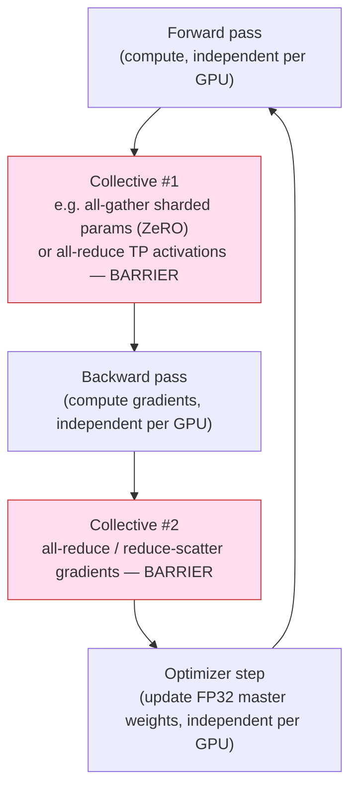
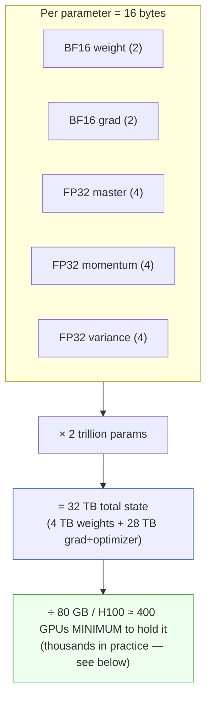
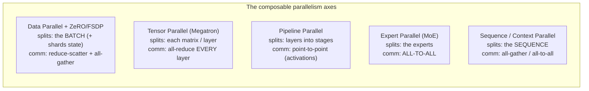
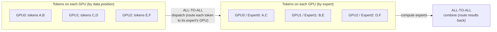
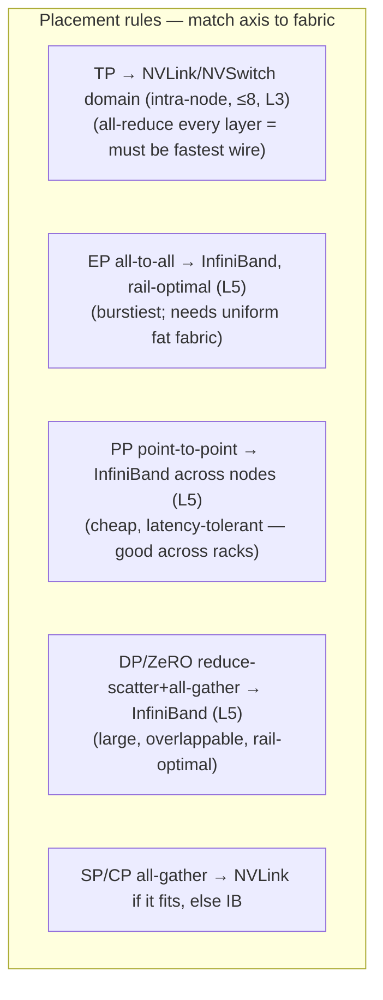
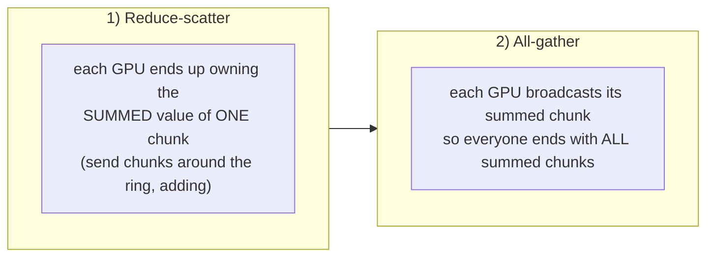

# Level 7 — Distributed Training

> **Where we are in the journey.** Levels 1–6 built the *physical machine*: one GPU (L1), the server
> around it (L2), the NVLink-bonded 8-GPU node (L3), the rack (L4), the InfiniBand fabric that stitches
> racks into one network (L5), and the storage + data pipeline that feeds it (L6). The city is wired.
> **Now we move into the Production half of the course — we stop building and start *running*.** This
> level takes a single, enormous program — *train a 2-trillion-parameter model* — and runs it across
> tens of thousands of those GPUs **at once, in lockstep.**
>
> **By the end of this level you can answer:** Why is a frontier training run *one program* and not ten
> thousand independent ones? Why does *one* slow GPU stall *all* of them? Where do 32 terabytes of
> optimizer state physically live? How do you slice a model across GPUs along five different axes
> simultaneously, and which axis rides which wire? And what is the *real* scorecard — not "GPU util,"
> but **goodput** — and how do checkpoints, loss spikes, and stragglers eat it?

---

## 1. The one idea: a training run is a 10,000-person marching band

Start with intuition, then we'll earn the numbers.

Picture a **marching band of 10,000 musicians** performing one routine. Everyone plays their own part,
but they all step on **the same beat**. The beat is not optional — it's what turns 10,000 individuals
into *one* performance. Between beats they're independent; *on* the beat they must all arrive together.

Now the cruel part: **if one musician trips, the whole band must wait for them to recover before the
next beat lands** — otherwise the formation falls apart. The band's speed is set not by the average
musician but by the **slowest one on every single beat.**

That is a distributed training run, exactly:

- Each GPU plays its **own part** — it owns a slice of the model and a slice of the data.
- The **beat** is a **collective operation** (an all-reduce, all-gather, all-to-all). On the beat, every
  GPU must exchange and agree on numbers (gradients, activations) before anyone can proceed.
- A collective is a **barrier**: it *does not complete* until *every* participant ("rank") has arrived.
- So **one slow or dead GPU stalls all of them.** A degraded NVLink (L3) or a flapping InfiniBand link
  (L5) on *one* node throttles a job spanning *thousands*.

```
   10,000 musicians, one beat            10,000 GPUs, one collective
   ───────────────────────────          ──────────────────────────────
   play your part  (independent)         compute on your shard (independent)
        ↓ BEAT (everyone arrives)             ↓ ALL-REDUCE (barrier)
   play your part                        compute next step
        ↓ BEAT                                ↓ ALL-REDUCE
   one trips → ALL wait                  one GPU slow/dead → ALL block
```

> **Keep this lens for the whole level:** a frontier training job is **one program** whose *instruction
> set* is **collective communication**, and whose speed is set by **the slowest participant plus the
> cost of keeping everyone synchronized.** Every design choice below — how we split the model, which
> wire we put traffic on, how often we checkpoint — is an attempt to make the barrier cheaper and the
> stragglers rarer.

---

## 2. The lockstep model: one training step, drawn out

Zoom into a *single* training step. It is a fixed dance of **compute → collective → compute →
collective**, and the collectives are the beats where everyone must sync.



The pink boxes are the beats. Read the consequence directly off the diagram: between beats the GPUs
run **independently and fast**; *at* each beat they must **all arrive** before the next box can start.
If GPU #7,412 is 50 ms late to collective #2, **every other GPU waits 50 ms** — idle, burning power,
producing nothing. That idle time is called **exposed communication / straggler loss**, and it is the
silent killer of MFU.

A simplified "step" timeline for 4 ranks, where rank 3 has a degraded link:

```mermaid
gantt
    title One training step — rank 3 is a straggler (idle = wasted GPU-seconds)
    dateFormat X
    axisFormat %s
    section Rank 0
    fwd        :0, 3
    bwd        :3, 6
    allreduce  :crit, 6, 9
    section Rank 1
    fwd        :0, 3
    bwd        :3, 6
    allreduce  :crit, 6, 9
    section Rank 2
    fwd        :0, 3
    bwd        :3, 6
    allreduce  :crit, 6, 9
    section Rank 3 (straggler)
    fwd        :0, 4
    bwd        :4, 8
    allreduce  :crit, 8, 9
```



Ranks 0–2 finish backward at t=6 but **cannot start the all-reduce without rank 3**, which limps in at
t=8. Three GPUs sat idle for 2 of every 9 seconds → ~22% of the fleet's time vaporized by *one* bad
link. At 10,000 GPUs and ~$2–4/GPU-hour, that is millions of dollars a month. This is why **L3's
"degraded NVLink straggler" and L5's "flapping IB link" are not local problems — they are fleet
problems.**

---

## 3. The memory math — why you need 400+ GPUs just to *hold* the model

This is the most important arithmetic in the level. Before we can talk about *running* the model, we
must answer: **where does it even fit?** A frontier model does not fit on one GPU — not even close —
and the reason isn't just the weights. It's the *optimizer state*.

### 3.1 Sixteen bytes per parameter (mixed-precision Adam)

Modern training uses **mixed precision**: compute in fast low-precision (BF16/FP8), but keep a
high-precision "source of truth" so tiny updates don't get lost. For Adam (the standard optimizer),
**each parameter** costs:

| What you store | Precision | Bytes |
|---|---|---|
| **Weight** (used in forward/backward) | BF16 | 2 |
| **Gradient** | BF16 | 2 |
| **Master weight** (the authoritative copy) | FP32 | 4 |
| **Momentum** (Adam's `m`, 1st moment) | FP32 | 4 |
| **Variance** (Adam's `v`, 2nd moment) | FP32 | 4 |
| **Total per parameter** | | **16 bytes** |

**Why keep the FP32 master + FP32 optimizer state?** Because the parameter updates are *minuscule*
relative to the weights. A typical update is `w -= lr * m/(√v+ε)`, and `lr * (...)` can be ~1e-7 while
`w` is ~1e-1. In BF16 (which has only ~7–8 bits of mantissa), adding 1e-7 to 1e-1 **rounds away to
nothing** — the update silently vanishes and the model stops learning. The **FP32 master weight**
(23-bit mantissa) has the dynamic range to actually accumulate those tiny nudges. You compute cheap in
BF16, but you *learn* in FP32. (This is the same range-vs-precision story as BF16-vs-FP16 from L1 — see
§6.)

### 3.2 Scaling 16 bytes to 2 trillion parameters

```
Weights alone (BF16):     2e12 params × 2 bytes  =  4 TB
Full training state:      2e12 params × 16 bytes = 32 TB
```

An H100 has **80 GB** of HBM (L1). So the *floor* — the number of GPUs needed merely to **hold** the
state, with zero room for compute scratch — is:

```
32 TB ÷ 80 GB ≈ 400 GPUs   (minimum, to STORE only)
```



But you never run with 400. You run with **thousands**, for three reasons:

1. **Activation memory** (§4) often *exceeds* the parameter memory during the forward pass.
2. **Compute throughput** — 400 GPUs would take *forever*; you add GPUs to add FLOP/s (data parallelism).
3. **Headroom** for communication buffers, fragmentation, and the inevitable failed nodes.

### 3.3 The MoE asymmetry: sparse compute, dense memory

Frontier models are increasingly **Mixture-of-Experts (MoE)**: the model has, say, 2T parameters split
across many "expert" sub-networks, but each token is routed to only a *few* experts (~5% active). The
trap that catches people:

> **MoE saves compute, not memory.** A 2T-param MoE with ~5% active does the **FLOPs of a ~100B dense
> model** per token — but you must still **store all 2T params and their optimizer state = 32 TB.** The
> experts you didn't activate this step are still in HBM, still have momentum/variance, still need
> checkpointing.

So MoE lets you train a *much larger, smarter* model for the compute budget of a small one — but your
**memory footprint and your storage/checkpoint bandwidth (L6) are sized by the full 2T, not the active
100B.** This asymmetry drives the whole placement strategy in §8.

---

## 4. Activation memory and the recomputation trade-off

Parameters and optimizer state are *static* — they sit there all step. **Activations** are different:
they're the intermediate tensors produced in the forward pass that the backward pass *needs* to compute
gradients. You must keep them alive from forward until backward consumes them.

Activation memory scales with **batch × sequence-length × hidden-size × layers**, and at long context
it can **dwarf** the parameter memory. A long-context training step can want *hundreds of GB* of
activations per GPU — far more than the 80 GB it has.

The standard escape is **activation recomputation** (a.k.a. **gradient checkpointing**):

- **Don't** store every activation. Store only a few "checkpoints" at layer boundaries.
- In the backward pass, when you need a discarded activation, **recompute it** by re-running that chunk
  of the forward pass from the nearest stored checkpoint.

```
Without recompute:  store all activations   → huge memory, 1× compute
With recompute:     store a few, redo fwd   → small memory, ~1.3× compute
                                              (one extra forward ≈ +30% FLOPs)
```

It's a classic **time–memory trade**: spend **~30% extra compute** to **slash activation memory** (often
5–10×). At frontier scale you almost always pay it, because you are memory-bound first and the recompute
overlaps with communication anyway. For **very long context**, you also reach for **sequence / context
parallelism** (§7.5), which splits the *sequence dimension* itself across GPUs so no single GPU holds the
whole sequence's activations.

---

## 5. The lockstep is also the source of numerical fragility

Running thousands of GPUs in low precision for months invites **numerical instability**, and instability
is an *operational* event you must design for — not a math curiosity.

### 6. Numerics for stability — BF16, FP16, FP8

| Format | Bits | Exponent (range) | Mantissa (precision) | Use |
|---|---|---|---|---|
| **FP32** | 32 | 8 | 23 | master weights, optimizer state, reductions |
| **FP16** | 16 | 5 | 10 | legacy; **narrow range → needs loss scaling**, fragile |
| **BF16** | 16 | **8** | 7 | **default training compute** — FP32's range, fewer mantissa bits |
| **FP8 (E4M3 / E5M2)** | 8 | 4 / 5 | 3 / 2 | matmuls on Hopper/Blackwell Tensor Cores — **2× throughput, ½ the bytes** |

**Why BF16, not FP16, is the training default** (callback to L1): both are 16 bits, but BF16 keeps
**FP32's 8-bit exponent** — the same *range* — trading away mantissa bits to get it. Range is what
prevents the gradient underflow/overflow that makes FP16 training fall over (FP16 has only a 5-bit
exponent and must use *loss scaling* to survive). For training, **range matters more than precision.**

**FP8 is the frontier lever but it's twitchy.** With only 4 exponent + 3 mantissa bits (E4M3), a tensor
whose values drift outside the representable range will **overflow to inf or underflow to zero**. The
production technique (**NVIDIA Transformer Engine**) is **per-tensor scaling with an amax history**:

- For each tensor, track the running **maximum absolute value (amax)** over recent steps.
- Choose a **scale factor** that maps that amax into FP8's sweet spot before casting.
- Keep a short **history window** so a single anomalous step doesn't whipsaw the scale.

This keeps the *important* bits inside FP8's tiny window while accumulating in higher precision. Done
right, FP8 roughly **doubles matmul throughput** vs BF16 — directly lifting MFU — which is why every
frontier lab is pushing toward it.

### 6.1 Loss spikes are operational events

Even with all of this, big runs **spike**: the loss suddenly jumps (or goes **NaN/Inf**) because of a
bad data shard, an unlucky scaling event, or accumulated drift. This is *expected*, not exotic. The
runbook:

```
detect spike / NaN  →  PAUSE  →  roll back to last good checkpoint
                    →  skip the offending data shard / lower LR briefly
                    →  resume from the checkpoint
```

This is precisely **why checkpoint cadence is a numerical-stability decision, not just a failure-recovery
one** (§10). If you checkpoint every 4 hours and a spike hits at hour 3:50, you lose 3:50 of a
thousand-GPU run. Tight, fast checkpoints (L6: the storage tier exists for this) make spikes cheap to
recover from.

---

## 7. The parallelism dimensions — the heart of the level

No single GPU holds the model, so we **split** it. There are five distinct ways to split, each with a
different *communication primitive* and a hard rule about *which physical wire it must live on*. Master
these five and their placement rules and you can map any model onto any cluster.



### 7.1 Data Parallelism (DP) + ZeRO / FSDP

**What it splits:** the **batch**. Every GPU holds a *replica* of the model and processes a *different
slice of the data*; after the backward pass they **all-reduce gradients** so every replica applies the
same update. This is the oldest, simplest axis — and the one that gives you raw throughput.

The problem: a full replica per GPU means **16 bytes/param on *every* GPU** — impossible for 2T params.
**ZeRO** (DeepSpeed) / **FSDP** (PyTorch) fix this by *sharding the state across the DP group* instead of
replicating it, in three stages:

| Stage | Shards across DP ranks | Memory per GPU | Added comm |
|---|---|---|---|
| **ZeRO-1** | optimizer state (the 12 FP32 bytes) | big drop | reduce-scatter grads |
| **ZeRO-2** | + gradients | bigger drop | reduce-scatter grads |
| **ZeRO-3 / FSDP** | + **parameters** themselves | maximal drop | **all-gather params** just-in-time per layer, then free |

ZeRO-3 turns DP from "everyone holds everything" into "everyone holds a *slice*; **all-gather** the layer
you're about to use, compute, then throw the gathered copy away." The collective pair is **reduce-scatter
(gradients) + all-gather (params)** — which, not coincidentally, *is* an all-reduce decomposed (§9). Cost:
more communication, traded for the memory that makes 2T even possible.

### 7.2 Tensor Parallelism (TP) — Megatron

**What it splits:** a **single matrix / a single layer**, horizontally across GPUs. A layer's weight
matrix is partitioned (column-wise then row-wise) so each GPU computes a *partial* result; to get the
true activation you must **all-reduce the partial outputs across the TP group on *every* layer** — twice
per transformer layer (once in attention, once in MLP), forward *and* backward.

That is an *enormous* amount of communication, on the critical path, **every layer**. So:

> **TP must stay inside the NVLink domain (L3). On Hopper, TP ≤ 8.** Because the all-reduce happens every
> layer, it can only be hidden if the link is absurdly fast — and only **NVLink/NVSwitch within an 8-GPU
> node (~900 GB/s, L3)** is fast enough. Cross that boundary onto InfiniBand (~50 GB/s/GPU, L5) and TP
> communication becomes *exposed* and MFU collapses. This is the single most important placement rule in
> distributed training, and it's a direct consequence of L3's NVLink-vs-IB bandwidth gap.

### 7.3 Pipeline Parallelism (PP) — and the bubble

**What it splits:** the model's **layers into sequential stages**, one stage per group of GPUs (e.g.
layers 1–20 on stage 0, 21–40 on stage 1, …). A microbatch flows stage 0 → stage 1 → … like an assembly
line. Communication is cheap — just **point-to-point activations** between adjacent stages — so PP is the
axis you use to span **across nodes over InfiniBand**.

The catch is the **pipeline bubble**: while stage 0 processes the first microbatch, stages 1…N sit
**idle** waiting for work to reach them — and again at the end as the pipe drains.

```mermaid
gantt
    title Pipeline bubble — 4 stages, 4 microbatches (GPipe-style fill/drain idle in gaps)
    dateFormat X
    axisFormat %s
    section Stage 0
    mb1 fwd :0,1
    mb2 fwd :1,2
    mb3 fwd :2,3
    mb4 fwd :3,4
    section Stage 1
    mb1 fwd :1,2
    mb2 fwd :2,3
    mb3 fwd :3,4
    mb4 fwd :4,5
    section Stage 2
    mb1 fwd :2,3
    mb2 fwd :3,4
    mb3 fwd :4,5
    mb4 fwd :5,6
    section Stage 3
    mb1 fwd :3,4
    mb2 fwd :4,5
    mb3 fwd :5,6
    mb4 fwd :6,7
```



The triangular empty regions (top-right and bottom-left) are the bubble — GPUs powered on, doing nothing.

**Bubble fraction ≈ (stages − 1) / (microbatches + stages − 1).**

With 4 stages and 4 microbatches: `3 / 7 ≈ 43%` wasted — terrible. Push microbatches to 64:
`3 / 67 ≈ 4.5%` — acceptable. **The fix for the bubble is *more in-flight microbatches*.** Schedules:

- **GPipe:** all forwards, then all backwards. Simple, but holds *all* microbatch activations alive → big
  activation memory.
- **1F1B (one-forward-one-backward):** interleave forward and backward so activations are freed early →
  far lower memory, same bubble. The production default.
- **Interleaved 1F1B (virtual stages):** each GPU owns *several non-contiguous* layer chunks, shrinking
  the bubble further at the cost of more point-to-point messages.

### 7.4 Expert Parallelism (EP) — for MoE

**What it splits:** the **experts**. With hundreds of experts and only a few active per token, you place
different experts on different GPUs. Each token must be **routed to wherever its chosen experts live**,
then the results gathered back:



The primitive is **all-to-all** (every GPU sends a different chunk to every other GPU), **twice** —
dispatch then combine. **All-to-all is the burstiest, most fabric-stressing pattern there is** (§9): a
sudden N×N storm of small-to-medium messages, prone to **incast** (many senders → one receiver). It's the
reason MoE clusters demand the fattest, most uniform InfiniBand fabric (L5) and rail-optimal topology.

Two MoE-specific knobs you must tune:

- **Capacity factor:** how many tokens each expert is allowed to accept. Too low → tokens get *dropped*
  (skipped) → quality loss. Too high → wasted compute/memory on padding.
- **Load-balancing (auxiliary) loss:** an extra training term that *pushes the router* to spread tokens
  evenly across experts. Without it, a few "celebrity" experts get all the tokens → **expert load
  imbalance** → those GPUs become stragglers and stall the all-to-all barrier (§10).

### 7.5 Sequence / Context Parallelism (SP/CP) — for long context

**What it splits:** the **sequence (token) dimension** itself. At very long context (100k–1M+ tokens),
the activations and the attention computation for one sequence won't fit on one GPU. SP/CP shards the
sequence across GPUs; the catch is **attention is all-to-all over positions** (every token attends to
every other), so it needs **all-gather / all-to-all** of keys and values across the CP group (e.g. *ring
attention* passes K/V blocks around a ring). It is the axis you add *specifically* to scale context
length, on top of the other four.

### 7.6 Composing into 3D / 4D / 5D parallelism — the placement rules

You don't pick one axis — you **compose** them, and the art is the **placement**: matching each axis's
communication pattern to the wire that can carry it.



The mental model: **the more often and more latency-sensitively an axis communicates, the closer to the
GPU its wire must be.** TP (every layer) → NVLink. EP/DP/PP (per step, overlappable) → InfiniBand.

### 7.7 Worked example — mapping a 2T MoE onto H100 nodes

Let's place a **2T-param MoE** (active ~100B/token, ~64 experts, long-ish context) on **H100 SXM nodes
(8 GPUs/node, NVSwitch-bonded, L3; nodes on an IB rail-optimal fabric, L5)**.

**Pick the axes:**

| Axis | Choice | Why |
|---|---|---|
| **TP** | **8** | Fill exactly one NVLink node — the per-layer all-reduce stays on the fastest wire (the L3 rule). Never cross the node boundary. |
| **PP** | **~8 stages** | Span layers across nodes over IB; cheap point-to-point; deep enough to cut per-GPU layer memory. Run many microbatches to keep bubble <5%. |
| **EP** | **~8** | Shard the 64 experts ~8-ways; all-to-all rides the rail-optimal IB fabric. |
| **DP + ZeRO-3** | **fill the rest** | Replicate the (TP×PP×EP) group across the remaining GPUs for throughput; ZeRO-3 shards the 32 TB of state so it actually fits. |

**Estimate the GPU count.** One model replica = `TP(8) × PP(8) × EP(8) = 512 GPUs`. Does 512 hold 32 TB
of state? `512 × 80 GB = 40 TB` raw — but subtract activations, recompute buffers, comm buffers, and
fragmentation, and 512 is a *tight* fit for state+activations, which is exactly why ZeRO-3 shards
everything. To get throughput we then **data-parallel** that 512-GPU replica, say **×16 → 8,192 GPUs**
(or ×32 → 16,384 for a frontier-speed run).

**Which traffic rides which fabric:**

```
Inside each 512-GPU replica:
  • TP all-reduce (every layer)      → NVLink/NVSwitch  (intra-node, ~900 GB/s)   [HOTTEST]
  • EP all-to-all (dispatch/combine) → InfiniBand        (rail-optimal)            [BURSTIEST]
  • PP activations (stage→stage)     → InfiniBand        (point-to-point)          [cheap]
Across the 16 replicas:
  • DP/ZeRO reduce-scatter+all-gather→ InfiniBand        (rail-optimal, overlapped)[bulk]
```

This is the whole game: **TP hugs the NVLink island; everything else spreads over InfiniBand, with the
all-to-all getting the most fabric respect.** Get the placement wrong — e.g. let TP straddle two nodes —
and MFU falls off a cliff because the per-layer all-reduce becomes *exposed* over the slow wire.

---

## 8. Collectives deep-dive — the instruction set of the supercomputer

The collectives are the *beats*. Their cost — and whether you can *hide* it behind compute — sets your
ceiling. NCCL (L3/L5) implements them; you must know how they move data.

### 8.1 All-reduce = reduce-scatter + all-gather

All-reduce (sum gradients across N GPUs, give everyone the total) is **not** "send everything to one node
and back." It decomposes into two bandwidth-optimal phases:



### 8.2 Ring vs Tree vs SHARP

**Ring all-reduce** — GPUs form a logical ring; data flows around it in chunks. Total data each GPU
moves:

```
ring all-reduce traffic = 2 × (N−1)/N × buffer_size  per GPU
```

The `(N−1)/N` factor means cost is **independent of N for large N** (it approaches `2 × buffer`), and
every link is **fully and evenly utilized** → **bandwidth-optimal**. This is why ring is the default for
**large messages** (gradient all-reduce). Its weakness: **latency grows with N** (data must hop through
all N GPUs), so it's bad for tiny messages.

**Tree all-reduce** — reduce up a tree, broadcast down. Latency is **O(log N)** instead of O(N), so it
wins for **small messages and very large N** (latency-bound), at some bandwidth efficiency cost.

**SHARP (Scalable Hierarchical Aggregation and Reduction Protocol)** — the InfiniBand **switches
themselves do the reduction in-network** (L5). The data is summed *as it passes through the switch*, so
GPUs send their contribution *once* and the fabric returns the answer — roughly **halving** the data on
the wire and offloading the GPU. This is a key MFU lever at scale and a reason the fabric (L5) is more
than dumb pipes.

| Algorithm | Best for | Cost shape |
|---|---|---|
| **Ring** | large messages (gradients) | bandwidth-optimal, latency ∝ N |
| **Tree** | small messages, large N | latency ∝ log N |
| **SHARP** | in-network reduce at scale | ~½ the wire data, switch does the math |
| **All-to-all** | MoE dispatch/combine | N×N storm, incast-prone, burstiest |

### 8.3 Overlap — why "exposed" comms is the MFU killer

The entire art of fast distributed training is **hiding communication behind computation.** NCCL runs
collectives on a **separate CUDA stream** (L1/L2) so that while the Tensor Cores grind on layer *k*'s
backward math, the fabric is *simultaneously* all-reducing layer *k+1*'s gradients.

```
GOOD (overlapped):  compute ████████████████  (comm hidden underneath) → high MFU
                    comm       ░░░░░░░░░░░░

BAD (exposed):      compute ████        ████        ████   → GPUs idle during comm
                    comm        ░░░░░       ░░░░░          → low MFU
```

When communication **cannot** be hidden — because there's no independent compute to run alongside it, or
the message is on the critical path (TP's per-layer all-reduce, the pipeline bubble's drain) — it becomes
**exposed**, and the GPUs sit idle on the barrier. **Exposed communication is the single biggest,
most-common MFU killer in real runs.** Every placement decision in §7 is, at bottom, an effort to keep
collectives *overlappable* and on a wire fast enough to *finish before the compute does.*

---

## 9. The scorecard — MFU and Goodput

L1 taught that **MFU (Model FLOPs Utilization)** — fraction of the chip's theoretical peak FLOP/s spent
on *useful model math* — is the real number, not "GPU util." At single-GPU scale, MFU is killed by
memory-bound kernels and wrong precision. At *cluster* scale, MFU adds new enemies: **exposed
communication, the pipeline bubble, and stragglers.** Frontier runs land around **MFU ≈ 40–55%** — and
getting there is genuinely hard.

But MFU isn't the *final* word, because it measures only the time the run was *making progress*. It says
nothing about time lost to checkpointing, crashes, and restarts. The honest, business-level metric is:

```
GOODPUT = MFU × (1 − checkpoint_overhead − restart_lost_work − straggler_loss)
```

- **checkpoint_overhead** — the time spent writing checkpoints (and any stall to do so).
- **restart_lost_work** — when a node dies, you lose all progress since the last checkpoint, then must
  reschedule and reload. At 16,000 GPUs, **something fails every few hours** (L1's failure vocabulary ×
  scale), so this term is *always* nonzero.
- **straggler_loss** — the idle time from §2: every barrier waits for the slowest rank.

> **Goodput is the number a Principal defends in a capacity review.** A run can show 50% MFU but only
> **35% goodput** because it loses a quarter of its time to crashes and checkpoints. Lifting goodput is
> where the real money is — and it ties directly to L5 (fabric quality → fewer stragglers), L6 (fast
> checkpoint storage → cheap recovery), and L8 (fleet reliability engineering).

### 9.1 Checkpoint cadence — the Young/Daly formula

How *often* should you checkpoint? Too often → checkpoint overhead dominates. Too rarely → a crash loses
hours of a thousand-GPU run. The classic optimum (Young/Daly) balances the two:

```
optimal_interval ≈ sqrt( 2 × checkpoint_cost × MTBF )
```

where `checkpoint_cost` is the time to write one checkpoint and `MTBF` is the mean time between failures
of the *whole job* (which **shrinks as you add GPUs** — more GPUs, more failures). Worked feel: if a
checkpoint takes ~60 s to write and the job's MTBF is ~2 hours (7200 s) at scale,
`sqrt(2 × 60 × 7200) ≈ sqrt(864,000) ≈ ~930 s ≈ every ~15 min`. As the cluster grows and MTBF *falls*,
the formula tells you to checkpoint *more often* — which is exactly why frontier labs invest in **fast,
asynchronous, sharded checkpointing to a fast storage tier (L6)** so `checkpoint_cost` stays tiny and
you can afford a tight interval. **Tight checkpoints also make the loss-spike rollback of §6.1 cheap** —
recovery and stability share the same lever.

---

## 10. How a distributed run fails (because at scale, it will — constantly)

L1 catalogued how *one GPU* fails. At 10,000+ GPUs in lockstep, those local failures become **fleet
events**, plus entirely new *distributed* failure modes:

| Failure | What it is | How it shows up | Action |
|---|---|---|---|
| **NCCL hang** | a collective never completes because **one rank died/stalled**; *all* others block forever on the barrier (§2) | the job is "running" (100% util on the survivors) but **loss stops advancing**; NCCL watchdog timeout fires | per-rank progress/heartbeat telemetry to find the *one* stuck rank; kill + restart from checkpoint; replace the dead node |
| **Straggler** | one GPU/link is *slow but alive* — degraded NVLink (L3) or flapping IB (L5), thermal throttle (L1) | every step quietly ~10–30% slower; MFU sags with **no error** | flag rank-time outliers; drain the node; reroute/replace |
| **Loss divergence / NaN** | numerical instability — FP8 overflow, bad data shard, LR too high (§6) | loss spikes or goes NaN/Inf | roll back to last good checkpoint, skip the bad shard, resume |
| **OOM** | underestimated **activation** or **optimizer** memory (§3–4); ZeRO stage too low; capacity factor too high | CUDA OOM at step 1 or at a long-sequence batch | raise ZeRO stage, enable recompute, shrink microbatch/capacity factor |
| **Expert load imbalance** | MoE router sends tokens to a few "celebrity" experts | those EP ranks straggle → all-to-all barrier stalls; uneven GPU memory | tune capacity factor + strengthen load-balancing loss (§7.4) |
| **Checkpoint/restart storm** | a crash → 10,000 GPUs all reload from storage at once | L6 storage saturates; slow restart inflates `restart_lost_work` | sharded/parallel checkpoint reads; staggered restart; fast tier (L6) |

The unifying lesson — and the through-line from L1: **the dangerous failures are the silent ones.** A
hang looks like a healthy run; a straggler throws no error. Because everything runs in **lockstep**, the
*only* reliable detection is **per-rank progress telemetry** — watching for the one rank that's late to
the beat. This is the direct bridge to the Observability domain
(`Observability/14-AI Infrastructure Observability/`).

---

## 11. Interview deep-dives (defend your understanding)

**Q: A 2T MoE has the compute of a 100B model. So can we train it on far fewer GPUs?**
No — that's the MoE asymmetry. MoE saves **compute** (only ~5% of experts fire per token), not
**memory**. You still store all 2T params + optimizer state = **32 TB**, so you still need hundreds of
GPUs just to *hold* it and thousands to feed the all-to-all and activations. MoE buys you a *bigger
model for the FLOP budget*, but your memory, storage, and checkpoint bandwidth are sized by the full 2T.

**Q: Why must Tensor Parallelism stay ≤8 and inside one node, while Pipeline Parallelism can span racks?**
TP does an **all-reduce on every layer**, forward and backward — it's on the critical path constantly, so
it can only be hidden on the fastest wire: **NVLink/NVSwitch within an 8-GPU node (~900 GB/s, L3).** PP
only sends **point-to-point activations between adjacent stages** — infrequent and latency-tolerant — so
it's fine over **InfiniBand across nodes (L5).** Put TP on IB and its per-layer all-reduce becomes
exposed and MFU collapses.

**Q: The loss just went NaN at step 410,000 of a month-long run. Walk me through the response.**
Treat it as an operational event, not a bug hunt. Pause; **roll back to the last good checkpoint**;
identify the cause (most often a bad data shard or an FP8 scaling event); **skip the offending shard
and/or briefly lower LR**; resume. This is why checkpoint cadence (Young/Daly) is a *stability* decision
— frequent, cheap checkpoints make spikes recoverable. If it recurs, audit FP8 amax-history scaling and
the data pipeline (L6).

**Q: GPU util is 100% across the cluster but the loss curve is flat. What happened?**
Almost certainly an **NCCL hang**: one rank died or stalled, and every other rank is **blocked on the
collective barrier** — they *look* 100% busy because they're spinning on the wait. "Util" is a lie (L1).
Check per-rank progress/heartbeats to find the stuck rank, look for the NCCL watchdog timeout, kill and
restart from checkpoint, and replace the failed node.

**Q: Define goodput and explain why a run at 50% MFU might have 35% goodput.**
`goodput = MFU × (1 − checkpoint_overhead − restart_lost_work − straggler_loss)`. MFU only counts time
spent making progress; goodput nets out the time lost to **checkpointing, crash recovery, and
stragglers**. A 50%-MFU run that crashes every few hours and reloads from a slow checkpoint store can
easily bleed 30% of its wall-clock to lost work → ~35% goodput. Goodput, not MFU, is the dollar metric.

**Q: How do you choose checkpoint frequency, and what happens to it as the cluster grows?**
Young/Daly: `interval ≈ sqrt(2 × checkpoint_cost × MTBF)`. As you add GPUs, **MTBF falls** (more
components → more failures), so the optimal interval **shrinks** — you must checkpoint *more often*. That
only stays affordable if `checkpoint_cost` is tiny, which is why frontier labs use **asynchronous,
sharded checkpointing to a fast storage tier (L6)**.

**Q: Why is MoE's all-to-all considered the most dangerous traffic pattern on the fabric?**
It's an **N×N burst**: every GPU sends a different chunk to every other GPU, *twice* per step (dispatch +
combine), all at once and prone to **incast** (many senders → one receiver overwhelms a link/buffer). Add
**expert load imbalance** and the storm becomes lumpy, stalling the barrier. It demands the fattest,
most-uniform rail-optimal InfiniBand fabric (L5) and careful capacity-factor/load-balancing tuning.

---

## 12. What you should now be able to draw from memory

- **The lockstep step:** forward → collective (barrier) → backward → collective (barrier) → optimizer,
  and *why one slow rank stalls everyone* (the marching band).
- **The 16-bytes/param stack** (2+2+4+4+4) → **2T = 32 TB**, ÷80 GB ≈ **~400 GPUs to hold, thousands to
  run**, and the **MoE asymmetry** (sparse compute, dense memory).
- **The five parallelism axes** with their primitive and their wire: **TP→NVLink (≤8, every-layer
  all-reduce), DP/ZeRO→IB (reduce-scatter+all-gather), PP→IB (the bubble), EP→IB (all-to-all), SP/CP→
  long context** — and the placement rules that compose them into 3D/4D/5D.
- **Ring all-reduce** = reduce-scatter + all-gather, traffic `≈ 2(N−1)/N × buffer`; when to use Tree and
  SHARP; and why **exposed comms kills MFU**.
- **The scorecard:** `goodput = MFU × (1 − checkpoint − restart − straggler)`, and **Young/Daly**
  checkpoint cadence.

> **Next — Level 8: The AI Supercomputer.** We've run *one* job across the cluster. Level 8 zooms out to
> the whole machine as a **multi-tenant, failure-saturated facility**: the scheduler that packs many jobs
> onto the fabric topology, fleet-wide reliability engineering (MTBF math, hot spares, automatic
> node-draining), the operational control loop that keeps goodput high across thousands of GPUs for
> months, and the economics — $/useful-token — that justify the whole thing. Distributed training was
> one program in lockstep; the supercomputer is *many* programs sharing one failure-prone city.

---
*Part of `AI-Infra/Production/` (Levels 7–9). See `AI-Infra/README.md` for the full 9-level map.*
