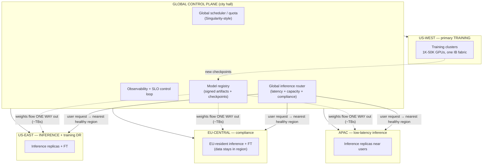
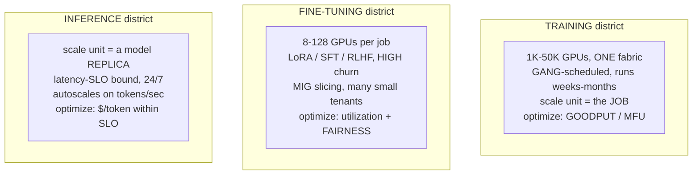
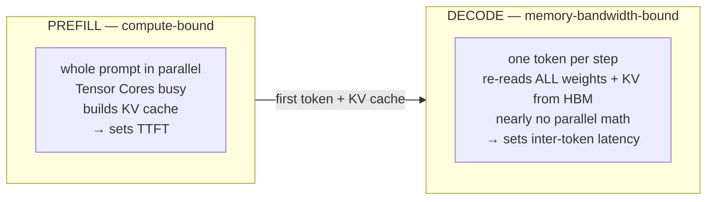
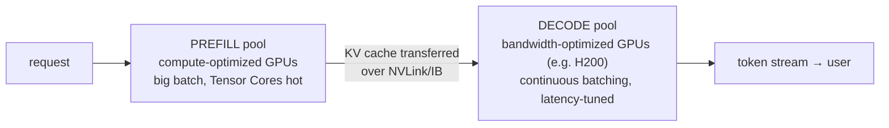
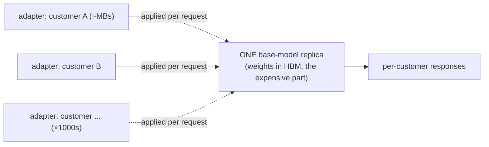
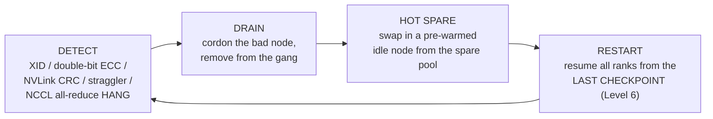
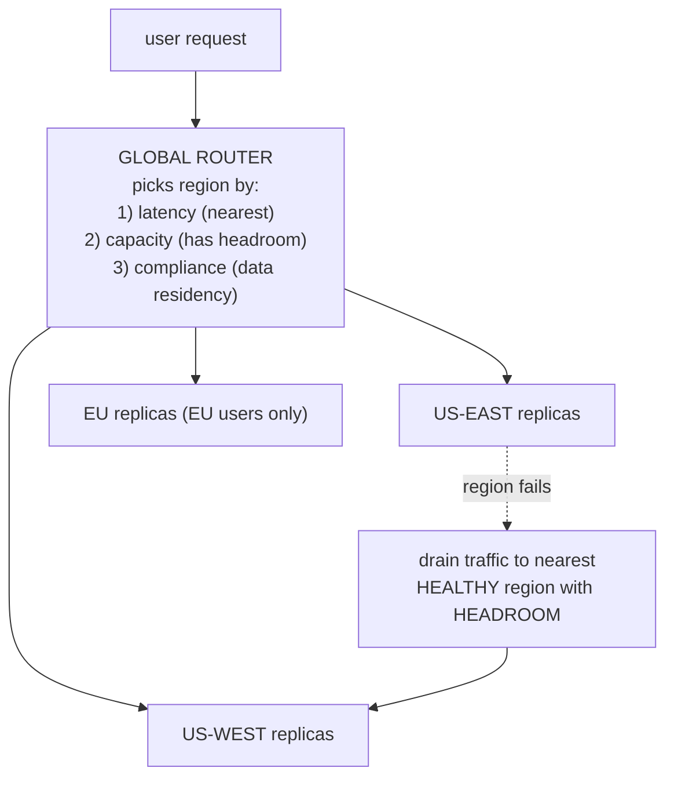
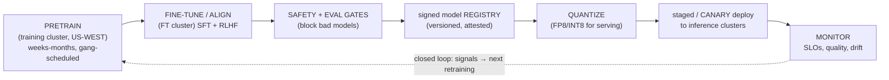

# Level 8 — The AI Supercomputer

> **Where we are in the journey.** We learned to build the machine: one GPU (1), the server (2), the
> NVLink domain (3), the rack (4), the network fabric (5), the storage and data pipeline (6). At
> Level 7 we ran *one* training job across thousands of those GPUs and made it converge. That was a
> single household moving in. **Now we operate the whole city.**
>
> A supercomputer is not a pile of GPUs. It's a **scheduled, multi-region SERVICE** that runs
> training, fine-tuning, *and* low-latency inference at the same time, on the same physical fleet,
> while hardware fails every single day. The job at this level is not "make one run fast" — it's
> **traffic control** (the scheduler), **zoning** (what kind of work runs where), **keeping the lights
> on** through constant outages (reliability), and **serving millions of citizens in real time**
> (inference). The scorecards are **goodput** (useful work net of failures) and **$/token**.
>
> **By the end of this level you can answer:** Why can't you tensor-parallel across an ocean? Why does
> a single dead GPU hang a 10,000-GPU job? What is prefill/decode disaggregation and why did Microsoft
> build it? Why is "GPU utilization" *still* a lie at inference, and what is goodput? How do you serve
> a thousand fine-tuned customers for the price of one base model?

---

## 1. The one idea: a supercomputer is a city, not a building

Start with intuition.

A **building** is what we built in Levels 1–7: a fixed structure, one purpose, one tenant. Run one
training job on it and you're done.

A **city** is a different kind of object. It has **districts** zoned for different uses (industrial,
residential, commercial). It has **traffic control** deciding who moves where and when. It has
**redundancy** — when one power station trips, the grid reroutes. And it serves **two utterly
different populations at once**: factories that run for months (training) and millions of citizens who
each want a fast response *right now* (inference). The factory and the citizen compete for the same
electricity and the same roads, and the city's whole job is to arbitrate that without either one
collapsing.

```
   A BUILDING (Levels 1-7)              A CITY (Level 8)
 ┌──────────────────────┐        ┌────────────────────────────────────┐
 │ one fabric           │        │ districts (training / FT / inference)│
 │ one job              │        │ traffic control (the SCHEDULER)      │
 │ run to completion    │        │ outage survival (drain/hot-spare/DR) │
 │ scored on: MFU       │        │ multi-region, multi-tenant, 24/7     │
 └──────────────────────┘        │ scored on: GOODPUT and $/token       │
                                  └────────────────────────────────────┘
```

> **Keep this lens for the whole level:** every decision below — how to schedule, where to place work,
> how to fail over, how to serve a token — follows from "this is a *shared, always-on service*, not a
> *job runner*." The expensive failures are the ones that quietly waste the city's electricity:
> stragglers, cold replicas, KV-cache thrash, traffic sent to the wrong region.

---

## 2. Zooming out: the global platform

Before the parts, the whole. A hyperscale AI platform is **N regional fleets** governed by **one
global control plane**. The control plane is the city hall; the regions are the boroughs.



Three rules are baked into that picture, and they are the spine of multi-region design:

1. **Training is centralized.** You cannot tensor-parallel across an ocean (we'll prove this with
   latency numbers in §6). A frontier run lives inside **one** fabric in **one** region.
2. **Inference is distributed**, placed near users for latency, and replicated for failover.
3. **Weights flow one way: out.** Training produces signed weights → registry → fans out to inference
   regions. **Customer/EU data does not flow back** to training. Data residency is a *routing and
   storage constraint*, not a nice-to-have.

---

## 3. The three districts (cluster types)

The single most important act of "zoning" is recognizing that **training, fine-tuning, and inference
are three different workloads** that want three different physical and scheduling treatments. Putting
them in the same pool and scheduling them the same way is the classic platform mistake.



| District | Scale unit | Job shape | Scheduling | Optimize for | Failure of one GPU |
|---|---|---|---|---|---|
| **Training** | the **job** (all-or-nothing) | 1K–50K GPUs, weeks–months | **gang** + topology-aware | **goodput / MFU** | can **hang the whole job** |
| **Fine-tuning** | a small job | 8–128 GPUs, minutes–hours, high churn | bin-packing + **MIG** slicing + fairness | utilization, fairness, queue time | loses one small job |
| **Inference** | a **replica** | N×GPU, runs forever | replica autoscaling | **$/token within latency SLO** | drops one replica's capacity |

The mental shift between districts: in **training**, the unit of scheduling is *the whole job* and one
slow GPU is catastrophic (lockstep — Level 7). In **inference**, the unit is *one replica*, replicas
are independent, and a dead one is just a small capacity dip the load balancer absorbs. **Fine-tuning**
is the chaotic middle: thousands of small, short, bursty jobs that you bin-pack onto **MIG-sliced**
GPUs (a single H100 carved into up to 7 isolated instances) to keep utilization high and tenants fair.

---

## 4. Traffic control: scheduling & orchestration

The scheduler is the city's traffic-control system. It decides which job gets which GPUs, when, and
*where on the fabric*. Get it wrong and a $200M cluster runs at 40% goodput.

### 4.1 Slurm vs Kubernetes — two philosophies
There are two lineages, and serious platforms run both.

| | **Slurm** (HPC lineage) | **Kubernetes + Kueue/Volcano** (cloud lineage) |
|---|---|---|
| Built for | batch HPC jobs, MPI, gang scheduling | long-lived services, autoscaling, microservices |
| Best at | **training** — gang scheduling and topology are native | **inference + fine-tuning** — services, rolling deploys, HPA |
| Gang scheduling | built in | needs **Volcano** or **Kueue** to add it |
| Weakness | not service-shaped, weak multi-tenant isolation | gang/topology bolted on, more moving parts |

The common pattern at hyperscale: **Slurm (or a Slurm-like batch scheduler) for the training district,
Kubernetes + Kueue/Volcano for inference and fine-tuning**, both fed by one global quota system.

### 4.2 Gang scheduling — all-or-nothing
A 1,024-GPU training job needs **all 1,024 GPUs at the same instant**, because every GPU is a peer in
the same synchronized collective (Level 7 — all-reduce in lockstep). If you start it with 1,000 and
"hope to find 24 more," the 1,000 sit *idle and burning power* waiting for peers that never come, and
two such half-started jobs **deadlock** each other.

**Gang scheduling** is the fix: the job is **all-or-nothing**. Either the scheduler can place the
entire gang at once, or it places none of it and the job waits in the queue. This is the defining
property of training schedulers and the #1 reason you can't just use a vanilla web-service scheduler.

### 4.3 Topology-aware placement — *where* matters as much as *whether*
Two GPUs are not interchangeable. The scheduler must honor the network hierarchy from Levels 3 and 5:

```
   tensor-parallel group  → must sit inside ONE NVLink domain   (Level 3, ~900 GB/s, intra-node)
   pipeline / data-parallel → laid out RAIL-OPTIMALLY on the IB fabric (Level 5, ~400 Gb/s, inter-node)
   spread a TP group across nodes → you just made every step ~25x slower
```

A topology-unaware scheduler that scatters a tensor-parallel group across racks turns the fastest link
(NVLink) into the slowest (multi-hop InfiniBand) for the *most* communication-heavy part of the model.
The scheduler needs a **physical map of the fabric** — which GPUs share an NVSwitch, which nodes share
a leaf switch, which leaves share a spine — and it places **TP groups intra-node, PP/DP rail-optimally**
so collectives stay on the fattest pipes. *(This is the scheduling-side payoff of everything in
Levels 3 and 5.)*

### 4.4 Preemption — protecting what matters
The city has priorities. A frontier training run and the inference SLO are sacred; a low-priority
fine-tuning job is not. **Preemption** lets the scheduler *evict* lower-priority work to protect
higher-priority work:

- A frontier run needs 256 more GPUs after a node failure → **preempt fine-tuning jobs** to free them.
- Inference demand spikes at peak hours → **preempt fine-tuning** to scale up replicas, protect TTFT.

Naive preemption is just `kill`, which throws away hours of work. The state of the art makes
preemption **transparent**.

### 4.5 The canonical example: Microsoft's Singularity (and Project Forge)
Microsoft's **Singularity** is the reference design for a global AI scheduler. Its key ideas:

- **One global scheduler** over the entire fleet across regions and clusters (not per-cluster silos),
  so a job can be placed anywhere there's capacity and quota.
- **Transparent preemption, migration, and elasticity:** Singularity can **checkpoint a running job's
  device state, move it to a different set of GPUs (even a different cluster), and resume it** — without
  the job's code knowing. So preemption isn't `kill`; it's *pause-and-relocate*. A job can also **grow
  or shrink** its GPU count elastically as capacity frees up.

**Project Forge** is the related inference-side serving/pooling layer (treating GPUs as a fungible pool
for serving, with throttling and load-aware placement). Together they're the textbook answer to "how
does a hyperscaler run training and inference on one fleet without one starving the other."

> Interview-ready framing: *Singularity decouples the job from the physical GPUs.* That decoupling is
> what makes a global, preemptible, elastic, failure-tolerant fleet possible.

---

## 5. Multi-region design

Now the geography. A real platform spans regions, and each region has a job:

| Region | Primary role | Why |
|---|---|---|
| **US-WEST** | **Primary training** | Big power + cooling + GPU allocation; centralized fabric for frontier runs |
| **US-EAST** | **Inference + training failover/DR** | Serves US-east users; holds replicated checkpoints so training can *resume* here if WEST is lost |
| **EU-CENTRAL** | **Compliance** | EU-resident inference + fine-tuning; **EU customer data never leaves the region** |
| **APAC** | **Low-latency inference** | Serve APAC users locally (a request to US would add ~150–250 ms RTT) |

The rules again, now with consequences:

- **Training centralized** (proven in §6). A frontier run does not span regions.
- **Inference distributed near users.** Latency is dominated by geography; you place replicas close.
- **Weights flow one-way out.** US-WEST trains → registry → replicate weights (tens of GB to a few TB
  per model) to inference regions. This is a one-time bulk copy per model version, not a hot path.
- **Data residency is a routing + storage constraint.** EU user requests route only to EU replicas;
  EU fine-tune data is stored only on EU storage and **never copied back** to the training region. You
  enforce this in the router (region selection) and in storage policy, not by trusting code.

---

## 6. Why you can't tensor-parallel across an ocean (the latency tax)

This is the number that justifies "training is centralized." Recall from Levels 3 and 5 the
communication ladder, and add inter-region:

| Link | One-way latency | Relative to NVLink |
|---|---|---|
| **NVLink** (intra-node, Level 3) | ~1 µs (sub-µs) | **1×** |
| **InfiniBand** (intra-datacenter, Level 5) | ~3–5 µs | ~5× |
| **Cross-region WAN** (e.g. US-WEST ↔ US-EAST) | ~30–40 ms RTT | **~10,000–40,000×** |
| **Trans-oceanic** (US ↔ EU/APAC) | ~80–250 ms RTT | **~100,000×+** |

Tensor parallelism does an all-reduce **every layer, every micro-step** — thousands of times per
training step. At NVLink latency that's invisible. At ~10,000× the latency, every step would stall for
tens of milliseconds waiting on the network; your GPUs (Level 1) would idle ~99% of the time. The
math is brutal: **inter-region RTT is ~10,000× NVLink latency**, so any tightly-coupled parallelism
across regions drives MFU to near zero. That's the proof. *(The only thing that crosses regions
cheaply is the **one-way weight copy** — latency-insensitive bulk transfer — and asynchronous,
loosely-coupled schemes, which frontier dense training does not use.)*

---

## 7. Real-time inference (the heart of this level)

This is where an AI service meets its users, and it's the part most infra engineers under-respect.
Training is a batch job you tune once a quarter. **Inference is a 24/7 latency-bound service** judged
on milliseconds and dollars, and its physics are genuinely different from training. We'll spend the
most time here.

### 7.1 The two phases: prefill vs decode
A single inference request has **two phases with opposite bottlenecks**, and almost everything about
serving comes down to this split.

```
PROMPT: "Explain the CAP theorem in two sentences."   ──►  GENERATED: "The CAP theorem ..."
        └──────────── PREFILL ────────────┘                └──────── DECODE (one token at a time) ────►
```

**PREFILL** — process the *entire prompt in parallel*, in one big matmul-heavy pass, to (a) produce the
first output token and (b) build the **KV cache** (the stored keys/values for every prompt token so we
never recompute them). Prefill is **compute-bound**: lots of parallel work, Tensor Cores busy
(Level 1's roofline, compute side). Prefill latency = **TTFT** (Time To First Token).

**DECODE** — generate output **one token at a time**, autoregressively. Each step processes *a single
new token*, but to do so it must **re-read every weight in the model and the entire KV cache from HBM**.
There's almost no parallel math — it's one token's worth of compute against gigabytes of memory reads.
Decode is **memory-bandwidth-bound** (Level 1's roofline, *memory* side; this is *exactly* why the H200
exists — same FLOPs, more HBM bandwidth, faster decode). Decode latency = **inter-token latency** (ITL),
the typing speed.



**The conflict:** these two phases fight for the same GPU. A long prefill (someone pasted a 100K-token
document) monopolizes the Tensor Cores and **stalls everyone else's decode** — your other users' tokens
stop arriving. Hold this; it's why disaggregation exists.

### 7.2 Prefill/decode disaggregation (Splitwise / DistServe / Mooncake)
Since prefill is compute-bound and decode is memory-bound, **running them on the same GPU pool means
neither is optimal and they interfere.** The fix is to **split them into separate GPU pools**:



- **Prefill pool**: compute-heavy GPUs, large batches, maximize prefill throughput.
- **Decode pool**: bandwidth-heavy GPUs (H200-class), tuned for low inter-token latency and high
  concurrency.
- The **KV cache is handed off** from prefill to decode over a fast link (NVLink/IB).

Microsoft's **Splitwise** is the canonical paper here; **DistServe** and **Mooncake** are the other
well-known designs (Mooncake also adds a disaggregated KV-cache *store*). The payoff: a giant prefill
no longer freezes everyone's decode, and each pool is sized and tuned for its own bottleneck. This is
the same instinct as §3's zoning, now *inside* a single request's lifecycle.

### 7.3 The KV cache: the capacity ceiling of inference
The KV cache is the thing that *actually* limits how many users you can serve. It's the stored
key/value tensors for every token already in context, so decode doesn't recompute them. Its size:

```
KV bytes ≈ 2 (K and V) × num_layers × kv_heads × head_dim × seq_len × batch × bytes_per_elem
```

The brutal facts:
- It grows **linearly with context length** *and* **with concurrency (batch)**. Double the context or
  double the users → double the KV cache.
- It **competes with the model weights for HBM**. On an 80 GB H100 serving a 70B model in FP16, the
  weights eat ~140 GB (so the model is *sharded* across GPUs anyway), and whatever HBM is left after
  weights is *all* you have for KV — i.e. for concurrent users and long context. **KV cache, not FLOPs,
  is usually what caps your concurrent-request count.**
- Run out of KV cache and you must **evict or queue** sequences → latency spikes or dropped requests.

The levers to fit more users in the same HBM:

| Lever | What it does |
|---|---|
| **PagedAttention** (vLLM) | stores KV in fixed pages like OS virtual memory → **no fragmentation**, near-100% KV utilization instead of ~40% with naive contiguous allocation |
| **GQA / MQA** | fewer **kv_heads** (many query heads share K/V) → directly shrinks the formula → smaller KV cache (now standard in modern models) |
| **KV quantization (FP8)** | store K/V in FP8 instead of FP16 → **~½ the KV bytes** → ~2× the concurrent users |
| **Prefix / RadixAttention reuse** | shared prompt prefixes (system prompt, few-shot examples) stored **once** and reused across requests → huge win for chat with a common system prompt |

### 7.4 Continuous (in-flight) batching — the biggest throughput win
Naive ("static") batching groups N requests, runs them together, and waits for **all** to finish
before starting the next batch. But requests finish at wildly different times (one wants 5 tokens,
another wants 2,000). With static batching, the GPU sits half-idle waiting for the longest sequence
while finished slots do nothing.

**Continuous (in-flight) batching** evaluates the batch composition **every single decode step**: the
moment a sequence finishes, **evict it and admit a waiting request into the freed slot**. The batch is
a living thing, refilled continuously, so the GPU stays full.

```
STATIC batching:                          CONTINUOUS batching:
 [aaaaa]                                    [aaaaa][f....]    finished 'a' → admit 'f' immediately
 [bb...] ← idle, waiting for 'a'            [bb..g][g....]    'b' done → admit 'g'
 [ccccc]                                    [ccccc][ccccc]
 GPU half-empty most of the time            GPU stays full → ~2-4x throughput
```

This single change is **the largest throughput improvement in modern LLM serving** — often 2–4× more
tokens/sec on the same hardware — and it's why vLLM-class engines exist.

### 7.5 The engines
You don't write this yourself; you pick an engine. The three that matter:

| Engine | Best at | Why |
|---|---|---|
| **vLLM** | general-purpose serving, fast-moving model support | invented **PagedAttention** + continuous batching; easiest to run many models; great default |
| **TensorRT-LLM** | **maximum throughput / lowest latency on NVIDIA** | deep kernel fusion + FP8 + compiled engines; squeezes the most $/token out of NVIDIA HW; heavier to build/deploy |
| **SGLang** | **complex multi-turn / structured / agentic** workloads, prefix reuse | **RadixAttention** for aggressive prefix-cache reuse; strong for shared-prefix and structured generation |

Rule of thumb: **vLLM to move fast and serve many models, TensorRT-LLM to squeeze the last drop of
$/token on a stable model, SGLang for heavy prefix-sharing / structured / agentic traffic.**

### 7.6 Latency levers: quantization, speculative decoding, chunked prefill
- **Quantization for serving (FP8 / INT8 / INT4):** fewer bytes per weight → **less HBM read per decode
  step** → since decode is bandwidth-bound, this *directly* speeds up generation *and* frees HBM for
  more KV cache. FP8 is now common with minimal quality loss; INT4 (e.g. AWQ/GPTQ) for the most
  aggressive memory savings. (This connects straight to Level 1: decode reads all weights every token,
  so halving weight bytes ~halves the bottleneck.)
- **Speculative decoding:** a small cheap "draft" model proposes several tokens; the big model
  *verifies* them in one parallel pass. When the draft is right (often), you get multiple tokens per
  expensive forward pass → lower inter-token latency at the same quality.
- **Chunked prefill:** break a long prefill into chunks and **interleave** them with ongoing decode
  steps, so a giant prompt doesn't block everyone's token stream (a lighter-weight cousin of full
  disaggregation, done within one pool).

### 7.7 SLOs and goodput — why utilization is *still* a lie
At Level 1 we said "GPU util 100%" is a lie for training. At inference, the lie is even more dangerous,
because **throughput that violates latency is worthless.** The SLOs:

| SLO | Typical target | Set by |
|---|---|---|
| **TTFT** (Time To First Token) | p95 < ~500 ms | **prefill** |
| **Inter-token latency** (ITL) | p95 < ~50 ms (≈ faster than reading speed) | **decode** |

> **Goodput = tokens/sec served *within* SLO.** Tokens generated while violating TTFT/ITL **do not
> count** — a user who waited 8 seconds for the first token churned, no matter how many tokens you
> eventually produced. This is the inference twin of training's goodput-vs-FLOPs distinction (Level 7).

This drives every operational choice:

- **Autoscale on tokens/sec, queue depth, and TTFT — NEVER on CPU% or even GPU-util.** CPU% is
  meaningless here; GPU-util can read 100% while you're blowing the latency SLO.
- **Warm replica pools.** A cold start must load **tens of GB of weights into HBM** (seconds to tens of
  seconds). You cannot do that in the middle of a traffic spike, so you keep warm/standby replicas and
  scale *ahead* of demand.
- **The throughput-vs-latency dial.** A bigger batch → better GPU efficiency → **lower $/token**, but
  **worse latency** (each user waits behind more work). Smaller batch → better latency, worse $/token.
  You tune the batch to sit right at the SLO edge.
- **Latency-tiered fleets.** Run separate fleets/configs for different SLOs: an interactive-chat fleet
  (small batch, low latency, higher $/token) vs a batch/async fleet (huge batch, cheapest $/token,
  relaxed latency). Route each request to the tier that matches its SLO.

### 7.8 Adapter multiplexing — the economic unlock for "bring your own fine-tune"
Here is the magic that makes a fine-tuning *business* viable. Suppose 2,000 customers each fine-tuned
the same base model. Naively that's 2,000 model replicas — 2,000× the HBM and GPUs. Unaffordable.

A **LoRA** fine-tune is *not* a new model; it's a tiny low-rank **adapter** (often <1% of the weights)
that modifies a shared base. So you serve **one base-model replica + thousands of small adapters**, and
**swap the active adapter per request** (or batch requests by adapter). Systems like **S-LoRA /
multi-LoRA** keep many adapters in memory and apply the right one inline.



The economics: **N fine-tuned customers cost ~one base replica** (plus a few MB each), instead of N
replicas. That ~1000× cost collapse is what makes "bring your own fine-tune" a product instead of a
loss leader.

---

## 8. Reliability & failover (keeping the lights on)

At tens of thousands of GPUs, **hardware fails every day** (Level 1's XID/ECC/NVLink vocabulary, now
at fleet scale). Reliability is not an add-on; it's the operating mode. Training and inference fail —
and recover — in completely different ways.

### 8.1 Training recovery: detect → drain → hot-spare → restart
A synchronized training job is *fragile by design*: every GPU is a peer in a lockstep collective
(Level 7), so **one bad GPU hangs all of them.** The recovery loop:



- **Detect:** the signals from earlier levels — XID errors, uncorrectable ECC, NVLink CRC/replay, a
  **straggler** (one rank consistently slow → drags the lockstep), or an **NCCL hang** (a collective
  that never completes because one rank died). Hang detection (watchdog timeouts on collectives) is
  critical because a dead rank doesn't crash — it just *stops responding*, and everyone waits forever.
- **Drain:** cordon the bad node so the scheduler stops using it; RMA later.
- **Hot spare:** every large training cluster keeps a **spare pool** (commonly ~3–10% extra nodes,
  pre-warmed). Swap a spare in for the dead node so the job keeps its shape.
- **Restart from last checkpoint:** all ranks roll back to the most recent checkpoint (Level 6). This
  is why checkpoint *frequency* is a goodput knob.
- **Elastic training:** if no spare is available, **continue at reduced scale** (e.g. 1,016 instead of
  1,024 GPUs) rather than halting — Singularity-style elasticity.

**Goodput math callback (Level 7):** if a 10,000-GPU job loses a node every few hours and each failure
costs (time-since-last-checkpoint + restart overhead), then **goodput = useful_FLOPs / total_FLOPs**
can collapse from ~50% MFU to ~30% effective if checkpointing and recovery are slow. The reliability
machinery above *is* the goodput strategy: faster detect + hot spare + frequent async checkpoints =
more of your $200M cluster doing real work.

### 8.2 Inference failover: multi-region active-active
Inference recovery is the opposite of training — **stateless replicas make it easy.** No checkpoint,
no gang; just route around the dead thing.



- **Active-active multi-region:** every inference region serves live traffic (not cold standby).
- **Global router** picks region per request by **latency + capacity + compliance**. EU users are
  pinned to EU regions by the compliance rule regardless of latency.
- **Region failure → drain to nearest healthy region with headroom.** This is why you run inference
  regions below 100% — you must hold **failover headroom** so a surviving region can absorb a dead
  one's load (see the capacity-exhaustion failure mode below).
- **Model-artifact DR:** the **registry and checkpoints are replicated cross-region**, so if the
  *training* region (US-WEST) is lost, training can **resume in the DR region (US-EAST)** from the last
  replicated checkpoint, and inference everywhere keeps serving from already-distributed weights.

---

## 9. Model lifecycle & placement (tying the districts together)

Everything above connects into one closed loop. A model is *born* in one district, *raised* in
another, *gated*, *registered*, and *deployed* to a third — then watched, and the watching feeds back
into the next training run.



The non-obvious points: **safety/eval gates must block promotion** (a model that fails eval never
reaches the registry); the **registry holds *signed* artifacts** so inference only ever loads attested
weights (supply-chain integrity); **deploy is staged/canary** (route 1% of traffic to the new version,
watch SLOs and quality, then ramp) — never a big-bang swap; and the **monitor → retrain loop** is what
makes the platform a living system rather than a one-shot. *(The monitoring half of this loop is the
Observability domain: `Observability/14-AI Infrastructure Observability/` and
`Observability/15-MLOps Observability/`.)*

---

## 10. How the supercomputer fails (because at scale, it will)

| Failure | What happens | Mitigation |
|---|---|---|
| **Single GPU hangs a 10k-GPU job (cascading)** | one dead rank → NCCL collective never completes → **all 10,000 GPUs idle**, burning power, until detected | hang/watchdog detection, fast drain + **hot spare**, frequent checkpoints, elastic restart |
| **Region failure** | a whole inference region goes dark (power/network) | **active-active** + global router drains to nearest healthy region; cross-region weight + checkpoint replication |
| **Capacity exhaustion under failover** | failed region's traffic floods survivors → they overload → **cascading regional failure** | run regions below 100% with **failover headroom**; load-shed / degrade gracefully (smaller model, queue) before collapse |
| **KV-cache exhaustion under load** | concurrent long-context requests fill HBM → new requests can't allocate KV → evictions/queueing → **TTFT spikes** | PagedAttention, KV quantization, admission control, autoscale on **queue depth + TTFT** |
| **Cold-start latency spike** | scale-up event → new replicas load tens of GB into HBM → first requests time out | **warm pools**, scale *ahead* of demand, pre-staged weights on local NVMe (Level 6) |
| **Straggler (silent)** | one throttling/degraded GPU (Level 1) is ~10% slow → drags the whole lockstep job's MFU | per-rank step-time telemetry; detect + drain the slow node, don't wait for a hard error |
| **Stale/poisoned model artifact** | unattested or bad weights deployed | **signed registry** + safety gates + canary rollout with auto-rollback |

The thread through all of these: **the worst failures are the silent, cascading ones** — a straggler,
a hang, a region quietly running out of headroom. Loud crashes are easy; the city-killers are the ones
that quietly waste electricity or amplify across the fleet.

---

## 11. Interview deep-dives (defend your understanding)

**Q: Why can't you tensor-parallel a training job across two regions?**
Tensor parallelism all-reduces every layer, every micro-step — thousands of times per step. Inter-region
RTT (~30–250 ms) is ~10,000–100,000× NVLink latency (~1 µs). The GPUs would idle ~99% of the time
waiting on the network, driving MFU to near zero. So training is **centralized** in one fabric; only
the **one-way weight copy** (latency-insensitive bulk transfer) crosses regions.

**Q: Prefill is compute-bound and decode is memory-bound — so what?**
They have opposite bottlenecks and **interfere on a shared GPU** (a long prefill stalls everyone's
decode). That motivates **prefill/decode disaggregation** (Splitwise/DistServe/Mooncake): separate
pools, each tuned for its bottleneck (compute-heavy GPUs for prefill, bandwidth-heavy like H200 for
decode), with the KV cache handed off between them. It's also why decode benefits from H200's extra HBM
bandwidth and from weight quantization (fewer bytes read per token).

**Q: A team reports "GPU util 100%" on the inference fleet but customers complain it's slow. What's
wrong and what do you measure?**
Util is meaningless for an SLO. Measure **TTFT p95, inter-token-latency p95, and goodput (tokens/sec
*within* SLO)**, plus **queue depth** and **KV-cache occupancy**. Likely causes: KV-cache exhaustion
forcing evictions, batch too large (great throughput, blown latency), or prefill stalling decode (need
disaggregation/chunked prefill). Autoscale on tokens/sec + TTFT + queue depth, never util.

**Q: How do you serve 2,000 fine-tuned customers without 2,000 replicas?**
**Adapter multiplexing.** A LoRA fine-tune is a tiny adapter (<1% of weights) over a shared base. Serve
**one base replica + thousands of adapters** (S-LoRA/multi-LoRA), swapping the active adapter per
request/batch. N customers cost ~one base replica plus a few MB each — the economic unlock for
"bring your own fine-tune."

**Q: A single GPU just threw a double-bit ECC error inside a 8,192-GPU training job. Walk me through
what happens.**
It's a synchronized job, so that rank stalls and the next NCCL collective **hangs all 8,192 GPUs**
(idle, burning power). A **watchdog** detects the hang/error, the scheduler **drains** the node and
swaps in a **hot spare** from the spare pool, and all ranks **restart from the last checkpoint**
(Level 6). If no spare, **elastic restart at reduced scale**. Goodput cost = time-since-last-checkpoint
+ restart overhead — which is why checkpoint frequency and fast detection are goodput levers.

**Q: How do you keep multi-region inference up when a whole region dies?**
**Active-active** across regions with a **global router** choosing region by latency + capacity +
compliance. On region failure, **drain traffic to the nearest healthy region that has headroom** — which
only works if you run regions **below 100%** to hold failover headroom; otherwise survivors overload and
you get *cascading* regional failure. Weights are already distributed; checkpoints + registry are
replicated cross-region so even the training region is recoverable (DR in US-EAST).

**Q: What does Microsoft's Singularity actually buy you?**
It **decouples the job from the physical GPUs**: a global scheduler can checkpoint a running job's
device state and **transparently preempt, migrate, or resize** it across GPUs/clusters without the job's
code knowing. That decoupling is what makes one global, preemptible, elastic, failure-tolerant fleet
possible — so you can protect frontier runs and inference SLOs by relocating (not killing) lower-priority
fine-tuning work.

---

## 12. What you should now be able to draw from memory

- The **global topology**: 4 regions (US-WEST training, US-EAST inference+DR, EU compliance, APAC
  latency) under **one global control plane** (scheduler, signed registry, inference router,
  observability) — with **weights flowing one way out** and **data residency** as a routing constraint.
- The **three districts** and what each optimizes: training (goodput/MFU, gang-scheduled), fine-tuning
  (utilization/fairness, MIG-sliced), inference (**$/token within SLO**, replica-scaled).
- The **prefill (compute-bound, TTFT) vs decode (memory-bound, ITL)** split, **disaggregation**, and the
  **KV-cache formula** as the capacity ceiling — with PagedAttention / GQA / FP8-KV / prefix-reuse as
  levers, and **continuous batching** as the biggest throughput win.
- **Goodput** on both sides: training (useful FLOPs net of failures) and inference (**tokens/sec within
  SLO**) — and why **utilization is a lie** at every level.
- The **training recovery loop** (detect → drain → hot-spare → restart-from-checkpoint, elastic if no
  spare) and **inference active-active failover** (route around dead regions, hold headroom).

> **Next — Level 9: Physical AI Infrastructure.** We've operated the city as a service. But the city
> sits on *physical ground* — megawatts of power, liquid cooling for ~1 kW/GPU (Level 1's heat problem
> at fleet scale), substations, the datacenter shell, and the supply chain (HBM/CoWoS) that gates how
> big any of this can get. Level 9 is the dirt, copper, water, and electricity underneath everything we
> just scheduled. See `Level-9-Physical-AI-Infrastructure.md`.

---
*Part of `AI-Infra/Production/` (Levels 7–9). See `AI-Infra/README.md` for the full 9-level map.*
