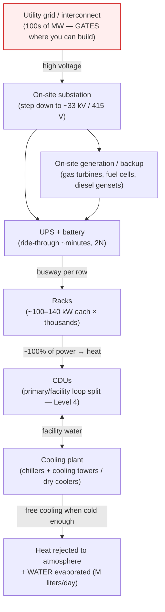
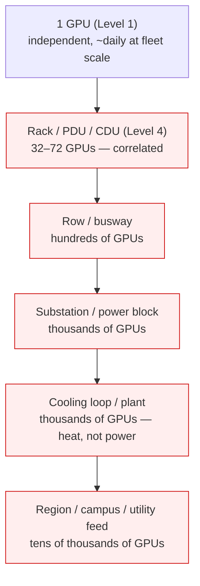
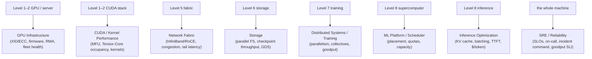
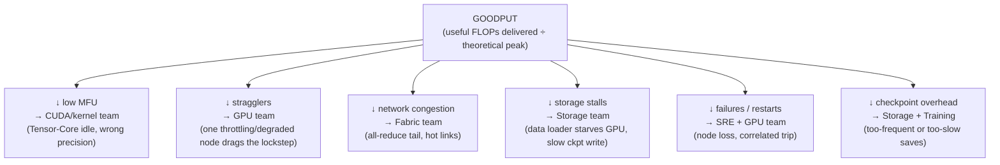
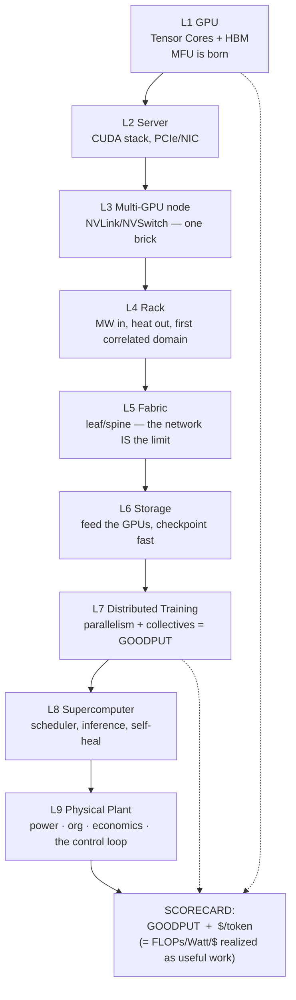

# Level 9 — Physical AI Infrastructure

> **Where we are in the journey.** We've built the whole machine. We started with one GPU (Level 1),
> wired it into a server (Levels 2–3), stacked servers into a rack (Level 4), strung racks into a
> fabric (Level 5), fed them from storage (Level 6), ran a 2T-parameter training job across them
> (Level 7), and learned to *operate* the supercomputer as one scheduled, self-healing organism
> (Level 8). The machine works.
>
> This final level is the **zoom-out that nobody draws but everybody pays for**: the **physical
> plant, the organization, and the economics** that make all of it real. We're going to treat the
> *datacenter campus itself as one machine* — and then step back further, because at the very top of
> the stack an AI cluster is not a silicon problem at all. It's **gigawatts of power, the org that
> operates them, and the dollar that justifies them.** This is the stuff under the streets.
>
> **By the end of this level you can answer:** Why does *where you can get power* now decide where AI
> gets built? How much power and water does a 100,000-GPU campus actually need? Why must the scheduler
> and the checkpointer assume *correlated* loss, not single-GPU loss? What are the real unit economics
> — $/GPU-hour, $/token, $/training-run — and why is a 1% goodput gain worth millions? Why does the
> *org chart* mirror the machine, and why does observability decide *who gets paged*? And finally:
> **what was this whole course actually about?**

---

## 1. The one idea: AI infrastructure is a *city*, and the compute is just the buildings

Start with the intuition, then we'll earn the numbers.

You've spent eight levels admiring the **buildings** — the skyscrapers of compute, the GPUs and racks
and fabric. But a city is not its buildings. A city *works* because of everything **beneath the
streets and behind the walls**: the power grid feeding it, the water moving through it, the
government departments that run each subsystem, and the budget that decides what gets built at all.
Cut the power and the most beautiful skyscraper is a dark concrete box.

**A datacenter campus is a city.** The GPUs are the buildings. But the thing that decides whether the
city *exists*, *grows*, or *browns out* is the hidden plant:

```
   The buildings (Levels 1–8)          The city underneath (Level 9)
 ┌──────────────────────────────┐    ┌────────────────────────────────────┐
 │ GPUs, servers, racks, fabric, │    │ POWER  — grid, substation, UPS, MW   │
 │ storage, training jobs, the   │    │ WATER  — cooling, heat rejection      │
 │ scheduler — the COMPUTE       │    │ GOVERNMENT — the org/teams that run it │
 │                               │    │ BUDGET — $/token, $/GPU-hr, capacity  │
 │ "what runs"                   │    │ "what makes it possible & worth it"   │
 └──────────────────────────────┘    └────────────────────────────────────┘
   admired in every keynote             never on a slide — but it's the
                                        actual constraint and the actual bill
```

> **Keep this lens for the whole level:** at the chip the binding constraint was *memory bandwidth*
> (Level 1); at the rack it was *kilowatts in and heat out* (Level 4); across the fabric it was
> *collective-communication bandwidth* (Levels 5/7). At the **campus**, the binding constraints become
> **a grid interconnect you can actually get, a cooling plant that can reject hundreds of MW, an org
> that can operate it, and a $/token that pays for it.** Silicon stopped being the limit several levels
> ago. This is where the *real* limits live.

---

## 2. The datacenter as a machine — scaling Level 4's rack physics up to a campus

At Level 4 we built **one ~100 kW rack** and learned its two binding numbers: the *electrical feed*
and the *heat rejected*. A campus is the same two numbers, multiplied by **tens of thousands of racks**
— and at that multiplier, the numbers stop being plumbing and become *geopolitics*.

Here is the full power-and-cooling topology of an AI campus, drawn as one machine — from the grid down
to a GPU and back out to the atmosphere:



Read it top to bottom and three things jump out, each of which we'll unpack:

1. **The grid feed at the top is now the gate.** You cannot build what you cannot power.
2. **The cooling plant at the bottom is a second power plant in reverse** — it exists only to throw
   away the heat the racks make, and it costs real megawatts to run.
3. **~100% of the electricity that enters becomes heat** (conservation of energy — Level 4's rack
   budget, now at campus scale). Every watt you buy, you must also *reject*.

### Power: from a 10k-GPU cluster to a GW-class campus

Scale up Level 4's per-rack number with real fleet figures:

| Build | GPUs | Approx. IT power | What that *is* |
|---|---|---|---|
| One dense rack (NVL72-class) | 72 | ~120–140 kW | a small office building's whole feed |
| A 10,000-GPU cluster | ~10k | **~15–25 MW** | a small town |
| A large training campus | ~50–100k | **~100–250 MW** | a steel mill / small city |
| A frontier campus (announced) | 100k+ | **hundreds of MW → GW-class** | a nuclear reactor's *entire* output |

A single large GPU draws ~700 W (H100) to ~1–1.4 kW (Blackwell). Multiply by 100,000 and you are at
**~70–140 MW just for the GPUs** — before networking, storage, CPUs, and the cooling plant. This is
why the headline number for frontier AI is now quoted in **gigawatts**, the unit of *power plants*, not
servers.

### Grid availability is the new bottleneck (the line that surprises infra engineers)

Here is the hyperscale truth that reframes the whole industry: **the constraint on building AI is no
longer chips — it's getting a grid interconnect.** Connecting hundreds of MW of new load to a utility
requires an **interconnection queue** that can run **years** in many regions, plus new transmission and
substation buildout. The practical consequences, which Principal-level people now reason about:

- **You site campuses where power is** — next to hydro, nuclear, abundant gas, or stranded
  generation — not where the engineers want to live.
- **On-site generation** (gas turbines, fuel cells) is increasingly built *because the grid can't be
  waited on* — the campus becomes its own power producer.
- **Power is procured years ahead** of the GPUs, in MW, like a utility plans a city's load.

> **The sentence to remember:** *at the campus, the first design review is not "which GPU" — it's
> "where can we physically get the power, and how soon."* The interconnect queue, not the GPU
> allocation, increasingly sets the schedule.

### Power redundancy at facility scale

Level 4 gave you the **N / N+1 / 2N** vocabulary for a rack. The campus applies the *same* ladder to
*every* layer of the power chain — utility feeds, substations, UPS strings, busways — and adds
**ride-through**: the UPS + battery only has to keep the load alive for the **seconds-to-minutes** it
takes on-site generation to spin up. A subtle, expensive truth: full **2N** power across hundreds of MW
is *enormously* costly, so AI training campuses often run **less redundancy than a bank's
transaction datacenter** — because a *training* job can checkpoint and restart (Levels 6–7), whereas a
payment can't. **The redundancy you buy is a function of what the workload can tolerate losing.**

### Cooling at facility scale, and PUE

Every watt in becomes a watt of heat (Level 4). At campus scale the heat-rejection plant is a major
machine in its own right. The spectrum, scaled up from Level 4's rack CDUs:

- **Direct-to-chip liquid → CDU → facility water → heat rejection.** The cold plates and CDUs are
  Level 4; the campus adds the *facility-water plant*: chillers, cooling towers, dry coolers.
- **Chillers vs. free cooling.** A **chiller** is a big refrigerator — it spends a lot of power to make
  cold water. **Free cooling** uses the outside air/water directly when it's cold enough — *no
  compressor*, so almost-free heat rejection. This is why AI campuses are sited in **cold, dry
  climates** and run **warm-water cooling** (Level 4's ~30–35 °C supply): the warmer your chips will
  tolerate the coolant, the more hours per year you can skip the chiller entirely.
- **Immersion** (Level 4) pushes density further still and is the frontier for the densest racks.

**PUE — Power Usage Effectiveness — is the one facility metric you must know cold:**

```
            total facility power      (IT load + cooling + power losses + lighting + …)
   PUE  =   ────────────────────  =   ───────────────────────────────────────────────
              IT equipment power                    IT load (the GPUs et al.)
```

- **PUE = 1.0** is the unreachable ideal: every watt goes to compute, zero overhead.
- **Legacy enterprise DC: PUE ~1.5–2.0** (cooling/overhead nearly *doubled* the bill).
- **Modern hyperscale, liquid-cooled, free-cooling climate: PUE ~1.1–1.2.**

The gap is money and carbon. At a 100 MW IT load, the difference between PUE 1.5 and PUE 1.15 is
**~35 MW of pure overhead** — a small power plant's worth of electricity spent on *not computing*.
This is why liquid cooling (Level 4) isn't just a density enabler; it's a **PUE lever**, because it
removes power-hungry chassis fans and enables warm-water free cooling.

### Worked example — power + cooling for a 100,000-GPU campus

Make it concrete, the way Level 4 did for one rack. Take **100,000 Blackwell-class GPUs at ~1.2 kW
each**:

- **GPU power:** 100,000 × 1.2 kW = **120 MW** just for the silicon.
- **+ servers/networking/storage/CPUs** (~25–40% on top): IT load ≈ **~150–170 MW**.
- **× PUE 1.15** (good liquid-cooled facility): total facility draw ≈ **~175–195 MW** — call it
  **~190 MW**, with **~25–30 MW** of that being the cooling plant + losses.
- **Heat to reject:** ≈ the full IT load ≈ **~160 MW** of heat, continuously, forever. In facility
  units (Level 4: 1 ton = 3.517 kW) that's **~45,000 tons of cooling.**
- **Water:** an evaporative-cooled plant of this size can evaporate **millions of liters of water per
  day** — a number that now draws community and regulatory scrutiny (see §8, Sustainability).

> **The two campus numbers to internalize:** a **100k-GPU campus ≈ ~190 MW total and ~160 MW of heat to
> reject** — the output of a mid-size power plant, spent entirely on one machine. If you can derive that
> from "1.2 kW × 100k × PUE," you understand this section.

---

## 3. Failure domains at facility scale — why correlated loss is the design center

At Level 4 we learned the rack is the first **correlated failure domain** — a PDU/breaker/CDU trip
drops 32–72 GPUs *at once*. The campus simply makes the blast radius **nested and bigger**. Walk the
containment hierarchy outward:



The crucial Principal-level point that ties three earlier levels together:

- **The scheduler (Level 8) must be power- and topology-aware.** Just as it places a job for *NVLink
  and fabric locality* (Levels 3/5/7), it must **spread a job's critical replicas across power blocks
  and cooling loops** so that a *single substation or chiller* failure cannot vaporize a quorum. Tight
  fabric-locality and broad failure-domain-spreading are in *tension* — and resolving that tension is
  the heart of a real placement engine.
- **Checkpoint/restart (Levels 6–7) must assume CORRELATED loss, not single-GPU loss.** The
  checkpoint *frequency* is set not by "how often does one GPU die" but by "what is the largest
  correlated blast radius I must be able to rewind from, and how much wasted GPU-time can I tolerate
  if it goes?" A substation trip mid-step doesn't lose one GPU — it loses *thousands*, and rewinds the
  *entire* synchronized job to the last checkpoint. **Blast radius × checkpoint interval = the
  GPU-hours you stand to burn.**

> **The sentence to remember:** *at the campus, you don't design for the GPU that dies — you design for
> the substation and the cooling loop that take thousands with them. The unit of correlated loss got
> bigger; the scheduler and the checkpointer must grow with it.*

---

## 4. Economics — the Principal lens (this is the section that gets you promoted)

Everything below the streets exists to serve one number that appears on no rack and in no datasheet:
**the cost of useful work.** A Staff engineer optimizes a kernel. A **Principal engineer optimizes the
dollar** — and to do that you must speak the unit economics fluently.

### The unit metrics

| Metric | Definition | Why it matters |
|---|---|---|
| **$/GPU-hour** | fully-loaded cost to run one GPU for one hour (hardware amortization + power + cooling + network + people + facility) | the *atomic unit of cost* — everything else derives from it |
| **$/training-run** | $/GPU-hour × GPUs × wall-clock hours | what a single frontier model *costs to make* |
| **$/token** | the serving unit: cost to generate one output token (Level 8 inference) | the *revenue-facing* number — it sets your price and margin |
| **$/MFU-point** | marginal cost saved per 1% MFU/goodput gained | translates engineering wins into money |

### Why a 1% goodput gain is real money (the bridge back to Level 7)

A frontier **2T-parameter training run** can occupy **~20,000–25,000 GPUs for ~2–3 months**. Sketch
the arithmetic:

```
   25,000 GPUs  ×  24 h  ×  75 days        ≈  45,000,000 GPU-hours
   45,000,000 GPU-hours  ×  ~$2–4 /GPU-hr  ≈  $90M – $180M  for ONE training run
```

Now recall **goodput** (Level 7) — useful FLOPs *net* of stragglers, congestion, storage stalls,
failures, and checkpoint overhead. If your goodput is **40%** and you push it to **41%**, you've
improved the *whole run* by **1/40 ≈ 2.5%** — on a $100M+ run that's **~$2.5M, from a single percentage
point.** This is the entire economic justification for Levels 1–8:

> *MFU and goodput were never vanity metrics. At frontier scale, one point of goodput is millions of
> dollars per run. That is why "GPU utilization 100%" being a lie (Level 1) is not a curiosity — it's a
> multi-million-dollar accounting error.*

### Capacity planning — in MW and GPU-months, with headroom

You don't plan capacity in "number of servers." You plan it in **MW** (what you can power — §2) and
**GPU-months** (the currency a scheduler allocates — Level 8). And you must **plan headroom** for two
things the naive planner forgets:

- **Inference failover headroom** — spare capacity so that when an inference region fails (Level 8),
  another region can absorb its traffic *without* breaching $/token SLOs.
- **Training hot spares** — idle GPUs held ready so a failed node in a 25k-GPU job can be swapped in
  and the job resumes from checkpoint *fast*, instead of stalling the whole run while you procure
  hardware (Levels 7–8).

Headroom *looks* like waste on a utilization dashboard and *is* insurance against goodput collapse.
Knowing the difference is the job.

### Build vs. Buy vs. Hybrid — re-decided per layer

There is no single "build or rent" answer; you decide it **layer by layer**, and the answer changes
with scale:

| Layer | Build (own DC + GPUs) | Buy (cloud / neocloud) | Typical hyperscale answer |
|---|---|---|---|
| Power & shell | massive capex, multi-year | — | **build** at scale; the moat *is* the power |
| GPUs | huge capex, but cheapest $/GPU-hr if kept hot | flexible, premium $/hr | **build** baseline, **buy** burst |
| Network fabric | full control, hard to operate | bundled | **build** for training, **buy** for spiky inference |
| Inference serving | own it where volume is steady | rent where demand is spiky/uncertain | **hybrid** — own the floor, rent the peak |

The economic logic: **owning wins when utilization is high and steady** (the amortization beats the
rental margin); **renting wins for spiky, uncertain, or short-lived demand** (you pay a premium to
avoid stranded capital). Frontier players **build** the power and the training fabric (the durable
moat) and **rent** at the volatile edges.

### Cost observability / showback, and the true long-run OpEx

You cannot optimize a cost you cannot see. **Cost observability** attributes spend to teams, models,
and jobs — **showback** (here's what you cost) and **chargeback** (here's your bill) — so a team that
runs a 35%-MFU job sees the dollars it's burning. This closes the loop between the engineering metric
(MFU/goodput) and the financial one ($/token).

And the punchline that reaches all the way back to Level 1: **over a multi-year horizon, power is the
dominant OpEx** — you buy the GPU once, but you pay for its watts every hour for years. Therefore the
true long-run currency of this entire field is **FLOPs per Watt** (Level 1's clocks-and-heat preview,
now revealed as the economic ground truth). Every efficiency lever — FP8 over BF16 (Level 1),
liquid cooling and low PUE (§2), high goodput (Level 7) — is ultimately a **FLOPs/Watt** play, which is
to say a **$** play.

> **The Principal sentence:** *the GPU is a capital expense you pay once; power is an operating expense
> you pay forever. So the long-run scorecard isn't FLOPs — it's FLOPs per Watt per dollar, and goodput
> is how you convert it into useful work.*

---

## 5. The org model — Conway's law, because the org mirrors the machine

**Conway's law:** an organization designs systems that mirror its own communication structure. At
hyperscale the reverse is the operating reality — *the machine you built (Levels 1–8) dictates the org
chart that runs it.* Each layer of the stack becomes a **team with an on-call surface**:



Now the point that *makes observability matter* — and it's subtle enough that most people miss it:

> **When a 10,000-GPU job slows down, the SYMPTOM — low goodput — does not name the owner.** "The run
> got 8% slower" could be the GPU team (a throttling node), the CUDA team (a kernel regression), the
> network team (fabric congestion), the storage team (a slow checkpoint), or the scheduler (a bad
> placement). Eight teams, one symptom, and *no obvious owner.* You cannot route the page from the
> symptom alone.

This is exactly why the next section exists. **Observability's job at this scale is to attribute the
goodput loss to a *cause*, so the page goes to the right team's on-call.** Without attribution, every
slowdown becomes an eight-team war room — the most expensive failure mode in the building.

---

## 6. Observability as the control loop — decompose goodput, route the page

This is where the AI-Infra domain reaches across to its sibling, the **Observability** domain. The
platform's **true SLI is GOODPUT** (Level 7) — not GPU utilization, not request count. And the entire
purpose of telemetry here is to **decompose goodput loss into its causes**, because (from §5) the
cause *is* the owner.

### The goodput-decomposition tree



Read it as the operator's runbook: a goodput dip *resolves down a branch* to exactly one team. That's
the difference between a 3-minute page and a 3-hour bridge call.

### The minimum signal set (across every layer of the course)

To populate that tree, you need a specific, non-negotiable set of signals — one cluster per level:

| Layer | Signals that matter | What loss they explain |
|---|---|---|
| **GPU (Level 1)** | DCGM **SM-occupancy**, **Tensor-Core-active %**, **HBM bandwidth**, **XID/ECC**, **thermal/clocks** | MFU, stragglers, silent throttle |
| **Intra-node (Level 3)** | **NVLink CRC/replay** errors | a degraded link → straggler |
| **Fabric (Level 5)** | InfiniBand **congestion / tail latency / link errors** | all-reduce stalls (Level 7) |
| **Inference (Level 8)** | **tokens/sec**, **TTFT**, **KV-cache utilization** | serving SLO + $/token health |
| **Storage (Level 6)** | **throughput**, **checkpoint write time** | data-loader stalls, checkpoint overhead |
| **Economics (§4)** | **$/token**, **$/GPU-hour**, MFU-to-$ mapping | the financial truth behind all of it |

The thread running through every one of these — first stated at Level 1 — is that **"GPU utilization
100%" tells you nothing**; the honest signals (Tensor-Core-active, HBM-BW, MFU, goodput) are what
close the control loop. For the full telemetry architecture, the sibling domain is the reference:
`../../Observability/14-AI Infrastructure Observability/`, and the platform answer key is
`../../Observability/18-Architecture Patterns/00-Reference-Platform-Architecture.md`.

> **The control loop, in one line:** *measure goodput → decompose the loss down the tree → route the
> page to the owning team → fix → goodput recovers.* The platform is not "observed"; it is **steered**
> by this loop. Telemetry is the steering wheel, goodput is the speedometer, $/token is the fuel gauge.

---

## 7. Failure modes at facility scale (the new vocabulary)

Scaling Level 4's rack-failure table up to the campus — the dangerous ones are **correlated and wide**:

| Failure | What it is | How it shows up | Blast radius |
|---|---|---|---|
| **Substation / power-block loss** | a transformer/feed fault opens an entire power block | thousands of GPUs drop *at once* → job-wide restart | thousands of GPUs (correlated) |
| **Cooling-plant / loop loss** | chiller, tower, or facility-water pump failure | rising coolant temp → mass throttle → emergency shutdown in seconds–minutes | a whole hall/loop (correlated) |
| **Grid event / brownout** | utility instability, frequency excursion | UPS rides through; if generation doesn't catch → wide outage | up to campus-wide |
| **Thermal runaway on hot day** | free-cooling can't keep up; chillers max out | campus-wide throttle → silent fleet-wide MFU loss | campus (silent, then hard) |
| **Water supply interruption** | evaporative cooling loses its makeup water | cooling capacity collapses → emergency derate | a whole hall/campus |
| **Correlated straggler wave** | a firmware/driver rollout degrades a fleet slice | many nodes throttle/slow together → goodput sags fleet-wide | many jobs (silent) |
| **Capacity / power oversubscription** | sum of real draw exceeds provisioned MW under load | upstream breaker trips during a hard training step | a power block (correlated) |

The escalated pattern from Levels 1 and 4: the **silent** failures (a hot day quietly throttling the
fleet, a bad firmware rollout creating a straggler wave) bleed goodput across *many jobs at once*,
while the **correlated** failures (substation, cooling plant, grid) hit *hard and wide* and are exactly
what your placement and checkpoint strategy (§3) must survive. None of these existed when you were
reasoning about one chip — they are *created* by the campus.

---

## 8. Sustainability — efficiency is both an economic and an environmental lever

The same levers that save dollars (§4) save carbon and water — which is why sustainability is not a
bolt-on at this scale; it's the *same optimization viewed through a second lens.*

- **Carbon footprint.** A campus's emissions ≈ its MW × the **carbon intensity of its grid**. Two
  identical campuses, one on hydro/nuclear and one on a coal-heavy grid, have *wildly* different
  footprints for the *same computation*. This is a third reason (after power availability and free
  cooling) that **siting** is a first-class design decision — you site for clean, abundant power.
- **Water footprint.** Evaporative cooling trades electricity for **water** (millions of liters/day at
  100k-GPU scale — §2). The industry metric is **WUE (Water Usage Effectiveness)**, liters per kWh.
  Dry coolers and warm-water free cooling cut water at some power/PUE cost — a real engineering
  trade-off, now under regulatory and community scrutiny.
- **Power efficiency = the shared lever.** Every efficiency win is *simultaneously* a cost win and a
  sustainability win: low **PUE** (§2), high **goodput/MFU** (Level 7), **FP8** over BF16 (Level 1),
  and **liquid/warm-water cooling** (Level 4) all reduce **Watts per useful token** — which is
  **FLOPs/Watt** (Level 1) yet again, the field's true north.
- **Power-capping / DVFS as a goodput-vs-power knob.** You can **cap power or lower clocks (DVFS)** to
  stay within a grid limit or shave a demand peak — at the cost of *some* MFU. This makes power and
  goodput **continuously tradeable**: on a constrained day you may *choose* to run the fleet at 90%
  clocks to fit the MW envelope, accepting a measured goodput hit. That choice — deliberate,
  measured, reversible — is a Level-9 operational decision that touches Levels 1, 7, and 8 at once.

---

## 9. Frontier / forward look — where the machine is heading

A short horizon scan, so you can reason about builds that don't exist yet:

- **Mega-NVLink domains (NVL72-style and beyond).** The trend (from Levels 3–5) is to make the
  *coherent, NVLink-connected domain larger* — 72 GPUs in one rack acting as one giant accelerator,
  with successors pushing toward hundreds. This shrinks the slow-fabric hops a collective must take
  (Level 7), pushing more of the all-reduce onto fast NVLink. **The intra-domain gets bigger; the
  inter-domain network becomes the harder problem.**
- **GW-scale campuses.** The frontier is moving from hundreds of MW to **gigawatt** campuses — at which
  point §2's grid-interconnect and §8's carbon/water constraints become *the* design problem, ahead of
  any silicon question.
- **The network is increasingly the bottleneck.** As compute per chip grows faster than network
  bandwidth between chips, the fraction of time spent in **collective communication** (Level 7) rises —
  which is why so much frontier investment is in fabric, SHARP-style in-network reduction, and optics.
  Restated: *the instruction set of the supercomputer is communication, and communication is getting
  relatively more expensive.*
- **"Physical AI" as the framing.** The industry's own term for this level: treating the entire
  campus — power, cooling, building, fabric, and silicon — as **one integrated machine designed
  together**, co-optimized from the grid interconnect down to the Tensor Core. That co-design *is* what
  this whole course taught you to see.

---

## 10. COURSE WRAP-UP — what this was all actually about

Put the slides down. Here is the spine of all nine levels in one breath:

> **A hyperscale AI cluster is ONE COMPUTER. Its instruction set is COLLECTIVE COMMUNICATION
> (all-reduce / all-gather / all-to-all). And its real scorecard is GOODPUT + $/token — never "GPU
> utilization %."**

Everything you learned was in service of that one machine and that one scorecard. Walk back *down* the
nine levels and watch each layer feed the score:



One sentence per level, each landing on the score:

- **L1 — GPU:** the Tensor Core and HBM define peak FLOPs; **MFU** is born here, and "100% util" is
  already a lie.
- **L2 — Server:** the CUDA stack and PCIe/NIC decide whether the chip is *fed* — launch-bound or
  starved kernels waste the peak.
- **L3 — Multi-GPU node:** NVLink/NVSwitch fuse 8 GPUs into one coherent brick — the cheapest, fastest
  collectives happen *inside* this box.
- **L4 — Rack:** power-in and heat-out become the wall, and the rack becomes the first **correlated
  failure domain** that placement and checkpointing must respect.
- **L5 — Fabric:** leaf/spine + InfiniBand carry the collectives between racks — and the **network,
  not the GPU,** becomes the thing that caps a 10k-GPU job.
- **L6 — Storage:** parallel filesystems feed the data loader and absorb checkpoints — a slow read or
  write is a direct goodput stall.
- **L7 — Distributed Training:** parallelism (DP/TP/PP/EP) + collectives turn the cluster into one
  trainer, and **goodput** is the net of all the losses below it.
- **L8 — Supercomputer:** the scheduler places jobs by topology *and* power domain, self-heals from
  failures, and runs inference to the $/token SLO.
- **L9 — Physical plant:** power, org, and economics make it real — and the **observability control
  loop** decomposes goodput loss and routes the page so the score can be defended.

That is the whole course: **nine rings around one idea.** You can now reason from a Tensor Core's
precision all the way up to a gigawatt interconnect queue and back down to who gets paged at 3 a.m. —
and tie every one of those decisions to **goodput and $/token.** That is the Principal-level view.

---

## 11. Interview deep-dives (defend your understanding)

**Q: What gates where you can build a frontier AI campus today — and why isn't it the GPUs?**
**Power, specifically grid interconnect.** GPUs are constrained but *allocatable*; getting hundreds of
MW connected to a utility requires an interconnection queue that can run years, plus transmission and
substation buildout. So campuses are sited *where power is* (hydro/nuclear/gas/stranded generation),
power is procured years ahead in MW, and on-site generation is built because the grid can't be waited
on. The first design review is "where can we get the power, and how soon," not "which GPU."

**Q: Define PUE, give realistic values, and explain why it's worth tens of MW.**
PUE = total facility power ÷ IT equipment power. Ideal 1.0; legacy enterprise ~1.5–2.0; modern
liquid-cooled hyperscale ~1.1–1.2. At 100 MW IT load, PUE 1.5 vs 1.15 is **~35 MW** of pure overhead —
a small power plant spent on *not computing*. Liquid cooling (Level 4) lowers PUE by removing chassis
fans and enabling warm-water free cooling, so it's both a density *and* a PUE lever.

**Q: Why must the scheduler and checkpointer assume *correlated* loss?**
Because at the campus a substation or cooling-loop failure drops **thousands** of GPUs at once, not
one. So the scheduler must spread a job's critical replicas across power blocks and cooling loops
(in tension with fabric-locality), and checkpoint frequency must be set by the *largest correlated
blast radius* you must rewind from — not by single-GPU failure rates. Blast radius × checkpoint
interval = the GPU-hours you risk burning.

**Q: A 10,000-GPU training job is "8% slower" this week. Walk me from symptom to the right on-call
team.**
"Slower" = a **goodput** drop, and goodput doesn't name an owner (Conway's law — eight teams, one
symptom). I **decompose** down the goodput tree using the minimum signal set: check **MFU /
Tensor-Core-active %** (→ CUDA/kernel team), **per-rank step-time variance + DCGM thermals/clocks** for
a **straggler** (→ GPU team), **InfiniBand congestion/tail** (→ fabric team), **storage throughput +
checkpoint time** (→ storage team), and **failure/restart counts** (→ SRE). The branch that lights up
routes the page. Without attribution it's an eight-team war room — the most expensive failure mode in
the building.

**Q (SYSTEM DESIGN): Design the *physical and economic plan* for a 10,000-GPU training cluster.**
*Power:* ~10k GPUs × ~1 kW ≈ ~10 MW GPU, +~30% overhead ≈ ~13 MW IT, × PUE ~1.15 ≈ **~15 MW total**;
secure the grid interconnect first, with UPS+battery ride-through to on-site/standby generation.
*Cooling:* direct-to-chip liquid + CDUs (Level 4) → facility water → free cooling in a cold/dry
climate, warm-water supply (~30–35 °C) to maximize chiller-free hours; reject ~13 MW of heat
continuously. *Topology & failure domains:* spread the job's critical replicas across power blocks and
cooling loops; ToR/leaf → spine fabric (Level 5) on InfiniBand for the collectives; parallel FS
(Level 6) sized so checkpoint writes don't stall goodput. *Reliability:* hot spares for fast
node-swap-and-resume; checkpoint interval tuned to the correlated blast radius. *Economics:* model
$/GPU-hour fully loaded; this cluster ≈ ~15 MW and a multi-month run ≈ tens of $M, so target high
**goodput** (every point ≈ real money) and instrument the **goodput-decomposition** control loop from
day one. *Redundancy:* less than 2N is acceptable *because* training can checkpoint/restart — buy
redundancy proportional to what the workload can lose.

**Q (SYSTEM DESIGN): Design real-time inference for a 100B-parameter model at scale.**
*Serving physics (Level 8):* split **prefill** (compute-bound, processes the prompt) from **decode**
(memory-bandwidth-bound, one token at a time) — disaggregate them so each runs on right-sized
hardware. *Memory:* the **KV cache** grows with batch × context and dominates HBM — H200/Blackwell's
extra HBM bandwidth/capacity (Level 1) directly buys more concurrent sequences and longer context.
*Throughput vs latency:* continuous (in-flight) batching to keep Tensor Cores fed while honoring
**TTFT** (time-to-first-token) and per-token latency SLOs. *Capacity & failover:* plan **inference
failover headroom** across regions so a region loss doesn't breach $/token SLOs; autoscale to the
diurnal demand curve. *Economics:* the scorecard is **$/token** — driven by tokens/sec/GPU, KV-cache
efficiency, and batching; instrument tokens/sec, TTFT, and KV utilization as the serving SLIs.
*Build vs buy:* own the steady-state floor (cheapest $/token when hot), rent the spiky peak.

**Q: Why is FLOPs/Watt the field's true long-run currency?**
Because the GPU is a one-time capital expense but power is an operating expense you pay *every hour for
years* — so at a multi-year horizon **power dominates OpEx.** Every efficiency lever — FP8 over BF16
(L1), low PUE and liquid cooling (L4/§2), high goodput (L7), power-capping trade-offs (§8) — is
ultimately a **FLOPs/Watt** play, which is a **$** play *and* a **carbon/water** play simultaneously.
That's why one number ties the economics, the physics, and the sustainability story together.

---

## 12. What you should now be able to draw from memory

- The **campus power-and-cooling topology**: grid interconnect → substation → UPS/generation →
  busway → racks → CDU → cooling plant → atmosphere, with **MW labels** and **~100% power→heat**.
- The **nested failure-domain hierarchy**: GPU → rack → row → substation → cooling loop → region, and
  why placement + checkpointing must assume **correlated** loss.
- The **goodput-decomposition tree**: goodput ← MFU, stragglers, congestion, storage stalls, failures,
  checkpoint overhead — each branch mapping to an **owning team**.
- The **org-map aligned to the machine** (Levels 1–8 → eight on-call surfaces) and *why a goodput dip
  doesn't name its owner* until telemetry attributes it.
- The **full 9-level stack as one machine**, and the one-sentence-per-level walk that lands every layer
  on the scorecard: **GOODPUT + $/token = FLOPs/Watt/$ realized as useful work.**
- The campus budget: **a 100k-GPU campus ≈ ~190 MW, ~160 MW of heat, millions of liters of water/day,
  PUE ~1.15** — and a frontier 2T run ≈ **tens of $M**, so **1% goodput ≈ millions.**

---

> **Where to go next (this is the finale — there's no Level 10).** You've finished the build. The
> work now is *reps*:
> - **Labs (local-first):** stand up a `kind` cluster + **DCGM exporter** and a tiny **vLLM** serve to
>   reproduce, at $0, the physics this course described at hyperscale — **KV-cache pressure**,
>   continuous-batching behavior, and a **simulated straggler** that makes goodput collapse so you can
>   watch the decomposition tree light up.
> - **System-design practice:** redo the two prompts above (10k-GPU cluster; 100B real-time inference)
>   on a whiteboard until the MW math, the failure-domain spread, and the $/token reasoning are
>   automatic.
> - **Cross-domain:** read the sibling **Observability** domain end-to-end —
>   `../../Observability/14-AI Infrastructure Observability/` for the telemetry that drives the control
>   loop, and `../../Observability/18-Architecture Patterns/00-Reference-Platform-Architecture.md` as
>   the platform answer key. The two domains are one story told from two ends.
>
> You started with one GPU and the question "why is it shaped this way?" You can now answer it all the
> way up to a gigawatt — and back down to who gets paged. That's the Principal lens. Go draw the
> machine.

---
*Part of `AI-Infra/Production/` (Levels 7–9). See `AI-Infra/README.md` for the full 9-level map.*
